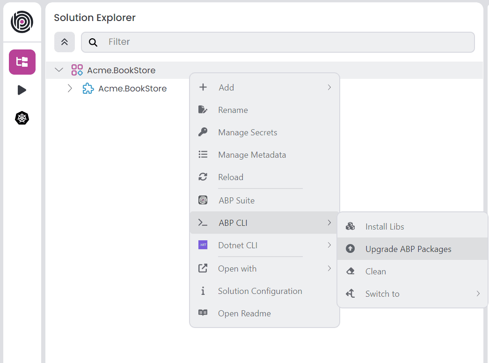

# ABP.IO Platform 10.1 Final Has Been Released!

We are glad to announce that [ABP](https://abp.io/) 10.1 stable version has been released. 

## What's New With Version 10.1?

All the new features were explained in detail in the [10.1 RC Announcement Post](https://abp.io/community/announcements/announcing-abp-10-1-release-candidate-cyqui19d), so there is no need to review them again. You can check it out for more details. 

## Getting Started with 10.1

### How to Upgrade an Existing Solution

You can upgrade your existing solutions with either ABP Studio or ABP CLI. In the following sections, both approaches are explained:

### Upgrading via ABP Studio

If you are already using the ABP Studio, you can upgrade it to the latest version. ABP Studio periodically checks for updates in the background, and when a new version of ABP Studio is available, you will be notified through a modal. Then, you can update it by confirming the opened modal. See [the documentation](https://abp.io/docs/latest/studio/installation#upgrading) for more info.

After upgrading the ABP Studio, then you can open your solution in the application, and simply click the **Upgrade ABP Packages** action button to instantly upgrade your solution:



### Upgrading via ABP CLI

Alternatively, you can upgrade your existing solution via ABP CLI. First, you need to install the ABP CLI or upgrade it to the latest version.

If you haven't installed it yet, you can run the following command:

```bash
dotnet tool install -g Volo.Abp.Studio.Cli
```

Or to update the existing CLI, you can run the following command:

```bash
dotnet tool update -g Volo.Abp.Studio.Cli
```

After installing/updating the ABP CLI, you can use the [`update` command](https://abp.io/docs/latest/CLI#update) to update all the ABP related NuGet and NPM packages in your solution as follows:

```bash
abp update
```

You can run this command in the root folder of your solution to update all ABP related packages.

## Migration Guides

There are a few breaking changes in this version that may affect your application. Please read the migration guide carefully, if you are upgrading from v10.0 or earlier versions: [ABP Version 10.1 Migration Guide](https://abp.io/docs/latest/release-info/migration-guides/abp-10-1)

## Community News

### New ABP Community Articles

As always, exciting articles have been contributed by the ABP community. I will highlight some of them here:

* [Enis Necipoğlu](https://abp.io/community/members/enisn):
  * [ABP Framework's Hidden Magic: Things That Just Work Without You Knowing](https://abp.io/community/articles/hidden-magic-things-that-just-work-without-you-knowing-vw6osmyt)
  * [Implementing Multiple Global Query Filters with Entity Framework Core](https://abp.io/community/articles/implementing-multiple-global-query-filters-with-entity-ugnsmf6i)
* [Suhaib Mousa](https://abp.io/community/members/suhaib-mousa):
  * [.NET 11 Preview 1 Highlights: Faster Runtime, Smarter JIT, and AI-Ready Improvements](https://abp.io/community/articles/dotnet-11-preview-1-highlights-hspp3o5x)
  * [TOON vs JSON for LLM Prompts in ABP: Token-Efficient Structured Context](https://abp.io/community/articles/toon-vs-json-b4rn2avd)
* [Fahri Gedik](https://abp.io/community/members/fahrigedik):
  * [Building a Multi-Agent AI System with A2A, MCP, and ADK in .NET](https://abp.io/community/articles/building-a-multiagent-ai-system-with-a2a-mcp-iefdehyx)
  * [Async Chain of Persistence Pattern: Designing for Failure in Event-Driven Systems](https://abp.io/community/articles/async-chain-of-persistence-pattern-wzjuy4gl)
* [Alper Ebiçoğlu](https://abp.io/community/members/alper):
  * [NDC London 2026: From a Developer's Perspective and My Personal Notes about AI](https://abp.io/community/articles/ndc-london-2026-a-.net-conf-from-a-developers-perspective-07wp50yl)
  * [Which Open-Source PDF Libraries Are Recently Popular? A Data-Driven Look At PDF Topic](https://abp.io/community/articles/which-opensource-pdf-libraries-are-recently-popular-a-g68q78it)
* [Engincan Veske](https://abp.io/community/members/EngincanV):
  * [Stop Spam and Toxic Users in Your App with AI](https://abp.io/community/articles/stop-spam-and-toxic-users-in-your-app-with-ai-3i0xxh0y)
* [Liming Ma](https://abp.io/community/members/maliming):
  * [How AI Is Changing Developers](https://abp.io/community/articles/how-ai-is-changing-developers-e8y4a85f)
* [Tarık Özdemir](https://abp.io/community/members/mtozdemir):
  * [JetBrains State of Developer Ecosystem Report 2025 — Key Insights](https://abp.io/community/articles/jetbrains-state-of-developer-ecosystem-report-2025-key-z0638q5e)
* [Adnan Ali](https://abp.io/community/members/adnanaldaim):
  * [Integrating AI into ABP.IO Applications: The Complete Guide to Volo.Abp.AI and AI Management Module](https://abp.io/community/articles/integrating-ai-into-abp.io-applications-the-complete-guide-jc9fbjq0)

Thanks to the ABP Community for all the content they have published. You can also [post your ABP related (text or video) content](https://abp.io/community/posts/create) to the ABP Community.

## About the Next Version

The next feature version will be 10.2. You can follow the [release planning here](https://github.com/abpframework/abp/milestones). Please [submit an issue](https://github.com/abpframework/abp/issues/new) if you have any problems with this version.
