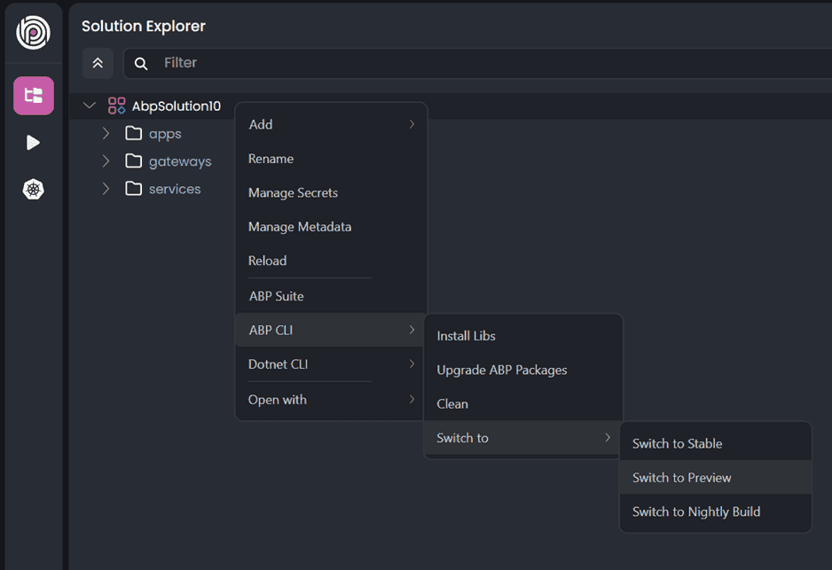
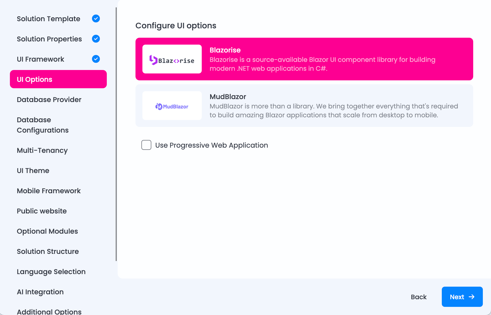
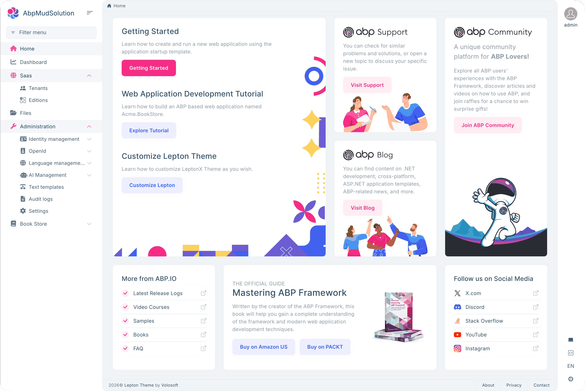
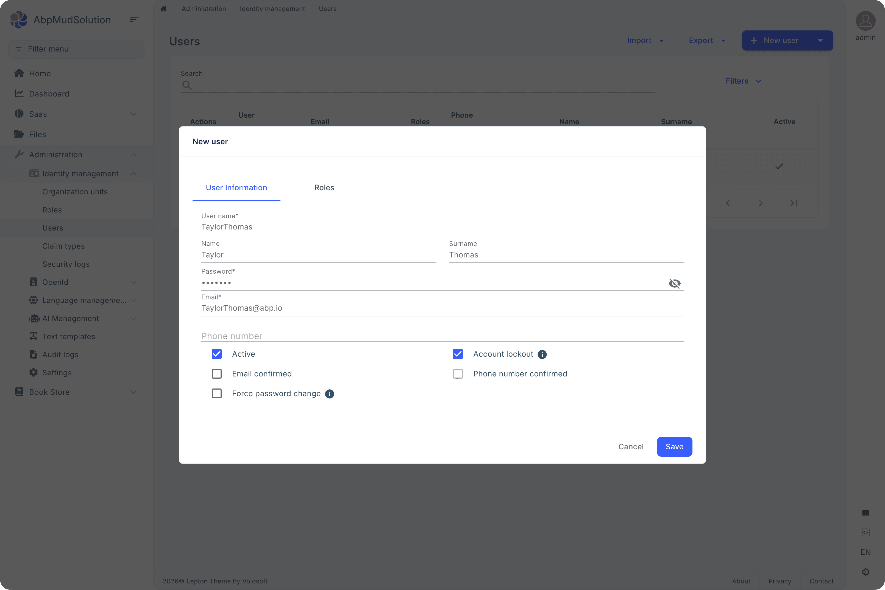
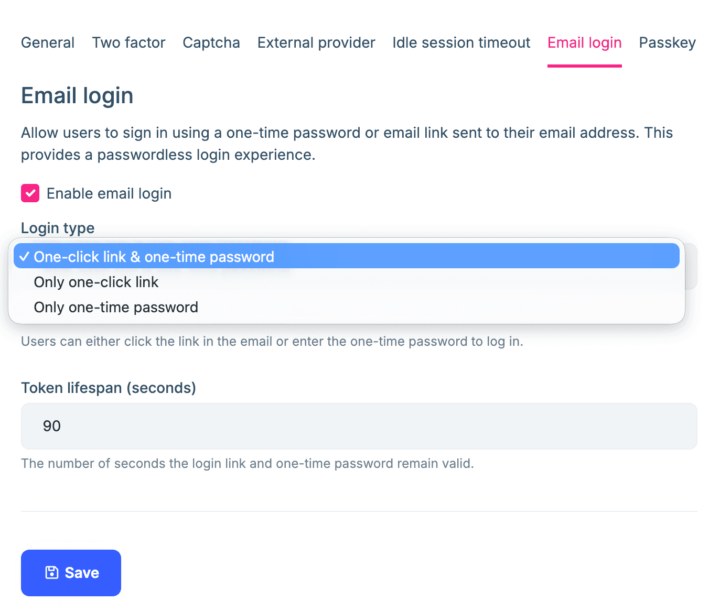
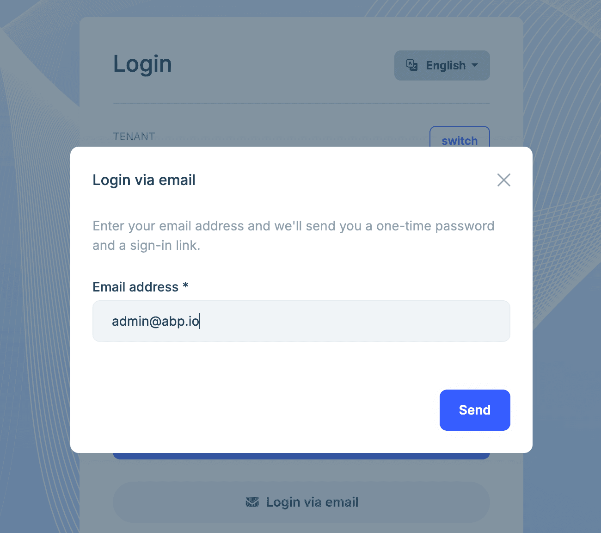
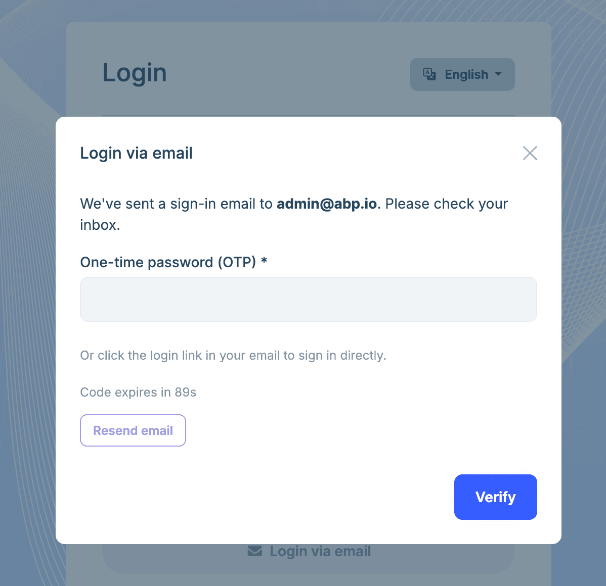

# ABP Platform 10.4 RC Has Been Released

We are happy to release [ABP](https://abp.io) version **10.4 RC** (Release Candidate). This blog post introduces the new features and important changes in this new version.

Try this version and provide feedback for a more stable version of ABP v10.4! Thanks to you in advance.

## Get Started with the 10.4 RC

You can check the [Get Started page](https://abp.io/get-started) to see how to get started with ABP. You can either download [ABP Studio](https://abp.io/get-started#abp-studio-tab) (**recommended**, if you prefer a user-friendly GUI application - desktop application) or use the [ABP CLI](https://abp.io/docs/latest/cli).

> The v10.4 RC versions of ABP Studio and the ABP CLI are still being tested and will be released shortly.

By default, ABP Studio uses stable versions to create solutions. Therefore, if you want to create a solution with a preview version, first you need to create a solution and then switch your solution to the preview version from the ABP Studio UI:



## Migration Guide

There are no explicitly marked breaking changes in this version. However, there are still some important migration notes for specific scenarios. Please check the migration guide if you are upgrading from v10.3 or earlier: [ABP Version 10.4 Migration Guide](https://abp.io/docs/10.4/release-info/migration-guides/abp-10-4).

## What's New with ABP v10.4?

In this section, I will introduce some major features released in this version.
Here is a brief list of titles explained in the next sections:

- URL-Based Localization
- Localization File Splitting
- Blazor UI: MudBlazor Support
- Identity: Single-Use Email/SMS 2FA Token Providers
- Account Pro: Passwordless Email Login
- AI Management: MCP Server Enhancements
- LeptonX: URL-Based Localization and Theme Improvements
- Dependency and Security Updates

### URL-Based Localization

ABP v10.4 introduces URL-based localization support. You can now embed the culture directly in the URL path, such as `/tr/products` or `/en/about`.

This is especially useful for public websites, documentation sites, e-commerce applications, and any application that needs SEO-friendly and shareable localized URLs. Instead of relying only on query string, cookie, or browser language detection, the selected culture can be part of the URL itself.

You can enable it with a single configuration:

```csharp
Configure<AbpRequestLocalizationOptions>(options =>
{
    options.UseRouteBasedCulture = true;
});
```

When enabled, ABP automatically handles route registration, URL generation, menu links, and language switching for MVC/Razor Pages, Blazor, and Angular UIs.

For Angular applications, route trees can be wrapped with `withOptionalRouteCulturePrefix` so the same route configuration can handle both `/identity/users` and `/en/identity/users`:

```typescript
import { Routes } from '@angular/router';
import { withOptionalRouteCulturePrefix } from '@abp/ng.core';

const appRoutesCore: Routes = [
  // ... your routes
];

export const appRoutes = withOptionalRouteCulturePrefix(appRoutesCore);
```

For Blazor applications, ABP built-in module pages already include culture-aware route variants. If you have your own Blazor pages, add culture route variants manually:

```razor
@page "/Products"
@page "/{culture}/Products"
```

> See the [URL-Based Localization](https://abp.io/docs/10.4/framework/fundamentals/url-based-localization) documentation and [#25174](https://github.com/abpframework/abp/pull/25174) for details.

### Localization File Splitting

ABP localization resources can now use multiple JSON files for the same culture. This is useful for large modules or applications where keeping all localization texts in a single `en.json` file becomes difficult to maintain.

For example, you can split a resource by feature:

```text
Localization/
+-- MyResource/
    +-- en.json
    +-- en_Authors.json
    +-- en_Books.json
    +-- en_Users.json
```

ABP merges these files into the same localization dictionary. Files are sorted by name before merging, and if the same key exists in multiple files, the value from the last file wins.

> See the [Localization](https://abp.io/docs/10.4/framework/fundamentals/localization) documentation and [#25227](https://github.com/abpframework/abp/pull/25227) for details.

### Blazor UI: MudBlazor Support

ABP v10.4 starts the [MudBlazor](https://mudblazor.com/) integration work for the Blazor UI stack.

This release adds MudBlazor-based package infrastructure, template integration, and module/theme support needed to build ABP Blazor applications with MudBlazor. Blazorise and MudBlazor are now supported side by side, the LeptonX theme works with both UI libraries, and when creating a new Blazor project you can pick which UI library to use.

This is a major UI foundation change, so we especially encourage Blazor users to try the RC and share feedback before the stable release.

***Selecting the UI library when creating a new Blazor project in ABP Studio:***



***MudBlazor-based application home page:***



***MudBlazor-based Identity management page:***



> See [#25235](https://github.com/abpframework/abp/pull/25235) for details.

### Identity: Single-Use Email/SMS 2FA Token Providers

ABP v10.4 improves the security model for email and SMS two-factor authentication codes.

Email and phone verification codes now use ABP's single-use token providers. Generated codes are encrypted, stored with an absolute expiration time, and consumed after successful validation. Generating a new code invalidates the previous one.

You can configure token lifetime and code length:

```csharp
Configure<AbpEmailTwoFactorTokenProviderOptions>(options =>
{
    options.TokenLifespan = TimeSpan.FromMinutes(5);
    options.CodeLength = 8;
});

Configure<AbpPhoneNumberTwoFactorTokenProviderOptions>(options =>
{
    options.TokenLifespan = TimeSpan.FromMinutes(2);
});
```

The authenticator app provider is not affected and continues to use the standard TOTP approach.

> See the [Two Factor Authentication](https://abp.io/docs/10.4/modules/identity/two-factor-authentication) documentation and [#25316](https://github.com/abpframework/abp/pull/25316) for details.

### Account Pro: Passwordless Email Login

ABP Commercial v10.4 RC introduces passwordless email login for the Account Pro module.

Users can sign in by receiving an email login link and/or a one-time password (OTP), depending on the configured login type. Administrators can enable the feature, choose the login mode, and configure token lifetime from the account settings.



The feature is designed with security in mind:

- Login links and OTPs are single-use.
- Resending a login email invalidates previous tokens.
- Token operations respect the current tenant context.
- Rate limiting helps protect against brute-force and email spam scenarios.
- Email enumeration behavior follows the existing account security setting.

This feature is especially useful for applications that want a smoother sign-in experience without removing the tenant-aware and security-focused account flow of ABP.

***"Login via email":***



***Type the One-time Password (OTP) to login:***



### AI Management: MCP Server Enhancements

The [AI Management module](https://abp.io/docs/latest/modules/ai-management) continues to improve its MCP (Model Context Protocol) support.

In this release, MCP server configuration has been enhanced for `stdio` transport scenarios and workspace relationships. This makes it easier to connect local or process-based MCP servers to AI workspaces and use their tools from the chat playground.

### LeptonX: URL-Based Localization and Theme Improvements

LeptonX has been updated to work with the new URL-based localization flow across UI types, including Angular language switching and culture-aware navigation.

This release also includes several theme improvements and fixes, such as PathBase-safe menu links, improved custom select synchronization, sidebar menu re-binding after async rendering, and MudBlazor-related theme support.

### Dependency and Security Updates

ABP v10.4 RC includes several dependency updates and security-related package bumps:

- OpenIddict upgraded to **7.5.0**
- MongoDB.Driver upgraded to **3.8.0**
- Microsoft/System package updates for CVE-2026-40372
- `System.Security.Cryptography.Xml` upgraded to **10.0.6**
- `@abp/lodash` lodash dependency updated

> Check [Package Version Changes](https://abp.io/docs/10.4/package-version-changes) document for all updates.

### Other Improvements and Enhancements

- **Virtual File System**: `ReplaceEmbeddedByPhysical` can now receive exclusion filters, which gives developers more control over included/excluded physical files during development ([#25284](https://github.com/abpframework/abp/pull/25284)).
- **Exception logging**: Complex objects in exception data are now serialized more clearly in logs ([#25267](https://github.com/abpframework/abp/pull/25267)).
- **Feature management**: Improved batch state checker performance and added `RequireFeaturesSimpleBatchStateChecker` ([#25276](https://github.com/abpframework/abp/pull/25276)).
- **RabbitMQ**: Fixed a potential hang while acquiring a closed channel after RabbitMQ restart ([#25311](https://github.com/abpframework/abp/pull/25311)).
- **Shared user accounts**: Improved shared-user lookup and two-factor authentication flows for shared user scenarios.
- **Account and SaaS modules**: Improved shared-user invitation and account-page flows in tenant user sharing scenarios.

## Community News

### New ABP Community Articles

As always, exciting articles have been contributed by the ABP community. I will highlight some of them here:

- [Stop Sprinkling [RequiresFeature] Everywhere — A Centralized Feature Gate for ABP.IO](https://abp.io/community/articles/stop-sprinkling-requiresfeature-everywhere-a-centralized-7znie818) by [Mohammad AlMohammad AlMahmoud](https://abp.io/community/members/Mohammad97Dev)
- [Top AI Coding Models in 2026: Which One Should Developers Actually Use?](https://abp.io/community/articles/top-ai-coding-models-in-2026-which-one-should-developers-use-rivh8x15) by [Alper Ebiçoğlu](https://abp.io/community/members/alper)

Thanks to the ABP Community for all the content they have published. You can also [post your ABP related (text or video) content](https://abp.io/community/posts/create) to the ABP Community.

## Conclusion

This version comes with some new features and a lot of enhancements to the existing features. You can see the [Road Map](https://abp.io/docs/10.4/release-info/road-map) documentation to learn about the release schedule and planned features for the next releases. Please try ABP v10.4 RC and provide feedback to help us release a more stable version.

Thanks for being a part of this community!