# Building a Multi-Agent AI System with A2A, MCP, and ADK in .NET

> How we combined three open AI protocols — Google's A2A & ADK with Anthropic's MCP — to build a production-ready Multi-Agent Research Assistant using .NET 10.

---

## Introduction

The AI space is constantly changing and improving. Once again, we've moved past the single LLM calls and into the future of **Multi-Agent Systems**, in which expert AI agents act in unison as a collaborative team.

But here is the problem: **How do you make agents communicate with each other? How do you equip agents with tools? How do you control them?**

Three open protocols have emerged for answering these questions:

- **MCP (Model Context Protocol)** by Anthropic — The "USB-C for AI"
- **A2A (Agent-to-Agent Protocol)** by Google — The "phone line between agents"
- **ADK (Agent Development Kit)** by Google — The "organizational chart for agents"

In this article, I will briefly describe each protocol, highlight the benefits of the combination, and walk you through our own project: a **Multi-Agent Research Assistant** developed via ABP Framework.

---

## The Problem: Why Single-Agent Isn't Enough

Imagine you ask an AI: *"Research the latest AI agent frameworks and give me a comprehensive analysis report."*

A single LLM call would:
-  Hallucinate search results (can't actually browse the web)
-  Produce a shallow analysis (no structured research pipeline)
-  Lose context between steps (no state management)
-  Can't save results anywhere (no tool access)

What you actually need is a **team of specialists**:

1. A **Researcher** who searches the web and gathers raw data
2. An **Analyst** who processes that data into a structured report
3. **Tools** that let agents interact with the real world (web, database, filesystem)
4. An **Orchestrator** that coordinates everything

This is exactly what we built.

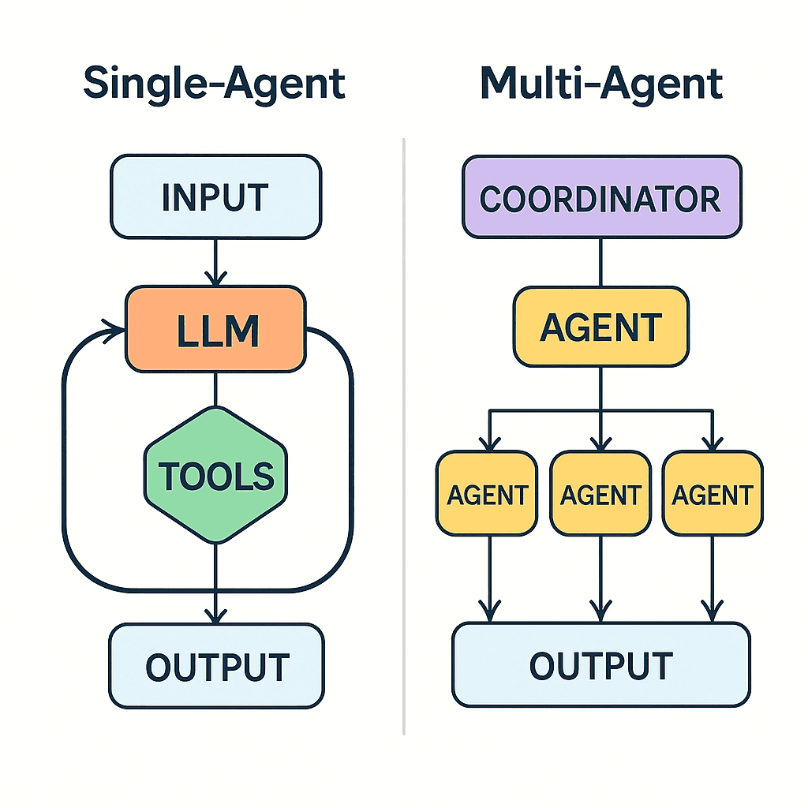
---

## Protocol #1: MCP — Giving Agents Superpowers

### What is MCP?

**MCP (Model Context Protocol)**: Anthropic's standardized protocol allows AI models to be connected to all external tools and data sources. MCP can be thought of as **the USB-C of AI** – one port compatible with everything.

Earlier, before MCP, if you wanted your LLM to do things such as search the web, query a database, and store files, you would need to write your own integration code for each capability. MCP lets you define your tools one time, and any agent that is MCP-compatible can make use of them.

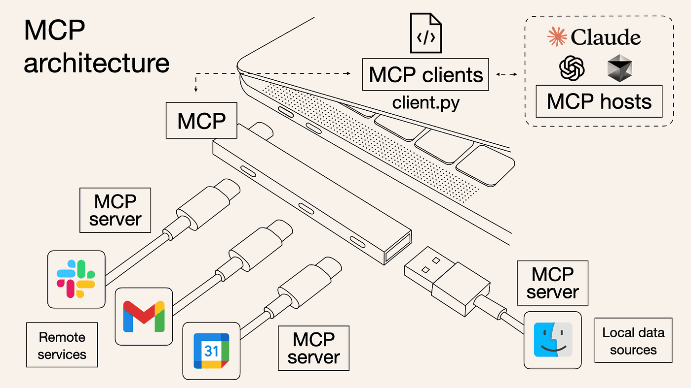

### How MCP Works

MCP follows a simple **Client-Server architecture**:

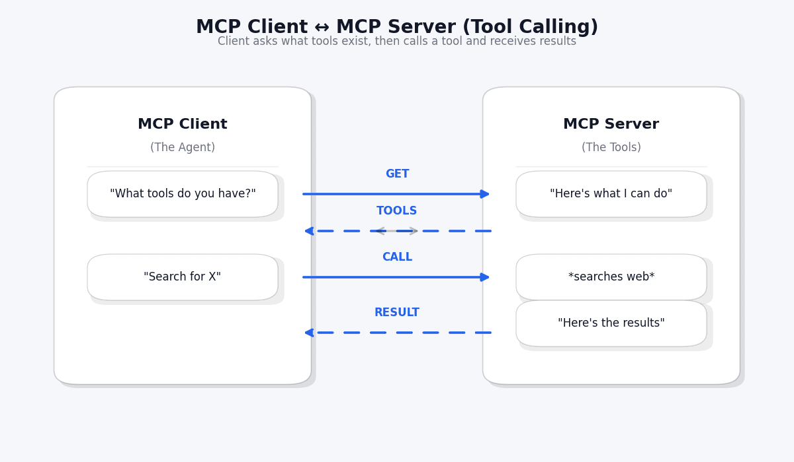

The flow is straightforward:

1. **Discovery**: The agent asks "What tools do you have?" (`tools/list`)
2. **Invocation**: The agent calls a specific tool (`tools/call`)
3. **Result**: The tool returns data back to the agent

### MCP in Our Project

We built three MCP tool servers:

| MCP Tool | Purpose | Used By |
|----------|---------|---------|
| `web_search` | Searches the web via Tavily API | Researcher Agent |
| `fetch_url_content` | Fetches content from a URL | Researcher Agent |
| `save_research_to_file` | Saves reports to the filesystem | Analysis Agent |
| `save_research_to_database` | Persists results in SQL Server | Analysis Agent |
| `search_past_research` | Queries historical research | Analysis Agent |

The beauty of MCP is that you do not need to know how these tools are implemented inside the tool. You simply need to call them by their names as given in the description.

---

## Protocol #2: A2A — Making Agents Talk to Each Other

### What is A2A?

**A2A (Agent to Agent)**, formerly proposed by Google and now presented under the Linux Foundation, describes a protocol allowing **one AI agent to discover another and trade tasks**. MCP fits as helping agents acquire tools; A2A helps them acquire the ability to speak.

Think of it this way:
- **MCP** = "What can this agent *do*?" (capabilities)
- **A2A** = "How do agents *talk*?" (communication)

### The Agent Card: Your Agent's Business Card

Every A2A-compatible agent publishes an **Agent Card** — a JSON document that describes who it is and what it can do. It's like a business card for AI agents:

```json
{
  "name": "Researcher Agent",
  "description": "Searches the web to collect comprehensive research data",
  "url": "https://localhost:44331/a2a/researcher",
  "version": "1.0.0",
  "capabilities": {
    "streaming": false,
    "pushNotifications": false
  },
  "skills": [
    {
      "id": "web-research",
      "name": "Web Research",
      "description": "Searches the web on a given topic and collects raw data",
      "tags": ["research", "web-search", "data-collection"]
    }
  ]
}
```

Other agents can discover this card at `/.well-known/agent.json` and immediately know:
- What this agent does
- Where to reach it
- What skills it has

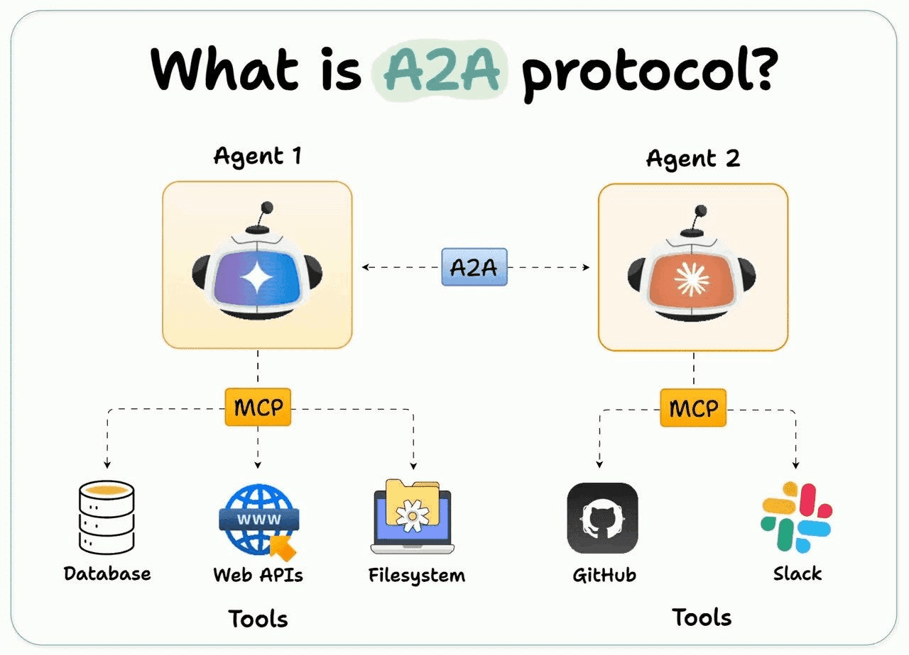

### How A2A Task Exchange Works

Once an agent discovers another agent, it can send tasks:

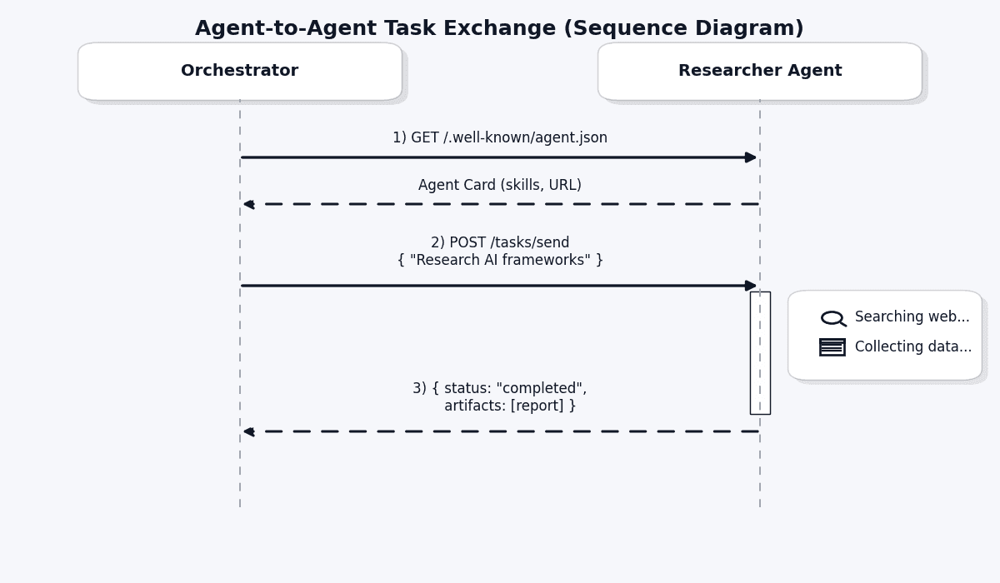

The key concepts:

- **Task**: A unit of work sent between agents (like an email with instructions)
- **Artifact**: The output produced by an agent (like an attachment in the reply)
- **Task State**: `Submitted → Working → Completed/Failed`

### A2A in Our Project

Agent communication in our system uses A2A:

- The **Orchestrator** finds all agents through the Agent Cards
- It sends a research task to the **Researcher Agent**
- The Researcher’s output (artifacts) is used as input by **Analysis Agent** - The Analysis Agent creates the final structured report

---

## Protocol #3: ADK — Organizing Your Agent Team

### What is ADK?

**ADK (Agent Development Kit)**, created by Google, provides patterns for **organizing and orchestrating multiple agents**. It answers the question: "How do you build a team of agents that work together efficiently?"

ADK gives you:
- **BaseAgent**: A foundation every agent inherits from
- **SequentialAgent**: Runs agents one after another (pipeline)
- **ParallelAgent**: Runs agents simultaneously
- **AgentContext**: Shared state that flows through the pipeline
- **AgentEvent**: Control flow signals (escalate, transfer, state updates)

> **Note**: ADK's official SDK is Python-only. We ported the core patterns to .NET for our project.

### The Pipeline Pattern

The most powerful ADK pattern is the **Sequential Pipeline**. Think of it as an assembly line in a factory:

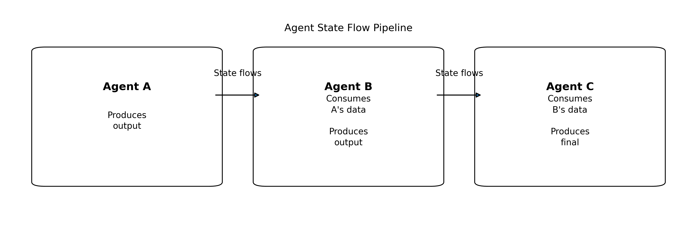

Each agent:
1. Receives the shared **AgentContext** (with state from previous agents)
2. Does its work
3. Updates the state
4. Passes it to the next agent

### AgentContext: The Shared Memory

`AgentContext` is like a shared whiteboard that all agents can read from and write to:

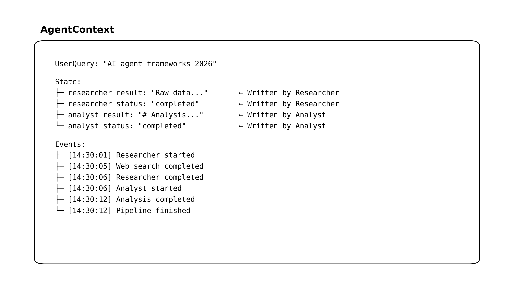

This pattern eliminates the need for complex inter-agent messaging — agents simply read and write to a shared context.

### ADK Orchestration Patterns

ADK supports multiple orchestration patterns:

| Pattern | Description | Use Case |
|---------|-------------|----------|
| **Sequential** | A → B → C | Research → Analysis pipeline |
| **Parallel** | A, B, C simultaneously | Multiple searches at once |
| **Fan-Out/Fan-In** | Split → Process → Merge | Distributed research |
| **Conditional Routing** | If/else agent selection | Route by query type |

---

## How the Three Protocols Work Together

Here's the key insight: **MCP, A2A, and ADK are not competitors — they're complementary layers of a complete agent system.**

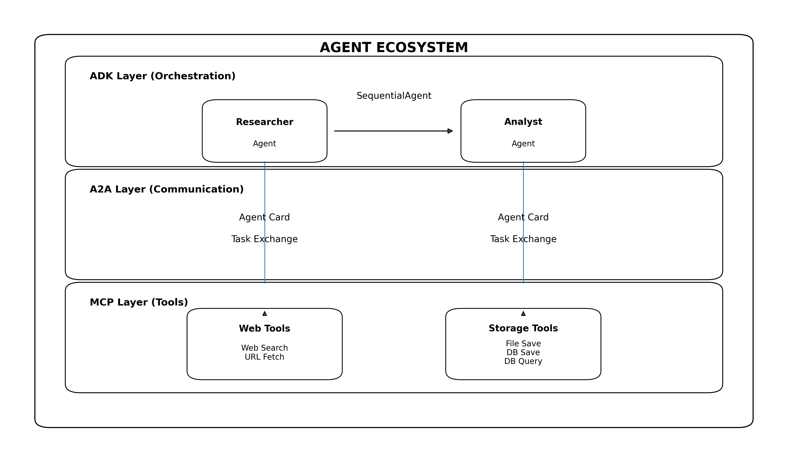

Each protocol handles a different concern:

| Layer | Protocol | Question It Answers |
|-------|----------|-------------------|
| **Top** | ADK | "How are agents organized?" |
| **Middle** | A2A | "How do agents communicate?" |
| **Bottom** | MCP | "What tools can agents use?" |

---

## Our Project: Multi-Agent Research Assistant

### Built With

- **.NET 10.0** — Latest runtime
- **ABP Framework 10.0.2** — Enterprise .NET application framework
- **Semantic Kernel 1.70.0** — Microsoft's AI orchestration SDK
- **Azure OpenAI (GPT)** — LLM backbone
- **Tavily Search API** — Real-time web search
- **SQL Server** — Research persistence
- **MCP SDK** (`ModelContextProtocol` 0.8.0-preview.1)
- **A2A SDK** (`A2A` 0.3.3-preview)


### How It Works (Step by Step)

**Step 1: User Submits a Query**

For example, the user specifies a field of research in the dashboard: *“Compare the latest AI agent frameworks: LangChain, Semantic Kernel, and AutoGen”*, and then specifies execution mode as ADK-Sequential or A2A.

**Step 2: Orchestrator Activates**

The `ResearchOrchestrator` receives the query and constructs the `AgentContext`. In ADK mode, it constructs a `SequentialAgent` with two sub-agents; in A2A mode, it uses the `A2AServer` to send the tasks.

**Step 3: Researcher Agent Goes to Work**

The Researcher Agent:
- Receives the query from the context
- Uses GPT to formulate optimal search queries
- Calls the `web_search` MCP tool (powered by Tavily API)
- Collects and synthesizes raw research data
- Stores results in the shared `AgentContext`

**Step 4: Analysis Agent Takes Over**

The Analysis Agent:
- Reads the Researcher's raw data from `AgentContext`
- Uses GPT to perform deep analysis
- Generates a structured Markdown report with sections:
  - Executive Summary
  - Key Findings
  - Detailed Analysis
  - Comparative Assessment
  - Conclusion and Recommendations
- Calls MCP tools to save the report to both filesystem and database

**Step 5: Results Returned**

The orchestrator collects all results and returns them to the user via the REST API. The dashboard displays the research report, analysis report, agent event timeline, and raw data.


### Two Execution Modes

Our system supports two execution modes, demonstrating both ADK and A2A approaches:

#### Mode 1: ADK Sequential Pipeline

Agents are organized as a `SequentialAgent`. State flows automatically through the pipeline via `AgentContext`. This is an in-process approach — fast and simple.

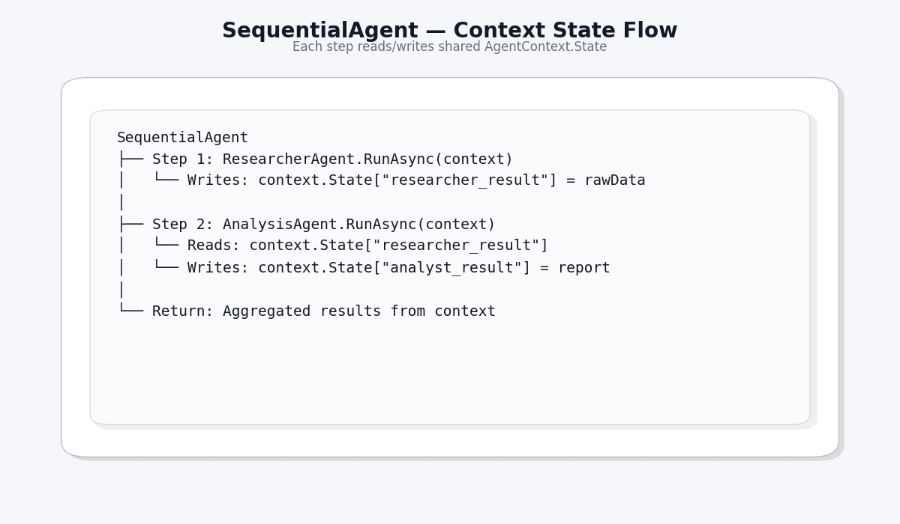

#### Mode 2: A2A Protocol-Based

Agents communicate via the A2A protocol. The Orchestrator sends `AgentTask` objects to each agent through the `A2AServer`. Each agent has its own `AgentCard` for discovery.

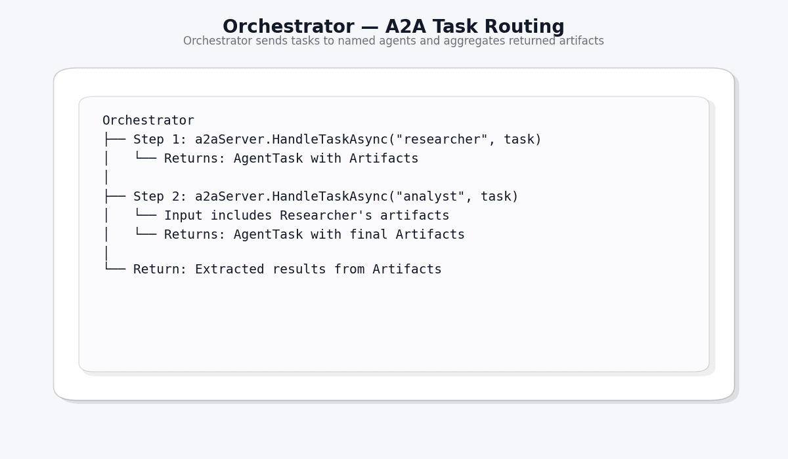

### The Dashboard

The UI provides a complete research experience:

- **Hero Section** with system description and protocol badges
- **Architecture Cards** showing all four components (Researcher, Analyst, MCP Tools, Orchestrator)
- **Research Form** with query input and mode selection
- **Live Pipeline Status** tracking each stage of execution
- **Tabbed Results** view: Research Report, Analysis Report, Raw Data, Agent Events
- **Research History** table with past queries and their results


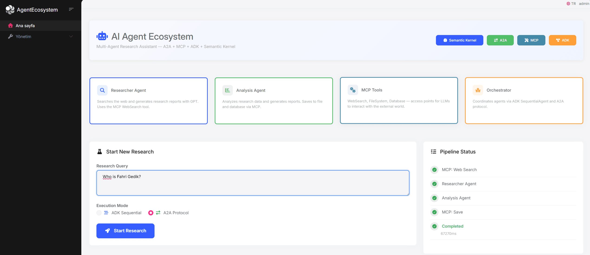

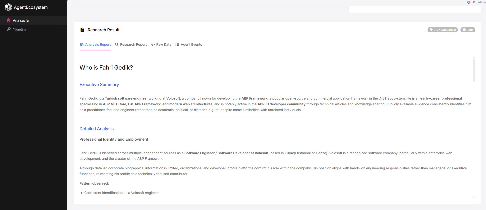

---

## Why ABP Framework?

We chose ABP Framework as our .NET application foundation. Here's why it was a natural fit:

| ABP Feature | How We Used It |
|-------------|---------------|
| **Auto API Controllers** | `ResearchAppService` automatically becomes REST API endpoints |
| **Dependency Injection** | Clean registration of agents, tools, orchestrator, Semantic Kernel |
| **Repository Pattern** | `IRepository<ResearchRecord>` for database operations in MCP tools |
| **Module System** | All agent ecosystem config encapsulated in `AgentEcosystemModule` |
| **Entity Framework Core** | Research record persistence with code-first migrations |
| **Built-in Auth** | OpenIddict integration for securing agent endpoints |
| **Health Checks** | Monitoring agent ecosystem health |

ABP's single layer template provided us the best .NET groundwork, which had all the enterprise features without any unnecessary complexity for a focused AI project. Of course, the agent architecture (MCP, A2A, ADK) is actually framework-agnostic and can be implemented with any .NET application.

---

## Key Takeaways

### 1. Protocols Are Complementary, Not Competing

MCP, A2A, and ADK solve different problems. Using them together creates a complete agent system:
- **MCP**: Standardize tool access
- **A2A**: Standardize inter-agent communication
- **ADK**: Standardize agent orchestration

### 2. Start Simple, Scale Later

Our approach runs all of that in a single process, which is in-process A2A. Using A2A allowed us to design the code so that each agent can be extracted into its own microservice later on without affecting the code logic.

### 3. Shared State > Message Passing (For Simple Cases)

ADK's `AgentContext` with shared state is simpler and faster than A2A message passing for in-process scenarios. Use A2A when agents need to run as separate services.

### 4. MCP is the Real Game-Changer

The ability to define tools once and have any agent use them — with automatic discovery and structured invocations — eliminates enormous amounts of boilerplate code.

### 5. LLM Abstraction is Critical

Using Semantic Kernel's `IChatCompletionService` lets you swap between Azure OpenAI, OpenAI, Ollama, or any provider without touching agent code.

---

## What's Next?

This project demonstrates the foundation of a multi-agent system. Future enhancements could include:

- **Streaming responses** — Real-time updates as agents work (A2A supports this)
- **More specialized agents** — Code analysis, translation, fact-checking agents
- **Distributed deployment** — Each agent as a separate microservice with HTTP-based A2A
- **Agent marketplace** — Discover and integrate third-party agents via A2A Agent Cards
- **Human-in-the-loop** — Using A2A's `InputRequired` state for human approval steps
- **RAG integration** — MCP tools for vector database search

---

## Resources

| Resource | Link |
|----------|------|
| **MCP Specification** | [modelcontextprotocol.io](https://modelcontextprotocol.io) |
| **A2A Specification** | [google.github.io/A2A](https://google.github.io/A2A) |
| **ADK Documentation** | [google.github.io/adk-docs](https://google.github.io/adk-docs) |
| **ABP Framework** | [abp.io](https://abp.io) |
| **Semantic Kernel** | [github.com/microsoft/semantic-kernel](https://github.com/microsoft/semantic-kernel) |
| **MCP .NET SDK** | [NuGet: ModelContextProtocol](https://www.nuget.org/packages/ModelContextProtocol) |
| **A2A .NET SDK** | [NuGet: A2A](https://www.nuget.org/packages/A2A) |
| **Our Source Code** | [GitHub Repository](https://github.com/fahrigedik/agent-ecosystem-in-abp) |

---

## Conclusion

Developing a multi-agent AI system is no longer a futuristic dream; it’s something that can actually be achieved today by using open protocols and available frameworks. In this manner, by using **MCP** for access to tools, **A2A** for communicating between agents, and **ADK** for orchestration, we have actually built a Research Assistant.

ABP Framework and .NET turned out to be an excellent choice, delivering us the infrastructure we needed to implement DI, repositories, auto APIs, and modules, allowing us to work completely on the AI agent architecture.

The era of single LLM calls is ending, and the era of agent ecosystems begins now.

---