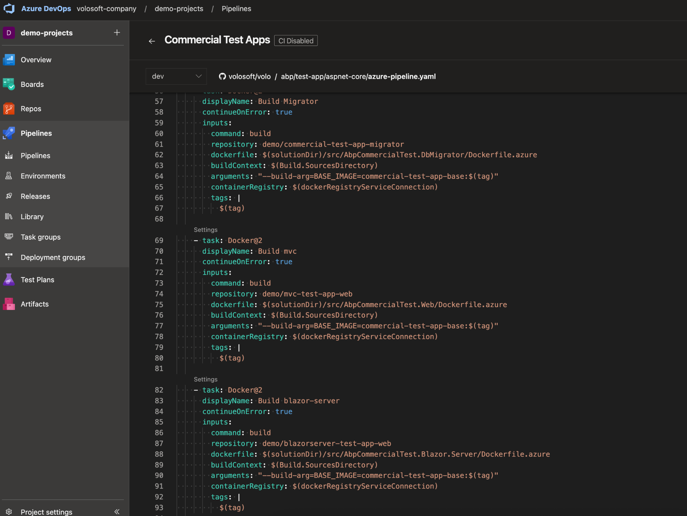
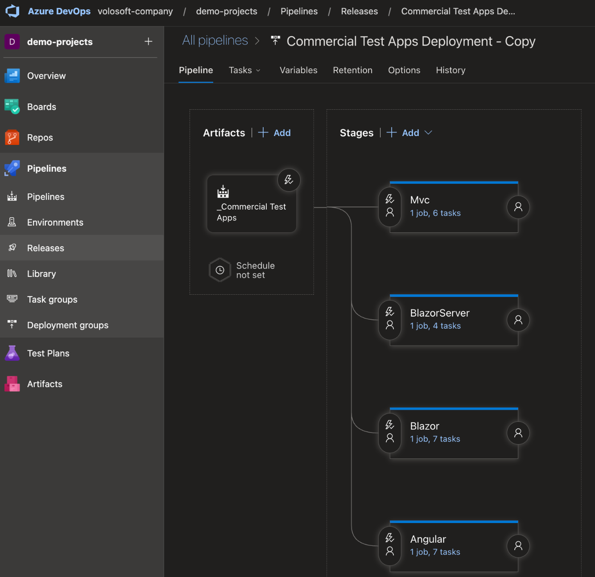
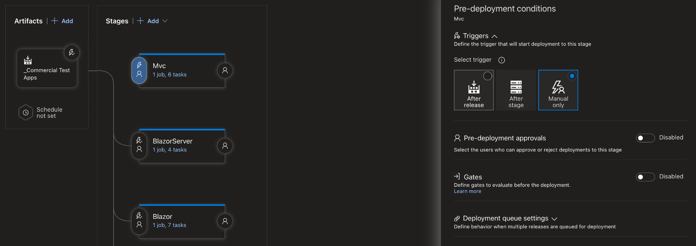
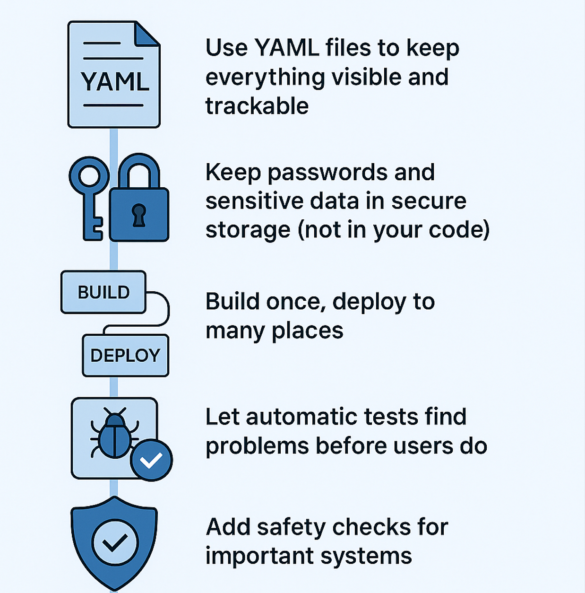

# 🚀 Best Practices for Azure DevOps CI/CD Pipelines

**CI/CD (Continuous Integration / Continuous Delivery)** is not just fancy tech talk - it's now a must-have for modern software teams.  
Microsoft's **Azure DevOps** helps make these processes easier to manage.  
But how do you create pipelines that work well for your team? Let's look at some practical tips that will make your life easier.

---

## 1. 📜 Define Your Pipeline as Code

Don't use the manual setup method that's hard to track. Azure DevOps lets you use **YAML files** for your pipelines, which gives you:

- A record of all changes - who made them and when  
- The same setup across all environments  
- The ability to undo changes when something goes wrong  

This stops the common problem where something works on one computer but not another.  

---

## 2. 🔑 Store Sensitive Information Safely

Never put passwords directly in your code, even temporarily.  
Each environment should have its own settings, and keep sensitive information in **Azure Key Vault** or **Library Variable Groups**.  

You'll avoid security problems later.  

<!--  -->
---

## 3. 🏗️ Keep Building and Releasing Separate

Think of **Building** like cooking a meal - you prepare everything and package it up.  
**Releasing** is like delivering that meal to different people.  

Keeping these as separate steps means:

- You create your package once, then send it to multiple places  
- You save time and resources by not rebuilding the same thing over and over  

---

## 4. 🧪 Add Automatic Testing

Don't waste time testing the same things manually over and over.  
Set up **different types of tests** to run automatically. When tests run every time you make changes:

- You catch problems before your customers do  
- Your software quality stays high without extra manual work  

Azure DevOps has tools to help you see test results easily without searching through technical logs.  

---

## 5. 🛡️ Add Safety Checks

Automatic doesn't mean pushing everything to your live system right away.  
For important environments, add **human approval steps** or **automatic checks** like security scans.  

This helps you avoid emergency problems in the middle of the night.  

---

## ✅ Conclusion

Good Azure DevOps pipelines aren't just about automation - they help you feel confident in your process.  
Remember these main points:

✔ Use YAML files to keep everything visible and trackable  
✔ Keep passwords and sensitive data in secure storage (not in your code)  
✔ Build once, deploy to many places  
✔ Let automatic tests find problems before users do  
✔ Add safety checks for important systems

---
