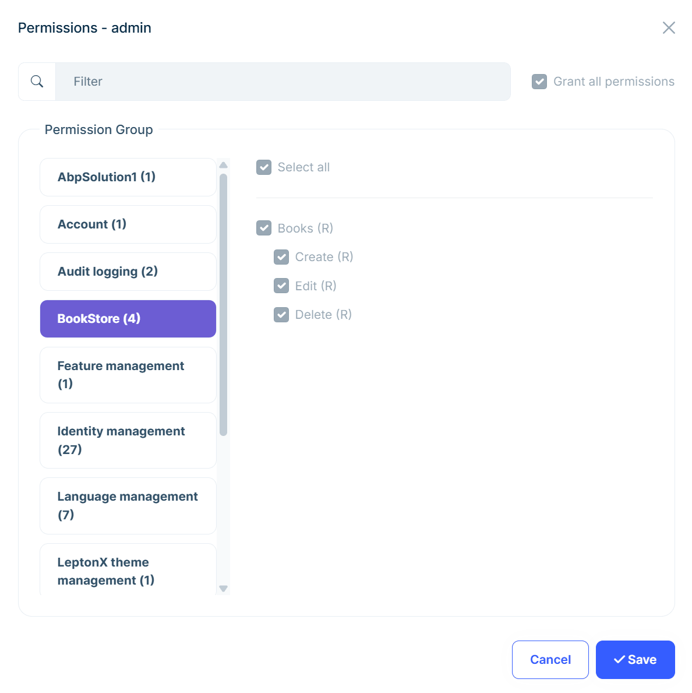

# Building a Permission-Based Authorization System for ASP.NET Core

In this article, we'll explore different authorization approaches in ASP.NET Core and examine how ABP's permission-based authorization system works.

First, we'll look at some of the core authorization types that come with ASP.NET Core, such as role-based, claims-based, policy-based, and resource-based authorization. We'll briefly review the pros and cons of each approach.

Then, we'll dive into [ABP's Permission-Based Authorization System](https://abp.io/docs/latest/framework/fundamentals/authorization#permission-system). This is a more advanced approach that gives you fine-grained control over what users can do in your application. We'll also explore ABP's Permission Management Module, which makes managing permissions through the UI easily.

## Understanding ASP.NET Core Authorization Types

Before diving into permission-based authorization, let's examine some of the core authorization types available in ASP.NET Core:

- **[Role-Based Authorization](https://learn.microsoft.com/en-us/aspnet/core/security/authorization/roles?view=aspnetcore-9.0)** checks if the current user belongs to specific roles (like **"Admin"** or **"User"**) and grants access based on these roles. (For example, only users in the **"Manager"** role can access the employee salary management page.)

- **[Claims-Based Authorization](https://learn.microsoft.com/en-us/aspnet/core/security/authorization/claims?view=aspnetcore-9.0)** uses key-value pairs (claims) that describe user attributes, such as age, department, or security clearance. (For example, only users with a **"Department=Finance"** claim can view financial reports.) This provides more granular control but requires careful claim management (such as grouping claims under policies).

- **[Policy-Based Authorization](https://learn.microsoft.com/en-us/aspnet/core/security/authorization/policies?view=aspnetcore-9.0)** combines multiple requirements (roles, claims, custom logic) into reusable policies. It offers flexibility and centralized management, and **this is exactly why ABP's permission system is built on top of it!** (We'll discuss this in more detail later.)

- **[Resource-Based Authorization](https://learn.microsoft.com/en-us/aspnet/core/security/authorization/resourcebased?view=aspnetcore-9.0)** determines access by examining both the user and the specific item they want to access. (For example, a user can edit only their own blog posts, not others' posts.) Unlike policy-based authorization which applies the same rules everywhere, resource-based authorization makes decisions based on the actual data being accessed, requiring more complex implementation.

Here's a quick comparison of these approaches:

| Authorization Type | Pros | Cons |
|-------------------|------|------|
| **Role-Based** | Simple implementation, easy to understand | Becomes inflexible with complex role hierarchies |
| **Claims-Based** | Granular control, flexible user attributes | Complex claim management, potential for claim explosion |
| **Policy-Based** | Centralized logic, combines multiple requirements | Can become complex with numerous policies |
| **Resource-Based** | Fine-grained per-resource control | Implementation complexity, resource-specific code |

## What is Permission-Based Authorization?

Permission-based authorization takes a different approach from other authorization types by defining specific permissions (like **"CreateUser"**, **"DeleteOrder"**, **"ViewReports"**) that represent granular actions within your application. These permissions can be assigned to users directly or through roles, providing both flexibility and clear action-based access control.

ABP Framework's permission system is built on top of this approach and extends ASP.NET Core's policy-based authorization system, working seamlessly with it.

## ABP Framework's Permission System

ABP extends [ASP.NET Core Authorization](https://learn.microsoft.com/en-us/aspnet/core/security/authorization/introduction?view=aspnetcore-9.0) by adding **permissions** as automatic [policies](https://learn.microsoft.com/en-us/aspnet/core/security/authorization/policies?view=aspnetcore-9.0) and allows the authorization system to be used in application services as well.

This system provides a clean abstraction while maintaining full compatibility with ASP.NET Core's authorization infrastructure.

ABP also provides a [Permission Management Module](https://abp.io/docs/latest/modules/permission-management) that offers a complete UI and API for managing permissions. This allows you to easily manage permissions in the UI, assign permissions to roles or users, and much more. (We'll see how to use it in the following sections.)

### Defining Permissions in ABP

In ABP, permissions are defined in classes (typically under the `*.Application.Contracts` project) that inherit from the `PermissionDefinitionProvider` class. Here's how you can define permissions for a book management system:

```csharp
public class BookStorePermissionDefinitionProvider : PermissionDefinitionProvider
{
    public override void Define(IPermissionDefinitionContext context)
    {
        var bookStoreGroup = context.AddGroup("BookStore");

        var booksPermission = bookStoreGroup.AddPermission("BookStore.Books", L("Permission:Books"));
        booksPermission.AddChild("BookStore.Books.Create", L("Permission:Books.Create"));
        booksPermission.AddChild("BookStore.Books.Edit", L("Permission:Books.Edit"));
        booksPermission.AddChild("BookStore.Books.Delete", L("Permission:Books.Delete"));
    }

    private static LocalizableString L(string name)
    {
        return LocalizableString.Create<BookStoreResource>(name);
    }
}
```

ABP automatically discovers this class and registers the permissions/policies in the system. You can then assign these permissions/policies to users/roles. There are two ways to do this:

* Using the [Permission Management Module](https://abp.io/docs/latest/modules/permission-management)
* Using the `IPermissionManager` service (via code)

#### Setting Permissions to Roles and Users via Permission Management Module

When you define a permission, it also becomes usable in the ASP.NET Core authorization system as a **policy name**. If you are using the [Permission Management Module](https://abp.io/docs/latest/modules/permission-management), you can manage the permissions through the UI:



In the permission management UI, you can grant permissions to roles and users through the **Role Management** and **User Management** pages within the "permissions" modals. You can then easily check these permissions in your code. In the screenshot above, you can see the permission modal for the user's page, clearly showing the permissions granted to the user by their role. (**(R)** in the UI indicates that the permission is granted by one of the current user's roles.)

#### Setting Permissions to Roles and Users via Code

You can also set permissions for roles and users programmatically. You just need to inject the `IPermissionManager` service and use its `SetForRoleAsync` and `SetForUserAsync` methods (or similar methods):

```csharp
public class MyService : ITransientDependency
{
    private readonly IPermissionManager _permissionManager;

    public MyService(IPermissionManager permissionManager)
    {
        _permissionManager = permissionManager;
    }

    public async Task GrantPermissionForUserAsync(Guid userId, string permissionName)
    {
        await _permissionManager.SetForUserAsync(userId, permissionName, true);
    }

    public async Task ProhibitPermissionForUserAsync(Guid userId, string permissionName)
    {
        await _permissionManager.SetForUserAsync(userId, permissionName, false);
    }
}
```

### Checking Permissions in AppServices and Controllers

ABP provides multiple ways to check permissions. The most common approach is using the `[Authorize]` attribute and passing the permission/policy name.

Here is an example of how to check permissions in an application service:

```csharp
[Authorize("BookStore.Books")]
public class BookAppService : ApplicationService, IBookAppService
{
    [Authorize("BookStore.Books.Create")]
    public async Task<BookDto> CreateAsync(CreateBookDto input)
    {
        //logic here
    }
}
```

> Notice that you can use the `[Authorize]` attribute at both class and method levels. In the example above, the `CreateAsync` method is marked with the `[Authorize]` attribute, so it will check the user's permission before executing the method. Since the application service class also has a permission requirement, both permissions must be granted to the user to execute the method!

And here is an example of how to check permissions in a controller:

```csharp
[Authorize("BookStore.Books")]
public class CreateBookController : AbpController
{
    //omitted for brevity...
}
```

### Programmatic Permission Checking

To conditionally control authorization in your code, you can use the `IAuthorizationService` service:

```csharp
public class BookAppService : ApplicationService, IBookAppService
{
    public async Task<BookDto> CreateAsync(CreateBookDto input)
    {
        // Checks the permission and throws an exception if the user does not have the permission
        await AuthorizationService.CheckAsync(BookStorePermissions.Books.Create);
        
        // Your logic here
    }

    public async Task<bool> CanUserCreateBooksAsync()
    {
        // Checks if the permission is granted for the current user
        return await AuthorizationService.IsGrantedAsync(BookStorePermissions.Books.Create);
    }
}
```

You can use the `IAuthorizationService`'s helpful methods for authorization checking, as shown in the example above:

- `IsGrantedAsync` checks if the current user has the given permission.
- `CheckAsync` throws an exception if the current user does not have the given permission.
- `AuthorizeAsync` checks if the current user has the given permission and returns an `AuthorizationResult`, which has a `Succeeded` property that you can use to verify if the user has the permission.

Also notice that we did not inject the `IAuthorizationService` in the constructor, because we are using the `ApplicationService` base class, which already provides property injection for it. This means we can directly use it in our application services, just like other helpful base services (such as `ICurrentUser` and `ICurrentTenant`).

## Conclusion

Permission-based authorization in ABP Framework provides a powerful and flexible approach to securing your applications. By building on ASP.NET Core's policy-based authorization, ABP offers a clean abstraction that simplifies permission management while maintaining the full power of the underlying system.

The ability to check permissions in both application services and controllers makes ABP Framework's authorization system very flexible and powerful, yet easy to use.

Additionally, the Permission Management Module makes it very easy to manage permissions and roles through the UI. You can learn more about how it works in the [documentation](https://abp.io/docs/latest/modules/permission-management).
