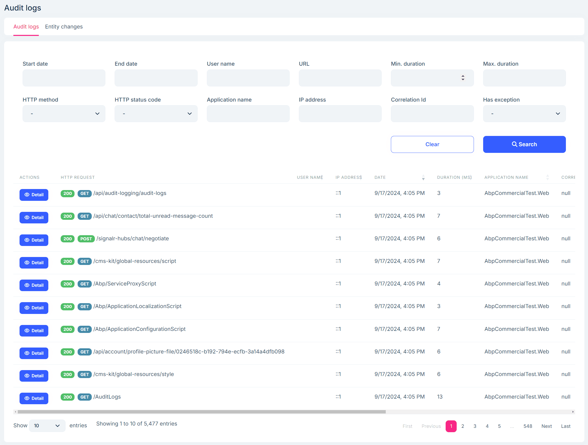
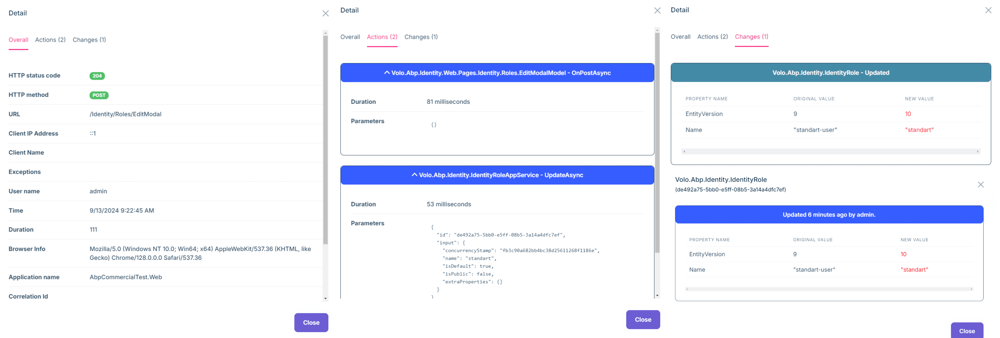

# Keep Track of Your Users in an ASP.NET Core Application

Tracking what users do in your app matters for security, debugging, and business insights. Doing it by hand usually means lots of boilerplate: managing request context, logging operations, tracking entity changes, and more. It adds complexity and makes mistakes more likely.

## Why Applications Need Audit Logs

Audit logs are time-ordered records that show what happened in your app.

A good audit log should capture details for every web request, including:

### 1. Request and Response Details
- Basic info like **URL, HTTP method, browser**, and **HTTP status code**
- Network info like **client IP address** and **user agent**
- **Request parameters** and **response content** when needed

### 2. Operations Performed
- **Controller actions** and **application service method calls** with parameters
- **Execution time** and **duration** for performance tracking
- **Call chains** and **dependencies** where helpful

### 3. Entity Changes
- **Entity changes** that happen during requests
- **Property-level changes**, with old and new values
- **Change types** (create, update, delete) and timestamps

### 4. Exception Information
- **Errors and exceptions** during request execution
- **Exception stack traces** and **error context**
- Clear records of failed operations

### 5. Request Duration
- Key metrics for **measuring performance**
- **Finding bottlenecks** and optimization opportunities
- Useful data for **monitoring system health**

## The Challenge with Doing It by Hand

In ASP.NET Core, developers often use middleware or MVC filters for tracking. Here’s what that looks like and the common problems you’ll hit.

### Using Middleware

Middleware are components in the ASP.NET Core pipeline that run during request processing.

Manual tracking typically requires:
- Writing custom middleware to intercept HTTP requests
- Extracting user info (user ID, username, IP address, and so on)
- Recording request start time and execution duration
- Handling both success and failure cases
- Saving audit data to logs or a database

### Tracking Inside Business Methods

In your business code, you also need to:
- Log the start and end of important operations
- Capture errors and related context
- Link business operations to the request-level audit data
- Make sure you track all critical actions

### Problems with Manual Tracking

Manual tracking has some big downsides:

**Code duplication and maintenance pain**: Each controller ends up repeating similar tracking logic. Changing the rules means touching many places, and it’s easy to miss some.

**Consistency and reliability issues**: Different people implement tracking differently. Exception paths are easy to forget. It’s hard to ensure complete coverage.

**Performance and scalability concerns**: Homegrown tracking can slow the app if not designed well. Tuning and extending it takes effort.

**Entity change tracking is especially hard**. It often requires:
- Recording original values before updates
- Comparing old and new values for each property
- Handling complex types, collections, and navigation properties
- Designing and saving change records
- Capturing data even when exceptions happen

This usually leads to:
- **A lot of code** in every update method
- **Easy-to-miss edge cases** and subtle bugs
- **High maintenance** when entity models change
- **Extra queries and comparisons** that can hurt performance
- **Incomplete coverage** for complex scenarios

## ABP Framework’s Built-in Solution

ABP Framework includes a built-in audit logging system. It solves the problems above and adds useful features on top.

### Simple Setup vs. Manual Tracking

Instead of writing lots of code, you configure it once:

```csharp
// Configure audit log options in the module's ConfigureServices method
Configure<AbpAuditingOptions>(options =>
{
    options.IsEnabled = true; // Enable audit log system (default value)
    options.IsEnabledForAnonymousUsers = true; // Track anonymous users (default value)
    options.IsEnabledForGetRequests = false; // Skip GET requests (default value)
    options.AlwaysLogOnException = true; // Always log on errors (default value)
    options.HideErrors = true; // Hide audit log errors (default value)
    options.EntityHistorySelectors.AddAllEntities(); // Track all entity changes
});
```

```csharp
// Add middleware in the module's OnApplicationInitialization method
public override void OnApplicationInitialization(ApplicationInitializationContext context)
{
    var app = context.GetApplicationBuilder();
    
    // Add audit log middleware - one line of code solves all problems!
    app.UseAuditing();
}
```

By contrast, manual tracking needs middleware, controller logic, exception handling, and often hundreds of lines. With ABP, a couple of lines enable it and it just works.

## What You Get with ABP

Here’s how ABP removes tracking code from your application and still captures what you need.

### 1. Application Services: No Tracking Code

Manual approach: You’d log inside each method and still risk missing cases.

ABP approach: Tracking is automatic—no tracking code in your methods.

```csharp
public class BookAppService : ApplicationService
{
    private readonly IRepository<Book, Guid> _bookRepository;
    private readonly IRepository<Author, Guid> _authorRepository;
    
    [Authorize(BookPermissions.Create)]
    public virtual async Task<BookDto> CreateAsync(CreateBookDto input)
    {
        // No need to write any tracking code!
        // ABP automatically tracks:
        // - Method calls and parameters
        // - Calling user
        // - Execution duration
        // - Any exceptions thrown
        
        var author = await _authorRepository.GetAsync(input.AuthorId);
        var book = new Book(input.Title, author, input.Price);
        
        await _bookRepository.InsertAsync(book);
        
        return ObjectMapper.Map<Book, BookDto>(book);
    }
    
    [Authorize(BookPermissions.Update)]
    public virtual async Task<BookDto> UpdateAsync(Guid id, UpdateBookDto input)
    {
        var book = await _bookRepository.GetAsync(id);
        
        // No need to write any entity change tracking code!
        // ABP automatically tracks entity changes:
        // - Which properties changed
        // - Old and new values
        // - When the change happened
        
        book.ChangeTitle(input.Title);
        book.ChangePrice(input.Price);
        
        await _bookRepository.UpdateAsync(book);
        
        return ObjectMapper.Map<Book, BookDto>(book);
    }
}
```

With manual code, each method might need 20–30 lines for tracking. With ABP, it’s zero—and you still get richer data.

For entity changes, ABP also saves you from writing comparison code. It handles:
- Property change detection
- Recording old and new values
- Complex types and collections
- Navigation property changes
- All with no extra code to maintain

### 2. Entity Change Tracking: One Line to Turn It On

Manual approach: You’d compare properties, serialize complex types, track collection changes, and write to storage.

ABP approach: Mark the entity or select entities globally.

```csharp
// Enable audit log for specific entity - one line of code solves all problems!
[Audited]
public class MyEntity : Entity<Guid>
{
    public string Name { get; set; }
    public string Description { get; set; }
    
    [DisableAuditing] // Exclude sensitive data - security control
    public string InternalNotes { get; set; }
}
```

```csharp
// Or global configuration - batch processing
Configure<AbpAuditingOptions>(options =>
{
    // Track all entities - one line of code tracks all entity changes
    options.EntityHistorySelectors.AddAllEntities();
    
    // Or use custom selector - precise control
    options.EntityHistorySelectors.Add(
        new NamedTypeSelector(
            "MySelectorName",
            type => typeof(IEntity).IsAssignableFrom(type)
        )
    );
});
```

### 3. Extension Features

Manual approach: Adding custom tracking usually spreads across many places and is hard to test.

ABP approach: Use a contributor for clean, centralized extensions.

```csharp
public class MyAuditLogContributor : AuditLogContributor
{
    public override void PreContribute(AuditLogContributionContext context)
    {
        var currentUser = context.ServiceProvider.GetRequiredService<ICurrentUser>();
        
        // Easily add custom properties - manual implementation needs lots of work
        context.AuditInfo.SetProperty(
            "MyCustomClaimValue",
            currentUser.FindClaimValue("MyCustomClaim")
        );
    }
    
    public override void PostContribute(AuditLogContributionContext context)
    {
        // Add custom comments - business logic integration
        context.AuditInfo.Comments.Add("Some comment...");
    }
}

// Register contributor - one line of code enables extension features
Configure<AbpAuditingOptions>(options =>
{
    options.Contributors.Add(new MyAuditLogContributor());
});
```

### 4. Precise Control

Manual approach: You end up with complex conditional logic.

ABP approach: Use attributes for simple, precise control.

```csharp
// Disable audit log for specific controller - precise control
[DisableAuditing]
public class HomeController : AbpController
{
    // Health check endpoints won't be audited - avoid meaningless logs
}

// Disable for specific action - method-level control
public class HomeController : AbpController
{
    [DisableAuditing]
    public async Task<ActionResult> Home()
    {
        // This action won't be audited - public data access
    }
    
    public async Task<ActionResult> OtherActionLogged()
    {
        // This action will be audited - important business operation
    }
}
```

### 5. Visual Management of Audit Logs

ABP also provides a UI to browse and inspect audit logs:





## Manual vs. ABP: A Quick Comparison

The benefits of ABP’s audit log system compared to doing it by hand:

| Aspect | Manual Implementation | ABP Audit Logs |
|--------|----------------------|----------------|
| **Setup Complexity** | High — Write middleware, services, repository code | Low — A few lines of config, works out of the box |
| **Code Maintenance** | High — Tracking code spread across the app | Low — Centralized, convention-based |
| **Consistency** | Variable — Depends on discipline | Consistent — Automated and standardized |
| **Performance** | Risky without careful tuning | Built-in optimizations and scope control |
| **Functionality Completeness** | Basic tracking only | Comprehensive by default |
| **Error Handling** | Easy to miss edge cases | Automatic and reliable |
| **Data Integrity** | Manual effort required | Handled by the framework |
| **Extensibility** | Custom work is costly | Rich extension points |
| **Development Efficiency** | Weeks to build | Minutes to enable |
| **Learning Cost** | Understand many details | Convention-based, low effort |

## Why ABP Audit Logs Matter

ABP’s audit logging removes the boilerplate from user tracking in ASP.NET Core apps.

### Core Idea

Manual tracking is error-prone and hard to maintain. ABP gives you a convention-based, automated system that works with minimal setup.

### Key Benefits

ABP runs by convention, so you don’t need repetitive code. You can control behavior at the request, entity, and method levels. It automatically captures request details, operations, entity changes, and exceptions, and you can extend it with contributors when needed.

### Results in Practice

| Metric | Manual Implementation | ABP Implementation | Improvement |
|--------|----------------------|-------------------|-------------|
| Development Time | Weeks | Minutes | **99%+** |
| Lines of Code | Hundreds of lines | 2 lines of config | **99%+** |
| Maintenance Cost | High | Low | **Significant** |
| Functionality Completeness | Basic | Comprehensive | **Significant** |
| Error Rate | Higher risk | Lower risk | **Improved** |

### Recommendation

If you need audit logs, start with ABP’s built-in system. It reduces effort, improves consistency, and stays flexible as your app grows. You can focus on your business logic and let the framework handle the infrastructure.

## References

- [ABP Audit Logging](https://abp.io/docs/latest/framework/infrastructure/audit-logging)
- [ABP Audit Logging UI](https://abp.io/modules/Volo.AuditLogging.Ui)
