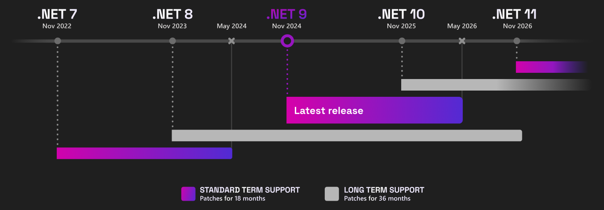
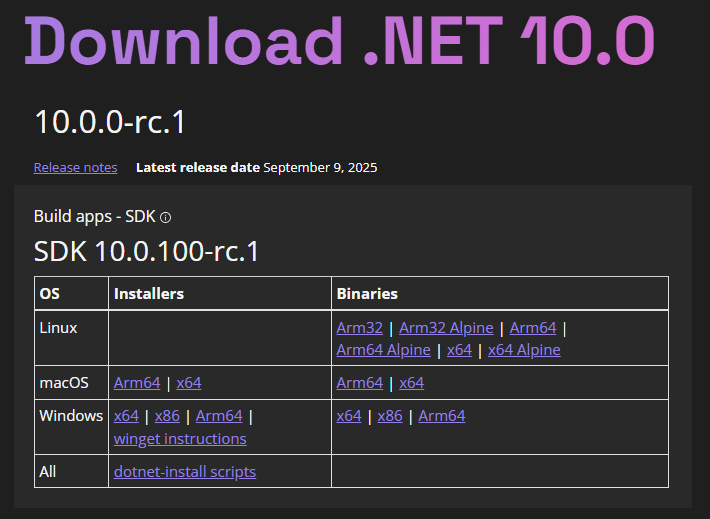

# .NET 10: What You Need to Know (LTS Release, Coming November 2025)

The next version of .NET is .NET 10 and it is coming with **Long-Term Support (LTS)**, scheduled for **November 2025**.

On **September 9, 2025**, Microsoft released **.NET 10 Release Candidate 1 (RC1)**, which supports go-live usage and is compatible with [Visual Studio 2026 Insider](https://visualstudio.microsoft.com/insiders/) and [Visual Studio Code Insider](https://code.visualstudio.com/insiders/) via the [C# Dev Kit](https://marketplace.visualstudio.com/items?itemName=ms-dotnettools.csdevkit) extension.

------

## .NET 10 Runtime Enhancements

- **JIT Speed-ups**: Enhanced struct argument handling—members now go directly into registers, reducing memory load/store operations.
- **Advanced Loop Optimization**: New graph-based loop inversion improves precision and boosts further optimizations.
- **Array Interface De-virtualization**: Critical for performance, now array-based enumerations inline and skip virtual calls including de-abstraction of array enumeration and small-array stack allocation.
- **General JIT Improvements**: Better code layout and branch reduction support overall efficiency.

------

## Language & Library Upgrades

### C# 14 Enhancements

- Field-backed properties: easier custom getters/setters.
- `nameof` for unbound generics like `List<>`.
- Implicit conversions for `Span<T>` and `ReadOnlySpan<T>`.
- Lambda parameter modifiers (`ref`, `in`, `out`).
- Partial constructors/events.
- `extension` blocks for static extension members.
- Null-conditional assignment (`?.=`) and custom compound/increment operators.

### F# & Visual Basic Enhancements

- F# improvements via `<LangVersion>preview</LangVersion>`, updated `FSharp.Core`, and compiler fixes.
- VB compiler supports `unmanaged` generics and respects `OverloadResolutionPriorityAttribute` for performance and overload clarity.

## .NET Libraries & SDK

### Libraries:

- Better ZipArchive performance (lazy entry loading).
- JSON improvements, including `JsonSourceGenerationOptions` and reference-handling tweaks.
- Enhanced `OrderedDictionary`, ISOWeek date APIs, PEM data and certificate handling, `CompareOptions.NumericOrdering`

### SDK & CLI:

- No major new SDK features in RC1—you should expect stability fixes rather than additions.
- Earlier previews brought JSON support improvements (e.g., `PipeReader` for JSON, WebSocketStream, ML-DSA crypto, AES KeyWrap), TLS 1.3 for macOS

------

## ASP.NET Core & Blazor

### Blazor & Web App Security:

Enhanced OIDC and Microsoft Entra ID integration, including encrypted token caching and Key Vault use.

### UI Enhancements:

- `QuickGrid` gains `RowClass` for conditional styling.
- Scripts now served as static assets with compression and fingerprinting.
- NavigationManager no longer scrolls to top for same-page updates.

### API Improvements:

Full support for OpenAPI 3.1 (JSON Schema draft 2020-12), and metrics for authentication/authorization events (e.g., sign-ins, logins) .

------

## .NET MAUI

Updates include multiple file selection, image compression, WebView request interception, and support for Android API 35/36.

## EF Core

LINQ enhancements, performance boosts, better Azure Cosmos DB support, and more flexible named query filters.

## Breaking Changes in .NET 10

### ASP.NET Core - Breaking Changes in .NET 10:

.NET 10 Preview 7 brings **several deprecations + behavior changes**, while **RC1 removes the old WebHost model**.

- **[Cookie login redirects disabled](https://learn.microsoft.com/en-us/dotnet/core/compatibility/aspnet-core/10/cookie-authentication-api-endpoints)** → Redirects no longer occur for API endpoints; APIs now return `401`/`403`. *(Behavioral change)*
- **[WithOpenApi deprecated](https://learn.microsoft.com/en-us/dotnet/core/compatibility/aspnet-core/10/withopenapi-deprecated)** → Extension method removed; use updated OpenAPI generator features. *(Source incompatible)*
- **[Exception diagnostics suppressed](https://learn.microsoft.com/en-us/dotnet/core/compatibility/aspnet-core/10/exception-handler-diagnostics-suppressed)** → When `TryHandleAsync` returns true, exception details aren’t logged. *(Behavioral change)*
- **[IActionContextAccessor obsolete](https://learn.microsoft.com/en-us/dotnet/core/compatibility/aspnet-core/10/iactioncontextaccessor-obsolete)** → Marked obsolete; may break code depending on it. *(Source/behavioral change)*
- **[IncludeOpenAPIAnalyzers deprecated](https://learn.microsoft.com/en-us/dotnet/core/compatibility/aspnet-core/10/openapi-analyzers-deprecated)** → Property and MVC API analyzers removed. *(Source incompatible)*
- **[IPNetwork & KnownNetworks obsolete](https://learn.microsoft.com/en-us/dotnet/core/compatibility/aspnet-core/10/ipnetwork-knownnetworks-obsolete)** → Old networking APIs removed in favor of new ones. *(Source incompatible)*
- **[ApiDescription.Client package deprecated](https://learn.microsoft.com/en-us/dotnet/core/compatibility/aspnet-core/10/apidescription-client-deprecated)** → No longer maintained; migrate to other tools. *(Source incompatible)*
- **[Razor run-time compilation obsolete](https://learn.microsoft.com/en-us/dotnet/core/compatibility/aspnet-core/10/razor-runtime-compilation-obsolete)** → Disabled at runtime; precompilation required. *(Source incompatible)*
- **[WebHostBuilder, IWebHost, WebHost obsolete](https://learn.microsoft.com/en-us/dotnet/core/compatibility/aspnet-core/10/webhostbuilder-deprecated)** → Legacy hosting model deprecated; use `WebApplicationBuilder`. *(Source incompatible, RC1)*

### EF Core - Breaking Changes in .NET 10: 

You can find the complete list at [Microsoft EF Core 10 Breaking Changes page](https://learn.microsoft.com/en-us/ef/core/what-is-new/ef-core-10.0/breaking-changes). Here's the brief summary:

#### EF Core - SQL Server

- **JSON column type by default (Azure SQL / compat level ≥170).** Primitive collections and owned types mapped to JSON now use SQL Server’s native `json` type instead of `nvarchar(max)`. A migration may alter existing columns. Mitigate by setting compat level <170 or explicitly forcing `nvarchar(max)`. 
- **`ExecuteUpdateAsync` signature change.** Column setters now take a regular `Func<…>` (not an expression). Dynamic expression-tree code won’t compile; replace with imperative setters inside the lambda.

#### Microsoft.Data.Sqlite

- **`GetDateTimeOffset` (no offset) assumes UTC.** Previously assumed local time. You can temporarily revert via `AppContext.SetSwitch("Microsoft.Data.Sqlite.Pre10TimeZoneHandling", true)`. 
- **Writing `DateTimeOffset` to REAL stores UTC.** Conversion now happens before writing; revertable with the same switch. 
- **`GetDateTime` (with offset) returns UTC `DateTime` (`DateTimeKind.Utc`).** Was `Local` before. Same temporary switch if needed. 

#### Who’s most affected

- Apps on **Azure SQL / SQL Server 2025** using JSON mapping.
- Codebases building **expression trees** for bulk updates.
- Apps using **SQLite** with date/time parsing or REAL timestamp storage.

#### Quick mitigations

- Set SQL Server compatibility <170 or force column type.
- Rewrite `ExecuteUpdateAsync` callers to use the new delegate form.
- For SQLite, update handling to UTC or use the temporary AppContext switch while transitioning. 

### Containers - Breaking Changes in .NET 10:

Default .NET images now use [Ubuntu](https://learn.microsoft.com/en-us/dotnet/core/compatibility/containers/10.0/default-images-use-ubuntu).

### Core Libraries - Breaking Changes in .NET 10:

[ActivitySource](https://learn.microsoft.com/en-us/dotnet/core/compatibility/core-libraries/10.0/activity-sampling) behavior tweaks; [generic math](https://learn.microsoft.com/en-us/dotnet/core/compatibility/core-libraries/10.0/generic-math) shift behavior aligned; W3C trace context is [default](https://learn.microsoft.com/en-us/dotnet/core/compatibility/core-libraries/10.0/default-trace-context-propagator); [DriveInfo](https://learn.microsoft.com/en-us/dotnet/core/compatibility/core-libraries/10.0/driveinfo-driveformat-linux) reports Linux FS types; InlineArray size rules tightened; [System.Linq.AsyncEnumerable](https://learn.microsoft.com/en-us/dotnet/core/compatibility/core-libraries/10.0/asyncenumerable) included in core libs...

### Cryptography - Breaking Changes in .NET 10: 

[Stricter X500](https://learn.microsoft.com/en-us/dotnet/core/compatibility/cryptography/10.0/x500distinguishedname-validation) name validation; [OpenSSL](https://learn.microsoft.com/en-us/dotnet/core/compatibility/cryptography/10.0/openssl-macos-unsupported) primitives unsupported on macOS; [some key members](https://learn.microsoft.com/en-us/dotnet/core/compatibility/cryptography/10.0/mldsa-slhdsa-secretkey-to-privatekey) nullable/renamed; env var [rename to](https://learn.microsoft.com/en-us/dotnet/core/compatibility/cryptography/10.0/version-override) `DOTNET_OPENSSL_VERSION_OVERRIDE`. 

### Extensions - Breaking Changes in .NET 10:

[Config preserves](https://learn.microsoft.com/en-us/dotnet/core/compatibility/extensions/10.0/configuration-null-values-preserved) nulls; [logging](https://learn.microsoft.com/en-us/dotnet/core/compatibility/extensions/10.0/console-json-logging-duplicate-messages)/[package](https://learn.microsoft.com/en-us/dotnet/core/compatibility/extensions/10.0/provideraliasattribute-moved-assembly)/trim annotations changes; some [trim-unsafe](https://learn.microsoft.com/en-us/dotnet/core/compatibility/extensions/10.0/dynamically-accessed-members-configuration) code annotations removed. 

### Globalization & Interop - Breaking Changes in .NET 10:

[ICU](https://learn.microsoft.com/en-us/dotnet/core/compatibility/globalization/10.0/version-override) env var renamed; single-file apps stop probing executable dir for native libs; [DllImport](https://learn.microsoft.com/en-us/dotnet/core/compatibility/interop/10.0/search-assembly-directory) search path tightened. 

Networking:

[HTTP/3 disabled ](https://learn.microsoft.com/en-us/dotnet/core/compatibility/networking/10.0/http3-disabled-with-publishtrimmed) by default when trimming; [default cert revocation](https://learn.microsoft.com/en-us/dotnet/core/compatibility/networking/10.0/ssl-certificate-revocation-check-default) check now Online; [browser clients](https://learn.microsoft.com/en-us/dotnet/core/compatibility/networking/10.0/default-http-streaming) stream responses by default; [URI length limits](https://learn.microsoft.com/en-us/dotnet/core/compatibility/networking/10.0/uri-length-limits-removed) removed. 

### SDK & MSBuild/NuGet - Breaking Changes in .NET 10: 

`dotnet --interactive` [defaults to true](https://learn.microsoft.com/en-us/dotnet/core/compatibility/sdk/10.0/dotnet-cli-interactive); tool packages are [RID-specific](https://learn.microsoft.com/en-us/dotnet/core/compatibility/sdk/10.0/dotnet-tool-pack-publish); [workload](https://learn.microsoft.com/en-us/dotnet/core/compatibility/sdk/10.0/default-workload-config) sets default; `dotnet new sln` uses [SLNX](https://learn.microsoft.com/en-us/dotnet/core/compatibility/sdk/10.0/dotnet-new-sln-slnx-default); restore audits transitives; [local tool](https://learn.microsoft.com/en-us/dotnet/core/compatibility/sdk/10.0/dotnet-tool-install-local-manifest) install creates manifest by default; `project.json` [not supported](https://learn.microsoft.com/en-us/dotnet/core/compatibility/sdk/10.0/dotnet-restore-project-json-unsupported); stricter NuGet [validation](https://learn.microsoft.com/en-us/dotnet/core/compatibility/sdk/10.0/nuget-packageid-validation)/[errors](https://learn.microsoft.com/en-us/dotnet/core/compatibility/sdk/10.0/http-warnings-to-errors). 

WinForms/WPF: 

Multiple [API obsoletions](https://learn.microsoft.com/en-us/dotnet/core/compatibility/windows-forms/10.0/obsolete-apis)/parameter [renames](https://learn.microsoft.com/en-us/dotnet/core/compatibility/windows-forms/10.0/insertadjacentelement-orientation); [rendering](https://learn.microsoft.com/en-us/dotnet/core/compatibility/windows-forms/10.0/statusstrip-renderer)/behavior tweaks; stricter XAML rules (e.g., [disallow empty row](https://learn.microsoft.com/en-us/dotnet/core/compatibility/wpf/10.0/empty-grid-definitions)/column definitions or incorrect usage of [DynamicResource](https://learn.microsoft.com/en-us/dotnet/core/compatibility/wpf/10.0/dynamicresource-crash) will crash). 

------

## Support Policy for .NET 10
As you can see from the picture below, **.NET 10 has long term support** therefore it will be maintained for 3 years **until November 2028**.

## Download .NET10

Click 👉 https://dotnet.microsoft.com/en-us/download/dotnet/10.0 to download the latest release candidate (currently RC.1).

Also to use the latest features, download/update your Visual Studio to the latest 👉  https://visualstudio.microsoft.com/downloads/

