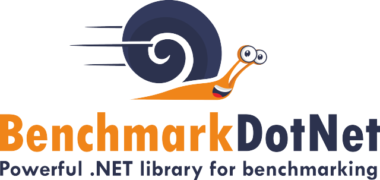
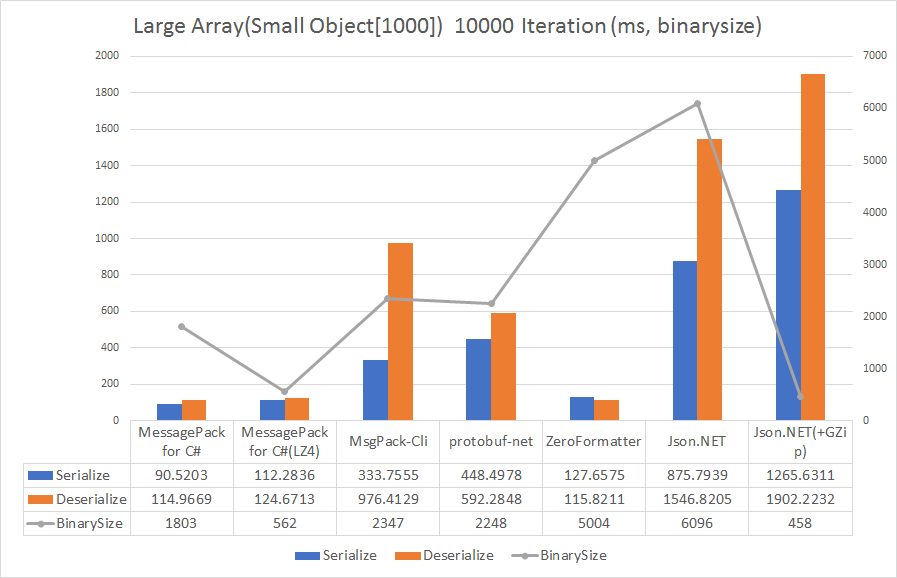
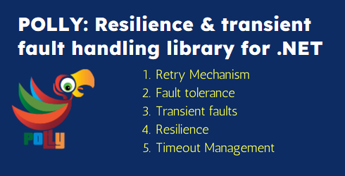
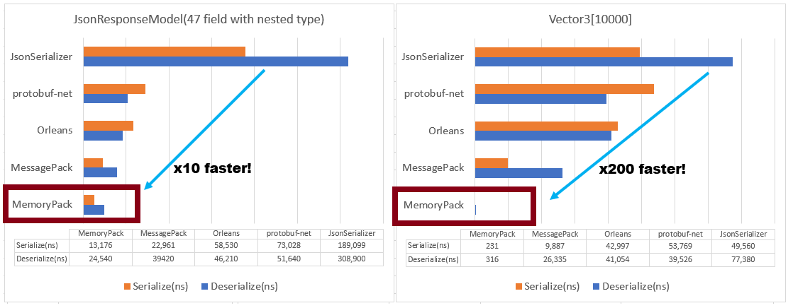
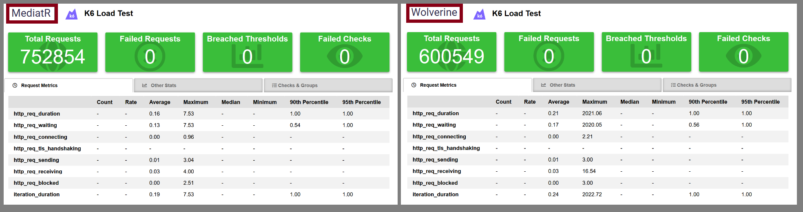
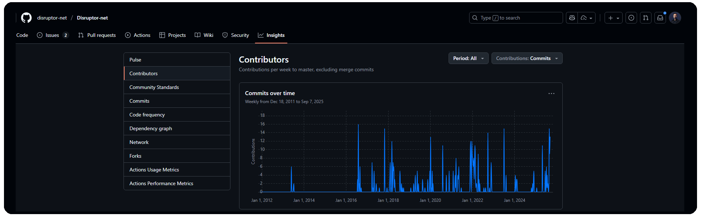

# High-Performance .NET Libraries You Didn’t Know You Needed

Whether you’re building enterprise apps, microservices, or SaaS platforms, using the right libraries can help you ship faster and scale effortlessly. 
Here are some **high-performance .NET libraries** you might not know but definitely should.

## 1. BenchmarkDotNet – Measure before you optimize

BenchmarkDotNet makes it simple to **benchmark .NET code with precision**.

- Easy setup with `[Benchmark]` attributes
- Generates detailed performance reports
- Works with .NET Core, .NET Framework, and Mono

Perfect for spotting bottlenecks in APIs, background services, or CPU-bound operations.

- **NuGet** (40M downloads) 🔗 https://www.nuget.org/packages/BenchmarkDotNet
- **GitHub** (11k stars) 🔗 https://github.com/dotnet/BenchmarkDotNet

## 2. MessagePack – Fastest JSON serializer

Need speed beyond System.Text.Json or Newtonsoft.Json?  MessagePack is the fastest serializer for C# (.NET, .NET Core, Unity, Xamarin). MessagePack has a compact binary size and a full set of general-purpose expressive data types. Ideal for high-traffic APIs, IoT data processing, and microservices.

- **NuGet** (204M downloads) 🔗 https://www.nuget.org/packages/messagepack
- **GitHub** (6.4K stars) 🔗 https://github.com/MessagePack-CSharp/MessagePack-CSharp

## 3. Polly – Resilience at scale

In distributed systems, failures are inevitable. **Polly** provides a fluent way to add **retry, circuit-breaker, and fallback** strategies.

- Handle transient faults gracefully
- Improve uptime and user experience
- Works seamlessly with HttpClient and gRPC

A must-have for cloud-native .NET applications.

- **NuGet** (1B downloads) 🔗 https://www.nuget.org/packages/polly/
- **GitHub** (14K stars) 🔗 https://github.com/App-vNext/Polly

## 4. MemoryPack – Zero-cost binary serialization

If you need **blazing-fast serialization** for in-memory caching or network transport, **MemoryPack** is a game-changer.

- Zero-copy, zero-alloc serialization
- Perfect for high-performance caching or game servers
- Strongly typed and version-tolerant

Great for real-time multiplayer games, chat apps, or financial systems.

- **NuGet** (5.3M downloads) 🔗 https://www.nuget.org/packages/MemoryPack
- **GitHub** (4K stars) 🔗 https://github.com/Cysharp/MemoryPack

## 5. WolverineFx –  Ultra-low latency messaging

MediatR was one of the best mediator libraries, but now it's a paid library. Wolverine is a toolset for command execution and message handling within .NET applications. The killer feature of Wolverine is its very efficient command execution pipeline that can be used as:

- An [inline "mediator" pipeline](https://wolverinefx.net/tutorials/mediator.html) for executing commands
- A [local message bus](https://wolverinefx.net/guide/messaging/transports/local.html) for in-application communication
- A full-fledged [asynchronous messaging framework](https://wolverinefx.net/guide/messaging/introduction.html) for robust communication and interaction between services when used in conjunction with low-level messaging infrastructure tools like RabbitMQ
- With the [WolverineFx.Http](https://wolverinefx.net/guide/http/) library, Wolverine's execution pipeline can be used directly as an alternative ASP.NET Core Endpoint provider

*image below is from [codecrash.net](https://www.codecrash.net/2024/02/06/Mediatr-versus-Wolverine-performance.html)*

WolverineFx is great for cleanly separating business logic from controllers while unifying in-process mediator patterns with powerful distributed messaging in a single, high-performance .NET library.

- **NuGet** (1.5M downloads) 🔗 https://www.nuget.org/packages/WolverineFx
- **GitHub** (1.7K stars) 🔗 https://github.com/JasperFx/wolverine

## 6.  Disruptor-net – Next generation free .NET mediator

The Disruptor is a high-performance inter-thread message passing framework. A lock-free ring buffer for ultra-low latency messaging.
Features are:

- Zero memory allocation after initial setup (the events are pre-allocated).

- Push-based consumers.

- Optionally lock-free.

- Configurable wait strategies.

- **NuGet** (1.2M downloads) 🔗 https://www.nuget.org/packages/Disruptor/
- **GitHub** (1.3K stars) 🔗 https://github.com/disruptor-net/Disruptor-net

## 7. CliWrap - Running command-line processes

CliWrap makes it easy to **run and manage external CLI processes in  .NET**.

- Fluent, task-based API for starting commands
- Streams standard input/output and error in real time
- Supports cancellation, timeouts, and piping between processes

Ideal for automation, build tools, and integrating external executables.

- **NuGet** (14.1M downloads) 🔗 https://www.nuget.org/packages/CliWrap
- **GitHub** (4.7K stars) 🔗 https://github.com/Tyrrrz/CliWrap

---

## Hidden Libs from the Community

### Sylvan.Csv & **Sep**

- **Sylvan.Csv**: Up to *10× faster* and *100× less memory allocations* than `CsvHelper`, making CSV processing lightning-fast. ([Reddit](https://www.reddit.com/r/csharp/comments/191rwgt/extremely_highperformance_libraries_for_common/?utm_source=chatgpt.com))
- **Sep**: Even faster than Sylvan, but trades off some flexibility. Great when performance matters more than API richness. ([Reddit](https://www.reddit.com/r/csharp/comments/191rwgt/extremely_highperformance_libraries_for_common/?utm_source=chatgpt.com))

### String Parsing: **csFastFloat**

- Parses `float` and `double` around *8–9× faster* than `.Parse` methods—perfect for high-volume parsing tasks. ([Reddit](https://www.reddit.com/r/csharp/comments/191rwgt/extremely_highperformance_libraries_for_common/?utm_source=chatgpt.com))

### CySharp’s Suite: MemoryPack, MasterMemory, SimdLinq

- **MemoryPack**: One of the fastest serializers available, with low allocations and high throughput. Ideal for Web APIs or microservices. ([Reddit](https://www.reddit.com/r/csharp/comments/191rwgt/extremely_highperformance_libraries_for_common/?utm_source=chatgpt.com))
- **MasterMemory**: Designed for databases or config storage. Claims *4,700× faster than SQLite* with zero-allocations per query. ([Reddit](https://www.reddit.com/r/csharp/comments/191rwgt/extremely_highperformance_libraries_for_common/?utm_source=chatgpt.com))
- **SimdLinq**: SIMD-accelerated LINQ operations supporting a broader set of methods than  .NET's built-in SIMD. Works when slight floating-point differences are acceptable. ([Reddit](https://www.reddit.com/r/csharp/comments/191rwgt/extremely_highperformance_libraries_for_common/?utm_source=chatgpt.com))

### Jil – JSON Deserializer

- Ultra-fast JSON (de)serializer with low memory overhead, used in high-scale systems. ([Performance is a Feature!](https://www.mattwarren.org/2014/09/05/stack-overflow-performance-lessons-part-2/?utm_source=chatgpt.com))

### StackExchange.NetGain – WebSocket Efficiency

- High-performance WebSocket server library designed for low-latency IO scenarios. (Now mostly replaced by Kestrel's built-in support, but worth knowing.) ([GitHub](https://github.com/StackExchange/NetGain?utm_source=chatgpt.com))

### Math Libraries: Math.NET Numerics & ILNumerics

- **Math.NET Numerics**: Core numerical methods and matrix math, similar to BLAS/LAPACK. ([Wikipedia](https://en.wikipedia.org/wiki/Math.NET_Numerics?utm_source=chatgpt.com))
- **ILNumerics**: Efficient numerical arrays with parallelized processing, loop unrolling and cache optimizations. Great for scientific computing. ([Wikipedia](https://en.wikipedia.org/wiki/ILNumerics?utm_source=chatgpt.com))

