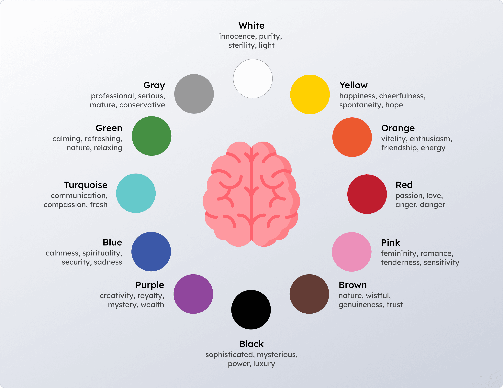
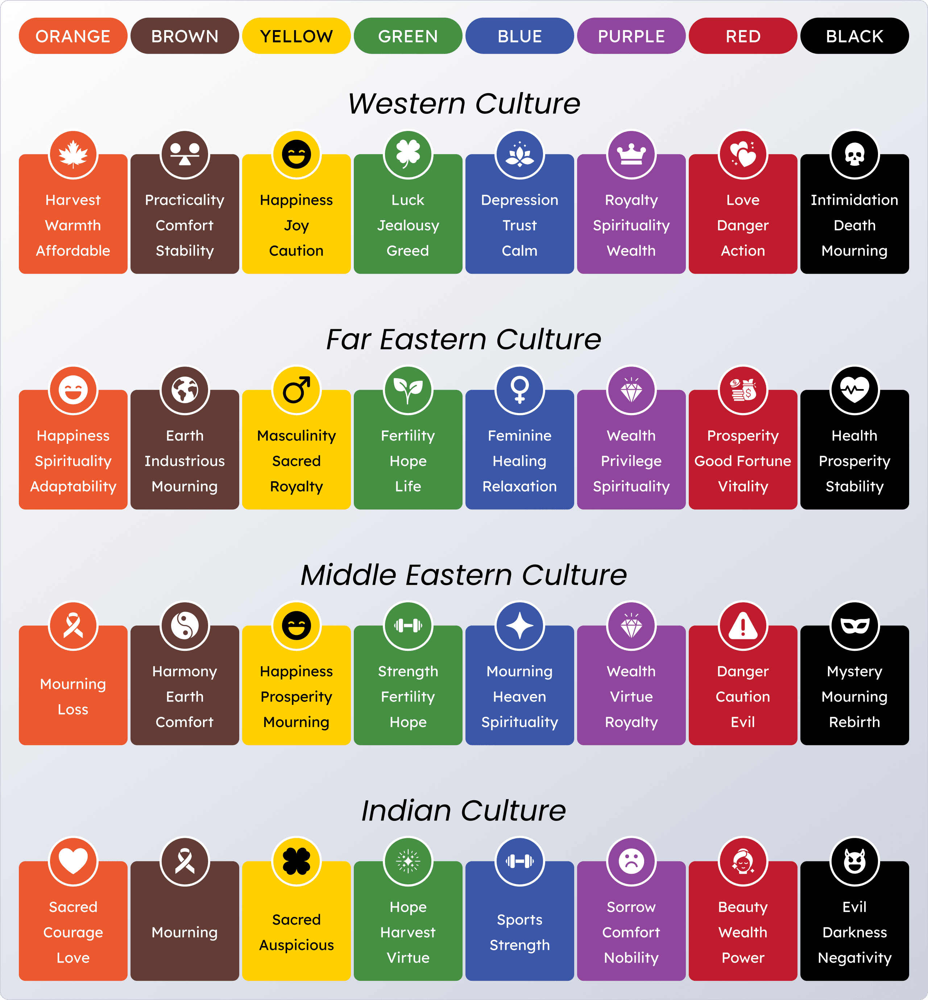
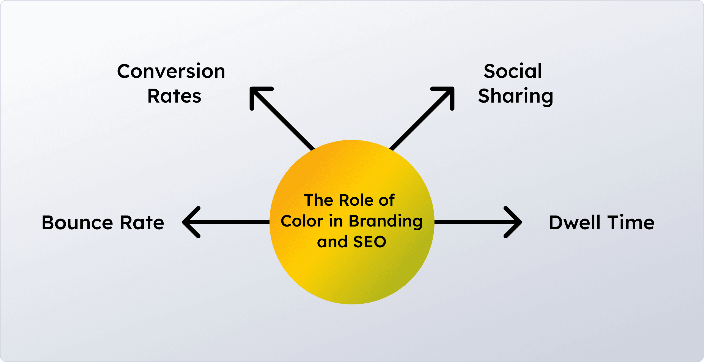

# Color Psychology in Web Design: How to Choose the Perfect Palette in 2025

## The Importance of Color Psychology in Web Design

First impressions online happen in under 50 milliseconds, and studies show that up to 90% of a user’s initial perception is based on color. In 2025, as digital competition intensifies, brands cannot rely on functionality alone—users expect emotionally engaging and visually strategic designs.

Whether you’re designing for e-commerce, SaaS, lifestyle blogs, or creative portfolios, the right color palette is more than decoration. It directly influences:

- Trust and credibility (blue = reliability, green = balance)
- Conversions and urgency (red for CTAs, orange for enthusiasm)
- Brand recall (consistent use of signature colors builds recognition)
- User comfort and inclusivity (high contrast, accessibility standards)

👉 In short, color psychology is not a design afterthought—it’s a core driver of user engagement, retention, and revenue growth.

## The Psychology of Color: How Hues Shape Human Behavior

Color psychology explains how different hues influence emotion, perception, and decision-making. Let’s explore the most common colors in web design:

- 🔴 **Red** – Sparks urgency and excitement. Common in sales promotions, e-commerce banners, and notifications.  
  Example: YouTube’s red play button signals attention and action.

- 🟠 **Orange** – Represents energy, warmth, and enthusiasm.  
  Example: Amazon’s orange “Add to Cart” button guides users toward purchases.

- 🟡 **Yellow** – Radiates optimism, creativity, and energy.  
  Example: Snapchat’s bright yellow interface reflects playfulness and innovation.

- 🟢 **Green** – Suggests growth, sustainability, and wellness.  
  Example: Whole Foods and health apps use green to symbolize balance and eco-conscious values.

- 🔵 **Blue** – Signals trust, calm, and stability.  
  Example: PayPal and LinkedIn use blue to reinforce security and professionalism.

- 🟣 **Purple** – Symbolizes luxury, creativity, and imagination.  
  Example: Beauty brands like Urban Decay use purple to highlight creativity and exclusivity.

- ⚫ **Black** – Conveys sophistication and exclusivity.  
  Example: Apple and Chanel use black to emphasize premium value.

- ⚪ **White** – Symbolizes purity, simplicity, and clarity.  
   Example: Apple’s predominantly white interfaces highlight elegance and minimalism.

👉 Pro Insight: Combine psychology with analytics. Tools like Hotjar and Google Optimize reveal how color placement (e.g., green vs. red CTA buttons) impacts conversion rates.

## Beyond Psychology: Cultural Differences in Color Meaning

In global web design, one palette does not fit all. Colors have different cultural associations that can influence user perception:

- **White** – Purity and minimalism in Western cultures, but associated with mourning in parts of East Asia.
- **Red** – Danger in the West, but luck and prosperity in China.
- **Green** – Islamically significant in the Middle East, while in the West it often symbolizes money.
- **Black** – Luxury in the West, but mourning in many cultures.

👉 For international brands, it’s crucial to localize website color palettes to avoid misinterpretations.

## Web Design Color Trends for 2025

The digital landscape evolves rapidly, and so do color preferences. The biggest color palette trends in 2025 include:

**Neo-Minimalist Neutrals** ✨
Soft beiges, warm grays, and creamy whites offer calm, distraction-free interfaces—ideal for B2B websites and productivity apps.

**Vibrant Gradients & Neon Accents** 🌈
Tech and e-commerce brands embrace multi-tone gradients and neon highlights to reflect energy and innovation.

**Dark Mode with High-Contrast Highlights** 🌑
Now a default in many apps, dark mode improves eye comfort while allowing accent colors to stand out for easier navigation.

**Nature-Inspired Palettes** 🍃
Eco-conscious businesses are adopting earthy greens, ocean blues, and muted browns to connect with sustainability-minded users.

**Soft Pastels for Inclusivity** 💕
Gentle tones—lavenders, light pinks, and mints—are trending in lifestyle, wellness, and community-driven platforms thanks to their approachable feel.

**Dynamic AI-Driven Palettes** 🤖
AI enables adaptive color systems that change in real-time based on time of day, user mood, or demographics.

👉 Case Study: Spotify uses dark backgrounds but personalizes accents with vibrant colors that align with playlists and campaigns.

## Best Practices for Choosing the Perfect Website Color Palette

A successful palette balances brand identity, psychology, accessibility, and testing. Follow these steps:

**Anchor in Brand Identity**
Select a primary color that embodies your company’s values.
Example: Tiffany & Co.’s teal blue has become globally iconic.
**Apply the 60-30-10 Rule**

- 60% background
- 30% secondary tone
- 10% accent (CTAs, highlights)
  This ratio maintains visual balance.

  **Leverage Color Theory**
  Use complementary or triadic harmonies for better contrast and consistency.

  **Prioritize Accessibility (WCAG Standards)**
  Ensure a minimum 4.5:1 contrast ratio for text and use color-blind–friendly palettes.

  **Account for Cultural Meanings**
  Research local associations before targeting global markets.

  **Test Across Devices & Modes**
  Preview palettes in both light and dark modes, and across desktop, mobile, and tablet.

  **A/B Test for Conversions**
  Experiment with button colors, background shades, and highlights to find what performs best.

## The Role of Color in Branding and SEO

Color impacts brand authority and indirectly influences SEO by shaping user behavior:

- **Bounce Rate** – Engaging palettes keep users onsite longer.
- **Dwell Time** – Comfortable color schemes encourage scrolling.
- **Conversion Rates** – Optimized CTAs improve click-throughs.
- **Social Sharing** – Bold, appealing colors increase shareability

## Future Outlook: Where Color Psychology Is Headed

- **Mood-Adaptive Websites**
  Platforms will adjust palettes based on detected user mood or behavior.
- **AR & VR Color Experiences**
  Immersive 3D design will require palettes that adapt across realities.
- **Inclusive Color Systems**
  Accessibility-first palettes will become the standard, ensuring usability for all.

## Final Thoughts

In 2025, the perfect color palette blends psychological insights, cultural awareness, and data-driven testing. Colors are no longer just visual accents—they are storytelling tools that build trust, guide behavior, and boost conversions.

👉 Brands that embrace color psychology in web design today will not only stand out visually but also gain lasting competitive and business advantages.
