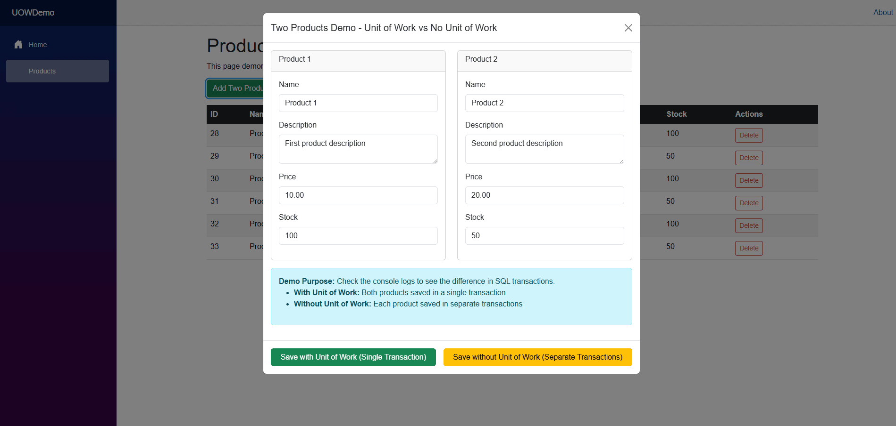
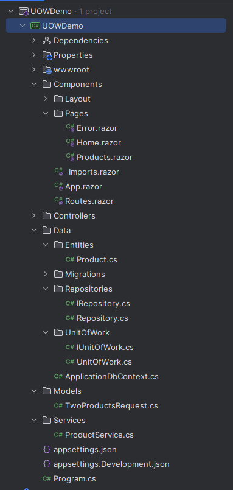

# Unit of Work Pattern with Generic Repository in ASP.NET Core

Picture this: You're building an e-commerce system and a customer places an order. You need to create the order record, update inventory, charge payment, and send a confirmation email. What happens if the payment succeeds but the inventory update fails? You're left with inconsistent data and an angry customer.

This is exactly where the Unit of Work pattern becomes invaluable. Instead of managing transactions manually across multiple repositories, this pattern coordinates all your data changes as a single, atomic operation.

## Understanding the Unit of Work Pattern

The Unit of Work pattern maintains a list of objects affected by a business transaction and coordinates writing out changes while resolving concurrency problems. Think of it as your transaction coordinator that ensures all-or-nothing operations.

### The Problem: Scattered Transaction Management

Without proper coordination, you often end up with code like this:

```csharp
// Each repository manages its own context - risky!
await _productRepository.CreateAsync(product);
await _inventoryRepository.UpdateStockAsync(productId, -quantity);
await _orderRepository.CreateAsync(order);
```

This approach has several problems:
- Each operation might use a different database context
- No automatic rollback if one operation fails
- Manual transaction management becomes complex
- Data consistency isn't guaranteed

### The Solution: Coordinated Operations

With Unit of Work, the same scenario becomes much cleaner:

```csharp
await _unitOfWork.BeginTransactionAsync();

try
{
    var productRepo = _unitOfWork.Repository<Product>();
    var inventoryRepo = _unitOfWork.Repository<Inventory>();
    var orderRepo = _unitOfWork.Repository<Order>();

    await productRepo.AddAsync(product);
    await inventoryRepo.UpdateStockAsync(productId, -quantity);
    await orderRepo.AddAsync(order);

    await _unitOfWork.SaveChangesAsync();
    await _unitOfWork.CommitTransactionAsync();
}
catch
{
    await _unitOfWork.RollbackTransactionAsync();
    throw;
}
```

Now all operations either succeed together or fail together, guaranteeing data consistency.

## Sample Implementation

> To keep the example short, I will only show the Product entity along with the implementation of the Generic Repository and Unit of Work. In this example, I will use Blazor and .NET 9. 

You can access the sample project here https://github.com/m-aliozkaya/UnitOfWorkDemo. 

### 1. Generic Repository Implementation

The repository interface defines the contract for data operations. Here's what we're working with:

_IRepository.cs_ at `~/Data/Repositories`
```csharp
using System.Linq.Expressions;

namespace UOWDemo.Repositories;

public interface IRepository<T> where T : class
{
    Task<T?> GetByIdAsync(int id);
    Task<IEnumerable<T>> GetAllAsync();
    Task<IEnumerable<T>> FindAsync(Expression<Func<T, bool>> predicate);
    Task<T?> SingleOrDefaultAsync(Expression<Func<T, bool>> predicate);

    Task AddAsync(T entity);
    void Update(T entity);
    void Remove(T entity);
    void RemoveRange(IEnumerable<T> entities);

    Task<bool> ExistsAsync(int id);
    Task<int> CountAsync();
    Task<int> CountAsync(Expression<Func<T, bool>> predicate);
}
```

_Repository.cs_ at `~/Data/Repositories`
```csharp
using Microsoft.EntityFrameworkCore;
using System.Linq.Expressions;
using UOWDemo.Data;

namespace UOWDemo.Repositories;

public class Repository<T> : IRepository<T> where T : class
{
    protected readonly ApplicationDbContext _context;
    protected readonly DbSet<T> _dbSet;

    public Repository(ApplicationDbContext context)
    {
        _context = context;
        _dbSet = context.Set<T>();
    }

    public virtual async Task<T?> GetByIdAsync(int id)
    {
        return await _dbSet.FindAsync(id);
    }

    public virtual async Task<IEnumerable<T>> GetAllAsync()
    {
        return await _dbSet.ToListAsync();
    }

    public virtual async Task<IEnumerable<T>> FindAsync(Expression<Func<T, bool>> predicate)
    {
        return await _dbSet.Where(predicate).ToListAsync();
    }

    public virtual async Task<T?> SingleOrDefaultAsync(Expression<Func<T, bool>> predicate)
    {
        return await _dbSet.SingleOrDefaultAsync(predicate);
    }

    public virtual async Task AddAsync(T entity)
    {
        await _dbSet.AddAsync(entity);
    }

    public virtual void Update(T entity)
    {
        _dbSet.Update(entity);
    }

    public virtual void Remove(T entity)
    {
        _dbSet.Remove(entity);
    }

    public virtual void RemoveRange(IEnumerable<T> entities)
    {
        _dbSet.RemoveRange(entities);
    }

    public virtual async Task<bool> ExistsAsync(int id)
    {
        var entity = await _dbSet.FindAsync(id);
        return entity != null;
    }

    public virtual async Task<int> CountAsync()
    {
        return await _dbSet.CountAsync();
    }

    public virtual async Task<int> CountAsync(Expression<Func<T, bool>> predicate)
    {
        return await _dbSet.CountAsync(predicate);
    }
}
```

### 2. Unit of Work Implementation

_IUnitOfWork.cs_ at `~/Data/UnitOfWork`
```csharp
public interface IUnitOfWork : IDisposable, IAsyncDisposable
{
    IRepository<T> Repository<T>() where T : class;
    Task<int> SaveChangesAsync(); 
    Task BeginTransactionAsync();
    Task CommitTransactionAsync();
    Task RollbackTransactionAsync();
}
```

_UnitOfWork.cs_ at `~/Data/UnitOfWork`
```csharp
public class UnitOfWork : IUnitOfWork
{
    private readonly ApplicationDbContext _context;
    private bool _disposed;
    private IDbContextTransaction? _currentTransaction;

    // ConcurrentDictionary for thread-safe repository caching
    private readonly ConcurrentDictionary<Type, object> _repositories = new();

    public UnitOfWork(ApplicationDbContext context)
    {
        _context = context;
    }

    public IRepository<T> Repository<T>() where T : class
    {
        return (IRepository<T>)_repositories.GetOrAdd(
            typeof(T),
            _ => new Repository<T>(_context)
        );
    }

    public int SaveChanges() => context.SaveChanges();
    public Task<int> SaveChangesAsync(CancellationToken cancellationToken = default) =>
        context.SaveChangesAsync(cancellationToken);

    public async Task BeginTransactionAsync()
    {
        if (_currentTransaction != null)
            return;

        _currentTransaction = await _context.Database.BeginTransactionAsync();
    }

    public async Task CommitTransactionAsync()
    {
        if (_currentTransaction == null)
            return;

        await _currentTransaction.CommitAsync();
        await _currentTransaction.DisposeAsync();
        _currentTransaction = null;
    }

    public async Task RollbackTransactionAsync()
    {
        if (_currentTransaction == null)
            return;

        await _currentTransaction.RollbackAsync();
        await _currentTransaction.DisposeAsync();
        _currentTransaction = null;
    }

    public void Dispose()
    {
        if (!_disposed)
        {
            _context.Dispose();
            _currentTransaction?.Dispose();
            _disposed = true;
        }
        GC.SuppressFinalize(this);
    }

    public async ValueTask DisposeAsync()
    {
        if (!_disposed)
        {
            await _context.DisposeAsync();
            if (_currentTransaction != null)
            {
                await _currentTransaction.DisposeAsync();
            }
            _disposed = true;
        }
        GC.SuppressFinalize(this);
    }
}
```

### 3. Configure Dependency Injection

Register the services in your `Program.cs`:

```csharp
builder.Services.AddScoped<IUnitOfWork, UnitOfWork>();
```


### 4. Defining and Registering Entity to DbContext

First, let's define a simple `Product` entity:

_Product.cs_ at `~/Data/Entities`
```csharp
using System.ComponentModel.DataAnnotations;

namespace UOWDemo.Models;

public class Product
{
    public int Id { get; set; }

    [Required]
    [MaxLength(100)]
    public string Name { get; set; } = string.Empty;

    [MaxLength(500)]
    public string? Description { get; set; }

    [Required]
    [Range(0.01, double.MaxValue)]
    public decimal Price { get; set; }

    [Required]
    [Range(0, int.MaxValue)]
    public int Stock { get; set; }

    public DateTime CreatedDate { get; set; } = DateTime.UtcNow;
}
```

* Go to your `DbContext` and implement following code.

```csharp
    public DbSet<Product> Products { get; set; }

    protected override void OnModelCreating(ModelBuilder modelBuilder)
    {
        base.OnModelCreating(modelBuilder);

        modelBuilder.Entity<Product>(entity =>
        {
            entity.HasKey(e => e.Id);
            entity.Property(e => e.Price).HasPrecision(18, 2);
            entity.Property(e => e.CreatedDate).HasDefaultValueSql("GETUTCDATE()");
        });

        modelBuilder.Entity<Product>().HasData(
            new Product { Id = 1, Name = "Laptop", Description = "High-performance laptop", Price = 1299.99m, Stock = 15, CreatedDate = new DateTime(2024, 1, 1, 0, 0, 0, DateTimeKind.Utc) },
            new Product { Id = 2, Name = "Mouse", Description = "Wireless gaming mouse", Price = 79.99m, Stock = 50, CreatedDate = new DateTime(2024, 1, 1, 0, 0, 0, DateTimeKind.Utc) },
            new Product { Id = 3, Name = "Keyboard", Description = "Mechanical keyboard", Price = 149.99m, Stock = 25, CreatedDate = new DateTime(2024, 1, 1, 0, 0, 0, DateTimeKind.Utc) }
        );
    }
``` 

### 5. Implement the UI

_ProductService.cs_ at `~/Services`
```csharp
using System.Text.Json;
using UOWDemo.Models;

namespace UOWDemo.Services;

public class ProductService
{
    private readonly HttpClient _httpClient;

    public ProductService(HttpClient httpClient)
    {
        _httpClient = httpClient;
    }

    public async Task<List<Product>> GetAllProductsAsync()
    {
        var response = await _httpClient.GetAsync("/api/products");
        response.EnsureSuccessStatusCode();
        var json = await response.Content.ReadAsStringAsync();
        return JsonSerializer.Deserialize<List<Product>>(json, new JsonSerializerOptions
        {
            PropertyNameCaseInsensitive = true
        }) ?? new List<Product>();
    }
        
    public async Task CreateTwoProductsWithUowAsync(Product product1, Product product2)
    {
        var request = new TwoProductsRequest { Product1 = product1, Product2 = product2 };
        var json = JsonSerializer.Serialize(request);
        var content = new StringContent(json, System.Text.Encoding.UTF8, "application/json");

        var response = await _httpClient.PostAsync("/api/products/two-products-with-uow", content);
        response.EnsureSuccessStatusCode();
    }

    public async Task CreateTwoProductsWithoutUowAsync(Product product1, Product product2)
    {
        var request = new TwoProductsRequest { Product1 = product1, Product2 = product2 };
        var json = JsonSerializer.Serialize(request);
        var content = new StringContent(json, System.Text.Encoding.UTF8, "application/json");

        var response = await _httpClient.PostAsync("/api/products/two-products-without-uow", content);
        response.EnsureSuccessStatusCode();
    }

    public async Task DeleteProductAsync(int id)
    {
        var response = await _httpClient.DeleteAsync($"/api/products/{id}");
        response.EnsureSuccessStatusCode();
    }
}
```

_Products.razor_ at `~/Components/Pages`
```csharp
@page "/products"
@using UOWDemo.Models
@using UOWDemo.Services
@inject ProductService ProductService
@inject IJSRuntime JSRuntime
@rendermode InteractiveServer

<PageTitle>Products</PageTitle>

<div class="container">
    <div class="row">
        <div class="col-12">
            <h1>Product Management</h1>
            <p>This page demonstrates Unit of Work transaction patterns with bulk operations.</p>
        </div>
    </div>

    <div class="row mb-3">
        <div class="col-12">
            <button class="btn btn-success me-2" @onclick="ShowTwoProductsForm">
                <i class="bi bi-plus-circle"></i> Add Two Products Demo
            </button>
        </div>
    </div>

    @if (isLoading)
    {
        <div class="text-center">
            <div class="spinner-border" role="status">
                <span class="visually-hidden">Loading...</span>
            </div>
        </div>
    }
    else
    {
        <div class="row">
            <div class="col-12">
                <div class="table-responsive">
                    <table class="table table-striped table-hover">
                        <thead class="table-dark">
                            <tr>
                                <th>ID</th>
                                <th>Name</th>
                                <th>Description</th>
                                <th>Price</th>
                                <th>Stock</th>
                                <th>Actions</th>
                            </tr>
                        </thead>
                        <tbody>
                            @foreach (var product in products)
                            {
                                <tr>
                                    <td>@product.Id</td>
                                    <td>@product.Name</td>
                                    <td>@product.Description</td>
                                    <td>$@product.Price.ToString("F2")</td>
                                    <td>@product.Stock</td>
                                    <td>
                                        <button class="btn btn-sm btn-outline-danger" @onclick="() => DeleteProduct(product.Id)">
                                            <i class="bi bi-trash"></i> Delete
                                        </button>
                                    </td>
                                </tr>
                            }
                        </tbody>
                    </table>
                </div>
            </div>
        </div>
    }
</div>


@if (showTwoProductsModal)
{
    <div class="modal fade show d-block" tabindex="-1" style="background-color: rgba(0,0,0,0.5);">
        <div class="modal-dialog modal-lg">
            <div class="modal-content">
                <div class="modal-header">
                    <h5 class="modal-title">Two Products Demo - Unit of Work vs No Unit of Work</h5>
                    <button type="button" class="btn-close" @onclick="HideTwoProductsModal"></button>
                </div>
                <div class="modal-body">
                    <div class="row">
                        <div class="col-md-6">
                            <div class="card">
                                <div class="card-header">
                                    <h6 class="card-title">Product 1</h6>
                                </div>
                                <div class="card-body">
                                    <div class="mb-3">
                                        <label class="form-label">Name</label>
                                        <input type="text" class="form-control" @bind="product1.Name" />
                                    </div>
                                    <div class="mb-3">
                                        <label class="form-label">Description</label>
                                        <textarea class="form-control" @bind="product1.Description"></textarea>
                                    </div>
                                    <div class="mb-3">
                                        <label class="form-label">Price</label>
                                        <input type="number" step="0.01" class="form-control" @bind="product1.Price" />
                                    </div>
                                    <div class="mb-3">
                                        <label class="form-label">Stock</label>
                                        <input type="number" class="form-control" @bind="product1.Stock" />
                                    </div>
                                </div>
                            </div>
                        </div>
                        <div class="col-md-6">
                            <div class="card">
                                <div class="card-header">
                                    <h6 class="card-title">Product 2</h6>
                                </div>
                                <div class="card-body">
                                    <div class="mb-3">
                                        <label class="form-label">Name</label>
                                        <input type="text" class="form-control" @bind="product2.Name" />
                                    </div>
                                    <div class="mb-3">
                                        <label class="form-label">Description</label>
                                        <textarea class="form-control" @bind="product2.Description"></textarea>
                                    </div>
                                    <div class="mb-3">
                                        <label class="form-label">Price</label>
                                        <input type="number" step="0.01" class="form-control" @bind="product2.Price" />
                                    </div>
                                    <div class="mb-3">
                                        <label class="form-label">Stock</label>
                                        <input type="number" class="form-control" @bind="product2.Stock" />
                                    </div>
                                </div>
                            </div>
                        </div>
                    </div>
                    <div class="alert alert-info mt-3">
                        <strong>Demo Purpose:</strong> Check the console logs to see the difference in SQL transactions.
                        <ul>
                            <li><strong>With Unit of Work:</strong> Both products saved in a single transaction</li>
                            <li><strong>Without Unit of Work:</strong> Each product saved in separate transactions</li>
                        </ul>
                    </div>
                </div>
                <div class="modal-footer d-flex justify-content-between">
                    <button type="button" class="btn btn-success flex-fill me-2" @onclick="SaveTwoProductsWithUow">
                        Save with Unit of Work (Single Transaction)
                    </button>
                    <button type="button" class="btn btn-warning flex-fill ms-2" @onclick="SaveTwoProductsWithoutUow">
                        Save without Unit of Work (Separate Transactions)
                    </button>
                </div>
            </div>
        </div>
    </div>
}

@code {
    private List<Product> products = new();
    private bool isLoading = true;

    private bool showTwoProductsModal = false;
    private Product product1 = new();
    private Product product2 = new();

    protected override async Task OnInitializedAsync()
    {
        await LoadProducts();
    }

    private async Task LoadProducts()
    {
        try
        {
            isLoading = true;
            products = await ProductService.GetAllProductsAsync();
        }
        catch (Exception ex)
        {
            await JSRuntime.InvokeVoidAsync("alert", $"Error loading products: {ex.Message}");
        }
        finally
        {
            isLoading = false;
        }
    }


    private void ShowTwoProductsForm()
    {
        product1 = new Product { Name = "Product 1", Description = "First product description", Price = 10.00m, Stock = 100 };
        product2 = new Product { Name = "Product 2", Description = "Second product description", Price = 20.00m, Stock = 50 };
        showTwoProductsModal = true;
    }

    private void HideTwoProductsModal()
    {
        showTwoProductsModal = false;
        product1 = new Product();
        product2 = new Product();
    }

    private async Task SaveTwoProductsWithUow()
    {
        try
        {
            await ProductService.CreateTwoProductsWithUowAsync(product1, product2);
            await JSRuntime.InvokeVoidAsync("alert", "Two products saved with Unit of Work! Check console logs to see single transaction.");
            await LoadProducts();
            HideTwoProductsModal();
        }
        catch (Exception ex)
        {
            await JSRuntime.InvokeVoidAsync("alert", $"Error saving products with UoW: {ex.Message}");
        }
    }

    private async Task SaveTwoProductsWithoutUow()
    {
        try
        {
            await ProductService.CreateTwoProductsWithoutUowAsync(product1, product2);
            await JSRuntime.InvokeVoidAsync("alert", "Two products saved without Unit of Work! Check console logs to see separate transactions.");
            await LoadProducts();
            HideTwoProductsModal();
        }
        catch (Exception ex)
        {
            await JSRuntime.InvokeVoidAsync("alert", $"Error saving products without UoW: {ex.Message}");
        }
    }

    private async Task DeleteProduct(int id)
    {
        if (await JSRuntime.InvokeAsync<bool>("confirm", "Are you sure you want to delete this product?"))
        {
            try
            {
                await ProductService.DeleteProductAsync(id);
                await LoadProducts();
            }
            catch (Exception ex)
            {
                await JSRuntime.InvokeVoidAsync("alert", $"Error deleting product: {ex.Message}");
            }
        }
    }
}
```

UI Preview



_ProductsController.cs_ at `~/Controllers`
```csharp
using Microsoft.AspNetCore.Mvc;
using UOWDemo.Data;
using UOWDemo.Models;
using UOWDemo.UnitOfWork;

namespace UOWDemo.Controllers;

[ApiController]
[Route("api/[controller]")]
public class ProductsController : ControllerBase
{
    private readonly IUnitOfWork _unitOfWork;
    private readonly ApplicationDbContext _context;

    public ProductsController(IUnitOfWork unitOfWork, ApplicationDbContext context)
    {
        _unitOfWork = unitOfWork;
        _context = context;
    }

    [HttpGet]
    public async Task<IActionResult> GetProducts()
    {
        var repository = _unitOfWork.Repository<Product>();
        var products = await repository.GetAllAsync();
        return Ok(products);
    }


    [HttpPost("two-products-with-uow")]
    public async Task<IActionResult> CreateTwoProductsWithUow(TwoProductsRequest request)
    {
        if (!ModelState.IsValid)
            return BadRequest(ModelState);

        await _unitOfWork.BeginTransactionAsync();

        try
        {
            var repository = _unitOfWork.Repository<Product>();
            await repository.AddAsync(request.Product1);
            await repository.AddAsync(request.Product2);
            await _unitOfWork.SaveChangesAsync();
            await _unitOfWork.CommitTransactionAsync();

            return Ok(new { message = "Two products created with Unit of Work (single transaction)",
                products = new[] { request.Product1, request.Product2 } });
        }
        catch
        {
            await _unitOfWork.RollbackTransactionAsync();
            throw;
        }
    }

    [HttpPost("two-products-without-uow")]
    public async Task<IActionResult> CreateTwoProductsWithoutUow(TwoProductsRequest request)
    {
        if (!ModelState.IsValid)
            return BadRequest(ModelState);

        // First product - separate transaction
        await _context.Products.AddAsync(request.Product1);
        await _context.SaveChangesAsync();

        // Second product - separate transaction
        await _context.Products.AddAsync(request.Product2);
        await _context.SaveChangesAsync();

        return Ok(new { message = "Two products created without Unit of Work (separate transactions)",
            products = new[] { request.Product1, request.Product2 } });
    }

    [HttpDelete("{id}")]
    public async Task<IActionResult> DeleteProduct(int id)
    {
        var repository = _unitOfWork.Repository<Product>();
        var product = await repository.GetByIdAsync(id);

        if (product == null)
            return NotFound();

        repository.Remove(product);
        await _unitOfWork.SaveChangesAsync();

        return NoContent();
    }
}
```

The code base should be shown like this.



### 6. Seeing the Difference: Transaction Logging

To see the transaction behavior in action, configure Entity Framework logging in `appsettings.Development.json`:

```json
{
  "Logging": {
    "LogLevel": {
      "Default": "Information",
      "Microsoft.AspNetCore": "Warning",
      "Microsoft.EntityFrameworkCore.Database.Command": "Information",
      "Microsoft.EntityFrameworkCore.Database.Transaction": "Information"
    }
  }
}
```

Now when you run the demo, the console will show:

**With Unit of Work - One Transaction:**
```
BEGIN TRANSACTION
INSERT INTO [Products] ([Name], [Description], [Price], [Stock]) VALUES ('Product 1', ...)
INSERT INTO [Products] ([Name], [Description], [Price], [Stock]) VALUES ('Product 2', ...)
COMMIT TRANSACTION
```

**Without Unit of Work - Two Separate Transactions:**
```
BEGIN TRANSACTION
INSERT INTO [Products] ([Name], [Description], [Price], [Stock]) VALUES ('Product 1', ...)
COMMIT TRANSACTION

BEGIN TRANSACTION
INSERT INTO [Products] ([Name], [Description], [Price], [Stock]) VALUES ('Product 2', ...)
COMMIT TRANSACTION
```

## What If?


What if we were using the ABP Framework instead of manually implementing the Unit of Work and Generic Repository? Well, most of the heavy lifting we did in this example would be handled automatically. ABP provides built-in support for Unit of Work, transactions, and repository patterns, allowing you to focus on business logic rather than plumbing code.

### Key Advantages with ABP

Automatic Transaction Management: Every application service method runs within a transaction by default. If an exception occurs, changes are automatically rolled back.

* [UnitOfWork] Attribute: You can simply annotate a method with [UnitOfWork] to ensure all repository operations within it run in a single transaction.

* Automatic SaveChanges: You don’t need to call SaveChanges() manually; ABP takes care of persisting changes at the end of a Unit of Work.

* Configurable Transaction Options: Transaction isolation levels and timeouts can be easily configured, helping with performance and data consistency.

* Event-Based Completion: After a successful transaction, related domain events can be triggered automatically—for example, sending a confirmation email when an entity is created.

And many of them. If you interested in check this document. https://abp.io/docs/latest/framework/architecture/domain-driven-design/unit-of-work

📌 Example:

```csharp
[UnitOfWork]
public void CreatePerson(CreatePersonInput input)
{
    var person = new Person { Name = input.Name, EmailAddress = input.EmailAddress };
    _personRepository.Insert(person);
    _statisticsRepository.IncrementPeopleCount();
}
```

In this example, both repository operations execute within the same transaction. ABP handles the commit automatically, so either all changes succeed or none are applied.

> Takeaway: With ABP, developers don’t need to manually implement Unit of Work or manage transactions. This reduces boilerplate code, ensures consistency, and lets you focus on the domain logic.

## Conclusion

The Unit of Work pattern shines in scenarios where multiple operations must succeed or fail together. By centralizing transaction management and repository access, it reduces complexity and ensures consistency.

This demo kept things simple with a single Product entity, but the same approach scales to more complex domains. Whether you’re building an e-commerce app, a financial system, or any data-heavy application, adopting Unit of Work with a Generic Repository can make your codebase cleaner, safer, and easier to maintain.

Feel free to clone the sample project, experiment with it, and adapt the pattern to your own needs. 🚀