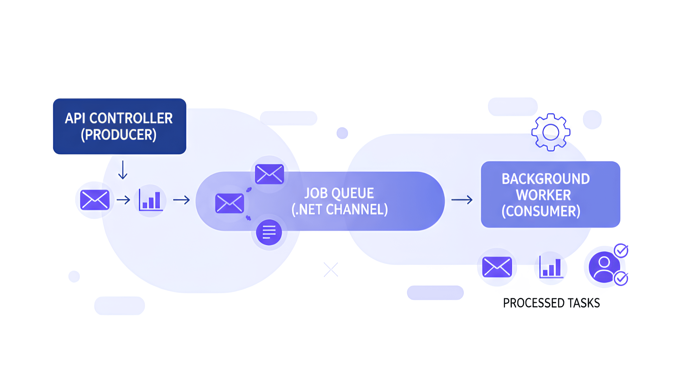
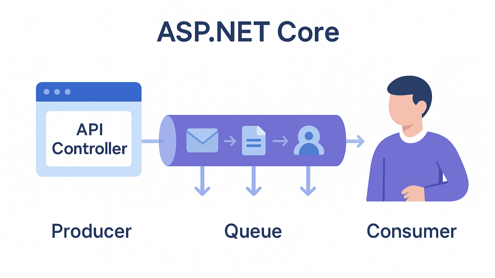

# How to Build an In Memory Background Job Queue in ASP.NET Core from Scratch

In web applications, providing a fast and responsive API is crucial for the user experience. However, some operations, such as sending emails, generating reports, or adding users in bulk, can take significant time. Performing these tasks during a request can block threads, resulting in slow response times.

To significantly alleviate this issue, it would be more effective to run long running tasks in a background process. Instead of waiting for the request to complete, we can queue the task, provide an immediate response to the user, and perform the work in a separate background process.

While libraries like Hangfire or message brokers like RabbitMQ exist for this purpose, you don't need any external dependencies. In this blog post, we'll build an in memory background job queue from scratch in ASP.NET Core using only built in .NET features.



## Core Components of Background Job System

Before implementing the code, it is important to first understand the basic parts that make up the background job system and how they work to process queued tasks.

### What are IHostedService and BackgroundService?

`IHostedService` is an interface used in ASP.NET Core to implement long running background tasks managed by the application's lifecycle. When your application starts, it starts all registered `IHostedService` applications. When it shuts down, it instructs them to stop.

`BackgroundService` is an abstract base class that implements `IHostedService`. It gives you a more efficient way to create a timed service by giving you a single overridable method `ExecuteAsync(CancellationToken stoppingToken)`. We'll use this as the basis for our job processor.

### The Producer/Consumer Structure

* **Producer:** This is the part of your application that creates jobs and adds them to the queue. In our example, the producer will be an API Controller.
* **Consumer:** This is a background service that constantly monitors the queue, pulls jobs from the queue, and executes them. Our `BackgroundService` application will be the consumer.
* **Queue:** This is the data structure between the producer and consumer that holds jobs waiting to be processed.




### Why System.Threading.Channels?

Introduced in .NET Core 3.0, `System.Threading.Channels` provides a synchronization data structure designed for asynchronous producer, consumer scenarios.

* **Thread Safety:** Handles all complex locking and synchronization operations internally, making it usable as a whole from multiple threads (for example, when multiple API requests are adding work simultaneously).
* **Async Native:** Designed for use with `async`/`await`, preventing thread blocking. You can asynchronously wait for an item in the queue to become available.
* **Performance:** Optimized for speed and low memory allocation. Generally superior to legacy constructs like `ConcurrentQueue` for asynchronous workflows because it eliminates the need for polling.

## Implementing the Background Job Queue

Now that we understand the architecture, we can implement the background job queue.

### Create the Project

First, create a new ASP.NET Core Web API project using the .NET CLI.

```bash
dotnet new sln -n BackgroundJobQueue

dotnet new webapi -n BackgroundJobQueue.Api

dotnet sln BackgroundJobQueue.sln add BackgroundJobQueue.Api/BackgroundJobQueue.Api.csproj
```

### Define the Job Queue Interface

For dependency injection and testability, we'll start by defining an interface for our queue. This interface will define methods for adding a job (`EnqueueAsync`) and removing a job (`DequeueAsync`).

Create a new file named `IBackgroundTaskQueue.cs`.

```csharp
namespace BackgroundJobQueue;

public interface IBackgroundTaskQueue
{
    // Adds a work item to the queue
    ValueTask EnqueueAsync(Func<CancellationToken, ValueTask> workItem);

    // Removes and returns a work item from the queue
    ValueTask<Func<CancellationToken, ValueTask>> DequeueAsync(CancellationToken cancellationToken);
}
```

We'll use `Func<CancellationToken, ValueTask>` to represent a work item. This allows us to queue any asynchronous method that accepts a `CancellationToken`.

### Implement the Queue Service with Channels

Now, let's implement the `IBackgroundTaskQueue` interface using the `System.Threading.Channels` class. This class will manage the in memory channel.

Create a new file named `BackgroundTaskQueue.cs`.

```csharp
using System.Threading.Channels;

namespace BackgroundJobQueue;

public class BackgroundTaskQueue : IBackgroundTaskQueue
{
    private readonly Channel<Func<CancellationToken, ValueTask>> _queue;

    public BackgroundTaskQueue(int capacity)
    {
        // BoundedChannelOptions specifies the behavior of the channel.
        var options = new BoundedChannelOptions(capacity)
        {
            // FullMode.Wait tells the writer to wait asynchronously if the queue is full.
            FullMode = BoundedChannelFullMode.Wait
        };
        _queue = Channel.CreateBounded<Func<CancellationToken, ValueTask>>(options);
    }

    public async ValueTask EnqueueAsync(Func<CancellationToken, ValueTask> workItem)
    {
        if (workItem is null)
        {
            throw new ArgumentNullException(nameof(workItem));
        }

        // Writes an item to the channel. If the channel is full,
        await _queue.Writer.WriteAsync(workItem);
    }

    public async ValueTask<Func<CancellationToken, ValueTask>> DequeueAsync(CancellationToken cancellationToken)
    {
        // Reads an item from the channel. If the channel is empty,
        var workItem = await _queue.Reader.ReadAsync(cancellationToken);

        return workItem;
    }
}
```

### Create the Consumer Service (QueuedHostedService)

This is our consumer. It's a `BackgroundService` that continuously dequeues and executes jobs.

Create a new file named `QueuedHostedService.cs`.

```csharp
namespace BackgroundJobQueue;

public class QueuedHostedService : BackgroundService
{
    private readonly IBackgroundTaskQueue _taskQueue;
    private readonly ILogger<QueuedHostedService> _logger;

    public QueuedHostedService(IBackgroundTaskQueue taskQueue, ILogger<QueuedHostedService> logger)
    {
        _taskQueue = taskQueue;
        _logger = logger;
    }

    protected override async Task ExecuteAsync(CancellationToken stoppingToken)
    {
        _logger.LogInformation("Queued Hosted Service is running.");

        while (!stoppingToken.IsCancellationRequested)
        {
            // Dequeue a work item
            var workItem = await _taskQueue.DequeueAsync(stoppingToken);

            try
            {
                // Execute the work item
                await workItem(stoppingToken);
            }
            catch (Exception ex)
            {
                _logger.LogError(ex, "Error occurred executing {WorkItem}.", nameof(workItem));
            }
        }

        _logger.LogInformation("Queued Hosted Service is stopping.");
    }
}
```

The `try-catch` block here is critical. It ensures that if one job fails with an exception, it won't crash the entire background service.

### Register the Services in Program.cs

Next we need to register the queue and hosted service in the dependency injection container inside `Program.cs`.

```csharp
using BackgroundJobQueue;

var builder = WebApplication.CreateBuilder(args);

//...

// Register the background task queue as a Singleton
builder.Services.AddSingleton<IBackgroundTaskQueue>(_ => 
{
    // You can configure the capacity of the queue here
    if (!int.TryParse(builder.Configuration["QueueCapacity"], out var queueCapacity))
    {
        queueCapacity = 100;
    }
    return new BackgroundTaskQueue(queueCapacity);
});

// Register the hosted service
builder.Services.AddHostedService<QueuedHostedService>();


var app = builder.Build();

//...

app.Run();
```

We register `IBackgroundTaskQueue` as a **Singleton** because we need a single, shared queue instance for the entire application. We register `QueuedHostedService` using `AddHostedService()` to ensure the .NET runtime manages its lifecycle.

### Create a Producer (API Controller)

Finally, let's create a producer. This will be a simple API controller with an endpoint that enqueues a new background job.

Create a new controller named `JobsController.cs`.

```csharp
using Microsoft.AspNetCore.Mvc;

namespace BackgroundJobQueue.Controllers;

[ApiController]
[Route("[controller]")]
public class JobsController : ControllerBase
{
    private readonly IBackgroundTaskQueue _queue;
    private readonly ILogger<JobsController> _logger;

    public JobsController(IBackgroundTaskQueue queue, ILogger<JobsController> logger)
    {
        _queue = queue;
        _logger = logger;
    }

    [HttpPost]
    public async Task<IActionResult> EnqueueJob()
    {
        // Enqueue a job that simulates a long running task
        await _queue.EnqueueAsync(async token =>
        {
            // Simulate a 5 second task
            var guid = Guid.NewGuid();
            _logger.LogInformation("Job {Guid} started.", guid);
            await Task.Delay(TimeSpan.FromSeconds(5), token);
            _logger.LogInformation("Job {Guid} finished.", guid);
        });

        return Ok("Job has been enqueued.");
    }
}
```

Now, when you run your application and send a POST request to `/jobs`, the API will respond instantly with "Job has been enqueued." while the 5 second task runs in the background. You'll see the log messages appear in your console after the delay.

## Important Considerations and Advanced Topics

### Shutdown

The `CancellationToken` passed to ExecuteAsync is important. The host triggers this token when you stop your application. Our while loop condition `(!stoppingToken.IsCancellationRequested)` and passing the token to `DequeueAsync` cause the service to stop listening for new items and exit.

### Error Handling

Our `try-catch` block prevents a single failed job from crashing the consumer. For production scenarios, you can consider a more advanced error handling strategy, such as a retry mechanism. Libraries like **Polly** can be integrated here to automatically retry failed jobs with policies like fallback.

### Limits of the In Memory Queue

The biggest drawback of this approach is that the queue is **in memory**. If your application process restarts or crashes for any reason, any work waiting in the queue will be lost. This solution is best for idempotent or non critical tasks.

### When Should You Use External Libraries?

Built from the ground up, this solution is powerful, but it's important to know when to turn to more advanced tools.

* **Hangfire:** Use Hangfire when you need job continuity (saves jobs to a database), automatic retries, a management dashboard, scheduled jobs, and delayed execution. Background tasks are an ideal solution while processing.

* **RabbitMQ** When building a distributed system (such as a microservices architecture), you can use a custom message broker. These brokers provide scalable queues that isolate your services and guarantee message delivery.

## Frequently Asked Questions

**Q1: What happens to the jobs in the queue if my application restarts or crashes?**

**A:** Because this is an **in-memory** queue, any unprocessed work is **lost** when the application closes or crashes. This solution is best suited for non-critical or idempotent tasks (i.e., they can be safely rerun without causing problems). For guaranteed business continuity, you should use a solution that stores jobs in a database or message broker, such as **Hangfire** or **RabbitMQ**.

**Q2: How can I implement retry logic for jobs that fail due to an exception?**

**A:** The `try-catch` block in `QueuedHostedService` prevents the entire background service from crashing, but it doesn't automatically retry the failed job. You can integrate a library like **Polly** to add robust retry capabilities. You can wrap the `await workItem(stoppingToken);` call in a Polly retry policy to automatically rerun the job a configured number of times with delays.

[Polly Official Documentation](https://github.com/App-vNext/Polly)

**Q3: Will this work in a load balanced environment with multiple server instances?**

**A:** No, this implementation is instance-specific. The queue exists only in the memory of the server instance that receives the API request. If you deploy your application across multiple servers, a job queued on Server A will be processed only by Server A. For a shared queue that can be processed by any server in a web environment, you should use a centralized, distributed message broker such as **RabbitMQ**, **Azure Service Bus**.

**Q4: What happens if jobs are added to the queue faster than the background service can process them?**

**A:** This application uses a BoundedChannel with a fixed capacity (for example, 100 in our example). When the queue is full, setting `FullMode = BoundedChannelFullMode.Wait` causes the producer (API controller) to asynchronously wait until space becomes available in the queue. This creates "backpressure" that prevents your application from running out of memory. However, this also means that if the background service is constantly overloaded, your API endpoint will become slower to respond as it waits to queue new jobs.

**Q5: How can I monitor the number of jobs currently in the queue?**

**A:** For basic monitoring, you can inject `IBackgroundTaskQueue` into a service and periodically record the queue count. A more advanced approach is to create a custom metrics endpoint (for example, for Prometheus). You can create a custom controller that accesses the `Count` property of the `ChannelReader` to report the current queue depth and set alerts if the queue grows too long.


## Conclusion

We've built a performant, in memory background job queue in ASP.NET Core using only built in framework features. This is a way to increase your API's responsiveness and improve the user experience by disabling long running tasks.

Using `IHostedService` and `System.Threading.Channels`, we've created an efficient implementation of the producer, consumer model. While this in memory approach has some limitations, it's a powerful tool for many common scenarios. As your needs grow, you can consider more feature rich tools like Hangfire or RabbitMQ, knowing you've mastered the fundamentals.

## References

  * [Background tasks with hosted services in ASP.NET Core](https://learn.microsoft.com/en-us/aspnet/core/fundamentals/host/hosted-services)
  * [An Introduction to System.Threading.Channels](https://devblogs.microsoft.com/dotnet/an-introduction-to-system-threading-channels/)
  * [ABP Framework - Background Jobs](https://docs.abp.io/en/abp/latest/Background-Jobs)
  * [Creating a queued background task service with IHostedService by Andrew Lock](https://andrewlock.net/controlling-ihostedservice-execution-order-in-aspnetcore-3/)
  * [Hangfire Documentation](https://docs.hangfire.io/en/latest/getting-started/aspnet-core-applications.html)
  * [RabbitMQ Tutorials](https://www.rabbitmq.com/getstarted.html)