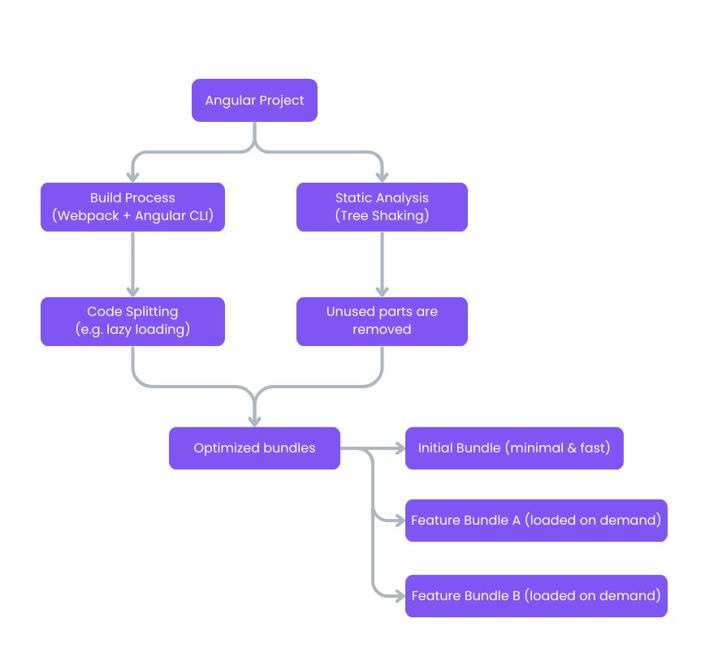

# Supercharge Your Angular App: A Developer's Guide to Unlock Peak Performance

Angular has consistently introduced new features to boost application performance, from lazy-loaded components to reactive change detection with signals. This article explores key optimization techniques, including **lazy loading**, **on-demand element loading**, **signals-based state management**, **code splitting and tree shaking**, and advanced **change detection strategies**. By understanding and implementing these practices, developers can significantly improve initial load time of the applicarion and overall responsiveness.

-----

## 1. Lazy Loading Approach

As the name implies, lazy loading provides the elements only when they are needed, differentiating it from eager loading. By enabling this feature for routes or modules, the bundle size gets smaller and the loading time decreases.

### 🧘🏼‍♀️ Lazy Loaded Components

The first way to integrate lazy loading into your application is to load components this way. First, you can create a component using this command `ng g component book`, and it will look like a regular standalone component:

```ts
import { Component } from '@angular/core';

@Component({
  selector: 'app-book',
  imports: [],
  templateUrl: './book.html',
  styleUrl: './book.scss'
})
export class Book { }
```

Then, you can declare a routing for the component and use `loadComponent` instead of `component` to load it lazily.

```ts
//app.routes.ts
import { Routes } from '@angular/router';
export const APP_ROUTES: Routes = [
  {
    path: 'book',
    loadComponent: () => import('./book/book').then(c => c.Book),
  },
];
```

Once you navigate to the books route, the component will be loaded. Lazy loading a component is a key technique for reducing the initial bundle size of your application. Instead of including code of the component in the main bundle that is downloaded when a user first visits your site, Angular creates a separate, small bundle for the Book component. This bundle is only downloaded and parsed by the browser when the user actually navigates to the `/book` route. This approach results in a faster initial load time and a more responsive user experience, as the browser does not have to process a large amount of unnecessary code upfront. The `import()` syntax is a dynamic import, which tells a module bundler like Webpack or Vite to create a separate chunk for the imported file, enabling this lazy-loading behavior.

### 🚲 Lazy Loaded Modules

If you still continue using the module-based structure, you can load the modules lazily as well. However, this approach will be marked as deprecated in the future. For this reason, we recommend a migration where you can [follow related steps](https://abp.io/community/articles/abp-now-supports-angular-standalone-applications-zzi2rr2z#gsc.tab=0).

First, you need to create a module using such command `ng g module book`. Then, you can create a component and connect to this module using this command `ng g component book --module book`. The final result will be like this:

```ts
//book.module.ts
import { NgModule } from '@angular/core';
import { CommonModule } from '@angular/common';
import { BookComponent } from './book.component';

@NgModule({
  declarations: [],
  imports: [
    CommonModule,
    BookComponent
  ]
})
export class BookModule { }
```

```ts
//book.component.ts
import { Component } from '@angular/core';

@Component({
  selector: 'app-book',
  imports: [],
  templateUrl: './book.component.html',
  styleUrl: './book.component.scss'
})
export class BookComponent {}
```

Then, you can declare a routing for the module and use `loadChildren` instead of `component` to load it lazily.

```ts
//app-routing.module.ts
import { NgModule } from '@angular/core';
import { RouterModule, Routes } from '@angular/router';
const routes: Routes = [
  {
    path: 'book',
    loadChildren: () => import('./book/book.module').then(m => m.BookModule),
  },
];
@NgModule({
  imports: [RouterModule.forRoot(routes, {})],
  exports: [RouterModule],
})
export class AppRoutingModule {}
```

-----

## 2. Code Splitting and Tree Shaking

Code splitting and tree shaking are two powerful techniques that work hand-in-hand to ensure your users download and execute only the JavaScript they truly need.

### 📘 Code Splitting

Code splitting is the process of breaking a large JavaScript bundle into smaller, more manageable chunks. Instead of sending one massive file to the browser at load time, Angular delivers only what is necessary at the moment.

Loading components or modules lazily, using deferrable views and signals are examples of code splitting.

### 📈 The benefits are:

  * Faster initial load time (reduced bundle size).
  * More efficient use of network bandwidth.
  * Scales better as applications grow in features.

### 📘 Tree Shaking

Tree shaking is a form of dead code elimination. It analyzes your imports, detects which parts of a library or file are unused, and removes them from the final build. The metaphor comes from shaking a tree: the dead leaves fall off, leaving only what’s alive (used code).

```ts
import { usefulFunction } from './helpers';
import { unusedFunction } from './helpers';

usefulFunction();
```

Here, `unusedFunction` is never called. With tree shaking, the Angular compiler ensures that this unused code won’t appear in the final production bundle.

### 📈 The benefits are:

  * Reduced JavaScript size.
  * Less parsing and execution time for the browser.
  * Lower memory usage.

**Code Splitting** decides **when** to load code, while **Tree Shaking** decides **what** code gets included in the first place. Together, they ensure the Angular app is both lean and efficient.



-----

## 3. Loading Elements on Demand using `@defer` block

The aim of using this view kind is also to reduce the initial bundle size of the application. Angular documentation claims that the initial load becomes faster, and it enhances the Core Web Vitals (CVW), especially for Largest Contentful Paint (LCP) and Time to First Byte (TTFB).

In order to use this block, your component needs to be standalone, and you cannot re-use the component outside of the deferring block. Here is how you can use it in your template:

```ts
@defer {
  <large-component />
}
```

You can also propose loading, error, and placeholder states out of the box.

```ts
@defer {
  <large-component />
} @loading {
  
} @placeholder {
  <p>Placeholder content</p>
} @error {
  <p>Failed to load large component.</p>
}
```

The framework also provides content loading based on triggers. These are **on** and **when**. Basically, the **on** property option relies on the user interaction, and the **when** property relies on the specified condition.

-----

## 4. Using Signals for State Management

Angular introduced signals as part of its reactivity model to make state management and change detection more precise and performant compared to the traditional Zone.js-based approach. Signals shift Angular from a 'check everything on every event' model to a 'react only to what changed' model. This makes applications more efficient, faster, and often simpler to reason about. Here are the benefits of signals in terms of performance optimization:

### ✅ Reduces unnecessary work and makes faster UI updates.

Traditionally, Angular relies on zone-based change detection, which means that any asynchronous event (e.g., click, HTTP request, timer) triggers a full change detection cycle across the entire component tree. Since Angular knows exactly which component property depends on which reactive value, this allows Angular to update only the affected components/elements when the signal changes, instead of re-checking everything.

### ✅ Dependencies are tracked explicitly.

A signal records its dependencies at runtime. When a computed signal or template expression reads a signal, Angular automatically tracks that dependency. If the value changes, only consumers of that signal re-run. So, the unrelated computations are prevented, and the performance is optimized.

### ✅ The updates are synchronous and predictable.

When you set a new value in a signal, all dependent computations and template updates happen immediately and predictably. So, it is easy to debug and determine the performance in that sense.

-----

## 5. Change Detection

Angular uses a change detection mechanism to keep the view in sync with the component state. By default, Angular uses the default change detection strategy for every component.

### Default Strategy Mechanism

When an event happens (like a user input, HTTP response, `setTimeout`, etc.), Angular runs change detection. It starts from the root component and traverses every component in the tree to check if any bound data has changed. Angular compares the current property values with the previous ones for each component. As can be perceived, if something changed, Angular updates the DOM. Even if a change occurs in one component, Angular will still go through all components down the tree unless properly optimized.

The good side is that it keeps the UI of the application constant with the state no matter where the change is coming from. However, it becomes a bottleneck for large applications as all components are going to be checked.

### Optimizing the Default Strategy

Even with the Default strategy, you can improve performance by:

  * Breaking up elements into smaller, reusable ones, so Angular checks smaller trees.
  * Using `track` in `@for` blocks to prevent re-rendering on unchanged list items.
  * Not adding heavy computations on templates or making them into smaller ones in services.

The other change detection strategy is **OnPush**. This will allow you to make checks when needed. By this means, Angular would check only if:

  * an input reference is changed
  * an event is triggered
  * or you trigger it manually by using `markForCheck` utility

### Manual Change Detection Triggers

Angular provides these controls by `ChangeDetectorRef` class injection.

**`markForCheck()`**

This marks the component along its ancestors as dirty. The component will be checked in the next change detection cycle. In this example case, a component uses the OnPush strategy, and something is updated directly (e.g. a service emits a new value without changing the `input()` reference).

```ts
private cdr = inject(ChangeDetectorRef);

updateData() {
  this.data.someProp = 'newValue';
  this.cdr.markForCheck();  // schedule re-check
}
```

**`detectChanges()`**

Immediately runs change detection synchronously on the component and its children. In this example, the DOM is reflected by the change immediately that could be after a dialog closing, or measuring the size of the element.

```ts
private cdr = inject(ChangeDetectorRef);

updateData() {
  this.data.someProp = 'newValue';
  this.cdr.detectChanges();  // run CD immediately
}
```

**In short:**

  * Use `markForCheck()` when performance is the key and you want to stay within the normal change detection cycle of Angular.
  * Use `detectChanges()` when you absolutely need the update immediately after the change occurs.

-----

## Conclusion

By implementing these strategies, developers can build Angular applications that are not only feature-rich but also fast and efficient. **Lazy loading**, **code splitting**, and **tree shaking** work together to reduce initial load times, while **signals** and optimized **change detection** ensure the application remains responsive and performant as it grows in complexity. Embracing these modern Angular features is crucial for delivering a high-quality user experience and maintaining a scalable codebase.