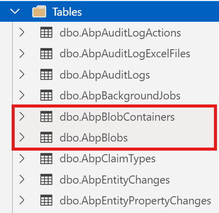

# Where and How to Store Your BLOB Objects in .NET?

When building modern web applications, managing [BLOBs (Binary Large Objects)](https://cloud.google.com/discover/what-is-binary-large-object-storage) such as images, videos, documents, or any other file types is a common requirement. Whether you're developing a CMS, an e-commerce platform, or almost any other kind of application, you'll eventually ask yourself: **"Where should I store these files?"**

In this article, we'll explore different approaches to storing BLOBs in .NET applications and demonstrate how the ABP Framework simplifies this process with its flexible [BLOB Storing infrastructure](https://abp.io/docs/latest/framework/infrastructure/blob-storing). 

ABP Provides [multiple storage providers](https://abp.io/docs/latest/framework/infrastructure/blob-storing#blob-storage-providers) such as Azure, AWS, Google, Minio, Bunny etc. But for the simplicity of this article, we will only focus on the **Database Provider**, showing you how to store BLOBs in database tables step-by-step.

## Understanding BLOB Storage Options

Before diving into implementation details, let's understand the common approaches for storing BLOBs in .NET applications. Mainly, there are three main approaches:

1. Database Storage
2. File System Storage
3. Cloud Storage

### 1. Database Storage

The first approach is to store BLOBs directly in the database alongside your relational data (_you can also store them separately_). This approach uses columns with types like `VARBINARY(MAX)` in SQL Server or `BYTEA` in PostgreSQL.

**Pros:**
- ✅ Transactional consistency between files and related data
- ✅ Simplified backup and restore operations (everything in one place)
- ✅ No additional file system permissions or management needed

**Cons:**
- ❌ Database size can grow significantly with large files
- ❌ Potential performance impact on database operations
- ❌ May require additional database tuning and optimization
- ❌ Increased backup size and duration

### 2. File System Storage

The second obvious approach is to store BLOBs as physical files in the server's file system. This approach is simple and easy to implement. Also, it's possible to use these two approaches together and keep the metadata and file references in the database.

**Pros:**
- ✅ Better performance for large files
- ✅ Reduced database size and improved database performance
- ✅ Easier to leverage CDNs and file servers
- ✅ Simple to implement file system-level operations (compression, deduplication)

**Cons:**
- ❌ Requires separate backup strategy for files
- ❌ Need to manage file system permissions
- ❌ Potential synchronization issues in distributed environments
- ❌ More complex cleanup operations for orphaned files

### 3. Cloud Storage (Azure, AWS S3, etc.)

The third approach can be using cloud storage services for scalability and global distribution. This approach is powerful and scalable. But it's also more complex to implement and manage.

**Best for:**
- Large-scale applications
- Multi-region deployments
- Content delivery requirements

## ABP Framework's BLOB Storage Infrastructure

The ABP Framework provides an abstraction layer over different storage providers, allowing you to switch between them with minimal code changes. This is achieved through the **IBlobContainer** (and `IBlobContainer<TContainerType>`) service and various provider implementations.

> ABP provides several built-in providers, which you can see the full list [here](https://abp.io/docs/latest/framework/infrastructure/blob-storing#blob-storage-providers).

Let's see how to use the Database provider in your application step by step.

### Demo: Storing BLOBs in Database in an ABP-Based Application

In this demo, we'll walk through a practical example of storing BLOBs in a database using ABP's BLOB Storing infrastructure. We'll focus on the backend implementation using the `IBlobContainer` service and examine the database structure that ABP creates automatically. The UI framework choice doesn't matter for this demonstration, as we're concentrating on the core BLOB storage functionality.

If you don't have an ABP application yet, create one using the ABP CLI:

```bash
abp new BlobStoringDemo
```

This command generates a new ABP layered application named `BlobStoringDemo` with **MVC** as the default UI and **SQL Server** as the default database provider.

#### Understanding the Database Provider Setup

When you create a layered ABP application, it automatically includes the BLOB Storing infrastructure with the Database Provider pre-configured. You can verify this by examining the module dependencies in your `*Domain`, `*DomainShared`, and `*EntityFrameworkCore` modules:

```csharp
[DependsOn(
    //...
    typeof(BlobStoringDatabaseDomainModule) // <-- This is the Database Provider
    )]
public class BlobStoringDemoDomainModule : AbpModule
{
    //...
}
```

Since the Database Provider is already included through module dependencies, no additional configuration is required to start using it. The provider is ready to use out of the box.

However, if you're working with multiple BLOB storage providers or want to explicitly configure the Database Provider, you can add the following configuration to your `*EntityFrameworkCore` module's `ConfigureServices` method:

```csharp
Configure<AbpBlobStoringOptions>(options =>
{
    options.Containers.ConfigureDefault(container => 
    {
        container.UseDatabase();
    });
});
```

> **Note:** This explicit configuration is optional when using only one BLOB provider (Database Provider in this case), but becomes necessary when managing multiple providers or custom container configurations.

#### Running Database Migrations

Now, let's apply the database migrations to create the necessary BLOB storage tables. Run the `DbMigrator` project:

```bash
cd src/BlobStoringDemo.DbMigrator
dotnet run
```

Once the migration completes successfully, open your database management tool and you'll see two new tables:



**Understanding the BLOB Storage Tables:**

- **`AbpBlobContainers`**: Stores metadata about BLOB containers, including container names, tenant information, and any custom properties.

- **`AbpBlobs`**: Stores the actual BLOB content (the binary data) along with references to their parent containers. Each BLOB is associated with a container through a foreign key relationship.

When you save a BLOB, ABP automatically handles the database operations: the binary content goes into `AbpBlobs`, while the container configuration and metadata are managed in `AbpBlobContainers`.

#### Creating a File Management Service

Let's implement a practical application service that demonstrates common BLOB operations. Create a new application service class:

```csharp
using System.Threading.Tasks;
using Volo.Abp.Application.Services;
using Volo.Abp.BlobStoring;

namespace BlobStoringDemo
{
    public class FileAppService : ApplicationService, IFileAppService
    {
        private readonly IBlobContainer _blobContainer;

        public FileAppService(IBlobContainer blobContainer)
        {
            _blobContainer = blobContainer;
        }

        public async Task SaveFileAsync(string fileName, byte[] fileContent)
        {
            // Save the file
            await _blobContainer.SaveAsync(fileName, fileContent);
        }

        public async Task<byte[]> GetFileAsync(string fileName)
        {
            // Get the file
            return await _blobContainer.GetAllBytesAsync(fileName);
        }

        public async Task<bool> FileExistsAsync(string fileName)
        {
            // Check if file exists
            return await _blobContainer.ExistsAsync(fileName);
        }

        public async Task DeleteFileAsync(string fileName)
        {
            // Delete the file
            await _blobContainer.DeleteAsync(fileName);
        }
    }
}
```

Here, we are doing the followings:

- Injecting the `IBlobContainer` service.
- Saving the BLOB data to the database with the `SaveAsync` method. (_it allows you to use byte arrays or streams_)	
- Retrieving the BLOB data from the database with the `GetAllBytesAsync` method.
- Checking if the BLOB exists with the `ExistsAsync` method.
- Deleting the BLOB data from the database with the `DeleteAsync` method.

With this service in place, you can now manage BLOBs throughout your application without worrying about the underlying storage implementation. Simply inject `IFileAppService` wherever you need file operations, and ABP handles all the provider-specific details behind the scenes.

> Also, it's good to highlight that, the beauty of this approach is **provider independence**: you can start with database storage and later switch to Azure Blob Storage, AWS S3, or any other provider without modifying a single line of your application code. We'll explore this powerful feature in the next section.

### Switching Between Providers

One of the biggest advantages of using ABP's BLOB Storage system is the ability to switch providers without changing your application code. 

For example, you might start with the [File System provider](https://abp.io/docs/latest/framework/infrastructure/blob-storing/file-system) during development and switch to [Azure Blob Storage](https://abp.io/docs/latest/framework/infrastructure/blob-storing/azure) for production:

**Development:**
```csharp
Configure<AbpBlobStoringOptions>(options =>
{
    options.Containers.ConfigureDefault(container =>
    {
        container.UseFileSystem(fileSystem =>
        {
            fileSystem.BasePath = Path.Combine(
                hostingEnvironment.ContentRootPath, 
                "Documents"
            );
        });
    });
});
```

**Production:**
```csharp
Configure<AbpBlobStoringOptions>(options =>
{
    options.Containers.ConfigureDefault(container =>
    {
        container.UseAzure(azure =>
        {
            azure.ConnectionString = "your azure connection string";
            azure.ContainerName = "your azure container name";
            azure.CreateContainerIfNotExists = true;
        });
    });
});
```

**Your application code remains unchanged!** You just need to install the appropriate package and update the configuration. You can even use pragmas (for example: `#if !DEBUG`) to switch the provider at runtime (or use similar techniques).

### Using Named BLOB Containers

ABP allows you to define multiple BLOB containers with different configurations. This is useful when you need to store different types of files using different providers. Here are the steps to implement it:

#### Step 1: Define a BLOB Container

```csharp
[BlobContainerName("profile-pictures")]
public class ProfilePictureContainer
{
}

[BlobContainerName("documents")]
public class DocumentContainer
{
}
```

#### Step 2: Configure Different Providers for Each Container

```csharp
Configure<AbpBlobStoringOptions>(options =>
{
    // Profile pictures stored in database
    options.Containers.Configure<ProfilePictureContainer>(container =>
    {
        container.UseDatabase();
    });

    // Documents stored in file system
    options.Containers.Configure<DocumentContainer>(container =>
    {
        container.UseFileSystem(fileSystem =>
        {
            fileSystem.BasePath = Path.Combine(
                hostingEnvironment.ContentRootPath, 
                "Documents"
            );
        });
    });
});
```

#### Step 3: Use the Named Containers

Once you have defined the BLOB Containers, you can use the `IBlobContainer<TContainerType>` service to access the BLOB containers:

```csharp
public class ProfileService : ApplicationService
{
    private readonly IBlobContainer<ProfilePictureContainer> _profilePictureContainer;

    public ProfileService(IBlobContainer<ProfilePictureContainer> profilePictureContainer)
    {
        _profilePictureContainer = profilePictureContainer;
    }

    public async Task UpdateProfilePictureAsync(Guid userId, byte[] picture)
    {
        var blobName = $"{userId}.jpg";
        await _profilePictureContainer.SaveAsync(blobName, picture);
    }
}
```

With this approach, your documents and profile pictures are stored in different containers and different providers. This is useful when you need to store different types of files using different providers and need scalability and performance.

## Conclusion

Managing BLOBs effectively is crucial for modern applications, and choosing the right storage approach depends on your specific needs.

ABP's BLOB Storing infrastructure provides a powerful abstraction that lets you start with one provider and switch to another as your requirements evolve, all without changing your application code. 

Whether you're storing files in a database, file system, or cloud storage, ABP's BLOB Storing system provides a flexible and powerful way to manage your files.