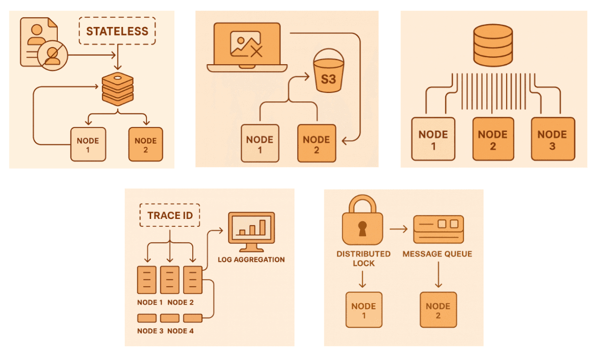

# 5 Things You Should Keep in Mind When Deploying to a Clustered Environment

Let’s be honest — moving from a single server to a cluster sounds simple on paper.  
You just add a few more machines, right?  
In practice, it’s the moment when small architectural mistakes start to grow legs.  
Below are a few things that experienced engineers usually double-check before pressing that “Deploy” button.

---

## 1️⃣ Managing State the Right Way
---

## 2️⃣ Shared Files and Where to Put Them
---

## 3️⃣ Database Connections Aren’t Free
---

## 4️⃣ Logging and Observability Matter More Than You Think
---

## 5️⃣ Background Jobs and Message Queues
---

👉 Read the full guide here: [5 Things You Should Keep in Mind When Deploying to a Clustered Environment](https://abp.io/community/articles/)