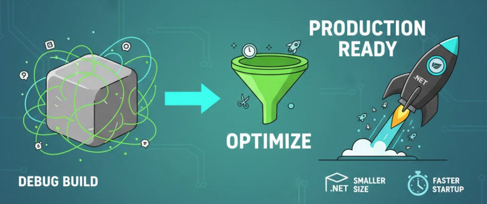
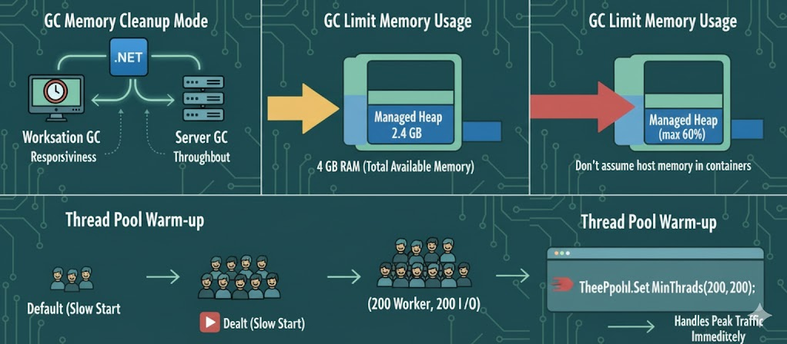
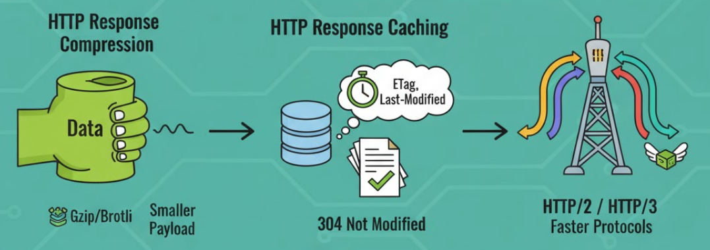
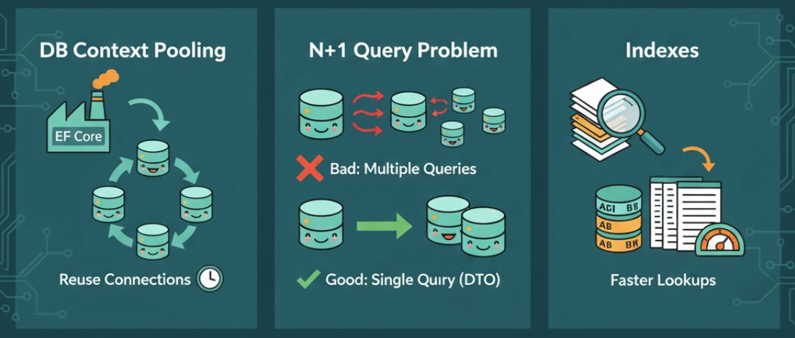

# Optimize Your .NET App for Production (Complete Checklist)

I see way too many .NET apps go to prod like it’s still “F5 on my laptop.” Here’s the checklist I wish someone shoved me years ago. It’s opinionated, pragmatic, copy-pasteable.

------

## 1) Publish Command and CSPROJ  Settings



Never go to production with debug build! See the below command which publishes properly a .NET app for production.

```bash
dotnet publish -c Release -o out -p:PublishTrimmed=true -p:PublishSingleFile=true -p:ReadyToRun=true
```

`csproj` for the optimum production publish:

```xml
<PropertyGroup>
  <PublishReadyToRun>true</PublishReadyToRun>
  <PublishTrimmed>true</PublishTrimmed>
  <InvariantGlobalization>true</InvariantGlobalization>
  <TieredCompilation>true</TieredCompilation>
</PropertyGroup>
```

- **PublishTrimmed** It's trimmimg assemblies. What's that!? It removes unused code from your application and its dependencies, hence it reduces the output files.

- **PublishReadyToRun** When you normally build a .NET app, your C# code is compiled into **IL** (Intrmediate Language). When your app runs, the JIT Compiler turns that IL code into native CPU commands. But this takes much time on startup. When you enable `PublishReadyToRun`, the build process precompiles your IL into native code and it's called AOT (Ahead Of Time). Hence your app starts faster... But the downside is; the output files are now a bit bigger. Another thing; it'll compile only for a specific OS like Windows and will not run on Linux anymore.

- **Self-contained** When you publish your .NET app this way, it ncludes the .NET runtime inside your app files. It will run even on a machine that doesn’t have .NET installed. The output size gets larger, but the runtime version is exactly what you built with.

  

------

## 2) Kestrel Hosting


By default, ASP.NET Core app listen only `localhost`, it means it accepts requests only from inside the machine. When you deploy to Docker or Kubernetes, the container’s internal network needs to expose the app to the outside world. To do this you can set it via environment variable as below:

```bash
ASPNETCORE_URLS=http://0.0.0.0:8080
```

Also if you’re building an internall API or a containerized microservice which is not multilngual, then add also the below setting. it disables operating system's globalization to reduce image size and dependencies..

```bash
DOTNET_SYSTEM_GLOBALIZATION_INVARIANT=1
```

Clean `Program.cs` startup!
Here's a minimal `Program.cs` which includes just the essential middleware and settings:

```csharp
var builder = WebApplication.CreateBuilder(args);

builder.Logging.ClearProviders();
builder.Logging.AddConsole();

builder.Services.AddResponseCompression();
builder.Services.AddResponseCaching();
builder.Services.AddHealthChecks();

var app = builder.Build();

if (!app.Environment.IsDevelopment())
{
    app.UseExceptionHandler("/error");
    app.UseHsts();
}

app.UseResponseCompression();
app.UseResponseCaching();

app.MapHealthChecks("/health");
app.MapGet("/error", () => Results.Problem(statusCode: 500));

app.Run();
```


------

## 3) Garbage Collection and ThreadPool




### GC Memory Cleanup Mode

GC (Garbage Collection) is how .NET automatically frees memory. There are two main modes:

- **Workstation GC:** good for desktop apps (focuses on responsiveness)
- **Server GC:**  good for servers (focuses on throughput)

The below environment variable is telling the .NET runtime to use the *Server Garbage Collector (Server GC)* instead of the *Workstation GC*. Because our ASP.NET Core app must be optmized for servers not personal computers.

```bash
COMPlus_gcServer=1
```

### GC Limit Memory Usage 

Use at max 60% of the total available memory for the managed heap (the memory that .NET’s GC controls). So if your container or VM has, let's say 4 GB of RAM, .NET will try to keep the GC heap below 2.4 GB (60% of 4 GB). Especially when you run your app in containers, don’t let the GC assume host memory:

```bash
COMPlus_GCHeapHardLimitPercent=60
```

### Thread Pool Warm-up

When your .NET app runs, it uses a thread pool. This is for handling background work like HTTP requests, async tasks, I/O things... By default, the thread pool starts small and grows dynamically as load increases. That’s good for desktop apps but for server apps  it's too slow! Because during sudden peek of traffic, the app might waste time creating threads instead of handling requests. So below code keeps at least 200 worker threads and 200 I/O completion threads ready to go even if they’re idle.

```csharp
ThreadPool.SetMinThreads(200, 200);
```


------

## 4) HTTP Performance



### HTTP Response Compression 

`AddResponseCompression()` enables HTTP response compression. It shrinks your outgoing responses before sending them to the client. Making smaller payloads for faster responses and uses less bandwidth. Default compression method is `Gzip`. You can also add `Brotli` compression. `Brotli` is great for APIs returning JSON or text. If your CPU is already busy, keep the default `Gzip` method.

```csharp
builder.Services.AddResponseCompression(options =>
{
    options.Providers.Add<BrotliCompressionProvider>();
    options.EnableForHttps = true;
});
```


### HTTP Response Caching 

Use caching for GET endpoints where data doesn’t change often (e.g., configs, reference data). `ETags` and `Last-Modified` headers tell browsers or proxies skip downloading data that hasn’t changed.

- **ETag** = a version token for your resource.
- **Last-Modified** = timestamp of last change.

If a client sends `If-None-Match: "abc123"` and your resource’s `ETag` hasn’t changed, .NET automatically returns `304 Not Modified`. 


###  HTTP/2 or HTTP/3

These newer protocols make web requests faster and smoother. It's good for microservices or frontends making many API calls.

- **HTTP/2** : multiplexing (many requests over one TCP connection).
- **HTTP/3** : uses QUIC (UDP) for even lower latency.

You can enable them on your reverse proxy (Nginx, Caddy, Kestrel)... 
.NET supports both out of the box if your environment allows it.


### Minimal Payloads with DTOs

The best practise here is; Never send/recieve your entire database entity, use DTOs. In the DTOs include only the fields the client actually needs by doing so you will keep the responses smaller and even safer. Also, prefer `System.Text.Json` (now it’s faster than `Newtonsoft.Json`) and for very high-traffic APIs, use source generation to remove reflection overhead.

```csharp
//define your entity DTO
[JsonSerializable(typeof(MyDto))]
internal partial class MyJsonContext : JsonSerializerContext { }

//and simply serialize like this    
var json = JsonSerializer.Serialize(dto, MyJsonContext.Default.MyDto)
```

------

## 5) Data Layer (Mostly Where Most Apps Slow Down!)



### Reuse `DbContext` via Factory (Pooling)

Creating a new `DbContext` for every query is expensive! Use `IDbContextFactory<TContext>`,  it gives you pooled `DbContext` instances from a pool that reuses objects instead of creating them from scratch.

```csharp
services.AddDbContextFactory<AppDbContext>(options =>
    options.UseSqlServer(connectionString));
```

Then inject the factory:

```csharp
using var db = _contextFactory.CreateDbContext();
```

Also, ensure your database server (SQL Server, PostgreSQL....) has **connection pooling enabled**.

------

### N+1 Query Problem

The N+1 problem occurs when your app runs **one query for the main data**, then **N more queries for related entities**. That kills performance!!!

**Bad-Practise:**

```csharp
var users = await context.Users.Include(u => u.Orders).ToListAsync();
```

**Good-Practise:**
Project to DTOs using `.Select()` so EF-Core generates a single optimized SQL query:

```csharp
var users = await context.Users.Select(u => new UserDto
   {
        Id = u.Id,
        Name = u.Name,
        OrderCount = u.Orders.Count
    }).ToListAsync();
```

------

###  **Indexes**

Use EF Core logging, SQL Server Profiler, or `EXPLAIN` (Postgres/MySQL) to find slow queries. Add missing indexes **only** where needed. For example [at this page](https://blog.sqlauthority.com/2011/01/03/sql-server-2008-missing-index-script-download/), he wrote an SQL query which lists missing index list (also there's another version at [Microsoft Docs](https://learn.microsoft.com/en-us/sql/relational-databases/system-dynamic-management-views/sys-dm-db-missing-index-details-transact-sql?view=sql-server-ver17)). This perf improvement is mostly applied after running the app for a period of time.


------

###  Migrations

In production run migrations manually, never do it on app startup. That way you can review schema changes, back up data and avoid breaking the live DB.


------

### Resilience with Polly

Use [Polly](https://www.pollydocs.org/) for retries, timeouts and circuit breakers for your DB or HTTP calls. Handles short outages gracefully

*To keep the article short and for the better readability I spitted it into 2 parts 👉 [Continue with the second part here](https://abp.io/community/articles/optimize-your-dotnet-app-for-production-for-any-.net-app-2-78xgncpi)...* 

