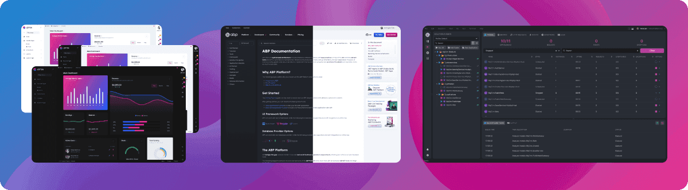
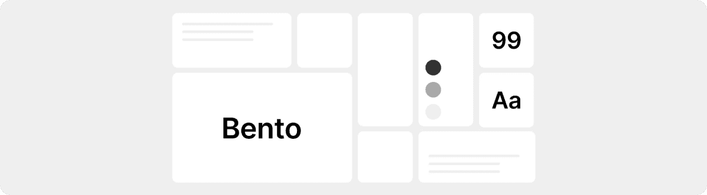
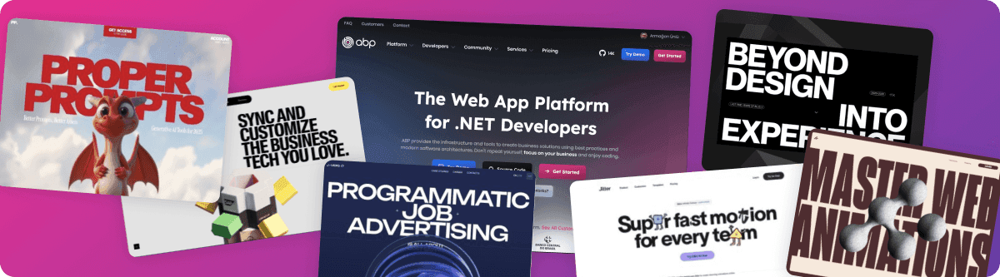

# UI & UX Trends That Will Shape 2026

Cinematic, gamified, high-wow-factor websites with scroll-to-play videos or scroll-to-tell stories are wonderful to experience, but you won't find these trends in this article. If you're interested in design trends directly related to the software world, such as **performance**, **accessibility**, **understandability**, and **efficiency**, grab a cup of coffee and enjoy.

As we approach the end of 2025, I'd like to share with you the most important user interface and user experience design trends that have become more of a **toolkit** than a trend, and that continue to evolve and become a part of our lives. I predict we'll see a lot of them in 2026\.

## 1\. Simplicity and Speed ​​

Designing understandable and readable applications is becoming far more important than designing in line with trends and fashion. In the software and business world, preferences are shifting more and more toward the **right design** over the cool design. As designers developing a product whose direct target audience is software developers, we design our products for the designers' enjoyment, but for the **end user's ease of use**. 

Users no longer care so much about the flashiness of a website. True converts are primarily interested in your product, service, or content. What truly matters to them is how easily and quickly they can access the information they're looking for.

More users, more sales, better promotion, and a higher conversion rate... The elements that serve these goals are optimized solutions and thoughtful details in our designs, more than visual displays.

If the "loading" icon appears too often on your digital product, you might not be doing it right. If you fail to optimize speed, the temporary effect of visual displays won't be enough to convert potential users into customers. Remember, the moment people start waiting, you've lost at least half of them.

## 2\. Dark Mode \- Still, and Forever

Dark Mode is no longer an option; it's a **standard**. It's become a necessity, not a choice, especially for users who spend hours staring at screens and are accustomed to dark themes in code editors and terminals. However, the approach to dark mode isn't simply about inverting colors; it's much deeper than that. The key is managing contrast and depth.

The layer hierarchy established in a light-colored design doesn't lose its impact when switched to dark mode. The colors, shadows, highlights, and contrasting elements used to create an **easily perceivable hierarchy** should be carefully considered for each mode. Our [LeptonX theme](https://leptontheme.com/)'s Light, Dark, Semi-dark, and System modes offer valuable insights you might want to explore.

You might also want to take a look at the dark and light modes we designed with these elements in mind in [ABP Studio](https://abp.io/get-started) and the [ABP.io Documents page](https://abp.io/docs/latest/).

## 3\. Bento Grid \- A Timeless Trend

People don't read your website; they **scan** it. 

Bento Grid, an indispensable trend for designers looking to manage their attention, looks set to remain a staple in 2026, just as it was in 2025\. No designer should ignore the fact that many tech giants, especially Apple and Samsung, are still using bento grids on their websites. The bento grid appears not only on websites but also in operating systems, VR headset interfaces, game console interfaces, and game designs.

The golden rule is **contrast** and **balance**.

The attractiveness and effectiveness of bento designs depend on certain factors you should consider when implementing them. If you ignore these rules, even with a proven method like bento, you can still alienate users.

The bento grid is one of the best ways to display different types of content inclusively. When used correctly, it's also a great way to manipulate reading order, guiding the user's eye. Improper contrast and hierarchy can also create a negative experience. Designers should use this to guide the reader's eye: "Read here first, then read here."

When creating a bento, you inherently have to sacrifice some of your "whitespace." This design has many elements for the user to focus on, and it actually strays from our first point, "Simplicity". Bento design, whose boundaries are drawn from the outset and independent of content, requires care not to include more or less than what is necessary. Too much content makes it boring; too little content makes it very close to meaningless.

Bento grids should aim for a balanced design by using both simple text and sophisticated visuals. This visual can be an illustration, a video that starts playing when hovered over, a static image, or a large title. Only one or two cards on the screen at a time should have attention.

## 4\. Larger Fonts, High Readability

Large fonts have been a trend for several years, and it seems web designers are becoming more and more bold. The increasing preference for larger fonts every year is a sign that this trend will continue into 2026\. This trend is about more than just using large font sizes in headlines.

Creating a cohesive typographic scale and proper line height and letter spacing are critical elements to consider when creating this trend. As the font size increases, line height should decrease, and the space between letters should be narrower.  

The browser default font size, which we used to see in body text and paragraphs and has now become standard, is 16 pixels. In the last few years, we've started seeing body font sizes of 17 or 18 pixels more frequently. The increasing importance of readability every year makes this more common. Font sizes in rem values, rather than px, provide the most efficient results.

## 5\. Micro Animations

Unless you're a web design agency designing a website to impress potential clients, you should avoid excessive changes, including excessive image changes during scrolling, and scroll direction changes. There's still room for oversized images and scroll animations. But be sure to create the visuals yourself. 

The trend I'm talking about here is **micro animations**, not macro ones. Small movements, not large ones.

The animation approach of 2025 is **functional** and **performance-sensitive**.

Microanimations exist to provide immediate feedback to the user. Instant feedback, like a button's shadow increasing when hovered over, a button's slight collapse when clicked, or a "Save" icon changing to a "Confirm" icon when saving data, keeps your designs alive.

We see the real impact of the micro-animation trend in static, non-action visuals. The use of non-button elements in your designs, accentuated by micro-movements such as scrolling or hovering, seems poised to continue to create macro effects in 2026\.

## 6\. Real Images and Human-like Touches

People quickly spot a fake. It's very difficult to convince a user who visits your website for the first time and doesn't trust you. **First impressions** matter.

Real photographs, actual product screenshots, and brand-specific illustrations will continue to be among the elements we want to see in **trust-focused** designs in 2026\.

In addition to flawless work done by AI, vivid, real-life visuals, accompanied by deliberate imperfections, hand-drawn details, or designed products that convey the message, "A human made this site\!", will continue to feel warmer and more welcoming.

The human touch is evident not only in the visuals but also in your **content and text**.

In 2026, you'll need more **human-like touches** that will make your design stand out among the thousands of similar websites rapidly generated by AI.

## 7\. Accessibility \- No Longer an Option, But a Legal and Ethical Obligation

Accessibility, once considered a nice-to-do thing in recent years, is now becoming a **necessity** in 2026 and beyond. Global regulations like the European Accessibility Act require all digital products to comply with WCAG standards.

All design and software improvements you make to ensure end users can fully perform their tasks in your products, regardless of their temporary or permanent disabilities, should be viewed as ethical and commercial requirements, not as a requirement to comply with these standards.

The foundation of accessibility in design is to use semantic HTML for screen readers, provide full keyboard control of all interactive elements, and clearly communicate the roles of complex components to the development team.

## 8\. Intentional Friction

Steve Krug, the father of UX design, started the trend of designing everything at a hyper-usable level with his book "Don't Make Me Think." As web designers, we've embraced this idea so much that all we care about is getting the user to their destination in the shortest possible scenario and as quickly as possible. This has required so many understandability measures that, after a while, it's starting to feel like fooling the user.

In recent years, designers have started looking for ways to make things a little more challenging, rather than just getting the user to the result.

When the end user visits your website, tries to understand exactly what it is at first glance, struggles a bit, and, after a little effort, becomes familiar with how your world works, they'll be more inclined to consider themselves a part of it.

This has nothing to do with anti-usability. This philosophy is called Intentional Friction.

This isn't a flaw; it's the pinnacle of error prevention. It's a step to prevent errors from occurring on autopilot and respects the user's ability to understand complex systems. Examples include reviewing the order summary or manually typing the project name when deleting a project on GitHub.

## Bonus: Where Does Artificial Intelligence Fit In?

Artificial intelligence will be an infrastructure in 2026, not a trend.

As designers, we should leverage AI not to paint us a picture, but to make workflows more intelligent. In my opinion, this is the best use case for AI.

AI can learn user behavior and adapt the interface accordingly. Real-time A/B testing can save us time by conducting a real-time content review. The ability to actively use AI in any area that allows you to accelerate your progress will take you a step further in your career.

Since your users are always human, **don't be too eager** to incorporate AI-generated visuals into your design. Unless you're creating and selling a ready-made theme, you should **avoid** AI-generated visuals, random bento grids, and randomly generated content.

You should definitely incorporate AI into your work for new content, new ideas, personal and professional development, and insights that will take your design a step further. But just as you don't design your website for designers to like, the same applies to AI. Humans, not robots, will experience your website. **AI-assisted**, not AI-generated, designs with a human touch are the trend I most expect seeing in 2026\.

## Conclusion

In the end, it's all fundamentally about respect for the user and their time. In 2026, our success as designers and developers will be measured not by how "cool" we are, but by how "efficient" and "reliable" a world we build for our users.

Thank you for your time.
