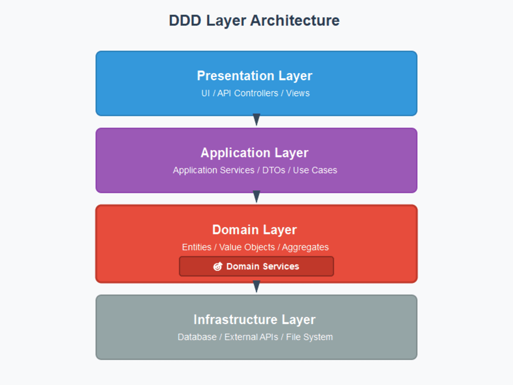
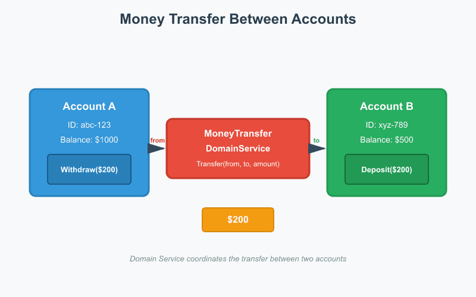
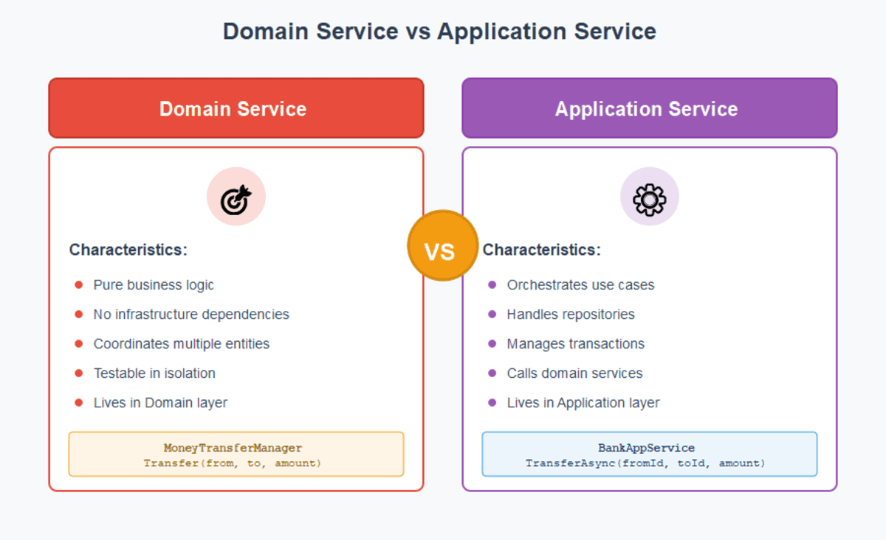
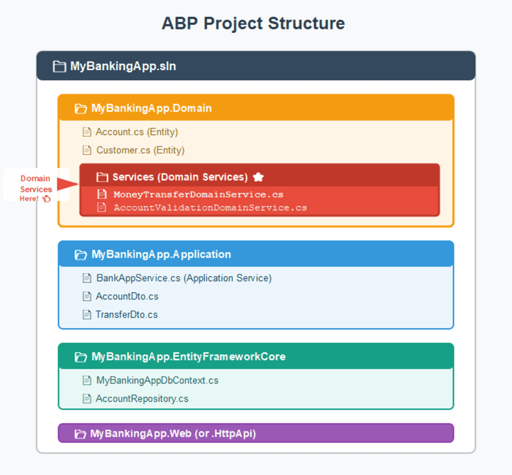

# What is That Domain Service in DDD for .NET Developers?

When you start applying **Domain-Driven Design (DDD)** in your .NET projects, you'll quickly meet some core building blocks: **Entities**, **Value Objects**, **Aggregates**, and finally… **Domain Services**.

But what exactly *is* a Domain Service, and when should you use one?

Let's break it down with practical examples and ABP Framework implementation patterns.

---



## The Core Idea of Domain Services

A **Domain Service** represents **a domain concept that doesn't naturally belong to a single Entity or Value Object**, but still belongs to the **domain layer** - *not* to the application or infrastructure.

In short:

> If your business logic doesn't fit into a single Entity, but still expresses a business rule, that's a good candidate for a Domain Service.

 

---

## Example: Money Transfer Between Accounts

Imagine a simple **banking system** where you can transfer money between accounts.

```csharp
public class Account : AggregateRoot<Guid>
{
    public decimal Balance { get; private set; }

    // Domain model should be created in a valid state.
    public Account(decimal openingBalance = 0m)
    {
        if (openingBalance < 0)
            throw new BusinessException("Opening balance cannot be negative.");
        Balance = openingBalance;
    }

    public void Withdraw(decimal amount)
    {
        if (amount <= 0)
            throw new BusinessException("Withdrawal amount must be positive.");
        if (Balance < amount)
            throw new BusinessException("Insufficient balance.");
        Balance -= amount;
    }

    public void Deposit(decimal amount)
    {
        if (amount <= 0)
            throw new BusinessException("Deposit amount must be positive.");
        Balance += amount;
    }
}
```

> In a richer domain you might introduce a `Money` value object (amount + currency + rounding rules) instead of a raw `decimal` for stronger invariants.

---

## Implementing a Domain Service



```csharp
public class MoneyTransferManager : DomainService
{
    public void Transfer(Account from, Account to, decimal amount)
    {
        if (from is null) throw new ArgumentNullException(nameof(from));
        if (to is null) throw new ArgumentNullException(nameof(to));
        if (ReferenceEquals(from, to))
            throw new BusinessException("Cannot transfer to the same account.");
        if (amount <= 0)
            throw new BusinessException("Transfer amount must be positive.");

        from.Withdraw(amount);
        to.Deposit(amount);
    }
}
```

> **Naming Convention**: ABP suggests using the `Manager` or `Service` suffix for domain services. We typically use `Manager` suffix (e.g., `IssueManager`, `OrderManager`).

> **Note**: This is a synchronous domain operation. The domain service focuses purely on business rules without infrastructure concerns like database access or event publishing. For cross-cutting concerns, use Application Service layer or domain events.

---

## Domain Service vs. Application Service

Here's a quick comparison:



| Layer                   | Responsibility                                                                   | Example                      |
| ----------------------- | -------------------------------------------------------------------------------- | ---------------------------- |
| **Domain Service**      | Pure business rule spanning entities/aggregates                                  | `MoneyTransferManager`       |
| **Application Service** | Orchestrates use cases, handles repositories, transactions, external systems     | `BankAppService`             |

---

## The Application Service Layer

An **Application Service** orchestrates the domain logic and handles infrastructure concerns:



```csharp
public class BankAppService : ApplicationService
{
    private readonly IRepository<Account, Guid> _accountRepository;
    private readonly MoneyTransferManager _moneyTransferManager;

    public BankAppService(
        IRepository<Account, Guid> accountRepository,
        MoneyTransferManager moneyTransferManager)
    {
        _accountRepository = accountRepository;
        _moneyTransferManager = moneyTransferManager;
    }

    public async Task TransferAsync(Guid fromId, Guid toId, decimal amount)
    {
        var from = await _accountRepository.GetAsync(fromId);
        var to = await _accountRepository.GetAsync(toId);

        _moneyTransferManager.Transfer(from, to, amount);

        await _accountRepository.UpdateAsync(from);
        await _accountRepository.UpdateAsync(to);
    }
}
```

> **Note**: Domain services are automatically registered to Dependency Injection with a **Transient** lifetime when inheriting from `DomainService`.

---

## Benefits of ABP's DomainService Base Class

The `DomainService` base class gives you access to:

- **Localization** (`IStringLocalizer L`) - Multi-language support for error messages
- **Logging** (`ILogger Logger`) - Built-in logger for tracking operations
- **Local Event Bus** (`ILocalEventBus LocalEventBus`) - Publish local domain events
- **Distributed Event Bus** (`IDistributedEventBus DistributedEventBus`) - Publish distributed events
- **GUID Generator** (`IGuidGenerator GuidGenerator`) - Sequential GUID generation for better database performance
- **Clock** (`IClock Clock`) - Abstraction for date/time operations

### Example with ABP Features

> **Important**: While domain services *can* publish domain events using the event bus, they should remain focused on business rules. Consider whether event publishing belongs in the domain service or the application service based on your consistency boundaries.

```csharp
public class MoneyTransferredEvent
{
    public Guid FromAccountId { get; set; }
    public Guid ToAccountId { get; set; }
    public decimal Amount { get; set; }
}

public class MoneyTransferManager : DomainService
{
    public async Task TransferAsync(Account from, Account to, decimal amount)
    {
        if (from is null) throw new ArgumentNullException(nameof(from));
        if (to is null) throw new ArgumentNullException(nameof(to));
        if (ReferenceEquals(from, to))
            throw new BusinessException(L["SameAccountTransferNotAllowed"]);
        if (amount <= 0)
            throw new BusinessException(L["InvalidTransferAmount"]);

        // Log the operation
        Logger.LogInformation(
            "Transferring {Amount} from {From} to {To}", amount, from.Id, to.Id);

        from.Withdraw(amount);
        to.Deposit(amount);

        // Publish local event for further policies (limits, notifications, audit, etc.)
        await LocalEventBus.PublishAsync(
            new MoneyTransferredEvent
            {
                FromAccountId = from.Id,
                ToAccountId = to.Id,
                Amount = amount
            }
        );
    }
}
```

> **Local Events**: By default, event handlers are executed within the same Unit of Work. If an event handler throws an exception, the database transaction is rolled back, ensuring consistency.

---

## Best Practices

### 1. Keep Domain Services Pure and Focused on Business Rules

Domain services should only contain business logic. They should not be responsible for application-level concerns like database transactions, authorization, or fetching entities from a repository.

```csharp
// Good ✅ Pure rule: receives aggregates already loaded.
public class MoneyTransferManager : DomainService
{
    public void Transfer(Account from, Account to, decimal amount)
    {
        // Business rules and coordination
        from.Withdraw(amount);
        to.Deposit(amount);
    }
}

// Bad ❌ Mixing application and domain concerns.
// This logic belongs in an Application Service.
public class MoneyTransferManager : DomainService
{
    private readonly IRepository<Account, Guid> _accountRepository;
    
    public MoneyTransferManager(IRepository<Account, Guid> accountRepository)
    {
        _accountRepository = accountRepository;
    }

    public async Task TransferAsync(Guid fromId, Guid toId, decimal amount)
    {
        // Don't fetch entities inside a domain service.
        var from = await _accountRepository.GetAsync(fromId);
        var to = await _accountRepository.GetAsync(toId);

        from.Withdraw(amount);
        to.Deposit(amount);
    }
}
```

### 2. Leverage Entity Methods First

Always prefer encapsulating business logic within an entity's methods when the logic belongs to a single aggregate. A domain service should only be used when a business rule spans multiple aggregates.

```csharp
// Good ✅ - Internal state change belongs in the entity
public class Account : AggregateRoot<Guid>
{
    public decimal Balance { get; private set; }
    
    public void Withdraw(decimal amount)
    {
        if (Balance < amount)
            throw new BusinessException("Insufficient balance");
        Balance -= amount;
    }
}

// Use Domain Service only when logic spans multiple aggregates
public class MoneyTransferManager : DomainService
{
    public void Transfer(Account from, Account to, decimal amount)
    {
        from.Withdraw(amount);  // Delegates to entity
        to.Deposit(amount);     // Delegates to entity
    }
}
```

### 3. Prefer Domain Services over Anemic Entities

Avoid placing business logic that coordinates multiple entities directly into an application service. This leads to an "Anemic Domain Model," where entities are just data bags and the business logic is scattered in application services.

```csharp
// Bad ❌ - Business logic is in the Application Service (Anemic Domain)
public class BankAppService : ApplicationService
{
    public async Task TransferAsync(Guid fromId, Guid toId, decimal amount)
    {
        var from = await _accountRepository.GetAsync(fromId);
        var to = await _accountRepository.GetAsync(toId);

        // This is domain logic and should be in a Domain Service
        if (ReferenceEquals(from, to))
            throw new BusinessException("Cannot transfer to the same account.");
        if (amount <= 0)
            throw new BusinessException("Transfer amount must be positive.");

        from.Withdraw(amount);
        to.Deposit(amount);
    }
}
```

### 4. Use Meaningful Names

ABP recommends naming domain services with a `Manager` or `Service` suffix based on the business concept they represent.

```csharp
// Good ✅
MoneyTransferManager
OrderManager
IssueManager
InventoryAllocationService

// Bad ❌
AccountHelper
OrderProcessor
```

---

## Advanced Example: Order Processing with Inventory Check

Here's a more complex scenario showing domain service interaction with domain abstractions:

```csharp
// Domain abstraction - defines contract but implementation is in infrastructure
public interface IInventoryChecker : IDomainService
{
    Task<bool> IsAvailableAsync(Guid productId, int quantity);
}

public class OrderManager : DomainService
{
    private readonly IInventoryChecker _inventoryChecker;

    public OrderManager(IInventoryChecker inventoryChecker)
    {
        _inventoryChecker = inventoryChecker;
    }

    // Validates and coordinates order processing with inventory
    public async Task ProcessAsync(Order order, Inventory inventory)
    {
        // First pass: validate availability using domain abstraction
        foreach (var item in order.Items)
        {
            if (!await _inventoryChecker.IsAvailableAsync(item.ProductId, item.Quantity))
            {
                throw new BusinessException(
                    L["InsufficientInventory", item.ProductId]);
            }
        }
        
        // Second pass: perform reservations
        foreach (var item in order.Items)
        {
            inventory.Reserve(item.ProductId, item.Quantity);
        }
        
        order.SetStatus(OrderStatus.Processing);
    }
}
```

> **Domain Abstractions**: The `IInventoryChecker` interface is a domain service contract. Its implementation can be in the infrastructure layer, but the contract belongs to the domain. This keeps the domain layer independent of infrastructure details while still allowing complex validations.

> **Caution**: Always perform validation and action atomically within a single transaction to avoid race conditions (TOCTOU - Time Of Check Time Of Use).

> **Transaction Boundaries**: When a domain service coordinates multiple aggregates, ensure the Application Service wraps the operation in a Unit of Work to maintain consistency. ABP's `[UnitOfWork]` attribute or Application Services' built-in UoW handling ensures this automatically.

---

## Common Pitfalls and How to Avoid Them

### 1. Bloated Domain Services
Don't let domain services become "god objects" that do everything. Keep them focused on a single business concept.

```csharp
// Bad ❌ - Too many responsibilities
public class AccountManager : DomainService
{
    public void Transfer(Account from, Account to, decimal amount) { }
    public void CalculateInterest(Account account) { }
    public void GenerateStatement(Account account) { }
    public void ValidateAddress(Account account) { }
    public void SendNotification(Account account) { }
}

// Good ✅ - Split by business concept
public class MoneyTransferManager : DomainService
{
    public void Transfer(Account from, Account to, decimal amount) { }
}

public class InterestCalculationManager : DomainService
{
    public void Calculate(Account account) { }
}
```

### 2. Circular Dependencies Between Aggregates
When domain services coordinate multiple aggregates, be careful about creating circular dependencies.

```csharp
// Consider using Domain Events instead of direct coupling
public class OrderManager : DomainService
{
    public async Task ProcessAsync(Order order)
    {
        order.SetStatus(OrderStatus.Processing);
        
        // Instead of directly modifying Customer aggregate here,
        // publish an event that CustomerManager can handle
        await LocalEventBus.PublishAsync(new OrderProcessedEvent
        {
            OrderId = order.Id,
            CustomerId = order.CustomerId
        });
    }
}
```

### 3. Confusing Domain Service with Domain Event Handlers
Domain services orchestrate business operations. Domain event handlers react to state changes. Don't mix them.

```csharp
// Domain Service - Orchestrates business logic
public class MoneyTransferManager : DomainService
{
    public async Task TransferAsync(Account from, Account to, decimal amount)
    {
        from.Withdraw(amount);
        to.Deposit(amount);
        await LocalEventBus.PublishAsync(
            new MoneyTransferredEvent
            {
                FromAccountId = from.Id,
                ToAccountId = to.Id,
                Amount = amount
            }
        );
    }
}

// Domain Event Handler - Reacts to domain events
public class MoneyTransferredEventHandler : 
    ILocalEventHandler<MoneyTransferredEvent>,
    ITransientDependency
{
    public async Task HandleEventAsync(MoneyTransferredEvent eventData)
    {
        // Send notification, update analytics, etc.
    }
}
```

---

## Testing Domain Services

Domain services are easy to test because they have minimal dependencies:

```csharp
public class MoneyTransferManager_Tests
{
    [Fact]
    public void Should_Transfer_Money_Between_Accounts()
    {
        // Arrange
        var fromAccount = new Account(1000m);
        var toAccount = new Account(500m);
        var manager = new MoneyTransferManager();

        // Act
        manager.Transfer(fromAccount, toAccount, 200m);

        // Assert
        fromAccount.Balance.ShouldBe(800m);
        toAccount.Balance.ShouldBe(700m);
    }

    [Fact]
    public void Should_Throw_When_Insufficient_Balance()
    {
        var fromAccount = new Account(100m);
        var toAccount = new Account(500m);
        var manager = new MoneyTransferManager();
        
        Should.Throw<BusinessException>(() => 
            manager.Transfer(fromAccount, toAccount, 200m));
    }

    [Fact]
    public void Should_Throw_When_Amount_Is_NonPositive()
    {
        var fromAccount = new Account(100m);
        var toAccount = new Account(100m);
        var manager = new MoneyTransferManager();
        
        Should.Throw<BusinessException>(() => 
            manager.Transfer(fromAccount, toAccount, 0m));
        Should.Throw<BusinessException>(() => 
            manager.Transfer(fromAccount, toAccount, -5m));
    }

    [Fact]
    public void Should_Throw_When_Same_Account()
    {
        var account = new Account(100m);
        var manager = new MoneyTransferManager();
        
        Should.Throw<BusinessException>(() => 
            manager.Transfer(account, account, 10m));
    }
}
```

### Integration Testing with ABP Test Infrastructure

```csharp
public class MoneyTransferManager_IntegrationTests : BankingDomainTestBase
{
    private readonly MoneyTransferManager _transferManager;
    private readonly IRepository<Account, Guid> _accountRepository;

    public MoneyTransferManager_IntegrationTests()
    {
        _transferManager = GetRequiredService<MoneyTransferManager>();
        _accountRepository = GetRequiredService<IRepository<Account, Guid>>();
    }

    [Fact]
    public async Task Should_Transfer_And_Persist_Changes()
    {
        // Arrange
        var fromAccount = new Account(1000m);
        var toAccount = new Account(500m);
        
        await _accountRepository.InsertAsync(fromAccount);
        await _accountRepository.InsertAsync(toAccount);
        await UnitOfWorkManager.Current.SaveChangesAsync();

        // Act
        await _transferManager.TransferAsync(fromAccount, toAccount, 200m);
        await UnitOfWorkManager.Current.SaveChangesAsync();

        // Assert
        var updatedFrom = await _accountRepository.GetAsync(fromAccount.Id);
        var updatedTo = await _accountRepository.GetAsync(toAccount.Id);
        
        updatedFrom.Balance.ShouldBe(800m);
        updatedTo.Balance.ShouldBe(700m);
    }
}
```

---

## When NOT to Use a Domain Service

Not every operation needs a domain service. Avoid over-engineering:

1. **Simple CRUD Operations**: Use Application Services directly
2. **Single Aggregate Operations**: Use Entity methods
3. **Infrastructure Concerns**: Use Infrastructure Services
4. **Application Workflow**: Use Application Services

```csharp
// Don't create a domain service for this ❌
public class AccountBalanceReader : DomainService
{
    public decimal GetBalance(Account account) => account.Balance;
}

// Just use the property directly ✅
var balance = account.Balance;
```

---

## Summary
- **Domain Services** are domain-level, not application-level
- They encapsulate **business logic that doesn't belong to a single entity**
- They keep your **entities clean** and **business logic consistent**
- In ABP, inherit from `DomainService` to get built-in features
- Keep them **focused**, **pure**, and **testable**

---

## Final Thoughts

Next time you're writing a business rule that doesn't clearly belong to an entity, ask yourself:

> "Is this a Domain Service?"

If it's pure domain logic that coordinates multiple entities or implements a business rule, **put it in the domain layer** - your future self (and your team) will thank you.

Domain Services are a powerful tool in your DDD toolkit. Use them wisely to keep your domain model clean, expressive, and maintainable.

---
