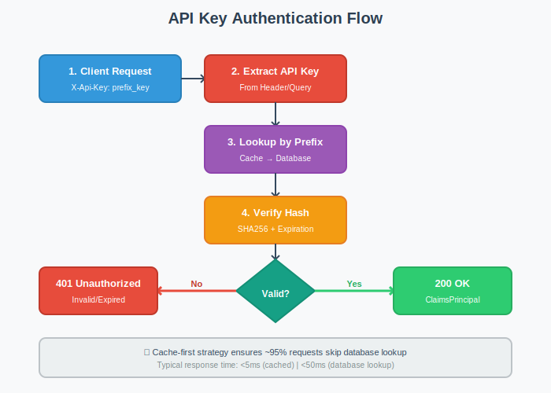

# Building an API Key Management System with ABP Framework

API keys are one of the most common authentication methods for APIs, especially for machine-to-machine communication. In this article, I'll explain what API key authentication is, when to use it, and how to implement a complete API key management system using ABP Framework.

## What is API Key Authentication?

An API key is a unique identifier used to authenticate requests to an API. Unlike user credentials (username/password) or OAuth tokens, API keys are designed for:

- **Programmatic access** - Scripts, CLI tools, and automated processes
- **Service-to-service communication** - Microservices authenticating with each other
- **Third-party integrations** - External systems accessing your API
- **IoT devices** - Embedded systems with limited authentication capabilities
- **Mobile/Desktop apps** - Native applications that need persistent authentication

## Why Use API Keys?

While modern authentication methods like OAuth2 and JWT are excellent for user authentication, API keys offer distinct advantages in certain scenarios:

**Simplicity**: No complex OAuth flows or token refresh mechanisms. Just include the key in your request header.

**Long-lived**: Unlike JWT tokens that expire in minutes/hours, API keys can remain valid for months or years, making them ideal for automated systems.

**Revocable**: You can instantly revoke a compromised key without affecting user credentials.

**Granular Control**: Different keys for different purposes (read-only, admin, specific services).

## Real-World Use Cases

Here are some practical scenarios where API key authentication shines:

### 1. Mobile Applications
Your mobile app needs to call your backend APIs. Instead of storing user credentials or managing token refresh flows, use an API key.

```csharp
// Mobile app configuration
var apiClient = new ApiClient("https://api.yourapp.com");
apiClient.SetApiKey("sk_mobile_prod_abc123...");
```

### 2. Microservice Communication
Service A needs to call Service B's protected endpoints.

```csharp
// Order Service calling Inventory Service
var request = new HttpRequestMessage(HttpMethod.Get, "https://inventory-service/api/products");
request.Headers.Add("X-Api-Key", _configuration["InventoryService:ApiKey"]);
```

### 3. Third-Party Integrations
You're providing APIs to external partners or customers.

```bash
# Customer's integration script
curl -H "X-Api-Key: pk_partner_xyz789..." \
     https://api.yourplatform.com/api/orders
```

## Implementing API Key Management in ABP Framework

Now let's see how to build a complete API key management system using ABP Framework. I've created an open-source implementation that you can use in your projects.

### Project Overview

The implementation consists of:

- **User-based API keys** - Each key belongs to a specific user
- **Permission delegation** - Keys inherit user permissions with optional restrictions
- **Secure storage** - Keys are hashed with SHA-256
- **Prefix-based lookup** - Fast key resolution with caching
- **Web UI** - Manage keys through a user-friendly interface
- **Multi-tenancy support** - Full ABP multi-tenancy compatibility


### Architecture Overview

The solution follows ABP's modular architecture with four main layers:

```
┌─────────────────────────────────────────────┐
│           Web Layer (UI)                    │
│  • Razor Pages for CRUD operations          │
│  • JavaScript for client interactions       │
└─────────────────────────────────────────────┘
                    ↓
┌─────────────────────────────────────────────┐
│       AspNetCore Layer (Middleware)         │
│  • Authentication Handler                   │
│  • API Key Resolver (Header/Query)          │
└─────────────────────────────────────────────┘
                    ↓
┌─────────────────────────────────────────────┐
│     Application Layer (Business Logic)      │
│  • ApiKeyAppService (CRUD operations)       │
│  • DTO mappings and validations             │
└─────────────────────────────────────────────┘
                    ↓
┌─────────────────────────────────────────────┐
│        Domain Layer (Core Business)         │
│  • ApiKey Entity & Manager                  │
│  • IApiKeyRepository                        │
│  • Domain services & events                 │
└─────────────────────────────────────────────┘
```

### Key Components

#### 1. Domain Layer - The Core Entity

```csharp
public class ApiKey : FullAuditedAggregateRoot<Guid>, IMultiTenant
{
    public virtual Guid? TenantId { get; protected set; }
    public virtual Guid UserId { get; protected set; }
    public virtual string Name { get; protected set; }
    public virtual string Prefix { get; protected set; }
    public virtual string KeyHash { get; protected set; }
    public virtual DateTime? ExpiresAt { get; protected set; }
    public virtual bool IsActive { get; protected set; }
    
    // Key format: {prefix}_{key}
    // Only the hash is stored, never the actual key
}
```

**Key Design Decisions:**

- **Prefix-based lookup**: Keys have format `prefix_actualkey`. The prefix is indexed for fast database lookups.
- **SHA-256 hashing**: The actual key is hashed and never stored in plain text.
- **User association**: Each key belongs to a user, inheriting their permissions.
- **Soft delete**: Deleted keys are marked as deleted but not removed from database for audit purposes.

#### 2. Authentication Flow

Here's how authentication works when a request arrives:



```csharp
// 1. Extract API key from request
var apiKey = httpContext.Request.Headers["X-Api-Key"].FirstOrDefault();
if (string.IsNullOrEmpty(apiKey)) return AuthenticateResult.NoResult();

// 2. Split prefix and key
var parts = apiKey.Split('_', 2);
var prefix = parts[0];
var key = parts[1];

// 3. Find key by prefix (cached)
var apiKeyEntity = await _apiKeyRepository.FindByPrefixAsync(prefix);
if (apiKeyEntity == null) return AuthenticateResult.Fail("Invalid API key");

// 4. Verify hash
var keyHash = HashHelper.ComputeSha256(key);
if (apiKeyEntity.KeyHash != keyHash) 
    return AuthenticateResult.Fail("Invalid API key");

// 5. Check expiration and active status
if (apiKeyEntity.ExpiresAt < DateTime.UtcNow || !apiKeyEntity.IsActive)
    return AuthenticateResult.Fail("API key expired or inactive");

// 6. Create claims principal with user identity
var claims = new List<Claim>
{
    new Claim(AbpClaimTypes.UserId, apiKeyEntity.UserId.ToString()),
    new Claim(AbpClaimTypes.TenantId, apiKeyEntity.TenantId?.ToString() ?? ""),
    new Claim("ApiKeyId", apiKeyEntity.Id.ToString())
};

return AuthenticateResult.Success(ticket);
```

#### 3. Creating and Managing API Keys

**Creating a new key:**


```csharp
public class ApiKeyManager : DomainService
{
    public async Task<(ApiKey, string)> CreateAsync(
        Guid userId, 
        string name, 
        DateTime? expiresAt = null)
    {
        // Generate unique prefix
        var prefix = await GenerateUniquePrefixAsync();
        
        // Generate secure random key
        var key = GenerateSecureRandomString(32);
        
        // Hash the key for storage
        var keyHash = HashHelper.ComputeSha256(key);
        
        var apiKey = new ApiKey(
            GuidGenerator.Create(),
            userId,
            name,
            prefix,
            keyHash,
            expiresAt,
            CurrentTenant.Id
        );
        
        await _apiKeyRepository.InsertAsync(apiKey);
        
        // Return both entity and the full key (prefix_key)
        // This is the ONLY time the actual key is visible
        return (apiKey, $"{prefix}_{key}");
    }
}
```

**Important**: The actual key is returned only once during creation. After that, only the hash is stored.


### Using API Keys in Your Application

Once created, clients can use the API key to authenticate:

**HTTP Header (Recommended):**
```bash
curl -H "X-Api-Key: sk_prod_abc123def456..." \
     https://api.example.com/api/products
```

**JavaScript:**
```javascript
const response = await fetch('https://api.example.com/api/products', {
  headers: {
    'X-Api-Key': 'sk_prod_abc123def456...'
  }
});
```

**C# HttpClient:**
```csharp
var client = new HttpClient();
client.DefaultRequestHeaders.Add("X-Api-Key", "sk_prod_abc123def456...");
var response = await client.GetAsync("https://api.example.com/api/products");
```

**Python:**
```python
import requests

headers = {'X-Api-Key': 'sk_prod_abc123def456...'}
response = requests.get('https://api.example.com/api/products', headers=headers)
```

### Permission Management

API keys inherit the user's permissions, but you can further restrict them:


This allows scenarios like:
- Read-only API key for reporting tools
- Limited scope keys for third-party integrations
- Service-specific keys with minimal permissions

```csharp
// Check if current request is authenticated via API key
if (CurrentUser.FindClaim("ApiKeyId") != null)
{
    var apiKeyId = CurrentUser.FindClaim("ApiKeyId").Value;
    // Additional API key specific logic
}
```

## Performance Considerations

The implementation uses several optimizations:

**1. Prefix-based indexing**: Database lookups are done by prefix (indexed column), not the full key hash.

**2. Distributed caching**: API keys are cached after first lookup, dramatically reducing database queries.

```csharp
// Cache configuration
Configure<AbpDistributedCacheOptions>(options =>
{
    options.KeyPrefix = "ApiKey:";
});
```

**3. Cache invalidation**: When a key is modified or deleted, cache is automatically invalidated.

**Typical Performance:**
- Cached lookup: **< 5ms**
- Database lookup: **< 50ms**
- Cache hit rate: **~95%**

## Security Best Practices

When implementing API key authentication, follow these guidelines:

✅ **Always use HTTPS** - Never send API keys over unencrypted connections

✅ **Use different keys per environment** - Separate keys for dev, staging, production

❌ **Don't log the full key** - Only log the prefix for debugging

## Getting Started

The complete source code is available on GitHub:

**Repository**: [github.com/salihozkara/AbpApikeyManagement](https://github.com/salihozkara/AbpApikeyManagement)

To integrate it into your ABP project:

1. Clone or download the repository
2. Add project references to your solution
3. Add module dependencies to your modules
4. Run EF Core migrations to create the database tables
5. Navigate to `/ApiKeyManagement` to start managing keys

```csharp
// In your Web module
[DependsOn(typeof(ApiKeyManagementWebModule))]
public class YourWebModule : AbpModule
{
    // ...
}

// In your HttpApi.Host module
[DependsOn(typeof(ApiKeyManagementHttpApiModule))]
public class YourHttpApiHostModule : AbpModule
{
    // ...
}
```

## Conclusion

API key authentication remains a crucial part of modern API security, especially for machine-to-machine communication. While it shouldn't replace user authentication methods like OAuth2 for user-facing applications, it's perfect for:

- Automated scripts and tools
- Service-to-service communication
- Third-party integrations
- Long-lived access without token refresh complexity

The implementation shown here demonstrates how ABP Framework's modular architecture, DDD principles, and built-in features (multi-tenancy, caching, permissions) can be leveraged to build a production-ready API key management system.

The solution is open-source and ready to be integrated into your ABP projects. Feel free to explore the code, suggest improvements, or adapt it to your specific needs.

**Resources:**
- GitHub Repository: [salihozkara/AbpApikeyManagement](https://github.com/salihozkara/AbpApikeyManagement)
- ABP Framework: [abp.io](https://abp.io)
- ABP Documentation: [docs.abp.io](https://abp.io/docs/latest)

Happy coding! 🚀
