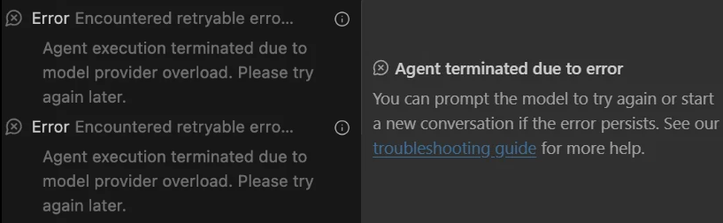
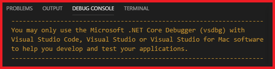
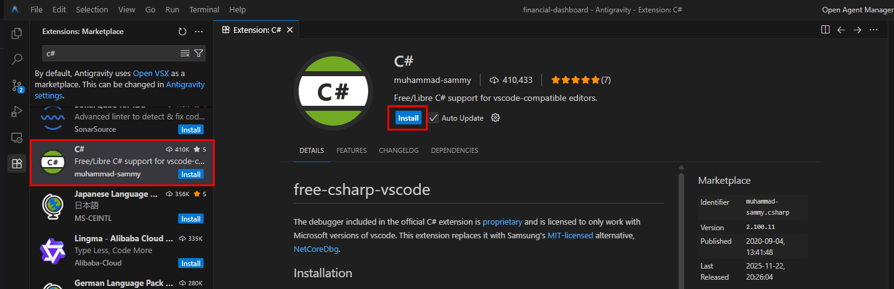
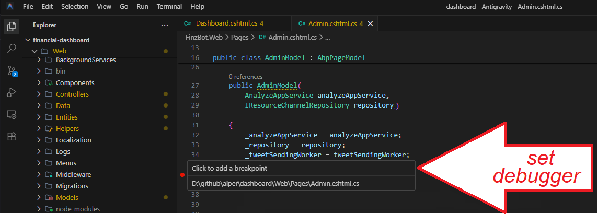
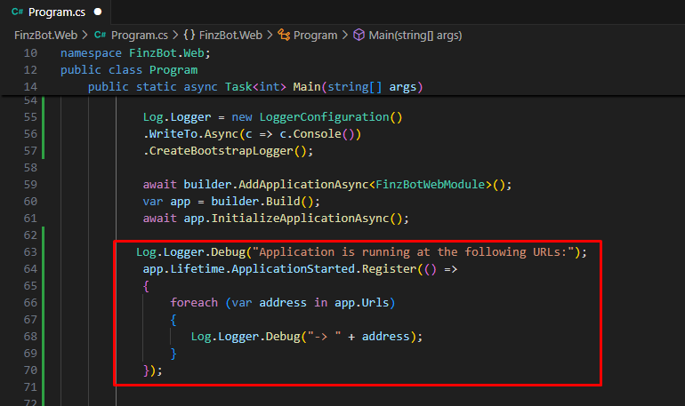
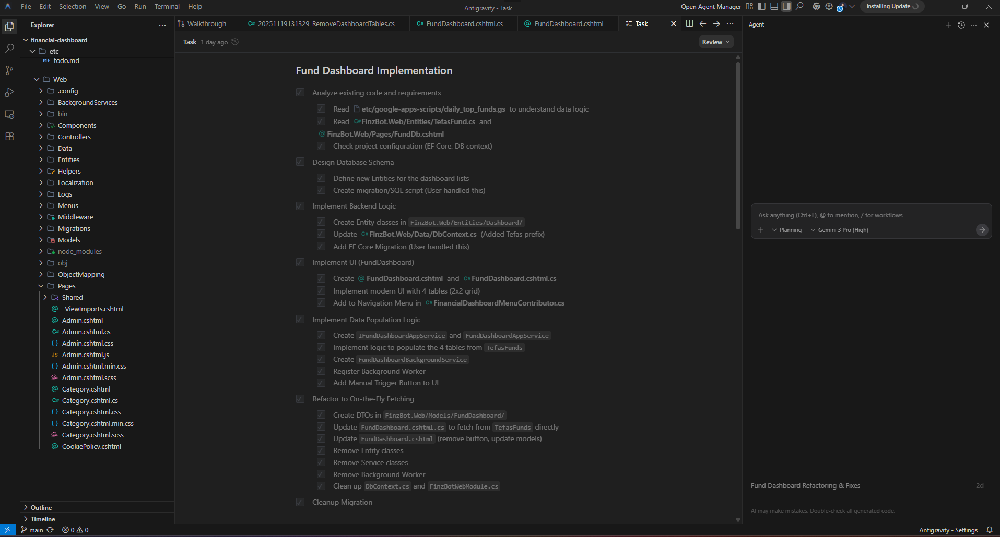
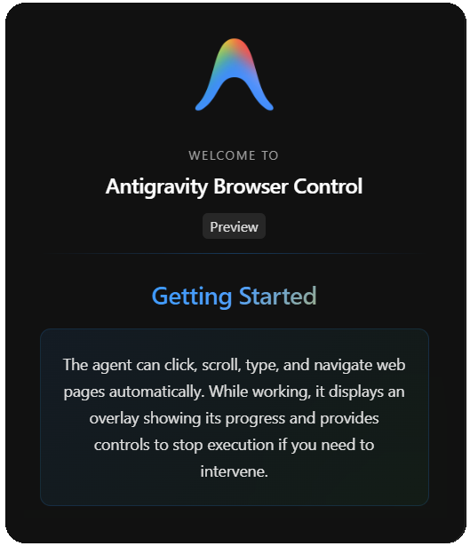
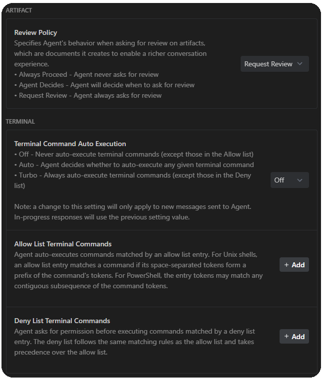

# My First Look and Experience with Google AntiGravity

## Is Google AntiGravity Going to Replace Your Main Code Editor?

Today, I tried the new code-editor AntiGravity by Google. *"It's beyond a code-editor*" by Google 🙄 
When I first launch it, I see the UI is almost same as Cursor. They're both based on Visual Studio Code. 
That's why it was not hard to find what I'm looking for. 

First of all, the main difference as I see from the Cursor is; when I type a prompt in the agent section **AntiGravity first creates a Task List** (like a road-map) and whenever it finishes a task, it checks the corresponding task. Actually Cursor has a similar functionality but AntiGravity took it one step further. 

Second thing which was good to me; AntiGravity uses [Nano Banana 🍌](https://gemini.google/tr/overview/image-generation/). This is Google's AI image generation model... Why it's important because when you create an app, you don't need to search for graphics, deal with image licenses. **AntiGravity generates images automatically and no license is required!** 

Third exciting feature for me; **AntiGravity is integrated with Google Chrome and can communicate with the running website**. When I first run my web project, it installed a browser extension which can see and interact with my website. It can see the results, click somewhere else on the page, scroll, fill up the forms, amazing 😵

Another feature I loved is that **you can enter a new prompt even while AntiGravity is still generating a response** 🧐. It instantly prioritizes the latest input and adjusts the ongoing process if needed. But in Cursor, if you add a prompt before the cursor finishes, it simply queues it and runs it later 😔.

And lastly, **AntiGravity is working very good with Gemini 3**.

Well, everything was not so perfect 😥 When I tried AntiGravity, couple of times it stucked AI generation and Agent stopped. I faced errors like this 👇

## Debugging .NET Projects via AntiGravity

⚠ There's a crucial development issue with AntiGravity (and also for Cursor, Windsurf etc...) 🤕 you **cannot debug your .NET application with AntiGravity 🥺.** *This is Microsoft's policy!* Microsoft doesn't allow debugging for 3rd party IDEs and shows the below error... That's why I cannot say it's a downside of AntiGravity. You need to use Microsft's original VS Code, Visual Studio or Rider for debugging.  But wait a while there's a workaround for this,  I'll let you know in the next section.

### What does this error mean?

AntiGravity, Cursor, Windsurf etc... are using Visual Studio Code and  the C# extension for VS Code includes the Microsoft .NET Core Debugger "*vsdbg*". 
VS Code is open-source but "*vsdbg*" is not open-source! It's working only with Visual Studio Code, Visual Studio and Visual Studio for Mac. This is clearly stated at [Microsoft's this link](https://github.com/dotnet/vscode-csharp/blob/main/docs/debugger/Microsoft-.NET-Core-Debugger-licensing-and-Microsoft-Visual-Studio-Code.md).

### Ok! How to resolve debugging issue with AntiGravity? and Cursor and Windsurf...

There's a free C# debugger extension for Visual Studio Code based IDEs that supports AntiGravity, Cursor and Windsurf. The extension name is **C#**. 
You can download this free C# debugger extension at 👉 [open-vsx.org/extension/muhammad-sammy/csharp/](https://open-vsx.org/extension/muhammad-sammy/csharp/). 
For AntiGravity open Extension window (*Ctrl + Shift + X*) and search for `C#`, there you'll see this extension.

After installing, I restarted AntiGravity and now I can see the red circle which allows me to add breakpoint on C# code.

### Another Extension For Debugging .NET Apps on VS Code

Recently I heard about DotRush extension from the folks. As they say DotRush works slightly faster and support Razor pages (.cshtml files). 
Here's the link for DotRush https://github.com/JaneySprings/DotRush

### Finding Website Running Port

When you run the web project via C# debugger extension, normally it's not using the `launch.json` therefore the website port is not the one when you start from Visual Studio / Rider... So what's my website's port which I just run now? Normally for ASP.NET Core **the default port is 5000**. You can try navigating to http://localhost:5000/. 
Alternatively you can write the below code in `Program.cs` which prints the full address of your website in the logs.
If you do the steps which I showed you, you can debug your C# application via AntiGravity and other VS Code derivatives.

## How Much is AntiGravity? 💲

Currently there's only individual plan is available for personal accounts and that's free 👏! The contents of Team and Enterprise plans and prices are not announced yet. But **Gemini 3 is not free**! I used it with my company's Google Workspace account which we normally pay for Gemini.

## More About AntiGravity

There have been many AI assisted IDEs like [Windsurf](https://windsurf.com/), [Cursor](https://cursor.com/), [Zed](https://zed.dev/), [Replit](https://replit.com/) and [Fleet](https://www.jetbrains.com/fleet/). But this time it's different, this is backed by Google. 
As you see from the below image AntiGravity, uses a standard grid layout as others based on VS Code editor. 
It's very similar to Cursor, Visual Studio, Rider. 

## Supported LLMs 🧠  

Antigravity offers the below models which supports reasoning: Gemini 3 Pro, Claude Sonnet 4.5, GPT-OSS

Antigravity uses other models for supportive tasks in the background:

- **Nano banana**: This is used to generate images.
- **Gemini 2.5 Pro UI Checkpoint**: It's for the browser subagent to trigger browser action such as clicking, scrolling, or filling in input.
- **Gemini 2.5 Flash**: For checkpointing and context summarization, this is used.
- **Gemini 2.5 Flash Lite**: And when it's need to make a semantic search in your code-base, this is used.

## AntiGravity Can See Your Website

This makes a big difference from traditional IDEs. AntiGravity's browser agent is taking screenshots of your pages when it needs to check. This is achieved by a Chrome Extension as a tool to the agent, and you can also prompt the agent to take a screenshot of a page. It can iterate on website designs and implementations, it can perform UI Testing, it can monitor dashboards, it can automate routine tasks like rerunning CI.
This is the link for the extension 👉 [chromewebstore.google.com/detail/antigravity-browser-exten/eeijfnjmjelapkebgockoeaadonbchdd](https://chromewebstore.google.com/detail/antigravity-browser-exten/eeijfnjmjelapkebgockoeaadonbchdd). AntiGravity will install this extension automatically on the first run.

## MCP Integration

### When Do We Need MCP in a Code Editor? 

Simply if we want to connect to a 3rd party service to complete our task we need MCP. So AntiGravity can connect to your DB and write proper SQL queries or it can pull in recent build logs from Netlify or Heroku. Also you can ask AntiGravity to to connect GitHub for finding the best authentication pattern. 

### AntiGravity Supports These MCP Servers

Airweave, AlloyDB for PostgreSQL, Atlassian, BigQuery, Cloud SQL for PostgreSQL, Cloud SQL for MySQL, Cloud SQL for SQL Server, Dart, Dataplex, Figma Dev Mode MCP, Firebase, GitHub, Harness, Heroku, Linear, Locofy, Looker, MCP Toolbox for Databases, MongoDB, Neon, Netlify, Notion, PayPal, Perplexity Ask, Pinecone, Prisma, Redis, Sequential Thinking, SonarQube, Spanner, Stripe and Supabase.

## Agent Settings ⚙️

The major settings of Agent are:

- **Agent Auto Fix Lints**: I enabled this setting because I want the Agent automatically fixes its own mistakes for invalid syntax, bad formatting, unused variables, unreachable code or following coding standards... It makes extra tool calls that's why little bit expensive 🥴.
- **Auto Execution**: Sometimes Agent tries to build application or writing test code and running it, in these cases it executes command. I choose "Turbo" 🤜  With this option, Agent always runs the terminal command and controls my browser.
- **Review Policy**: How much control you are giving to agent 🙎. I choose "Always Proceed" 👌 because I mostly trust AI 😀. The Agent will never ask for review.

## Differences Between Cursor and AntiGravity

While Cursor was the champion of AI code editors, **Antigravity brings a different philosophy**.

### 1. "Agent-First 🤖"  vs "You-First 🤠"

- **Cursor:** It acts like an assistant; it predicts your next move, auto-completes your thoughts, and helps you refactor while you type. You are still the driver; Cursor just drives the car at 200 km/h.
- **Antigravity:** Antigravity is built to let you manage coding tasks. It is "Agent-First." You don't just type code; you assign tasks to autonomous agents (e.g., "Fix the bug in the login flow and verify it in the browser"). It behaves more like a junior developer that you supervise.

### 2. The Interface

- **Cursor:** Looks and feels exactly like **VS Code**. If you know VS Code, you know Cursor. 

- **Antigravity:** Introduces 2 major layouts:
  - **Editor View:** Similar to a standard IDE
  - **Manager View:** A dashboard where you see multiple "Agents" working in parallel. You can watch them plan, execute, and test tasks asynchronously.

### 3. Verification & Trust

- **Cursor:** You verify by reading the code diffs it suggests.
- **Antigravity:** Introduces **Artifacts**... Since the agents work autonomously, they generate proof-of-work documents, screenshots of the app running, browser logs and execution plans. So you can verify what they did without necessarily reading every line of code immediately.

### 4. Capabilities

- **Cursor:** Best-in-class **Autocomplete** ("Tab" feature) and **Composer** (multi-file editing). It excels at "Vibe Coding". It's getting into a flow state where the AI writes the boilerplate and you direct the logic.
- **Antigravity:** Is good at **Autonomous Execution**. It has a built-in browser and terminal that the *Agent* controls. The Agent can write code, run the server, open the browser, see the error, and fix it 😎 

### 5. AI Models (Brains 🧠)

- **Cursor:** Model Agnostic. You can switch between **Claude 3.5 Sonnet** *-mostly the community uses this-*, GPT-4o, and others.
- **Antigravity:** Built deeply around **Gemini 3 Pro**. It leverages Gemini's massive context window (1M+ tokens) to understand huge mono repos without needing as much "RAG" as Cursor.

## Try It Yourself Now 🤝

If you are ready to experience the new AI code editor by Google, download and use 👇
[**Launch Google AntiGravity**](https://antigravity.google/)