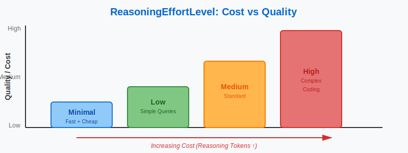
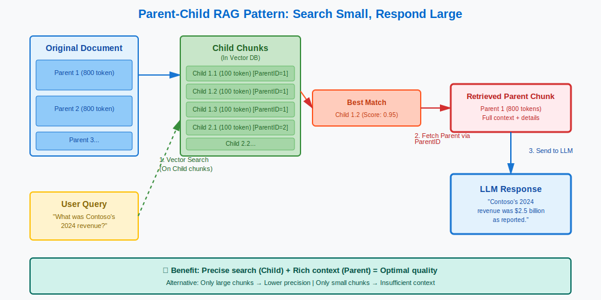
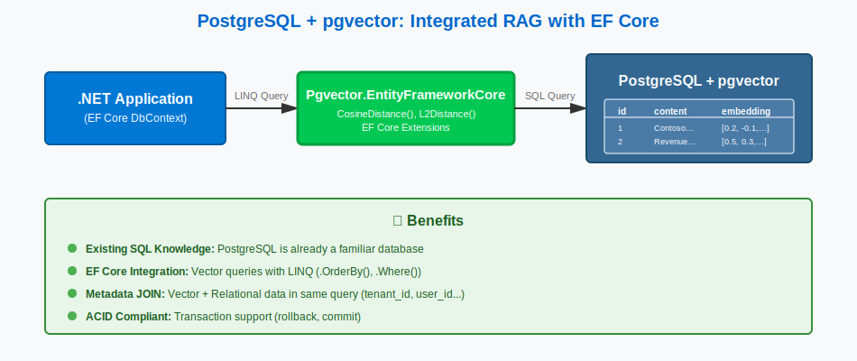
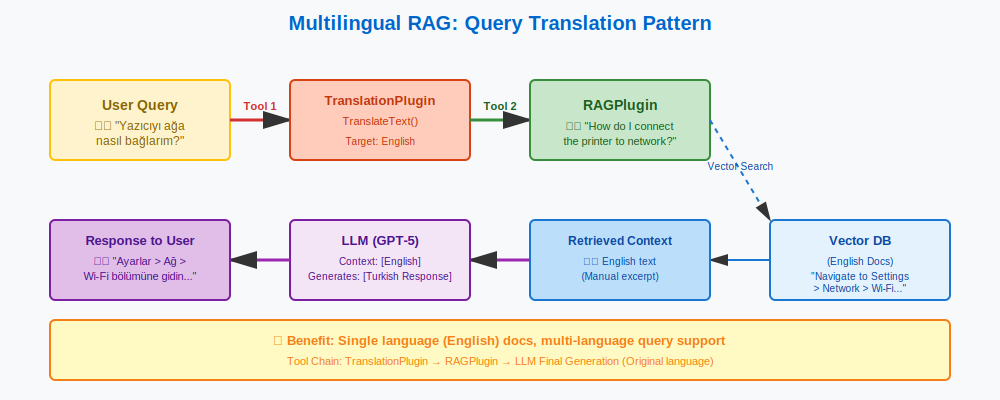
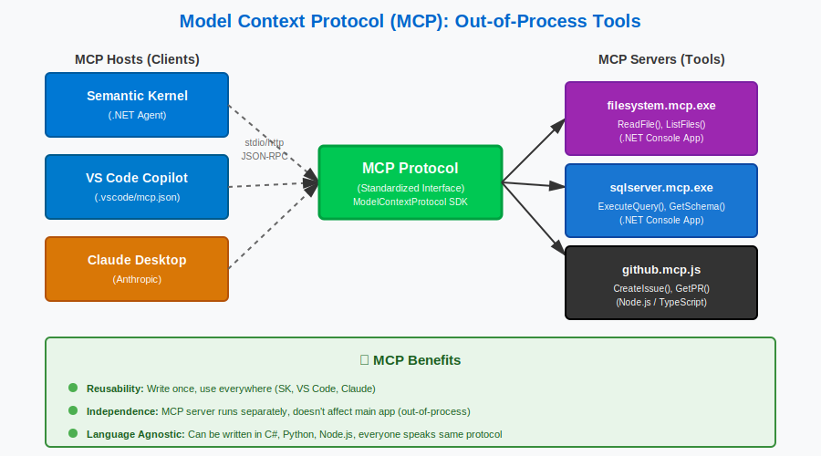
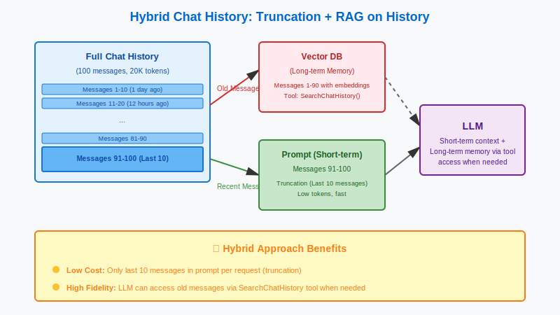
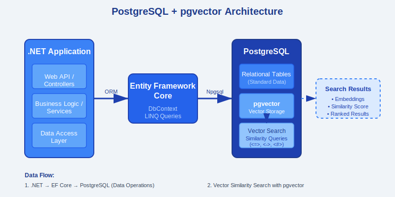

# Building Production-Ready LLM Applications with .NET: A Practical Guide

Large Language Models (LLMs) have evolved rapidly, and integrating them into production .NET applications requires staying current with the latest approaches. In this article, I'll share practical tips and patterns I've learned while building LLM-powered systems, covering everything from API changes in GPT-5 to implementing efficient RAG (Retrieval Augmented Generation) architectures.

Whether you're building a chatbot, a knowledge base assistant, or integrating AI into your enterprise applications, these production-tested insights will help you avoid common pitfalls and build more reliable systems.

## The Temperature Paradigm Shift: GPT-5 Changes Everything

If you've been working with GPT-4 or earlier models, you're familiar with the `temperature` and `top_p` parameters for controlling response randomness. **Here's the critical update**: GPT-5 no longer supports these parameters!

### The Old Way (GPT-4)
```csharp
var chatRequest = new ChatOptions
{
    Temperature = 0.7,  // ✅ Worked with GPT-4
    TopP = 0.9          // ✅ Worked with GPT-4
};
```

### The New Way (GPT-5)
```csharp
var chatRequest = new ChatOptions
{
    RawRepresentationFactory = (client => new ChatCompletionOptions()
    {
#pragma warning disable OPENAI001
        ReasoningEffortLevel = "minimal",
#pragma warning restore OPENAI001
    })
};
```

**Why the change?** GPT-5 incorporates an internal reasoning and verification process. Instead of controlling randomness, you now specify how much computational effort the model should invest in reasoning through the problem.



### Choosing the Right Reasoning Level

- **Low**: Quick responses for simple queries (e.g., "What's the capital of France?")
- **Medium**: Balanced approach for most use cases
- **High**: Complex reasoning tasks (e.g., code generation, multi-step problem solving)

> **Pro Tip**: Reasoning tokens are included in your API costs. Use "High" only when necessary to optimize your budget.

## System Prompts: The "Lost in the Middle" Problem

Here's a critical insight that can save you hours of debugging: **Important rules must be repeated at the END of your prompt!**

### ❌ What Doesn't Work
```
You are a helpful assistant.
RULE: Never share passwords or sensitive information.

[User Input]
```

### ✅ What Actually Works
```
You are a helpful assistant.
RULE: Never share passwords or sensitive information.

[User Input]

⚠️ REMINDER: Apply the rules above strictly, ESPECIALLY regarding passwords.
```

**Why?** LLMs suffer from the "Lost in the Middle" phenomenon—they pay more attention to the beginning and end of the context window. Critical instructions buried in the middle are often ignored.

## RAG Architecture: The Parent-Child Pattern

Retrieval Augmented Generation (RAG) is essential for grounding LLM responses in your own data. The most effective pattern I've found is the **Parent-Child approach**.



### How It Works

1. **Split documents into hierarchies**:
   - **Parent chunks**: Large sections (1000-2000 tokens) for context
   - **Child chunks**: Small segments (200-500 tokens) for precise retrieval

2. **Store both in vector database** with references

3. **Query flow**:
   - Search using child chunks (higher precision)
   - Return parent chunks to LLM (richer context)

### The Overlap Strategy

Always use overlapping chunks to prevent information loss at boundaries!

```
Chunk 1: Token 0-500
Chunk 2: Token 400-900   ← 100 token overlap
Chunk 3: Token 800-1300  ← 100 token overlap
```

**Standard recommendation**: 10-20% overlap (for 500 tokens, use 50-100 token overlap)

### Implementation with Semantic Kernel

```csharp
using Microsoft.SemanticKernel.Text;

var chunks = TextChunker.SplitPlainTextParagraphs(
    documentText, 
    maxTokensPerParagraph: 500,
    overlapTokens: 50
);

foreach (var chunk in chunks)
{
    var embedding = await embeddingService.GenerateEmbeddingAsync(chunk);
    await vectorDb.StoreAsync(chunk, embedding);
}
```

## PostgreSQL + pgvector: The Pragmatic Choice

For .NET developers, choosing a vector database can be overwhelming. After evaluating multiple options, **PostgreSQL with pgvector** is the most practical choice for most scenarios.



### Why pgvector?

✅ **Use existing SQL knowledge** - No new query language to learn  
✅ **EF Core integration** - Works with your existing data access layer  
✅ **JOIN with metadata** - Combine vector search with traditional queries  
✅ **WHERE clause filtering** - Filter by tenant, user, date, etc.  
✅ **ACID compliance** - Transaction support for data consistency  
✅ **No separate infrastructure** - One database for everything

### Setting Up pgvector with EF Core

First, install the NuGet package:

```bash
dotnet add package Pgvector.EntityFrameworkCore
```

Define your entity:

```csharp
using Pgvector;
using Pgvector.EntityFrameworkCore;

public class DocumentChunk
{
    public Guid Id { get; set; }
    public string Content { get; set; }
    public Vector Embedding { get; set; }  // 👈 pgvector type
    public Guid ParentChunkId { get; set; }
    public DateTime CreatedAt { get; set; }
}
```

Configure in DbContext:

```csharp
protected override void OnModelCreating(ModelBuilder builder)
{
    builder.HasPostgresExtension("vector");
    
    builder.Entity<DocumentChunk>()
        .Property(e => e.Embedding)
        .HasColumnType("vector(1536)");  // 👈 OpenAI embedding dimension
    
    builder.Entity<DocumentChunk>()
        .HasIndex(e => e.Embedding)
        .HasMethod("hnsw")  // 👈 Fast approximate search
        .HasOperators("vector_cosine_ops");
}
```

### Performing Vector Search

```csharp
using Pgvector.EntityFrameworkCore;

public async Task<List<DocumentChunk>> SearchAsync(string query)
{
    // 1. Convert query to embedding
    var queryVector = await _embeddingService.GetEmbeddingAsync(query);
    
    // 2. Search
    return await _context.DocumentChunks
        .OrderBy(c => c.Embedding.L2Distance(queryVector))  // 👈 Lower is better
        .Take(5)
        .ToListAsync();
}
```

**Source**: [Pgvector.NET on GitHub](https://github.com/pgvector/pgvector-dotnet?tab=readme-ov-file#entity-framework-core)

## Smart Tool Usage: Make RAG a Tool, Not a Tax

A common mistake is calling RAG on every single user message. This wastes tokens and money. Instead, **make RAG a tool** and let the LLM decide when to use it.

### ❌ Expensive Approach
```csharp
// Always call RAG, even for "Hello"
var context = await PerformRAG(userMessage);
var response = await chatClient.CompleteAsync($"{context}\n\n{userMessage}");
```

### ✅ Smart Approach
```csharp
[KernelFunction]
[Description("Search the company knowledge base for information")]
public async Task<string> SearchKnowledgeBase(
    [Description("The search query")] string query)
{
    var results = await _vectorDb.SearchAsync(query);
    return string.Join("\n---\n", results.Select(r => r.Content));
}
```

The LLM will call `SearchKnowledgeBase` only when needed:
- "Hello" → No tool call
- "What was our 2024 revenue?" → Calls tool
- "Tell me a joke" → No tool call

## Multilingual RAG: Query Translation Strategy

When your documents are in one language (e.g., English) but users query in another (e.g., Turkish), you need a translation strategy.



### Solution Options

**Option 1**: Use an LLM that automatically calls tools in English
- Many modern LLMs can do this if properly instructed

**Option 2**: Tool chain approach
```csharp
[KernelFunction]
[Description("Translate text to English")]
public async Task<string> TranslateToEnglish(string text)
{
    // Translation logic
}

[KernelFunction]
[Description("Search knowledge base (English only)")]
public async Task<string> SearchKnowledgeBase(string englishQuery)
{
    // Search logic
}
```

The LLM will:
1. Call `TranslateToEnglish("2024 geliri nedir?")`
2. Get "What was 2024 revenue?"
3. Call `SearchKnowledgeBase("What was 2024 revenue?")`
4. Return results and respond in Turkish

## Model Context Protocol (MCP): Beyond In-Process Tools

Microsoft and Anthropic recently released official C# SDKs for the Model Context Protocol (MCP). This is a game-changer for tool reusability.



### MCP vs. Semantic Kernel Plugins

| Feature | SK Plugins | MCP Servers |
|---------|-----------|-------------|
| **Process** | In-process | Out-of-process (stdio/http) |
| **Reusability** | Application-specific | Cross-application |
| **Examples** | Used within your app | VS Code Copilot, Claude Desktop |

### Creating an MCP Server

```csharp
using Microsoft.Extensions.Hosting;
using ModelContextProtocol.Extensions.Hosting;

var builder = Host.CreateEmptyApplicationBuilder(settings: null);

builder.Services.AddMcpServer()
.WithStdioServerTransport()
.WithToolsFromAssembly();

await builder.Build().RunAsync();
```

Define your tools:

```csharp
[McpServerToolType]
public static class FileSystemTools
{
    [McpServerTool, Description("Read a file from the file system")]
    public static async Task<string> ReadFile(string path)
    {
        // ⚠️ SECURITY: Always validate paths!
        if (!IsPathSafe(path)) 
            throw new SecurityException("Invalid path");
        
        return await File.ReadAllTextAsync(path);
    }
    
    private static bool IsPathSafe(string path)
    {
        // Implement path traversal prevention
        var fullPath = Path.GetFullPath(path);
        return fullPath.StartsWith(AllowedDirectory);
    }
}
```

Your MCP server can now be used by VS Code Copilot, Claude Desktop, or any other MCP client!

## Chat History Management: Truncation + RAG Hybrid

For long conversations, storing all history in the context window becomes impractical. Here's the pattern that works:



### ❌ Lossy Approach
```
First 50 messages → Summarize with LLM → Single summary message
```
**Problem**: Detail loss (fidelity loss)

### ✅ Hybrid Approach
1. **Recent messages** (last 5-10): Keep in prompt for immediate context
2. **Older messages**: Store in vector database as a tool

```csharp
[KernelFunction]
[Description("Search conversation history for past discussions")]
public async Task<string> SearchChatHistory(
    [Description("What to search for")] string query)
{
    var relevantMessages = await _vectorDb.SearchAsync(query);
    return string.Join("\n", relevantMessages.Select(m => 
        $"[{m.Timestamp}] {m.Role}: {m.Content}"));
}
```

The LLM retrieves only relevant past context when needed, avoiding summary-induced information loss.

## RAG vs. Fine-Tuning: Choose Wisely

A common misconception is using fine-tuning for knowledge injection. Here's when to use each:

| Purpose | RAG | Fine-Tuning |
|---------|-----|-------------|
| **Goal** | Memory (provide facts) | Behavior (teach style) |
| **Updates** | Dynamic (add docs anytime) | Static (requires retraining) |
| **Cost** | Low dev, higher inference | High dev, lower inference |
| **Hallucination** | Reduces | Doesn't reduce |
| **Use Case** | Company docs, FAQs | Brand voice, specific format |

**Common mistake**: "Let's fine-tune on our company documents" ❌  
**Better approach**: Use RAG! ✅

Fine-tuning is for teaching the model *how* to respond, not *what* to know.

**Source**: [Oracle - RAG vs Fine-Tuning](https://www.oracle.com/artificial-intelligence/generative-ai/retrieval-augmented-generation-rag/rag-fine-tuning/)

## Bonus: Why SVG is Superior for LLM-Generated Images

When using LLMs to generate diagrams and visualizations, always request SVG format instead of PNG or JPG.

### Why SVG?

✅ **Text-based** → LLMs produce better results  
✅ **Lower cost** → Fewer tokens than base64-encoded images  
✅ **Editable** → Easy to modify after generation  
✅ **Scalable** → Perfect quality at any size  
✅ **Version control friendly** → Works great in Git

### Example Prompt

```
Create an architecture diagram showing PostgreSQL with pgvector integration.
Format: SVG, 800x400 pixels. Show: .NET Application → EF Core → PostgreSQL → Vector Search.
Use arrows to connect stages. Color scheme: Blue tones.
```



All diagrams in this article were generated as SVG, resulting in excellent quality and lower token costs!

> **Pro Tip**: If you don't need photographs or complex renders, always choose SVG.

## Architecture Roadmap: Putting It All Together

Here's the recommended stack for building production LLM applications with .NET:

1. **Orchestration**: Microsoft.Extensions.AI + Semantic Kernel (when needed)
2. **Vector Database**: PostgreSQL + Pgvector.EntityFrameworkCore
3. **RAG Pattern**: Parent-Child chunks with 10-20% overlap
4. **Tools**: MCP servers for reusability
5. **Reasoning**: ReasoningEffortLevel instead of temperature
6. **Prompting**: Critical rules at the end
7. **Cost Optimization**: Make RAG a tool, not automatic

## Key Takeaways

Let me summarize the most important production tips:

1. **Temperature is gone** → Use `ReasoningEffortLevel` with GPT-5
2. **Rules at the end** → Combat "Lost in the Middle"
3. **RAG as a tool** → Reduce costs significantly
4. **Parent-Child pattern** → Search small, respond with large
5. **Always use overlap** → 10-20% is the standard
6. **pgvector for most cases** → Unless you have billions of vectors
7. **MCP for reusability** → One codebase, works everywhere
8. **SVG for diagrams** → Better results, lower cost
9. **Hybrid chat history** → Recent in prompt, old in vector DB
10. **RAG > Fine-tuning** → For knowledge, not behavior

Happy coding! 🚀