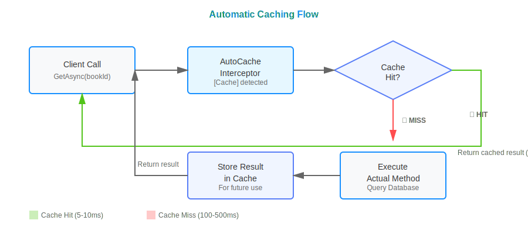
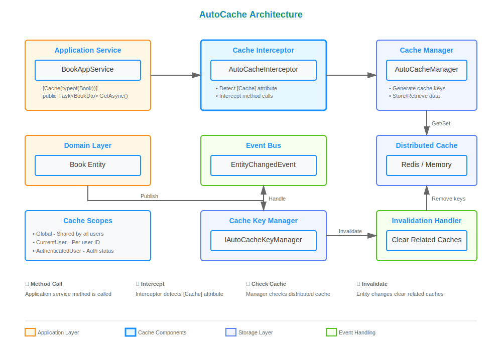
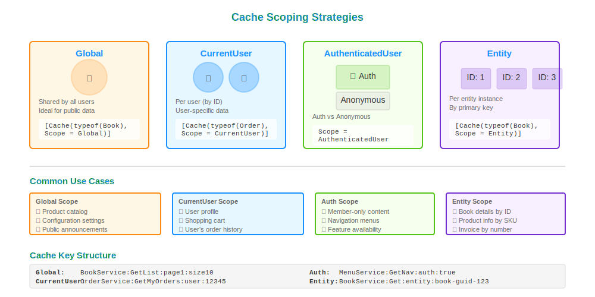
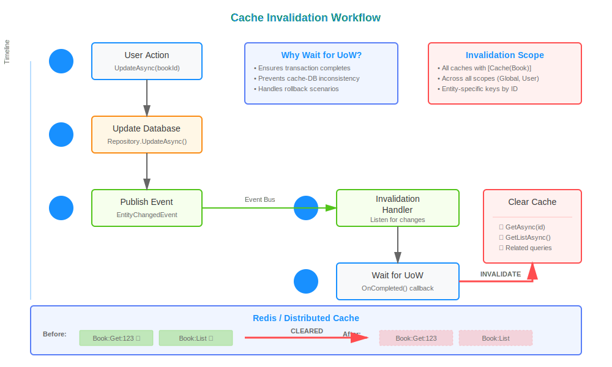

# Implement Automatic Method-Level Caching in ABP Framework

Caching is one of the most effective ways to improve application performance, but implementing it manually for every method can be tedious and error-prone. What if you could cache method results automatically with just an attribute? In this article, we'll explore how to build an automatic method-level caching system in ABP Framework that handles cache invalidation, supports multiple scopes, and integrates seamlessly with your existing application.

By the end of this guide, you'll understand how to implement attribute-based caching that automatically invalidates when entities change, supports user-specific and global caching scopes, and provides built-in metrics for monitoring cache performance.

> 💡 **Complete Implementation Available**: This article is based on a working demo project. You can find the complete implementation in the [AbpAutoCacheDemo repository](https://github.com/salihozkara/AbpAutoCacheDemo), with the core AutoCache library implementation available in [this commit](https://github.com/salihozkara/AbpAutoCacheDemo/commit/946df1fc07de6eddd26eb14013a09968cd59329b).

## What is Automatic Method-Level Caching?

Automatic method-level caching is a technique that intercepts method calls and caches their results without requiring manual cache management code. Instead of writing cache logic in every method, you simply decorate methods with attributes that define caching behavior.



The key benefits include:

- **Reduced Boilerplate:** No repetitive cache management code in your business logic
- **Consistent Caching Strategy:** Centralized cache configuration and behavior
- **Smart Invalidation:** Automatic cache clearing when related entities change
- **Multiple Scopes:** Support for global, user-specific, and entity-specific caching
- **Built-in Monitoring:** Track cache hits, misses, and performance metrics

## Architecture Overview

The automatic caching system consists of several key components working together:



**Core Components:**

1. **CacheAttribute:** The attribute you apply to methods to enable automatic caching
2. **AutoCacheInterceptor:** Intercepts method calls and handles cache operations
3. **AutoCacheManager:** Manages cache storage, retrieval, and key generation
4. **IAutoCacheKeyManager:** Handles cache key mapping and invalidation
5. **AutoCacheInvalidationHandler:** Listens to entity changes and clears related caches

This architecture leverages ABP's dynamic proxy system and event bus to provide seamless caching without modifying your business logic.

## Prerequisites

Before implementing automatic caching, ensure you have:

- ABP Framework 10.0 or later
## Implementation

> 📦 **Repository Structure**: The complete implementation is available in the [AbpAutoCacheDemo repository](https://github.com/salihozkara/AbpAutoCacheDemo). The AutoCache library is located in the `src/AutoCache` folder, making it easy to extract and reuse in your own projects.

### Step - 1: Create the AutoCache Module

First, let's create a separate module for our caching infrastructure. This makes it reusable across projects.

### Step - 1: Create the AutoCache Module

First, let's create a separate module for our caching infrastructure. This makes it reusable across projects.

Create `AutoCache.csproj`:

```xml
<Project Sdk="Microsoft.NET.Sdk">
    <PropertyGroup>
        <TargetFramework>net10.0</TargetFramework>
        <Nullable>enable</Nullable>
    </PropertyGroup>

    <ItemGroup>
        <PackageReference Include="Volo.Abp.Caching.StackExchangeRedis" Version="10.0.0" />
        <PackageReference Include="Volo.Abp.Core" Version="10.0.0" />
        <PackageReference Include="Volo.Abp.Ddd.Domain" Version="10.0.0" />
    </ItemGroup>
</Project>
```

Create the module class `AutoCacheModule.cs`:

```csharp
using Microsoft.Extensions.DependencyInjection;
using Volo.Abp.Caching.StackExchangeRedis;
using Volo.Abp.Domain;
using Volo.Abp.Modularity;

namespace AutoCache;

[DependsOn(typeof(AbpDddDomainModule), typeof(AbpCachingStackExchangeRedisModule))]
public class AutoCacheModule : AbpModule
{
    public override void PreConfigureServices(ServiceConfigurationContext context)
    {
        context.Services.OnRegistered(AutoCacheRegister.RegisterInterceptorIfNeeded); // 👈 Register interceptor
    }
}
```

This module automatically registers the cache interceptor for any class that uses the `CacheAttribute`.

### Step - 2: Define the Cache Attribute

The `CacheAttribute` is the core of our automatic caching system. It specifies which entities affect the cache and what scope to use.

Create `CacheAttribute.cs`:

```csharp
using System;
using Volo.Abp.Domain.Entities;

namespace AutoCache;

[AttributeUsage(AttributeTargets.Method)]
public class CacheAttribute : Attribute
{
    /// <summary>
    /// Entity types that affect this cache. When these entities change, the cache will be invalidated.
    /// </summary>
    public Type[] InvalidateOnEntities { get; set; }

    /// <summary>
    /// Scope of the cache (Global, CurrentUser, AuthenticatedUser, or Entity)
    /// </summary>
    public AutoCacheScope Scope { get; set; } = AutoCacheScope.Global;

    /// <summary>
    /// Absolute expiration time relative to now in milliseconds (0 = use default, -1 = disabled)
    /// </summary>
    public long AbsoluteExpirationRelativeToNow { get; set; }

    /// <summary>
    /// Sliding expiration time in milliseconds (0 = use default, -1 = disabled)
    /// </summary>
    public long SlidingExpiration { get; set; }

    public bool ConsiderUow { get; set; }

    public string AdditionalCacheKey { get; set; }

    public CacheAttribute(params Type[] invalidateOnEntities) // 👈 Specify entities that trigger cache invalidation
    {
        foreach (var entityType in invalidateOnEntities)
        {
            ArgumentNullException.ThrowIfNull(entityType);
            if (!typeof(IEntity).IsAssignableFrom(entityType))
            {
                throw new ArgumentException($"Type {entityType.FullName} must implement IEntity interface.");
            }
        }
        InvalidateOnEntities = invalidateOnEntities;
    }
}
```

**Key Properties:**

- **InvalidateOnEntities:** Array of entity types that, when modified, will clear this cache
- **Scope:** Determines cache visibility (Global, CurrentUser, AuthenticatedUser, Entity)
- **AbsoluteExpirationRelativeToNow / SlidingExpiration:** Control cache lifetime

### Step - 3: Define Cache Scopes

Cache scopes determine how cache entries are partitioned. Create `AutoCacheScope.cs`:

```csharp
using System;

namespace AutoCache;

[Flags]
public enum AutoCacheScope
{
    /// <summary>
    /// Cache is shared globally across all users
    /// </summary>
    Global,

    /// <summary>
    /// Cache is scoped to the current user (based on user ID)
    /// </summary>
    CurrentUser,

    /// <summary>
    /// Cache is scoped to authenticated vs unauthenticated users
    /// </summary>
    AuthenticatedUser,

    /// <summary>
    /// Cache is scoped to the primary key of the entity involved
    /// </summary>
    Entity
}
```



**When to Use Each Scope:**

- **Global:** For data that's the same for all users (e.g., configuration, public lists)
- **CurrentUser:** For user-specific data (e.g., user profile, user's orders)
- **AuthenticatedUser:** For data that differs between authenticated and anonymous users
- **Entity:** For data tied to a specific entity instance (e.g., book details by ID)

### Step - 4: Implement the Cache Interceptor

The interceptor is the heart of automatic caching. It intercepts method calls, checks the cache, and stores results. Create `AutoCacheInterceptor.cs`:

```csharp
using System;
using System.Collections.Concurrent;
using System.Linq;
using System.Reflection;
using System.Threading.Tasks;
using Microsoft.Extensions.Caching.Distributed;
using Microsoft.Extensions.Logging;
using Microsoft.Extensions.Options;
using Volo.Abp.DependencyInjection;
using Volo.Abp.DynamicProxy;

namespace AutoCache;

public class AutoCacheInterceptor : AbpInterceptor, ITransientDependency
{
    private readonly ILogger<AutoCacheInterceptor> _logger;
    private readonly AutoCacheOptions _options;
    private static readonly MethodInfo GetOrAddCacheAsyncMethod;
    private readonly AutoCacheManager _autoCacheManager;
    private static readonly ConcurrentDictionary<Type, MethodInfo> MethodCache = new();

    static AutoCacheInterceptor()
    {
        GetOrAddCacheAsyncMethod = typeof(AutoCacheInterceptor).GetMethod(
            nameof(GetOrAddCacheAsync),
            BindingFlags.NonPublic | BindingFlags.Instance
        )!;
    }

    public AutoCacheInterceptor(
        ILogger<AutoCacheInterceptor> logger,
        IOptions<AutoCacheOptions> options, 
        AutoCacheManager autoCacheManager)
    {
        _logger = logger;
        _autoCacheManager = autoCacheManager;
        _options = options.Value;
    }

    public override async Task InterceptAsync(IAbpMethodInvocation invocation)
    {
        // Check if caching is enabled and method has [Cache] attribute
        if(!_options.Enabled || 
           invocation.Method.GetCustomAttributes(typeof(CacheAttribute), true).FirstOrDefault() 
           is not CacheAttribute attribute)
        {
            await invocation.ProceedAsync(); // 👈 No caching, proceed normally
            return;
        }
        
        var proceeded = false;

        try
        {
            // Create generic method based on return type
            var genericMethod = MethodCache.GetOrAdd(invocation.Method.ReturnType, t =>
            {
                var isGenericTask = t.IsGenericType && t.GetGenericTypeDefinition() == typeof(Task<>);
                var resultType = isGenericTask ? t.GetGenericArguments()[0] : t;
                return GetOrAddCacheAsyncMethod.MakeGenericMethod(resultType);
            });
            
            // Execute cache logic
            (var result, proceeded) = await (Task<(object, bool)>)genericMethod.Invoke(this, [invocation, attribute])!;
            invocation.ReturnValue = result; // 👈 Set cached or fresh result
        }
        catch (Exception e)
        {
            _logger.LogError(e, "Error occurred while caching method {MethodName}", invocation.Method.Name);
            
            if(e is AutoCacheExceptionWrapper exceptionWrapper)
            {
                if (_options.ThrowOnError)
                {
                    throw exceptionWrapper.OriginalException;
                }
                
                _logger.LogWarning(
                    "Cache operation failed, falling back to method execution for {MethodName}",
                    invocation.Method.Name
                );
            }

            if (!proceeded && invocation.ReturnValue == null)
            {
                await invocation.ProceedAsync(); // 👈 Fallback to actual method execution
            }
        }
    }

    private async Task<(object?, bool)> GetOrAddCacheAsync<TResult>(
        IAbpMethodInvocation invocation, 
        CacheAttribute attribute)
    {
        var proceeded = false;
        var result = await _autoCacheManager.GetOrAddAsync(
            invocation.TargetObject, 
            Factory, 
            invocation.Arguments, 
            () => new DistributedCacheEntryOptions
            {
                AbsoluteExpirationRelativeToNow = GetExpiration(
                    attribute.AbsoluteExpirationRelativeToNow, 
                    _options.DefaultAbsoluteExpirationRelativeToNow),
                SlidingExpiration = GetExpiration(
                    attribute.SlidingExpiration, 
                    _options.DefaultSlidingExpiration)
            }, 
            attribute.InvalidateOnEntities, 
            attribute.Scope, 
            attribute.ConsiderUow, 
            attribute.AdditionalCacheKey, 
            invocation.Method.Name);
        
        return (result, proceeded);

        async Task<TResult> Factory()
        {
            await invocation.ProceedAsync(); // 👈 Execute actual method on cache miss
            proceeded = true;
            return (TResult)invocation.ReturnValue;
        }
    }
    
    private static TimeSpan? GetExpiration(long milliseconds, long defaultValue)
    {
        return milliseconds switch
        {
            0 => defaultValue > 0 ? TimeSpan.FromMilliseconds(defaultValue) : null,
            < 0 => null,
            _ => TimeSpan.FromMilliseconds(milliseconds)
        };
    }
}
```

The interceptor intelligently determines whether to serve cached data or execute the actual method.

### Step - 5: Implement the Cache Manager

The `AutoCacheManager` handles the actual cache operations. Create a simplified version:

```csharp
using System;
using System.Runtime.CompilerServices;
using System.Threading.Tasks;
using Microsoft.Extensions.Caching.Distributed;
using Microsoft.Extensions.Logging;
using Volo.Abp.DependencyInjection;
using Volo.Abp.DynamicProxy;
using Volo.Abp.Users;

namespace AutoCache;

public class AutoCacheManager : IScopedDependency
{
    private readonly IAutoCacheKeyManager _autoCacheKeyManager;
    private readonly ICurrentUser _currentUser;
    private readonly ILogger<AutoCacheManager> _logger;
    private readonly IAutoCacheMetrics _metrics;
    private readonly AutoCacheOptions _options;

    public AutoCacheManager(
        IAutoCacheKeyManager autoCacheKeyManager, 
        ICurrentUser currentUser,
        ILogger<AutoCacheManager> logger,
        IAutoCacheMetrics metrics,
        IOptions<AutoCacheOptions> options)
    {
        _autoCacheKeyManager = autoCacheKeyManager;
        _currentUser = currentUser;
        _logger = logger;
        _metrics = metrics;
        _options = options.Value;
    }

    public async Task<TResult> GetOrAddAsync<TResult>(
        object? caller,
        Func<Task<TResult>> func,
        object?[]? parameters = null,
        Func<DistributedCacheEntryOptions>? optionsFactory = null,
        Type[]? invalidateOnEntities = null,
        AutoCacheScope scope = AutoCacheScope.Global,
        bool considerUow = false,
        string? additionalCacheKey = null,
        [CallerMemberName] string methodName = "")
    {
        if (!_options.Enabled)
        {
            return await func(); // 👈 Caching disabled, execute directly
        }
        
        var callerType = caller != null ? ProxyHelper.GetUnProxiedType(caller) : GetType();
        parameters ??= [];
        
        // Generate unique cache key based on method, parameters, and scope
        var cacheKey = GenerateCacheKey<TResult>(
            callerType.Name, 
            additionalCacheKey, 
            methodName, 
            parameters, 
            scope);
        
        var (cachedResult, exception, wasHit) = await GetOrAddCacheAsync(
            cacheKey,
            func,
            optionsFactory,
            considerUow
        );
        
        // Record metrics
        if (wasHit)
        {
            _metrics.RecordHit(cacheKey);
        }
        else
        {
            _metrics.RecordMiss(cacheKey);
        }
        
        if (exception != null)
        {
            _metrics.RecordError(cacheKey, exception);
            
            if (_options.ThrowOnError)
            {
                throw exception;
            }
        }
        
        return cachedResult;
    }

    private string GenerateCacheKey<TResult>(
        string callerTypeName,
        string? additionalCacheKey,
        string methodName,
        object?[] parameters,
        AutoCacheScope scope)
    {
        var keyBuilder = new StringBuilder();
        keyBuilder.Append($"{callerTypeName}:{methodName}");
        
        // Add parameters to key
        foreach (var param in parameters)
        {
            keyBuilder.Append($":{param}");
        }
        
        // Add scope-specific segments
        if (scope.HasFlag(AutoCacheScope.CurrentUser) && _currentUser.Id.HasValue)
        {
            keyBuilder.Append($":user:{_currentUser.Id}"); // 👈 User-specific cache key
        }
        
        if (scope.HasFlag(AutoCacheScope.AuthenticatedUser))
        {
            keyBuilder.Append($":auth:{_currentUser.IsAuthenticated}");
        }
        
        if (!string.IsNullOrEmpty(additionalCacheKey))
        {
            keyBuilder.Append($":{additionalCacheKey}");
        }
        
        return keyBuilder.ToString();
    }

    // Additional methods for cache retrieval and storage...
}
```

The manager generates unique cache keys based on method signatures, parameters, and scope settings.

### Step - 6: Implement Cache Invalidation

When entities change, related caches must be cleared. Create `AutoCacheInvalidationHandler.cs`:

```csharp
using System;
using System.Threading.Tasks;
using Microsoft.Extensions.Logging;
using Volo.Abp.Domain.Entities;
using Volo.Abp.Domain.Entities.Events;
using Volo.Abp.EventBus;
using Volo.Abp.Uow;

namespace AutoCache;

public class AutoCacheInvalidationHandler<TEntity> : 
    ILocalEventHandler<EntityChangedEventData<TEntity>> 
    where TEntity : class, IEntity
{
    private readonly IAutoCacheKeyManager _autoCacheKeyManager;
    private readonly ILogger<AutoCacheInvalidationHandler<TEntity>> _logger;
    private readonly IUnitOfWorkManager _unitOfWorkManager;
    
    public AutoCacheInvalidationHandler(
        IAutoCacheKeyManager autoCacheKeyManager, 
        ILogger<AutoCacheInvalidationHandler<TEntity>> logger,
        IUnitOfWorkManager unitOfWorkManager)
    {
        _autoCacheKeyManager = autoCacheKeyManager;
        _logger = logger;
        _unitOfWorkManager = unitOfWorkManager;
    }

    public async Task HandleEventAsync(EntityChangedEventData<TEntity> eventData)
    {
        try
        {
            var entityType = typeof(TEntity);
            var context = new RemoveCacheKeyContext 
            { 
                Keys = eventData.Entity.GetKeys()! 
            };
            
            // Clear cache after unit of work completes
            if(_unitOfWorkManager.Current != null)
            {
                _unitOfWorkManager.Current.OnCompleted(async () =>
                {
                    await _autoCacheKeyManager.RemoveCacheAndCacheKeys(entityType, context); // 👈 Invalidate cache
                });
            }
            else
            {
                await _autoCacheKeyManager.RemoveCacheAndCacheKeys(entityType, context);
            }
        }
        catch (Exception e)
        {
            _logger.LogError(
                e, 
                "Error occurred while clearing cache for entity type {EntityType}", 
                typeof(TEntity).FullName
            );
        }
    }
}
```



This handler listens to entity change events and automatically clears related caches. The invalidation happens after the unit of work completes to ensure data consistency.

### Step - 7: Configure AutoCache in Your Application

Add the `AutoCacheModule` to your application module dependencies:

```csharp
[DependsOn(
    typeof(AutoCacheModule), // 👈 Add AutoCache module
    typeof(AbpCachingStackExchangeRedisModule),
    // ... other modules
)]
public class YourApplicationModule : AbpModule
{
    public override void ConfigureServices(ServiceConfigurationContext context)
    {
        Configure<AutoCacheOptions>(options =>
        {
            options.Enabled = true; // 👈 Enable caching
            options.DefaultAbsoluteExpirationRelativeToNow = 3600000; // 1 hour
            options.DefaultSlidingExpiration = 600000; // 10 minutes
            options.ThrowOnError = false; // Fallback to method execution on cache errors
        });
        
        // Configure Redis (if using distributed cache)
        Configure<AbpDistributedCacheOptions>(options =>
        {
            options.KeyPrefix = "YourApp:";
        });
    }
}
```

### Step - 8: Use Automatic Caching in Application Services

Now comes the easy part - using automatic caching! Simply add the `[Cache]` attribute to your methods:

```csharp
using AutoCache;

[Authorize(AutoCacheDemoPermissions.Books.Default)]
public class BookAppService : ApplicationService, IBookAppService
{
    private readonly IRepository<Book, Guid> _repository;
    private readonly AutoCacheManager _autoCacheManager;

    public BookAppService(IRepository<Book, Guid> repository, AutoCacheManager autoCacheManager)
    {
        _repository = repository;
        _autoCacheManager = autoCacheManager;
    }

    // Cache this method, invalidate when Book entity changes
    [Cache(typeof(Book), Scope = AutoCacheScope.Global)]
    public virtual async Task<BookDto> GetAsync(Guid id)
    {
        // You can also use AutoCacheManager directly for nested caching
        var book = await _autoCacheManager.GetOrAddAsync(
            this, 
            async () => await _repository.GetAsync(id), 
            [id], // 👈 Method parameters
            invalidateOnEntities: [typeof(Book)], 
            scope: AutoCacheScope.Entity);
            
        return ObjectMapper.Map<Book, BookDto>(book!);
    }

    // Cache book list, invalidate when any Book changes
    [Cache(typeof(Book))]
    public virtual async Task<PagedResultDto<BookDto>> GetListAsync(PagedAndSortedResultRequestDto input)
    {
        var queryable = await _repository.GetQueryableAsync();
        var query = queryable
            .OrderBy(input.Sorting.IsNullOrWhiteSpace() ? "Name" : input.Sorting)
            .Skip(input.SkipCount)
            .Take(input.MaxResultCount);

        var books = await AsyncExecuter.ToListAsync(query);
        var totalCount = await AsyncExecuter.CountAsync(queryable);

        return new PagedResultDto<BookDto>(
            totalCount,
            ObjectMapper.Map<List<Book>, List<BookDto>>(books)
        );
    }

    // No caching on write operations
    [Authorize(AutoCacheDemoPermissions.Books.Create)]
    public async Task<BookDto> CreateAsync(CreateUpdateBookDto input)
    {
        var book = ObjectMapper.Map<CreateUpdateBookDto, Book>(input);
        await _repository.InsertAsync(book); // 👈 This will trigger cache invalidation
        return ObjectMapper.Map<Book, BookDto>(book);
    }
}
```

**What Happens Here:**

1. When `GetAsync` is called, the interceptor checks the cache
2. On cache miss, the actual method executes and the result is cached
3. When `CreateAsync` inserts a `Book`, the invalidation handler clears all caches related to `Book`
4. Next call to `GetAsync` will fetch fresh data

## Advanced Features

### User-Specific Caching

For user-specific data, use `AutoCacheScope.CurrentUser`:

```csharp
[Cache(typeof(Order), Scope = AutoCacheScope.CurrentUser)]
public virtual async Task<List<OrderDto>> GetMyOrdersAsync()
{
    var orders = await _orderRepository.GetListAsync(x => x.UserId == CurrentUser.Id);
    return ObjectMapper.Map<List<Order>, List<OrderDto>>(orders);
}
```

Each user gets their own cache entry, automatically invalidated when their orders change.

### Custom Cache Keys

For fine-grained control, add custom cache key segments:

```csharp
[Cache(
    typeof(Product), 
    Scope = AutoCacheScope.Global,
    AdditionalCacheKey = "featured"
)]
public virtual async Task<List<ProductDto>> GetFeaturedProductsAsync()
{
    // Only featured products are cached separately
    return await GetProductsByCategoryAsync("Featured");
}
```

### Performance Metrics

Monitor cache performance using `IAutoCacheMetrics`:

```csharp
public class CacheMonitoringService : ITransientDependency
{
    private readonly IAutoCacheMetrics _metrics;

    public CacheMonitoringService(IAutoCacheMetrics metrics)
    {
        _metrics = metrics;
    }

    public AutoCacheStatistics GetStatistics()
    {
        return _metrics.GetStatistics(); // 👈 Get hit rate, miss count, error count
    }
}
```

## Testing the Application

### 1. Run the Application

```bash
abp new BookStore -u mvc -d ef
cd BookStore
dotnet run --project src/BookStore.Web
```

### 2. Test Cache Behavior

Create a simple test to verify caching:

```csharp
[Fact]
public async Task Should_Cache_Book_Results()
{
    // First call - cache miss
    var book1 = await _bookAppService.GetAsync(testBookId);
    
    // Second call - cache hit (should be faster)
    var book2 = await _bookAppService.GetAsync(testBookId);
    
    book1.Name.ShouldBe(book2.Name);
}

[Fact]
public async Task Should_Invalidate_Cache_On_Update()
{
    // Cache the book
    var book1 = await _bookAppService.GetAsync(testBookId);
    
    // Update the book
    await _bookAppService.UpdateAsync(testBookId, new CreateUpdateBookDto 
    { 
        Name = "Updated Name" 
    });
    
    // Fetch again - should get updated data (cache was invalidated)
    var book2 = await _bookAppService.GetAsync(testBookId);
    
    book2.Name.ShouldBe("Updated Name");
}
```

### 3. Monitor Cache Performance

Check your application logs for cache metrics:

```
[INF] Cache Hit: BookAppService:GetAsync:book-id-123 (Response Time: 5ms)
[INF] Cache Miss: BookAppService:GetListAsync (Response Time: 156ms)
[INF] Cache Invalidation: Book entity changed, cleared 3 cache entries
```

## Key Takeaways

✅ **Automatic caching reduces boilerplate code** - Just add `[Cache]` attribute to methods instead of manual cache management

✅ **Smart invalidation keeps data fresh** - Entity changes automatically clear related caches without manual intervention

✅ **Multiple scoping options** - Support for global, user-specific, authenticated, and entity-level caching strategies

✅ **Built-in fallback handling** - Gracefully falls back to method execution if caching fails

✅ **Performance monitoring** - Track cache hits, misses, and errors for optimization

## Conclusion

Automatic method-level caching dramatically simplifies performance optimization in ABP Framework applications. By using attributes and interceptors, you can add sophisticated caching behavior without cluttering your business logic with cache management code.

The system we've built provides intelligent cache invalidation, multiple scoping strategies, and built-in monitoring - all while maintaining clean, readable code. Whether you're building a small application or an enterprise system, this approach scales elegantly and integrates seamlessly with ABP's architecture.

Ready to implement this in your project? The complete working implementation is available in the [AbpAutoCacheDemo repository](https://github.com/salihozkara/AbpAutoCacheDemo). You can clone the repository, explore the code, and even extract the `src/AutoCache` folder to use it as a standalone library in your own ABP applications. The [main implementation commit](https://github.com/salihozkara/AbpAutoCacheDemo/commit/946df1fc07de6eddd26eb14013a09968cd59329b) shows all the components working together, including interceptor registration, cache key management, and automatic invalidation handlers.r you're building a small application or an enterprise system, this approach scales elegantly and integrates seamlessly with ABP's architecture.

Ready to implement this in your project? Check out the complete working example in the repository linked below, and start improving your application's performance today!

### See Also

- [ABP Caching Documentation](https://abp.io/docs/latest/framework/fundamentals/caching)
- [Interceptors in ABP](https://abp.io/docs/latest/framework/infrastructure/interceptors)
- [Event Bus Documentation](https://abp.io/docs/latest/framework/infrastructure/event-bus)
- [Sample Project on GitHub](https://github.com/salihozkara/AbpAutoCacheDemo)

---

## References

- [ABP Framework Documentation](https://docs.abp.io)
- [Redis Distributed Caching](https://redis.io/docs/)
- [Aspect-Oriented Programming Patterns](https://en.wikipedia.org/wiki/Aspect-oriented_programming)
