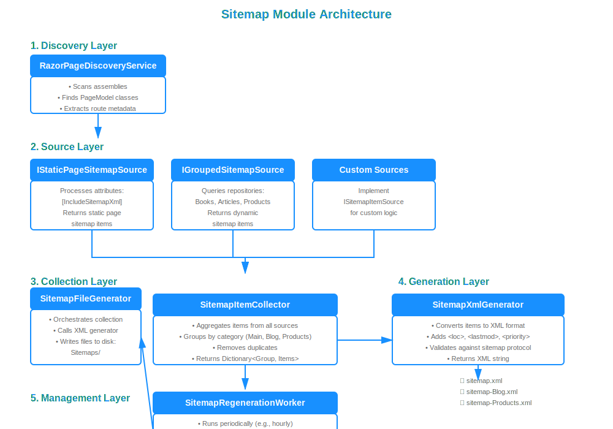

# Building Dynamic XML Sitemaps with ABP Framework

Search Engine Optimization (SEO) is crucial for any web application that wants to be discovered by users. One of the most fundamental SEO practices is providing a comprehensive XML sitemap that helps search engines crawl and index your website efficiently. In this article, we'll use a reusable ABP module that automatically generates dynamic XML sitemaps for both static Razor Pages and dynamic content from your database.

By the end of this tutorial, you'll have a production-ready sitemap solution that discovers your pages automatically, includes dynamic content like blog posts or products, and regenerates sitemaps in the background without impacting performance.

## What is an XML Sitemap?

An XML sitemap is a file that lists all important pages of your website in a structured format that search engines can easily read. It acts as a roadmap for crawlers like Google, Bing, and others, telling them which pages exist, when they were last updated, and how they relate to each other.

For modern web applications with dynamic content, manually maintaining sitemap files quickly becomes impractical. A dynamic sitemap solution that automatically discovers and updates URLs is essential for:

- **Large content sites** with frequently changing blog posts, articles, or products
- **Multi-tenant applications** where each tenant may have different content
- **Enterprise applications** with complex page hierarchies
- **E-commerce platforms** with thousands of product pages

## Why Build a Custom Sitemap Module?

While there are general-purpose sitemap libraries available, building a custom module for ABP Framework provides several advantages:

✅ **Deep ABP Integration**: Leverages ABP's dependency injection, background workers, and module system
✅ **Automatic Discovery**: Uses ASP.NET Core's Razor Page infrastructure to automatically find pages
✅ **Type-Safe Configuration**: Strongly-typed attributes and options for configuration
✅ **Multi-Group Support**: Organize sitemaps by logical groups (main, blog, products, etc.)
✅ **Background Generation**: Non-blocking sitemap regeneration using ABP's background worker system
✅ **Repository Integration**: Direct integration with ABP repositories for database entities

## Project Architecture Overview

Before using the module, let's understand its architecture:



The sitemap module consists of several key components:

1. **Discovery Layer**: Discovers Razor Pages and their metadata using reflection
2. **Source Layer**: Defines contracts for providing sitemap items (static pages and dynamic content)
3. **Collection Layer**: Collects items from all registered sources
4. **Generation Layer**: Transforms collected items into XML format
5. **Management Layer**: Orchestrates file generation and background workers

## Installation

To get started, clone the demo repository which includes the sitemap module:

```bash
git clone https://github.com/salihozkara/AbpSitemapDemo
cd AbpSitemapDemo
```

The repository contains the sitemap module in the `Modules/abp.sitemap/` directory. To use it in your own project, add a project reference:

```xml
<ProjectReference Include="../Modules/abp.sitemap/Abp.Sitemap.Web/Abp.Sitemap.Web.csproj" />
```

## Module Configuration

After installing the package, add the module to your ABP application's module class:

```csharp
using Abp.Sitemap.Web;

[DependsOn(
    typeof(SitemapWebModule), // 👈 Add sitemap module
    // ... other dependencies
)]
public class YourProjectWebModule : AbpModule
{
    public override void ConfigureServices(ServiceConfigurationContext context)
    {
        // Configure sitemap options
        Configure<SitemapOptions>(options =>
        {
            options.BaseUrl = "https://yourdomain.com"; // 👈 Your website URL
            options.FolderPath = "Sitemaps"; // 👈 Where XML files are stored
            options.WorkerPeriod = 3600000; // 👈 Regenerate every hour (in milliseconds)
        });
    }
}
```

> **Note:** In ABP applications, BaseUrl can be resolved from AppUrlOptions to stay consistent with environment configuration.

That's it! The module is now integrated and will automatically:
- Discover your Razor Pages
- Generate sitemap XML files on application startup
- Regenerate sitemaps in the background every hour

## Usage Examples

Let's explore practical examples of using the sitemap module. You can see complete working examples in the [AbpSitemapDemo repository](https://github.com/salihozkara/AbpSitemapDemo).

### Example 1: Mark Static Pages

The simplest way to include pages in your sitemap is using attributes:

```csharp
using Abp.Sitemap.Web.Sitemap.Sources.Page.Attributes;

namespace YourProject.Pages;

[IncludeSitemapXml] // 👈 Include in default "Main" group
public class IndexModel : PageModel
{
    public void OnGet()
    {
        // Your page logic
    }
}

[IncludeSitemapXml(Group = "Help")]
public class FaqModel : PageModel
{
    public void OnGet()
    {
        // Your page logic
    }
}
```

These pages will be automatically discovered and included in the sitemap XML files.

### Example 2: Add Dynamic Content from Database

For dynamic content like blog posts, products, or articles, create a custom sitemap source. Here's a complete example using a Book entity:

```csharp
using Abp.Sitemap.Web.Sitemap.Core;
using Abp.Sitemap.Web.Sitemap.Sources.Group;
using Volo.Abp.DependencyInjection;

namespace YourProject.Sitemaps;

public class BookSitemapSource : GroupedSitemapItemSource<Book>, ITransientDependency
{
    public BookSitemapSource(
        IReadOnlyRepository<Book> repository,
        IAsyncQueryableExecuter executer)
        : base(repository, executer, group: "Books") // 👈 Creates sitemap-Books.xml
    {
        Filter = x => x.IsPublished; // 👈 Only published books
    }

    protected override Expression<Func<Book, SitemapItem>> Selector =>
        book => new SitemapItem(
            book.Id.ToString(), // 👈 Unique identifier
            $"/Books/Detail/{book.Id}", // 👈 URL pattern matching your route
            book.LastModificationTime ?? book.CreationTime // 👈 Last modified date
        )
        {
            ChangeFrequency = "weekly",
            Priority = 0.7
        };
}
```

Key points:
- Inherits from `GroupedSitemapItemSource<TEntity>`
- Specifies the entity type (`Book`)
- Defines a group name ("Books") which creates `sitemap-Books.xml`
- Uses `Filter` to include only published books
- Maps entity properties to sitemap URLs using `Selector`
- Automatically registered via `ITransientDependency`

### Example 3: Category-Based Dynamic Content

For content with categories, you can build more complex URL patterns:

```csharp
using Abp.Sitemap.Web.Sitemap.Core;
using Abp.Sitemap.Web.Sitemap.Sources.Group;

namespace YourProject.Sitemaps;

public class ArticleSitemapSource : GroupedSitemapItemSource<Article>, ITransientDependency
{
    public ArticleSitemapSource(
        IReadOnlyRepository<Article> repository,
        IAsyncQueryableExecuter executer)
        : base(repository, executer, "Articles")
    {
        // Multiple filter conditions
        Filter = x => x.IsPublished && 
                     !x.IsDeleted && 
                     x.PublishDate <= DateTime.Now;
    }

    protected override Expression<Func<Article, SitemapItem>> Selector =>
        article => new SitemapItem(
            article.Id.ToString(),
            $"/blog/{article.Category.Slug}/{article.Slug}", // 👈 Category-based URL
            article.LastModificationTime ?? article.CreationTime
        );
}
```

This example demonstrates:
- Multiple filter conditions for complex business logic
- Building URLs with category slugs

## Testing Your Sitemaps

After configuring the module, test your sitemap generation:

### 1. Run Your Application

```bash
dotnet run
```

The sitemaps are automatically generated on application startup.

### 2. Check Generated Files

Navigate to `{WebProject}/Sitemaps/` directory (at the root of your web project):

```
{WebProject}
└── Sitemaps/
    ├── sitemap.xml           # Main group (static pages)
    ├── sitemap-Books.xml     # Books from database
    ├── sitemap-Articles.xml  # Articles from database
    └── sitemap-Help.xml      # Help pages
```

### 3. Verify XML Content

Open `sitemap-Books.xml` and verify the structure:

```xml
<?xml version="1.0" encoding="UTF-8"?>
<urlset xmlns="http://www.sitemaps.org/schemas/sitemap/0.9">
  <url>
    <loc>https://yourdomain.com/Books/Detail/3a071e39-12c9-48d7-8c1e-3b4f5c6d7e8f</loc>
    <lastmod>2025-12-13</lastmod>
  </url>
  <url>
    <loc>https://yourdomain.com/Books/Detail/7b8c9d0e-1f2a-3b4c-5d6e-7f8g9h0i1j2k</loc>
    <lastmod>2025-12-10</lastmod>
  </url>
</urlset>
```

### 4. Test in Browser

Visit the sitemap URLs directly (the module serves them from the root path):
- Main sitemap: `https://localhost:5001/sitemap.xml`
- Books sitemap: `https://localhost:5001/sitemap-Books.xml`

> **Note:** The sitemaps are stored in `{WebProject}/Sitemaps/` directory and served directly from the root URL.

## Advanced Configuration

### Custom Regeneration Schedule

Control when sitemaps are regenerated using cron expressions:

```csharp
public override void ConfigureServices(ServiceConfigurationContext context)
{
    Configure<SitemapOptions>(options =>
    {
        options.BaseUrl = "https://yourdomain.com";
        options.WorkerCronExpression = "0 0 2 * * ?"; // 👈 Every day at 2 AM
        // Or use period in milliseconds:
        // options.WorkerPeriod = 7200000; // 2 hours
    });
}
```

### Environment-Specific Configuration

Use different settings for development and production:

```csharp
public override void ConfigureServices(ServiceConfigurationContext context)
{
    var configuration = context.Services.GetConfiguration();
    var hostingEnvironment = context.Services.GetHostingEnvironment();

    Configure<SitemapOptions>(options =>
    {
        if (hostingEnvironment.IsDevelopment())
        {
            options.BaseUrl = "https://localhost:5001";
            options.WorkerPeriod = 300000; // 5 minutes for testing
        }
        else
        {
            options.BaseUrl = configuration["App:SelfUrl"]!;
            options.WorkerPeriod = 3600000; // 1 hour in production
        }
        
        options.FolderPath = "Sitemaps";
    });
}
```

### Manual Sitemap Generation

Trigger sitemap generation manually (useful for admin panels):

```csharp
using Abp.Sitemap.Web.Sitemap.Management;

public class SitemapManagementService : ITransientDependency
{
    private readonly SitemapFileGenerator _generator;

    public SitemapManagementService(SitemapFileGenerator generator)
    {
        _generator = generator;
    }

    [Authorize("Admin")]
    public async Task RegenerateSitemapsAsync()
    {
        await _generator.GenerateAsync(); // 👈 Manual regeneration
    }
}
```

## Real-World Use Cases

Here are practical scenarios where the sitemap module excels:

### E-Commerce Platform
```csharp
// Products grouped by category
public class ProductSitemapSource : GroupedSitemapItemSource<Product>
{
    // Automatically includes all active products with stock
}

// Separate sitemap for categories
public class CategorySitemapSource : GroupedSitemapItemSource<Category>
{
    // All browsable categories
}

// Brand pages
public class BrandSitemapSource : GroupedSitemapItemSource<Brand>
{
    // All active brands
}
```

Result: `sitemap-Products.xml`, `sitemap-Categories.xml`, `sitemap-Brands.xml`

### Content Management System
```csharp
// Blog posts by date
public class BlogPostSitemapSource : GroupedSitemapItemSource<BlogPost>
{
    // Filter by published date, priority based on view count
}

// Static CMS pages
[IncludeSitemapXml]
public class AboutUsModel : PageModel { }
```

## Best Practices

### 1. Group Related Content
Organize your sitemaps logically:
```csharp
// ✅ Good: Logical grouping
"Products", "Categories", "Brands", "Blog", "Help"

// ❌ Bad: Everything in one group
"Main" // Contains 50,000 mixed URLs
```

### 2. Use Filters Wisely
```csharp
// ✅ Good: Only published, non-deleted content
Filter = x => x.IsPublished && 
             !x.IsDeleted && 
             x.PublishDate <= DateTime.Now

// ❌ Bad: Including draft content
Filter = x => true // Everything included
```

### 3. Keep URLs Clean
```csharp
// ✅ Good: SEO-friendly URLs
$"/products/{product.Slug}"
$"/blog/{year}/{month}/{article.Slug}"

// ❌ Bad: Technical IDs exposed
$"/product-detail?id={product.Id}"
```

## Troubleshooting

### Sitemap Not Generated
**Problem:** No XML files in `{WebProject}/Sitemaps/`

**Solutions:**
1. Check module is added to dependencies
2. Verify `SitemapOptions.BaseUrl` is configured
3. Check application logs for errors
4. Ensure the web project directory has write permissions

### Pages Not Appearing
**Problem:** Some pages missing from sitemap

**Solutions:**
1. Verify `[IncludeSitemapXml]` attribute is present
2. Check namespace imports: `using Abp.Sitemap.Web.Sitemap.Sources.Page.Attributes;`
3. Ensure PageModel classes are public
4. Check filter conditions in custom sources

### Background Worker Not Running
**Problem:** Sitemaps not regenerating automatically

**Solutions:**
1. Check `SitemapOptions.WorkerPeriod` is set
2. Verify background workers are enabled in ABP configuration
3. Check application logs for worker errors

## Performance Considerations

### Caching Strategy
Consider adding caching for frequently accessed sitemaps:

```csharp
public class CachedSitemapFileGenerator : ITransientDependency
{
    private readonly SitemapFileGenerator _generator;
    private readonly IDistributedCache _cache;

    public async Task<string> GetOrGenerateAsync(string group)
    {
        var cacheKey = $"Sitemap:{group}";
        var cached = await _cache.GetStringAsync(cacheKey);
        
        if (cached != null)
            return cached;
        
        await _generator.GenerateAsync();
        // Read and cache...
    }
}
```

## Conclusion

The ABP Sitemap module provides a production-ready solution for dynamic sitemap generation in ABP Framework applications. By leveraging ABP's architecture—dependency injection, repository pattern, and background workers—the module automatically discovers pages, includes dynamic content, and regenerates sitemaps without manual intervention.

Key benefits:
✅ **Zero Configuration** for basic scenarios
✅ **Type-Safe** attribute-based configuration
✅ **Extensible** for complex business logic
✅ **Performance** optimized with background processing
✅ **SEO-Friendly** following XML sitemap standards

Whether you're building a blog, e-commerce platform, or enterprise application, this module provides a solid foundation for search engine optimization.

## Additional Resources

### Documentation
- [ABP Framework Documentation](https://abp.io/docs/latest/)
- [ABP Background Workers](https://abp.io/docs/latest/framework/infrastructure/background-workers)
- [ABP Repository Pattern](https://abp.io/docs/latest/framework/architecture/domain-driven-design/repositories)
- [ABP Dependency Injection](https://abp.io/docs/latest/framework/fundamentals/dependency-injection)

### Source Code
- [Complete Working Demo](https://github.com/salihozkara/AbpSitemapDemo) - Full implementation with examples
  - [BookSitemapSource](https://github.com/salihozkara/AbpSitemapDemo/blob/master/AbpSitemapDemo/Pages/Books/Index.cshtml.cs#L23) - Entity-based source example
  - [Index.cshtml](https://github.com/salihozkara/AbpSitemapDemo/blob/master/AbpSitemapDemo/Pages/Index.cshtml#L9) - Page attribute usage
