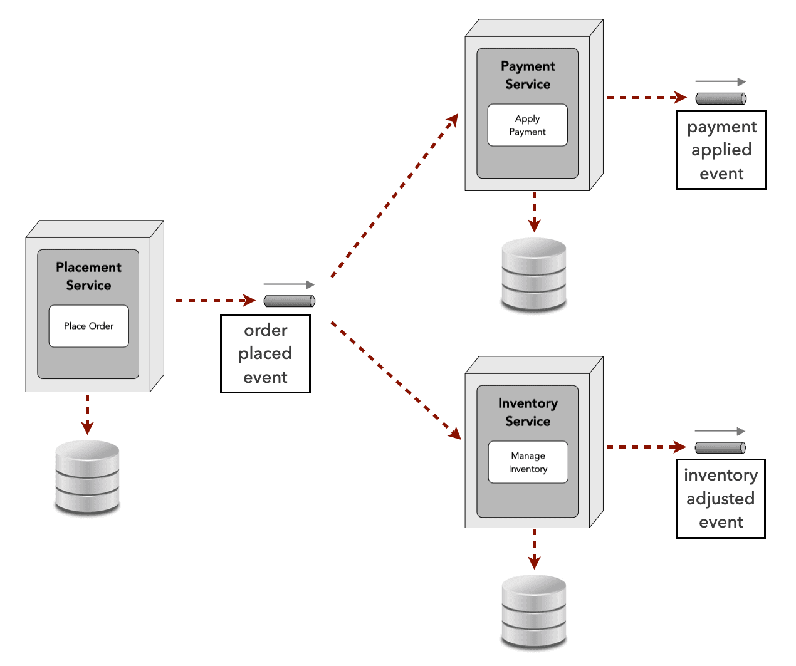
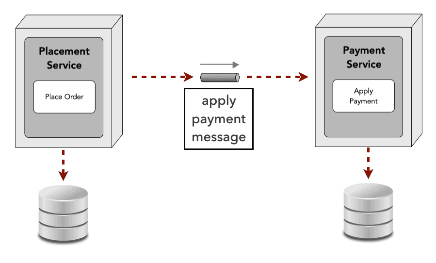

# Async Chain of Persistence Pattern: Designing for Failure in Event-Driven Systems

## Introduction
Messages can get lost while being processed when you use asynchronous messaging or event handling. 
The Async Chain of Persistence Pattern makes sure that no message is ever lost from the system by making sure that the message is always stored at every step of the workflow.

## The Fundamental Principle of Pattern
The Async Chain of Persistence Pattern guarantees that no message is ever lost by ensuring that the message is always persistently stored at every step of the workflow. This is where the pattern gets its name.  A message cannot be removed from its previous location until it is confirmed to be persistently stored in the subsequent stages of the chain. 

It is commonly used in event-driven systems and message-driven systems.

### Event-Driven versus Message-Driven Systems
To understand the pattern, it's important to know the differences between events and messages.

#### The Core Difference

**Event:** Says "something happened", describes the past. Example: `OrderPlaced`, `PaymentCompleted`

**Message:** Says "do this", commands for the future. Example: `CreateOrder`, `SendEmail`

| Property | Event | Message |
|----------|-------|---------|
| **Coupling** | Loose - no one knows who's listening | Tighter - there's a specific receiver |
| **Publishing** | Pub/Sub - 0-N services listen | Point-to-Point - usually 1 service |
| **Tense** | Past tense, immutable | Present/future tense |
| **Error Handling** | If one consumer fails, others continue | If not processed, system breaks |


### Relationship with Async Chain of Persistence

**In event-driven systems:** Each service receives the event → persists it → publishes a new event



**In message-driven systems:** At each step, the message is kept safe on queue + disk

In both systems, the goal is the same: no message should be lost!



---

## When Do Messages Get Lost?
There are 3 main scenarios for message loss:

### 1. While Processing a Message (Receiving a Message)
While processing a message in a reply, by default, there is an automatic acknowledgment and subsequent deletion of a message that is in a queue. But in cases where there is a fatal or unrecoverable error in the message processing operation or a service instance crashes, this message gets lost.

### 2. Message Broker Crashes
In the majority of message brokers, the default option for the message persistence state is set to nonpersisting. In other words, the message will be held in the memory of the message broker without any persistence. It has been used for the purpose of obtaining rapid responses and improved throughput. However, in the event of failure of the message broker process, the nonpersistent message will be lost permanently.

### 3. Event Chaining
In event-driven systems, an event is published as a derived message after an operation is done by a service. Message loss in two ways is possible in this scenario:
1. **Risk of Asynchronous Send:** The publish operation is often carried out using the asynchronous send feature. When a fatal error takes place prior to the receipt of acknowledgment of the message publish operation by the publish services, it becomes difficult to determine if the message has been successfully transmitted to the message broker.
2. **Transaction Coordination:** In case an error is detected after the commit of the database but before the derived event is published, the derived event might be lost.

## Implementing the Pattern: 4 Critical Steps
Four critical steps are required to implement the Async Chain of Persistence Pattern:

### 1. Message Persistence 
The initial step to ensure that there are no lost messages is to specify the messages as PERSISTENT: When the message broker receives the message, it is saved on disk.

```javascript
var delivery_mode = PERSISTENT
var producer = create_producer(delivery_mode)

// All sent messages are persisted on the message broker
producer.send_message(APPLY_PAYMENT)

// Alternatively
var delivery_mode = PERSISTENT
var producer = create_producer()
producer.send_message(APPLY_PAYMENT, delivery_mode)
```
With this approach, even if the message broker crashes, all messages will still be there when it comes back up.

### 2. Client Acknowledgement Mode
Instead, client-acknowledgement mode needs to be employed. When a message is received in this mode, that message will be retained in the queue until a proper acknowledgment from the processing service has been made. Instead of "auto acknowledge" mode, "client-acknowledgement" mode

Client acknowledgement mode ensures that the message is not lost while processing by the service. When a fatal error is detected during message processing, the service exits without sending an acknowledgement message and thus results in a message redispatched.

**Important Note:** The message has to be acknowledged while the message processing operation is completed so that a repeat message will not be processed.

### 3. Synchronous Send
The synchronous send must be preferred over the asynchronous send.

Although it takes longer to send via synchronous send, since it's a blocking call, it ensures that the message broker received and persisted the message on disk.

```javascript
// Blocking call to publish the derived event
var ack = publish_event(PAYMENT_APPLIED)
if (ack not_successful) {
   retry_or_persist(PAYMENT_APPLIED)
}
```
With this approach, the risk of message loss during event chaining is eliminated.

### 4. Last Participant Support
This is the most complex step of the Async Chain of Persistence pattern. It determines when the message should be acknowledged.

#### For Message-Driven Systems:
```javascript
var message = receive_message()
process_message(message)
database.commit()
message.acknowledge()
```
Recommended order: **commit first, ack last.** Otherwise, if the database operation fails, the message will be lost because it has already been removed from the queue.

#### For Event-Driven Systems
In event-driven systems, there are two distinct parties involved: one that acknowledges an event and another that publishes the event that’s been derived. The party that publishes the event that’s been derived should be treated as “last participant.”
```javascript
var event = receive_event()
process_event(event)
database.commit()
message.acknowledge()

var ack = publish_event(PAYMENT_APPLIED)
if (ack not_successful) {
   retry_or_persist(PAYMENT_APPLIED)
}
```
In this sequence, the original event is acknowledged after it is completed. If publishing the derived event fails, it can be retried or persisted for later delivery.

---

## Trade-offs

### Advantages

**Preventing Message Loss:**
The major benefit of this pattern is that it doesn't let a message get lost while messages are under processing. This issue, being a serious concern in asynchronous systems, is ruled out due to the pattern.

### Disadvantages

#### 1. Possible Duplicate Messages
Enabling the client-acknowledgement mode can result in the processing of the same message multiple times. If the service instance fails after the database commit but before the message could be acknowledged, the message will be repeated and duplicates can be processed.

**Solution:** In order to determine whether the arriving messages are previously processed or not, the message IDs can be logged and traced back. This also has the drawback of requiring one extra read operation per message in the system.

#### 2. Performance and Throughput
It has also been noted that the time duration in which the persistent message takes to be sent from the message broker could be **up to four times longer** than in the nonpersistent message transmission.

Persisted messages also affect performance in terms of sending and reading the message. It is also common for message brokers to maintain message data in their memory for efficient reading, but there is no assurance that messages will always be resident in memory, depending on memory size, among other factors.

#### 3. Impact of Synchronous Send
Because a synchronous send makes a blocking call until a confirmation is received, there is no other work that can be accomplished before a confirmation is received from the broker for a synchronous send. A persisted message makes this even more apparent.

#### 4. Overall Scalability
This is because, upon receipt, the message broker has to spend more time persisting messages to disk, thus negatively affecting scalability. Persistent messages always give lower total throughput, which can limit scalability under high usage loads and high message volumes.

---

## Conclusion

The Async Chain of Persistence Pattern provides a powerful solution for preventing message loss. Although it has negative effects on performance, throughput, and scalability, these trade-offs are generally acceptable in systems where data loss is critical.

Before implementing the pattern, carefully analyze your system requirements:

- **How critical is message loss?**
- **What are the performance and throughput requirements?**
- **How should the system behave in case of duplicate processing?**

The answers to these questions will help you determine whether the Async Chain of Persistence Pattern is suitable for your system.

## Sample Project

To see an example project where this pattern is implemented, you can check out the repository:

🔗 **[GitHub Repository](https://github.com/fahrigedik/SoftwareArchitecturePatterns)**
