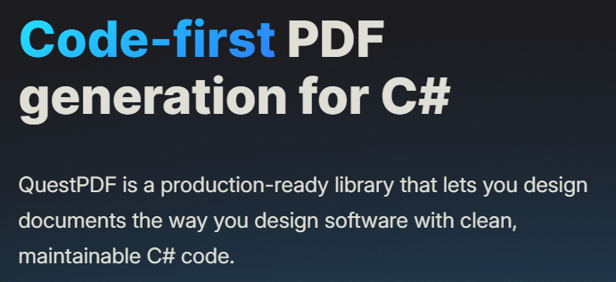

# Which Open-Source PDF Libraries Are Recently Popular ? A Data-Driven Look At PDF Topic

So you're looking for a PDF library in .NET, right? Here's the thing - just because something has a million downloads doesn't mean it's what you should use *today*. I'm looking at **recent download momentum** (how many people are actually using it NOW via NuGet) and **GitHub activity** (are they still maintaining this thing or did they abandon it?).

I pulled data from the last ~90 days for the main players in the .NET PDF space. Here's what's actually happening:

## Popularity Comparison of  .NET PDF Libraries (*ordered by score*)

| Library | GitHub Stars | Avg Daily NuGet Downloads | Total NuGet Downloads | **Popularity Score** |
|---------|---------------|-----------------------------|----------------------------|---------------------|
| **[Microsoft.Playwright](https://github.com/microsoft/playwright-dotnet)** | [2.9k](https://github.com/microsoft/playwright-dotnet) | [23k](https://www.nuget.org/packages/Microsoft.Playwright) | 39M | **71/100** |
| **[QuestPDF](https://github.com/QuestPDF/QuestPDF)** | [13.7k](https://github.com/QuestPDF/QuestPDF) | [8.2k](https://www.nuget.org/packages/QuestPDF) | 15M | **54/100** |
| **[PDFsharp](https://github.com/empira/PDFsharp)** | [862](https://github.com/empira/PDFsharp) | [9k](https://www.nuget.org/packages/PdfSharp) | 47M | **48/100** |
| **[iText](https://github.com/itext/itext-dotnet)** | [1.9k](https://github.com/itext/itext-dotnet) | [17.2k](https://www.nuget.org/packages/itext) | 16M | **44/100** |
| **[PuppeteerSharp](https://github.com/hardkoded/puppeteer-sharp)** | [3.8k](https://github.com/hardkoded/puppeteer-sharp) | [8.7k](https://www.nuget.org/packages/PuppeteerSharp) | 26M | **40/100** |

**How I calculated the score:** I weighted GitHub Stars (30%), Daily Downloads (40% - because that's what matters NOW), and Total Downloads (30% - for historical context). Everything normalized to 0-100 before weighting. Higher = better momentum overall.

## The Breakdown - What You Actually Need to Know

### [PDFsharp](https://docs.pdfsharp.net/)

**NuGet:** [PdfSharp](https://www.nuget.org/packages/PdfSharp) | **GitHub:** [empira/PDFsharp](https://github.com/empira/PDFsharp)

**What it does:** Code-first PDF stuff - drawing, manipulating, merging, that kind of thing. Not for HTML/browser rendering though, so don't try to convert your React app to PDF with this.

**What's the vibe?** **Stable, but kinda old school.** It's got the biggest total download count (47M!) but only pulling ~9k/day now. They updated it 2 weeks ago (Jan 6) so it's alive, and it supports .NET 8-10 which is nice. The GitHub stars (862) are pretty low compared to the shiny new kids, but honestly? It's been around forever and people still use it. It's the reliable old workhorse.

**Pick this if:**
- You need to build PDFs from scratch with code (not HTML)
- You want to draw graphics, manipulate existing PDFs, merge files
- You don't want browser engines anywhere near your project

---

### [iText](https://itextpdf.com/)

**NuGet:** [itext](https://www.nuget.org/packages/itext/) | **GitHub:** [itext/itext-dotnet](https://github.com/itext/itext-dotnet)

**What it does:** The enterprise beast. Digital signatures, PDF compliance (PDF/A, PDF/UA), forms, all that fancy stuff. Can do HTML-to-PDF too if you need it.

**What's the vibe?** **Actually doing pretty well!** ~17.2k downloads/day (highest for code-first libs), updated literally yesterday (Jan 18). They're moving fast. 1.9k stars isn't huge but the community seems active. The catch? This is the enterprise option - check the licensing before you commit if you're doing commercial work.

**Pick this if:**
- You need digital signatures, PDF compliance, or advanced form stuff
- Your company is cool with licensing fees (or you're doing open source)
- You need serious PDF manipulation features
- You want HTML-to-PDF AND code-based generation in one package

---

### [Microsoft.Playwright](https://playwright.dev/dotnet/)

**NuGet:** [Microsoft.Playwright](https://www.nuget.org/packages/Microsoft.Playwright) | **GitHub:** [microsoft/playwright-dotnet](https://github.com/microsoft/playwright-dotnet)

**What it does:** Browser automation that can turn HTML/CSS/JS into PDFs. Uses real browser engines (Chromium, WebKit, Firefox) so your PDFs look exactly like they would in a browser.

**What's the vibe?** **Killing it.** ~23k downloads/day (highest in this whole list!). It's Microsoft-backed so you know they're not gonna abandon it anytime soon. Last commit was December 3rd but honestly that's fine, they're actively maintaining. 2.9k stars and climbing. If you need to turn web pages into PDFs, this is probably your best bet right now.

**Pick this if:**
- You need to convert HTML/CSS/JS to PDF and want it to look EXACTLY like the browser
- You're working with SPAs, dynamic content, or web templates
- You also need browser automation/testing (bonus!)
- Layout accuracy is critical (forms, dashboards, etc.)

---

### [PuppeteerSharp](https://www.puppeteersharp.com/)

**NuGet:** [PuppeteerSharp](https://www.nuget.org/packages/PuppeteerSharp) | **GitHub:** [hardkoded/puppeteer-sharp](https://github.com/hardkoded/puppeteer-sharp)

**What it does:** Basically Playwright's older sibling. Uses headless Chromium to turn HTML into PDFs. Same idea, different API.

**What's the vibe?** **Stable but losing ground.** Got updated last week (Jan 12) so it's maintained, but ~8.7k/day is way less than Playwright's ~23k. 3.8k stars is decent though. It works fine, but Playwright is eating its lunch. Still, if you know Puppeteer already or only need Chromium, this might be fine.

**Pick this if:**
- You already know Puppeteer from Node.js and want the same vibe in .NET
- You only need Chromium (don't care about Firefox/WebKit)
- You have existing Puppeteer code you're porting

---

### [QuestPDF](https://github.com/QuestPDF/QuestPDF)

**NuGet:** [QuestPDF](https://www.nuget.org/packages/QuestPDF) | **GitHub:** [QuestPDF/QuestPDF](https://github.com/QuestPDF/QuestPDF)

**What it does:** Build PDFs with fluent C# APIs. Think of it like building a UI layout, but for PDFs. No HTML needed - it's all code, all .NET.

**What's the vibe?** **The community favorite.** 13.7k stars (most by far!), updated yesterday (Jan 18). ~8.2k downloads/day isn't the highest but the community is clearly excited about it. Modern API, active dev, people seem to actually enjoy using it. If you're building reports/invoices from code and want something that feels modern, this is it.

**Pick this if:**
- You want to build PDFs with code (not HTML) and you like fluent APIs
- You're generating reports, invoices, structured documents
- You want zero browser dependencies
- You care about type safety and maintainable code
- You want something that feels modern and well-designed

## Who's Winning Right Now?

Here's what the numbers are telling us:

### Code-First Libraries (Building PDFs with Code)

**[QuestPDF](https://github.com/QuestPDF/QuestPDF)** - Score: 54/100
The people's choice. Most GitHub stars (13.7k), updated yesterday, community loves it. Downloads aren't the highest but the engagement is real. This is what people are excited about.

**[iText](https://github.com/itext/itext-dotnet)** - Score: 44/100  
Actually pulling the most daily downloads (~17.2k/day) for code-first libs, also updated yesterday. The enterprise crowd is still using this heavily. Just watch that licensing.

**[PDFsharp](https://github.com/empira/PDFsharp)** - Score: 48/100
The old reliable. 47M total downloads but only ~9k/day now. It works, it's stable, but it's not where the momentum is. Still a solid choice if you need something battle-tested.

### HTML/Browser-Based Libraries (Turning Web Pages into PDFs)

**[Microsoft.Playwright](https://github.com/microsoft/playwright-dotnet)** - Score: 71/100
Winner winner. ~23k downloads/day (highest overall), Microsoft backing, actively maintained. If you need HTML-to-PDF, this is probably the move.

**[PuppeteerSharp](https://github.com/hardkoded/puppeteer-sharp)** - Score: 40/100
Still kicking around at ~8.7k/day but Playwright is clearly the future. Updated last week so it's not dead, just... less popular.

## TL;DR - What Should You Actually Use?

**Building PDFs from code (not HTML):**
- **QuestPDF** - If you want something modern and the community is raving about it (13.7k stars!)
- **iText** - If you need enterprise features and can handle the licensing
- **PDFsharp** - If you want the battle-tested option that's been around forever

**Converting HTML/web pages to PDF:**
- **Playwright** - Just use this. It's winning right now (~23k/day), Microsoft-backed, actively maintained. Game over.
- **PuppeteerSharp** - Only if you really need Chromium-only or you're migrating from Node.js Puppeteer

**Bottom line:** For HTML-to-PDF, Playwright is dominating. For code-first, QuestPDF has the hype but iText has the downloads. Choose your fighter.

---

*Numbers from GitHub and NuGet as of January 19, 2026. Daily downloads are from the last 90 days.*

