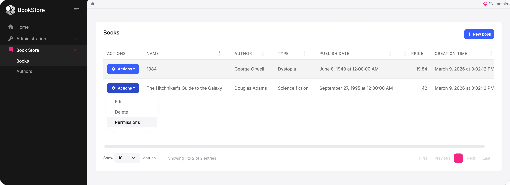
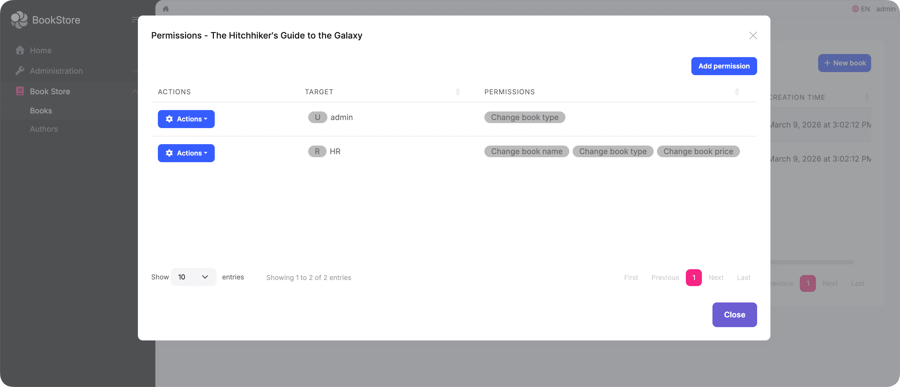
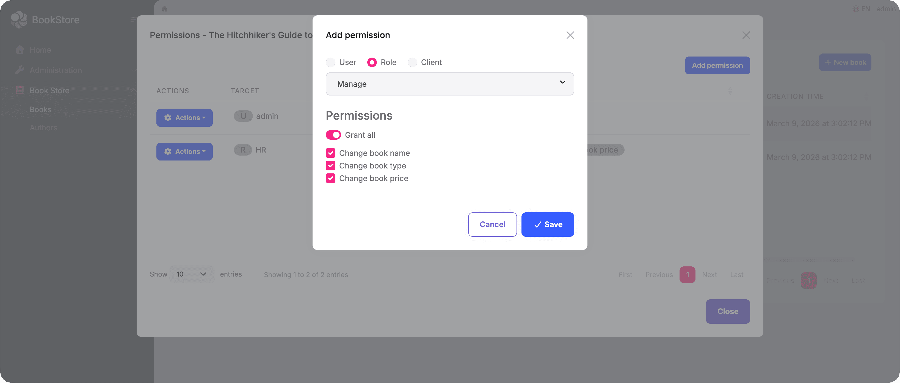
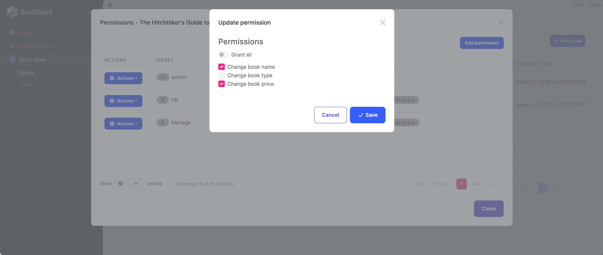
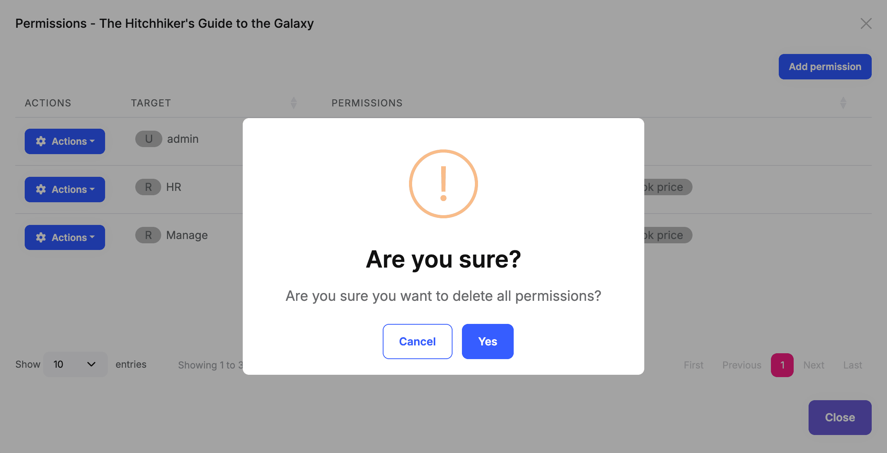

# Resource-Based Authorization in ABP Framework

ABP has a built-in permission system that supports role-based access control (RBAC). You define permissions, assign them to roles, and assign roles to users — once a user logs in, they automatically have the corresponding access. This covers the vast majority of real-world scenarios and is simple, straightforward, and easy to maintain.

However, there is one class of requirements it cannot handle: **different access rights for different instances of the same resource type**.

Take a bookstore application as an example. You define a `Books.Edit` permission and assign it to an editor role, so every editor can modify every book. But reality is often more nuanced:

- A specific book should only be editable by its assigned editor
- Certain books are only visible to specific users
- Different users have different levels of access to the same book

Standard permissions cannot address this, because their granularity is the *permission type*, not a *specific record*. The traditional approach requires designing your own database tables, writing query logic, and building a management UI from scratch — all of which is costly.

ABP Framework now ships with **Resource-Based Authorization** to solve exactly this problem. The core idea is to bind permissions to specific resource instances rather than just resource types. For example, you can grant a user permission to edit the price of *1984* specifically, while they have no access to any other book.

More importantly, the entire permission management workflow is handled through a built-in UI dialog — **no custom code needed for the management side**.

## How It Works

Each resource instance (e.g. a book) can have its own permission management dialog. Users who hold the `ManagePermissions` permission can open it and grant or revoke access for users, roles, or OAuth clients — all from the UI.

A **Permissions** action appears in each book's action menu:



Clicking it opens the resource permission management dialog for that specific book. You can see who currently has access and click **Add permission** to grant more:



The **Add permission** dialog lets you select a user, role, or OAuth client, then choose which permissions to grant:



After saving, the new entry appears in the list immediately.

Each entry in the list also supports **Edit** and **Delete** actions. Clicking **Edit** opens the update dialog where you can adjust the granted permissions:



Clicking **Delete** shows a confirmation prompt — confirming removes all permissions for that user, role, or OAuth client on this book:



## Setting It Up

To get this working, you need to define your resource permissions and wire up the dialog.

### Defining Resource Permissions

```csharp
public static class BookStorePermissions
{
    public const string GroupName = "BookStore";

    public static class Books
    {
        public const string Default = GroupName + ".Books";
        public const string ManagePermissions = Default + ".ManagePermissions";

        public static class Resources
        {
            public const string Name = "Acme.BookStore.Books.Book";
            public const string View = Name + ".View";
            public const string Edit = Name + ".Edit";
            public const string Delete = Name + ".Delete";
        }
    }
}
```

```csharp
public override void Define(IPermissionDefinitionContext context)
{
    var group = context.AddGroup(BookStorePermissions.GroupName);

    var bookPermission = group.AddPermission(BookStorePermissions.Books.Default);

    // Users with this permission can open the resource permission dialog
    bookPermission.AddChild(BookStorePermissions.Books.ManagePermissions);

    context.AddResourcePermission(
        name: BookStorePermissions.Books.Resources.View,
        resourceName: BookStorePermissions.Books.Resources.Name,
        managementPermissionName: BookStorePermissions.Books.ManagePermissions
    );

    context.AddResourcePermission(
        name: BookStorePermissions.Books.Resources.Edit,
        resourceName: BookStorePermissions.Books.Resources.Name,
        managementPermissionName: BookStorePermissions.Books.ManagePermissions
    );

    context.AddResourcePermission(
        name: BookStorePermissions.Books.Resources.Delete,
        resourceName: BookStorePermissions.Books.Resources.Name,
        managementPermissionName: BookStorePermissions.Books.ManagePermissions
    );
}
```

The `managementPermissionName` acts as a gate: only users who hold `ManagePermissions` will see the resource permission dialog for a book.

### Wiring Up the Dialog (MVC)

Add the required script to your page and open the dialog using `abp.ModalManager`:

```html
@section scripts
{
    <abp-script src="/Pages/Books/Index.js"/>
    <abp-script src="/Pages/AbpPermissionManagement/resource-permission-management-modal.js" />
}
```

```javascript
var _permissionsModal = new abp.ModalManager({
    viewUrl: abp.appPath + 'AbpPermissionManagement/ResourcePermissionManagementModal',
    modalClass: 'ResourcePermissionManagement'
});

function openPermissionsModal(bookId, bookName) {
    _permissionsModal.open({
        resourceName: 'Acme.BookStore.Books.Book',
        resourceKey: bookId,
        resourceDisplayName: bookName
    });
}
```

> For Blazor and Angular applications, ABP provides the equivalent `ResourcePermissionManagementModal` component and `ResourcePermissionManagementComponent`. See the [Permission Management Module](https://abp.io/docs/latest/modules/permission-management) documentation for details.

## Checking Permissions in Code

The UI manages the permission assignments; the code enforces them at runtime. In your application service, use `AuthorizationService.CheckAsync` to verify that the current user holds a specific permission on a given resource instance.

All ABP entities implement `IKeyedObject`, which the framework uses to extract the resource key automatically — so you can pass the entity object directly without building the key manually:

```csharp
public virtual async Task<BookDto> GetAsync(Guid id)
{
    var book = await _bookRepository.GetAsync(id);

    // Throws AbpAuthorizationException if the current user has no View permission on this book
    await AuthorizationService.CheckAsync(book, BookStorePermissions.Books.Resources.View);

    return ObjectMapper.Map<Book, BookDto>(book);
}

public virtual async Task<BookDto> UpdateAsync(Guid id, UpdateBookDto input)
{
    var book = await _bookRepository.GetAsync(id);

    await AuthorizationService.CheckAsync(book, BookStorePermissions.Books.Resources.Edit);

    book.Name = input.Name;
    await _bookRepository.UpdateAsync(book);

    return ObjectMapper.Map<Book, BookDto>(book);
}
```

If you want to check a permission without throwing an exception — for example, to conditionally show or hide a button — use `IsGrantedAsync` instead, which returns a `bool`:

```csharp
var canEdit = await AuthorizationService.IsGrantedAsync(book, BookStorePermissions.Books.Resources.Edit);
```

## Don't Forget to Clean Up

Every resource permission grant is stored as a record in the database. When a book is deleted, those records are not removed automatically — orphaned permission data accumulates over time.

Make sure to clean up resource permissions whenever a resource is deleted:

```csharp
public virtual async Task DeleteAsync(Guid id)
{
    await _bookRepository.DeleteAsync(id);

    // Clean up all resource permissions for this book
    await _resourcePermissionManager.DeleteAsync(
        resourceName: BookStorePermissions.Books.Resources.Name,
        resourceKey: id.ToString()
    );
}
```

## Summary

Resource-Based Authorization fills the gap between "everyone can do this" and "only specific users can do this on specific resources." In practice, most of the work comes down to two things:

- Define resource permissions and wire up the built-in UI dialog so administrators can assign access through the interface
- Call `AuthorizationService.CheckAsync` in your application services to enforce those permissions at runtime

Storing permission grants, rendering the dialog, searching for users, roles, and OAuth clients — ABP handles all of that for you.

## References

- [Resource-Based Authorization](https://abp.io/docs/latest/framework/fundamentals/authorization/resource-based-authorization)
- [Authorization](https://abp.io/docs/latest/framework/fundamentals/authorization)
- [Permission Management Module](https://abp.io/docs/latest/modules/permission-management)
