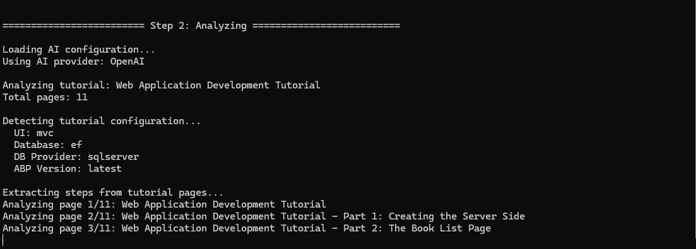
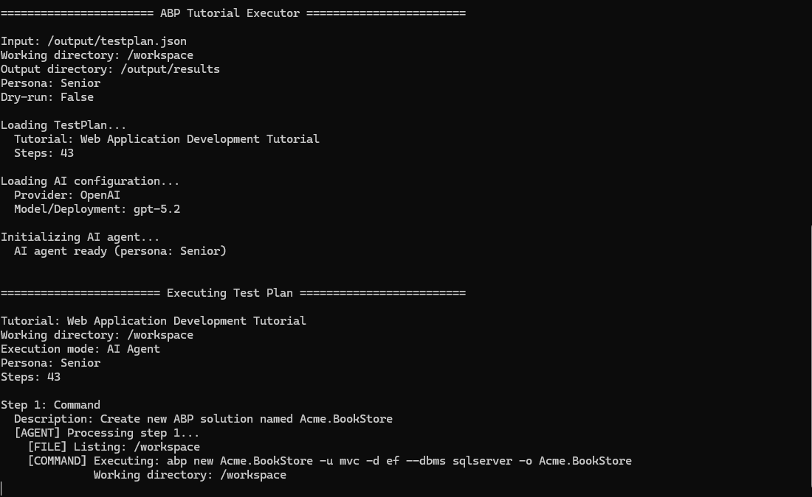

# Automatically Validate Your Documentation: How We Built an AI Tutorial Validator

> If you're in a hurry and want to quickly check the repository, you can find the source code of the AI Tutorial Validator here 👉 [github.com/abpframework/ai-tutorial-validator](https://github.com/abpframework/ai-tutorial-validator)

Writing a tutorial is difficult. Keeping technical documentation accurate over time is even harder.
If you maintain developer documentation, you probably know the problem: a tutorial that worked a few months ago can silently break after a framework update, dependency change, or a small missing line in a code snippet.
New developers follow the guide, encounter an error, and quickly lose trust in the documentation.
To solve this problem, we built the tutorial validator — an open-source AI-powered tutorial validator that automatically verifies whether a software tutorial actually works from start to finish.
Instead of manually reviewing documentation, the tutorial validator behaves like a real developer following your guide step by step.
It reads instructions, runs commands, writes files, executes the application, and verifies expected results.
We initially created it to automatically validate ABP Framework tutorials, then released it as an open-source tool so anyone can use it to test their own documentation.

## The Problem: Broken Tutorials in Technical Documentation

Many documentation issues are difficult to catch during normal reviews.
Common problems include:

- A command assumes a file already exists

- A code snippet misses a namespace or import

- A tutorial step relies on hidden context

- An endpoint is expected to respond but fails

- A dependency version changed and breaks the project

Traditional proofreading tools only check grammar or wording.
**The tutorial validator focuses on execution correctness.**
It treats tutorials like testable workflows, ensuring that every step works exactly as written.

## How the Tutorial Validator Works?

The tutorial validator validates tutorials using a three-stage pipeline:

1. **Analyst**: Scrapes tutorial pages and converts instructions into a structured test plan
2. **Executor**: Follows the plan step by step in a clean environment
3. **Reporter**: Produces a clear result summary and optional notifications

It identifies commands, code edits, HTTP requests, and expected outcomes.
The key idea is simple: if a developer needs to do it, the validator does it too.
That includes running terminal commands, editing files, checking HTTP responses, and validating build outcomes.

## Why Automated Tutorial Validation Matters?

The tutorial validator is designed for practical documentation quality, not just technical experimentation.

- **Catches real-world breakages early** before readers report them
- **Creates repeatable validation** instead of one-off manual checks
- **Works well in teams** through report outputs, logs, and CI-friendly behavior
- **Supports different strictness levels** with developer personas (`junior`, `mid`, `senior`)

For example, `junior` and `mid` personas are great for spotting unclear documentation, while `senior` helps identify issues an experienced developer could work around.

## Built for ABP, Open for Everyone

Although TutorialValidator was originally built to validate **ABP Framework tutorials**, it works with **any publicly accessible software tutorial**.

It supports validating any publicly accessible software tutorial and can run in:

- **Docker mode** for clean, isolated execution (recommended)
- **Local mode** for faster feedback when your environment is already prepared

It also supports multiple AI providers, including OpenAI, Azure OpenAI, and OpenAI-compatible endpoints.

## Open Source and Easily Extensible

The tutorial validator is designed with a modular architecture.
The project consists of multiple focused components:

- **Core** – shared models and contracts
- **Analyst** – tutorial scraping and step extraction
- **Executor** – step-by-step execution engine
- **Orchestrator** – workflow coordination
- **Reporter** – notifications and result summaries

This architecture makes it easy to extend the validator with:

- new step types
- additional AI providers
- custom reporting integrations

This architecture keeps the project easy to understand and extend. Teams can add new step types, plugins, or reporting channels based on their own workflow.

## Final Thoughts

Documentation is a critical part of the product experience.
When tutorials break, developer trust breaks too.
TutorialValidator helps teams move from:

> We believe this tutorial works 🙄

to

> We verified this tutorial works ✅

If your team maintains **technical tutorials, developer guides, or framework documentation**, automated tutorial validation can provide a powerful safety net.

Documentation is part of the product experience. When tutorials fail, trust fails.
If your team maintains technical tutorials, this project can give you a practical safety net and a repeatable quality process.

---

You can find the source code of the tutorial validator at this repo 👉 [github.com/abpframework/ai-tutorial-validator](https://github.com/abpframework/ai-tutorial-validator)

We would love to hear your feedback, ideas and waiting PRs to improve this application.
