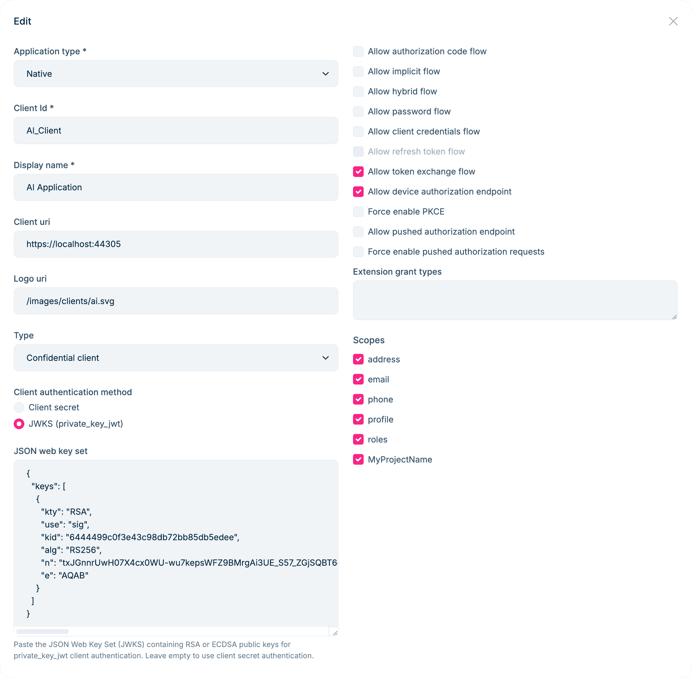

# Secure Client Authentication with private_key_jwt in ABP 10.3

If you've built a confidential client with ABP's OpenIddict module, you know the drill: create an application in the management UI, set a `client_id`, generate a `client_secret`, and paste that secret into your client's `appsettings.json` or environment variables. It works. It's familiar. And for a lot of projects, it's perfectly fine.

But `client_secret` is a **shared secret** — and shared secrets carry an uncomfortable truth: the same value exists in two places at once. The authorization server stores a hash of it in the database, and your client stores the raw value in configuration. That means two potential leak points. Worse, the secret has no inherent identity. Anyone who obtains the string can impersonate your client and the server has no way to tell the difference.

For many teams, this tradeoff is acceptable. But certain scenarios make it hard to ignore:

- **Microservice-to-microservice calls**: A backend mesh of a dozen services, each with its own `client_secret` scattered across deployment configs and CI/CD pipelines. Rotating them across environments without missing one becomes a coordination problem.
- **Multi-tenant SaaS platforms**: Every tenant's client application deserves truly isolated credentials. With shared secrets, the database holds hashed copies for all tenants — a breach of that table is a breach of everyone's credentials.
- **Financial-grade API (FAPI) compliance**: Standards like [FAPI 2.0](https://openid.net/specs/fapi-2_0-security-profile.html) explicitly require asymmetric client authentication. `client_secret` doesn't make the cut.
- **Zero-trust architectures**: In a zero-trust model, identity must be cryptographically provable, not based on a string that can be copied and pasted.

The underlying problem is that a shared secret is just a password. It can be stolen, replicated, and used without leaving a trace. The fix has existed in cryptography for decades: **asymmetric keys**.

With asymmetric key authentication, the client generates a key pair. The public key is registered with the authorization server. The private key never leaves the client. Each time the client needs a token, it signs a short-lived JWT — called a _client assertion_ — with the private key. The server verifies the signature using the registered public key. There is no secret on the server side that could be used to forge a request, because the private key is never transmitted or stored remotely.

This is exactly what the **`private_key_jwt`** client authentication method, defined in [OpenID Connect Core](https://openid.net/specs/openid-connect-core-1_0.html#ClientAuthentication), provides. ABP's OpenIddict module now supports it end-to-end: you register a **JSON Web Key Set (JWKS)** containing your public key through the application management UI (ABP Commercial), and your client authenticates using the corresponding private key. The key generation tooling (`abp generate-jwks`) ships as part of the open-source ABP CLI.

> This feature is available starting from **ABP Framework 10.3**.

## How It Works

The flow is straightforward:

1. The client holds an RSA key pair — **private key** (kept locally) and **public key** (registered on the authorization server as a JWKS).
2. On each token request, the client uses the private key to sign a JWT with a short expiry and a unique `jti` claim.
3. The authorization server verifies the signature against the registered public key and issues a token if it checks out.

The private key never leaves the client. Even if someone obtains the authorization server's database, there's nothing there that can be used to generate a valid client assertion.

## Generating a Key Pair

ABP CLI includes a `generate-jwks` command that creates an RSA key pair in the right formats:

```bash
abp generate-jwks
```

This produces two files in the current directory:

- `jwks.json` — the public key in JWKS format, to be uploaded to the server
- `jwks-private.pem` — the private key in PKCS#8 PEM format, to be kept on the client

You can customize the output directory, key size, and signing algorithm:

```bash
abp generate-jwks --alg RS512 --key-size 4096 -o ./keys -f myapp
```

> Supported algorithms: `RS256`, `RS384`, `RS512`, `PS256`, `PS384`, `PS512`. The default is `RS256` with a 2048-bit key.

The command also prints the contents of `jwks.json` to the console so you can copy it directly.

## Registering the JWKS in the Management UI

Open **OpenIddict → Applications** in the ABP admin panel and create or edit a confidential application (Client Type: `Confidential`).

In the **Client authentication method** section, you'll find the new **JSON Web Key Set** field.



Paste the contents of `jwks.json` into the **JSON Web Key Set** field:

```json
{
  "keys": [
    {
      "kty": "RSA",
      "use": "sig",
      "kid": "6444...",
      "alg": "RS256",
      "n": "tx...",
      "e": "AQAB"
    }
  ]
}
```

Save the application. It's now configured for `private_key_jwt` authentication. You can set either `client_secret` or a JWKS, or both — ABP enforces that a confidential application always has at least one credential.

## Requesting a Token with the Private Key

On the client side, each token request requires building a _client assertion_ JWT signed with the private key. Here's a complete `client_credentials` example:

```csharp
// Discover the authorization server endpoints (including the issuer URI).
var client = new HttpClient();
var configuration = await client.GetDiscoveryDocumentAsync("https://your-auth-server/");

// Load the private key generated by `abp generate-jwks`.
using var rsaKey = RSA.Create();
rsaKey.ImportFromPem(await File.ReadAllTextAsync("jwks-private.pem"));

// Read the kid from jwks.json so it stays in sync with the server-registered public key.
string? signingKid = null;
if (File.Exists("jwks.json"))
{
    using var jwksDoc = JsonDocument.Parse(await File.ReadAllTextAsync("jwks.json"));
    if (jwksDoc.RootElement.TryGetProperty("keys", out var keysElem) &&
        keysElem.GetArrayLength() > 0 &&
        keysElem[0].TryGetProperty("kid", out var kidElem))
    {
        signingKid = kidElem.GetString();
    }
}

var signingKey = new RsaSecurityKey(rsaKey) { KeyId = signingKid };
var signingCredentials = new SigningCredentials(signingKey, SecurityAlgorithms.RsaSha256);

// Build the client assertion JWT.
var now = DateTime.UtcNow;
var jwtHandler = new JsonWebTokenHandler();
var clientAssertionToken = jwtHandler.CreateToken(new SecurityTokenDescriptor
{
    // OpenIddict requires typ = "client-authentication+jwt" for client assertion JWTs.
    TokenType = "client-authentication+jwt",
    Issuer = "MyClientId",
    // aud must equal the authorization server's issuer URI from the discovery document,
    // not the token endpoint URL.
    Audience = configuration.Issuer,
    Subject = new ClaimsIdentity(new[]
    {
        new Claim(JwtRegisteredClaimNames.Sub, "MyClientId"),
        new Claim(JwtRegisteredClaimNames.Jti, Guid.NewGuid().ToString()),
    }),
    IssuedAt = now,
    NotBefore = now,
    Expires = now.AddMinutes(5),
    SigningCredentials = signingCredentials,
});

// Request a token using the client_credentials flow.
var tokenResponse = await client.RequestClientCredentialsTokenAsync(
    new ClientCredentialsTokenRequest
    {
        Address = configuration.TokenEndpoint,
        ClientId = "MyClientId",
        ClientCredentialStyle = ClientCredentialStyle.PostBody,
        ClientAssertion = new ClientAssertion
        {
            Type = OidcConstants.ClientAssertionTypes.JwtBearer,
            Value = clientAssertionToken,
        },
        Scope = "MyAPI",
    });
```

A few things worth paying attention to:

- **`TokenType`** must be `"client-authentication+jwt"`. OpenIddict rejects client assertion JWTs that don't carry this header.
- **`Audience`** must match the authorization server's issuer URI exactly — use `configuration.Issuer` from the discovery document, not the token endpoint URL.
- **`Jti`** must be unique per request to prevent replay attacks.
- Keep **`Expires`** short (five minutes or less). A client assertion is a one-time proof of identity, not a long-lived credential.

This example uses [IdentityModel](https://github.com/IdentityModel/IdentityModel) for the token request helpers and [Microsoft.IdentityModel.JsonWebTokens](https://www.nuget.org/packages/Microsoft.IdentityModel.JsonWebTokens) for JWT creation.

## Key Rotation Without Downtime

One of the practical advantages of JWKS is that it can hold multiple public keys simultaneously. This makes **zero-downtime key rotation** straightforward:

1. Run `abp generate-jwks` to produce a new key pair.
2. Append the new public key to the `keys` array in your existing `jwks.json` and update the JWKS in the management UI.
3. Switch the client to sign assertions with the new private key.
4. Once the transition is complete, remove the old public key from the JWKS.

During the transition window, both the old and new public keys are registered on the server, so any in-flight requests signed with either key will still validate correctly.

## Summary

To use `private_key_jwt` authentication in an ABP Pro application:

1. Run `abp generate-jwks` to generate an RSA key pair.
2. Paste the `jwks.json` contents into the **JSON Web Key Set** field in the OpenIddict application management UI.
3. On the client side, sign a short-lived _client assertion_ JWT with the private key — making sure to set the correct `typ`, `aud` (from the discovery document), and a unique `jti` — then use it to request a token.

ABP handles public key storage and validation automatically. OpenIddict handles the signature verification on the token endpoint. As a developer, you only need to keep the private key file secure — there's no shared secret to synchronize between client and server.

## References

- [OpenID Connect Core — Client Authentication](https://openid.net/specs/openid-connect-core-1_0.html#ClientAuthentication)
- [RFC 7523 — JWT Profile for Client Authentication](https://datatracker.ietf.org/doc/html/rfc7523)
- [ABP OpenIddict Module Documentation](https://abp.io/docs/latest/modules/openiddict)
- [ABP CLI Documentation](https://abp.io/docs/latest/cli)
- [OpenIddict Documentation](https://documentation.openiddict.com/)
