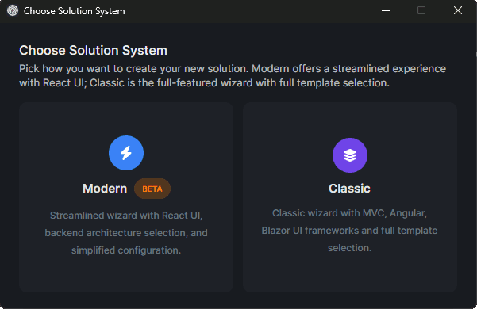
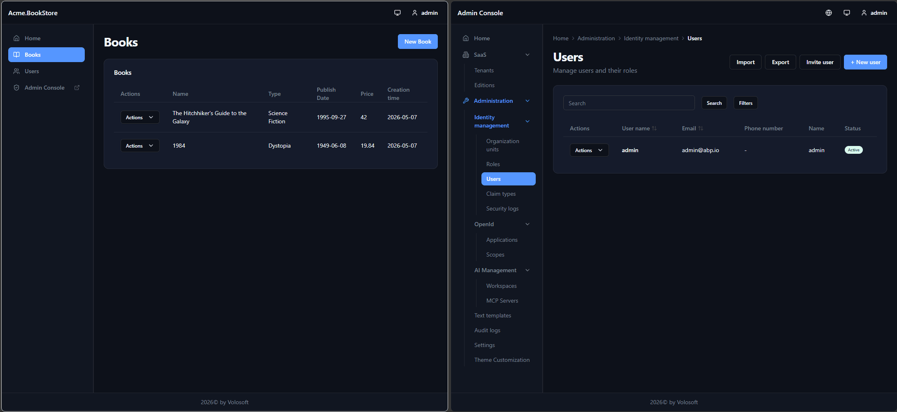
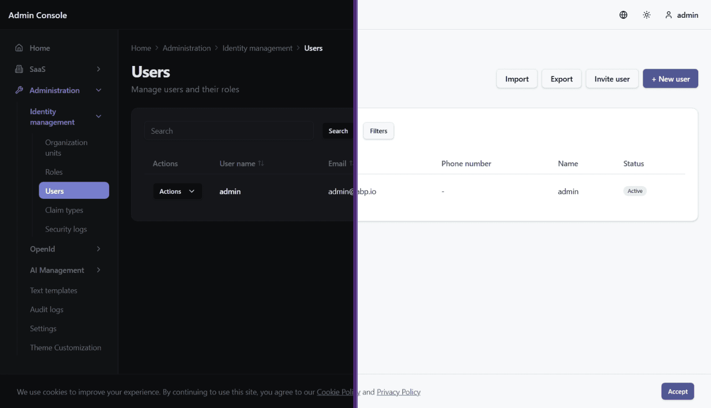
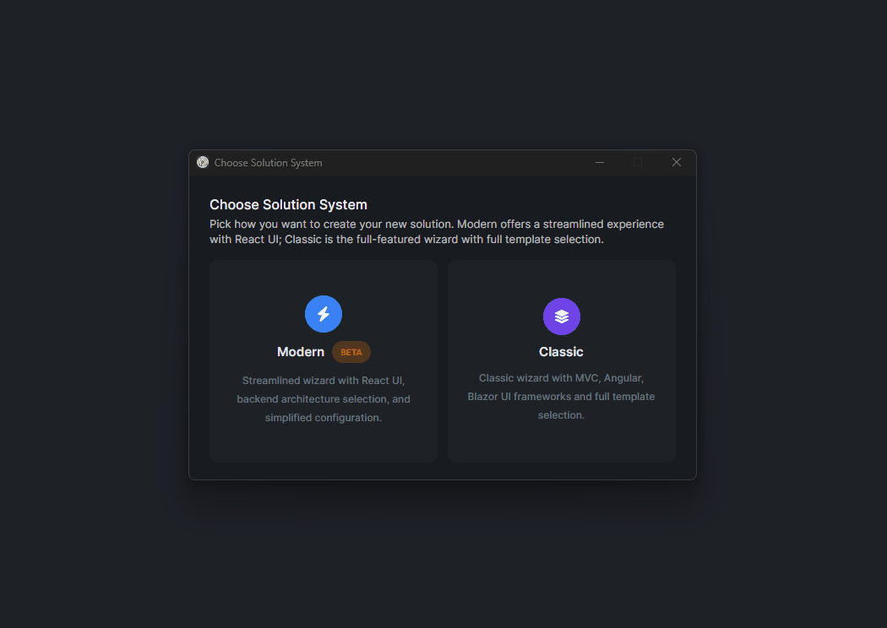

# React UI for ABP Framework Is Finally Here

If you have followed ABP for a while, you probably know that React support has been one of the most requested topics in the community.

With **ABP 10.4.0-rc.1**, that wait ends. React in ABP is no longer just something people ask about, hope for, or imagine as the next step. You can now create it, run it, and explore it today as a beta/preview experience in the modern template system.

As part of the ABP Framework team, and as one of the developers working on this React effort, I am genuinely happy to finally share it. This RC gives the community an early chance to try it, share feedback, and help us polish the final details before **ABP 10.4 stable**, where we plan to make the React UI generally available.



## Why this matters

ABP Framework has always been about helping teams build modern, maintainable, production-ready applications faster. With the new React UI, we are extending that same vision to teams who want ABP on the backend and React on the frontend without losing the built-in application features that make ABP productive from day one.

This is not another empty starter. The goal is a **first-class UI option** that fits into the ABP application startup experience and works naturally with familiar ABP concepts such as authentication, authorization, localization, multi-tenancy, modularity, runtime configuration, and deployment.

There is one important detail: the React UI belongs to ABP's **modern template system**. You create it with the `--modern` flag in the ABP CLI or by selecting the modern template flow in ABP Studio. You can find the technical documentation here: [React UI documentation](https://abp.io/docs/10.4/framework/ui/react).

## A quick look at the architecture

The final shape is clearer now: a modern React solution gives you a real React application in the solution, plus the ABP administration experience.

First, there is **your React application**. In the modern templates, this lives directly in the solution as a real app under `react/` or `apps/react/`. It contains the frontend code you work with every day, including pages, components, routing, API integration, runtime configuration, and authentication setup.

Second, there is the **ABP Admin Console**. The Admin Console is a pre-built React application that provides the standard ABP module management pages. It is delivered through the `Volo.Abp.AdminConsole` NuGet package, so it can evolve with ABP package updates while your own React application stays focused on your product's business features.

For layered and single-layer modern applications, the Admin Console is hosted by the backend and served under `/admin-console/*`. For microservice solutions, it runs as a separate React app under `apps/react-admin-console/`, with its own runtime configuration and the same `/admin-console/` base path. In both cases, the main React app can link users into the Admin Console when they need full administrative screens.

This split is a practical design choice. Your business UI stays yours, while administration capabilities remain available, consistent, and upgradeable.


## A different frontend philosophy

One of the most important things to understand is that this React UI is **not** being shaped with exactly the same architecture as some previous UI options.

We are not trying to ship the whole frontend experience as a closed set of page implementations coming from npm packages. Instead, the generated solution includes the actual page code inside the app itself. You can open it, understand it, refactor it, redesign it, and adapt it without fighting against a packaged black box.

The Admin Console covers ABP's standard module administration pages. Your own React application remains intentionally open and direct. That gives teams a good balance: built-in administrative power from ABP, and full ownership of the product-facing frontend.

## Built for AI-driven development

The new React UI is also shaped for the era of **AI-assisted development**.

React, TypeScript, Vite, TanStack Router, TanStack Query, Axios, Zod, React Hook Form, and shadcn/ui are technologies that modern coding assistants understand very well. Just as importantly, the generated application contains real frontend code in the solution. That gives AI tools and coding agents concrete project context to read, extend, and refactor.

This direction also fits the broader ABP AI story. ABP Studio already includes an AI assistant experience, and the new **ABP AI Agent** is being introduced to bring code generation, project understanding, issue fixing, and natural-language application evolution directly into the ABP workflow. You can follow that work here: [The Future of ABP Studio: AI Agent + Code Generation](https://abp.io/community/events/community-talks/the-future-of-abp-studio-ai-agent-code-generation-live-fekeoyjr). For the wider toolset, see the [ABP AI Toolkit](https://abp.io/ai/toolkit).

## What the React experience looks like

The current template already points to the kind of experience React developers expect from a modern application:

- A Vite-powered React + TypeScript frontend
- TanStack Router for client-side routing
- TanStack Query for server state and data fetching
- OIDC authentication against the ABP Auth Server
- Axios-based HTTP client integration
- Runtime configuration through `dynamic-env.json`
- Localization and permission-aware behavior integrated with ABP application configuration
- Tailwind CSS and shadcn/ui components that live in your project and can be customized directly
- Zod and React Hook Form for form handling and validation
- Vitest for frontend tests
- A dedicated Admin Console for ABP module administration

Even in its current form, the React UI already feels like a real ABP solution experience, not just a login page plus a few demo screens.



## More than a hello world

The generated React app is intentionally small enough to understand, but it is not empty.

Out of the box, you already get the kind of foundation most teams expect: login, registration, forgot-password and reset-password flows, runtime configuration, localization, permission-aware routing, API proxy generation, and a simple users page that can deep-link into the Admin Console when full user management is needed.

Depending on the selected options, it can also include a sample Books CRUD page that demonstrates how to build a full create/read/update/delete flow against an ABP backend.

The Admin Console provides the standard management experience for ABP modules, including identity management, roles, organization units, settings, audit logs, OpenIddict administration, language management, text templates, GDPR, SaaS and tenant management, and other module pages depending on your solution configuration.

That is the core value: developers get a clean React application to build their product, while ABP continues to provide the administrative capabilities expected from a production-ready application platform.

## Try it with ABP 10.4 RC

During the RC period, you can create a modern React solution with ABP 10.4.0-rc.1:

```bash
abp new Acme.BookStore --template app --modern
```

The React UI is the default UI option when `--modern` is used, but you can also pass it explicitly:

```bash
abp new Acme.BookStore --template app --modern --ui-framework react
```

For a single-layer application:

```bash
abp new Acme.BookStore --template app-nolayers --modern
```

For a microservice solution:

```bash
abp new Acme.BookStore --template microservice --modern
```

Once ABP 10.4 stable is released, the same modern React experience is planned to become generally available without needing to target the RC version explicitly.



## What's next

The React UI is now real in ABP 10.4 RC, and the final polishing work continues toward the stable release. If you have been waiting for a real React path in ABP, this is the point where it stops being a wish and starts becoming something you can actually build with.

For me, one of the nicest parts of this RC is that we can finally stop talking about React support in ABP as a future idea and start improving something real together.

Try it, explore it, and share feedback with us while we keep polishing it for **ABP 10.4 stable**.
