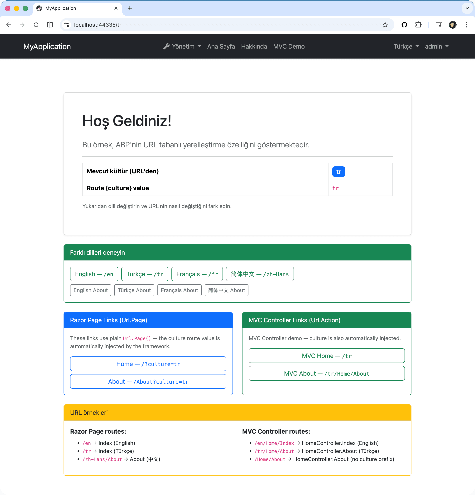
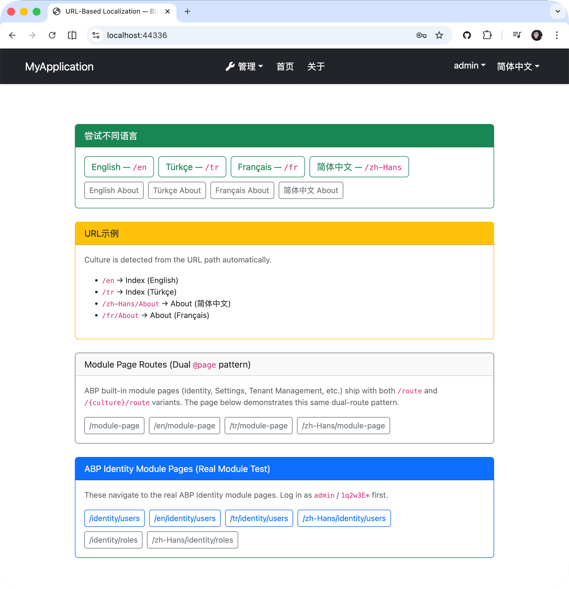
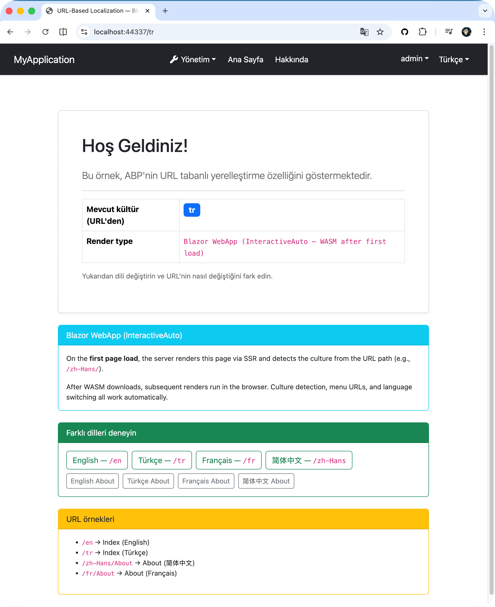
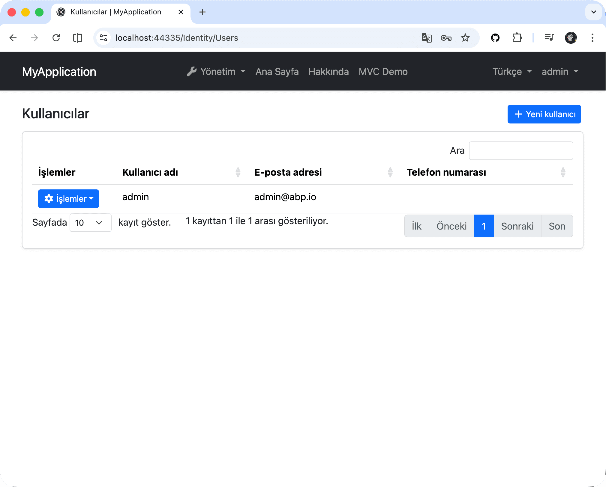

# SEO-Friendly Localized URLs in ABP with a Single Line of Configuration

ABP has always supported language switching via the `?culture=en` query string and the culture cookie. That works fine for most applications — but it has a limitation that shows up quickly once SEO or link-sharing matters.

Consider a book-store app where users browse in their language:

- A Spanish user shares a product link. The recipient opens it in English because the cookie on *their* machine says `en`.
- Search engines crawl the same URL in every language, making it impossible to create separate sitemaps per locale.
- A user shares a link like `/Books/Detail?id=42&culture=es`. When the server processes the request, it sets the culture cookie and then redirects to `/Books/Detail?id=42` — stripping the `?culture=` parameter. The shared link no longer carries the intended language.

Embedding the culture in the URL path — `/es/books`, `/zh-Hans/about` — solves all three. Each language has its own stable URL, readable by humans and index-friendly for search engines.

ABP supports this out of the box. You opt in with a single configuration property, and the framework takes care of routing, URL generation, menu links, and language switching automatically.

## Enabling URL-Based Localization

In your ABP module class, add:

```csharp
Configure<AbpRequestLocalizationOptions>(options =>
{
    options.UseRouteBasedCulture = true;
});
```

That is the only change you need to make.

## MVC / Razor Pages

MVC and Razor Pages have the most complete support — everything works automatically. No code changes needed in your pages or controllers.




## What Happens Automatically

When you set `UseRouteBasedCulture = true`, ABP automatically:

- Registers ASP.NET Core's built-in [`RouteDataRequestCultureProvider`](https://learn.microsoft.com/en-us/dotnet/api/microsoft.aspnetcore.localization.routing.routedatarequestcultureprovider) to detect culture from the URL path.
- Adds a `{culture}/{controller}/{action}` conventional route for MVC controllers, with a route constraint to prevent non-culture URL segments (like `/enterprise/products`) from matching.
- Adds `{culture}/...` route selectors to all Razor Pages at startup.
- Injects the current culture into all `Url.Page()` and `Url.Action()` calls, so generated URLs automatically include the culture prefix.
- Prepends the culture prefix to navigation menu item URLs.

You do not need to configure these individually.

## URL Generation Just Works

In a Razor Page or view running under a culture-prefixed URL (say, `/zh-Hans/Books`), you do not need to pass a `culture` parameter anywhere:

```cshtml
@Url.Page("/Books/Detail", new { id = book.Id })
@* Generates: /zh-Hans/Books/Detail?id=42 *@

@Url.Action("About", "Home")
@* Generates: /zh-Hans/Home/About *@
```

If you explicitly pass a different `culture` value, that takes precedence — so cross-language links are also straightforward:

```cshtml
@Url.Page("/Books/Index", new { culture = "tr" })
@* Generates: /tr/Books *@
```

## Language Switching

The built-in ABP language switcher already works with route-based culture. When a user switches language, the culture segment in the URL is automatically replaced:

| Current URL | Switch to | Redirect to |
|---|---|---|
| `/tr/books` | `en` | `/en/books` |
| `/zh-Hans/about` | `en` | `/en/about` |
| `/tenant-a/zh-Hans/about` | `en` | `/tenant-a/en/about` |

No theme changes, no language switcher changes — the existing UI component just works.

## Blazor Support

Blazor Server and Blazor WebAssembly (WebApp) both support URL-based localization. Culture detection and cookie persistence work automatically on the initial page load (SSR). Menu URLs and language switching also work automatically.





ABP's built-in module pages (Identity, Settings, etc.) also work with URL-based localization out of the box:



### Manual step: Blazor component routes

The only manual step for Blazor is adding `@page "/{culture}/..."` routes to your own pages. ASP.NET Core does not support automatically adding route selectors to Blazor components (unlike Razor Pages), so you must add them explicitly:

```razor
@page "/"
@page "/{culture}"

@code {
    [Parameter]
    public string? Culture { get; set; }
}
```

```razor
@page "/Products"
@page "/{culture}/Products"

@code {
    [Parameter]
    public string? Culture { get; set; }
}
```

> **ABP's built-in module pages** (Identity, Tenant Management, Settings, Account, etc.) already ship with `@page "/{culture}/..."` route variants. You only need to add these routes to your own application pages.

### Blazor WebApp (WASM) configuration

The WASM client project does not need any `UseRouteBasedCulture` configuration. It reads the setting from the server automatically.

```csharp
// Server project — the only place you need to configure
Configure<AbpRequestLocalizationOptions>(options =>
{
    options.UseRouteBasedCulture = true;
});
```

## Multi-Tenancy

URL-based localization is fully compatible with ABP's multi-tenant routing. Language switching supports tenant-prefixed URLs, so `/tenant-a/zh-Hans/About` correctly switches to `/tenant-a/en/About` without any additional configuration.

## UI Framework Support Overview

| UI Framework | Route Registration | URL Generation | Menu URLs | Language Switch | Manual Work |
|---|---|---|---|---|---|
| **MVC / Razor Pages** | Automatic | Automatic | Automatic | Automatic | None |
| **Blazor Server** | Manual `@page` routes | N/A | Automatic | Automatic | Add `{culture}` route to pages |
| **Blazor WebApp (WASM)** | Manual `@page` routes | N/A | Automatic | Automatic | Add `{culture}` route to pages |

## Running the Sample

A runnable sample is available at [abp-samples/UrlBasedLocalization](https://github.com/abpframework/abp-samples/tree/master/UrlBasedLocalization), with three projects:

| Project | UI Type | URL | Command |
|---|---|---|---|
| `BookStore.Mvc` | MVC / Razor Pages | `https://localhost:44335` | `dotnet run --project src/BookStore.Mvc` |
| `BookStore.Blazor.Server` | Blazor Server | `https://localhost:44336` | `dotnet run --project src/BookStore.Blazor.Server` |
| `BookStore.Blazor.WebApp` | Blazor WebApp (InteractiveAuto) | `https://localhost:44337` | `dotnet run --project src/BookStore.Blazor.WebApp` |

Supported languages: English, Türkçe, Français, 简体中文.

## Summary

To add SEO-friendly localized URL paths to your ABP application:

1. Set `options.UseRouteBasedCulture = true` in your module.
2. For **Blazor** projects, add `@page "/{culture}/..."` routes to your own pages.

Everything else — route registration, URL generation, menu links, and language switching — is handled automatically.

## References

- [URL-Based Localization — ABP Documentation](https://abp.io/docs/latest/framework/fundamentals/url-based-localization)
- [Localization — ABP Documentation](https://abp.io/docs/latest/framework/fundamentals/localization)
- [abp-samples/UrlBasedLocalization — GitHub](https://github.com/abpframework/abp-samples/tree/master/UrlBasedLocalization)
- [Request Localization in ASP.NET Core](https://learn.microsoft.com/en-us/aspnet/core/fundamentals/localization/select-language-culture)
