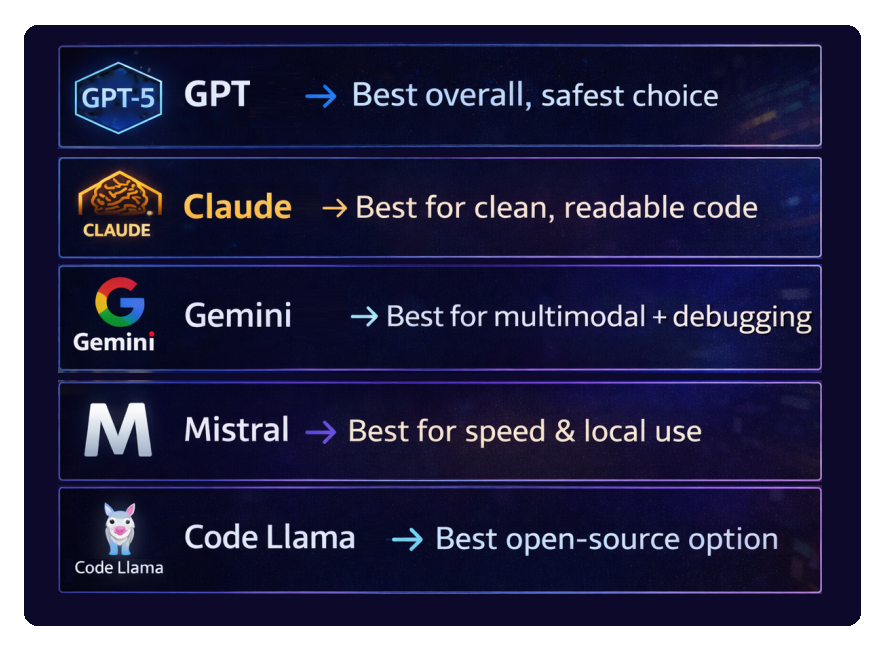

## Introduction

AI coding tools went from “cool autocomplete” to “basically your junior dev (who never sleeps)” in just a couple of years.

In 2026, the landscape is **crowded, competitive, and honestly a bit confusing**. Every model claims to be the best at coding—but depending on what you actually *do* (APIs, frontend, DevOps, debugging), the “best” can change fast.

So instead of hype, let’s break down the **top AI coding models in 2026**, ranked by:

* Real-world dev usefulness
* Code quality & correctness
* Context handling
* Tooling ecosystem

We'll check the AI models against these topics:

---

## 🏆 1. GPT-5.4 (OpenAI) — The All-Round Beast

Let’s not dance around it—**GPT-5.4 is still the most versatile coding model right now.**

### Why it’s #1

* Extremely strong across **all languages**
* Handles **large codebases** without losing context
* Excellent at:

  * Refactoring
  * Architecture suggestions
  * Debugging complex issues

### Where it shines

* Full-stack development
* API design
* Writing clean, production-ready code

### Where it struggles

* Occasionally over-engineers solutions
* Can be slower than lightweight models

### As a result;

If you want a **default “just works” coding AI**, this is it.

---

## 🥈 2. Claude 4.7 (Anthropic) — The Clean Code Specialist

Claude 4.7 has built a reputation for writing code that feels like it came from a senior engineer who drinks too much coffee but cares deeply about readability.

### Strengths

* Beautiful, readable code
* Strong reasoning for:

  * Refactoring
  * Code reviews
  * Documentation

### Killer feature

* Massive context window → great for:

  * Large repositories
  * Long discussions
  * System design

### Weak spots

* Slightly less aggressive in solving edge-case bugs
* Sometimes too “safe” in decisions

### As a result;

Perfect if you care about **maintainability over raw speed**.

---

## 🥉 3. Gemini 3.1 (Google) — The Multimodal Powerhouse

Gemini 3.1 is where things get interesting.

This isn’t just a coding model—it’s a **multi-input problem solver**.

### What makes it different

* Understands:

  * Code
  * Screenshots
  * Diagrams
  * Logs

### Where it dominates

* Debugging UI issues from screenshots
* DevOps + cloud workflows
* Cross-referencing documentation

### Downsides

* Code style can be inconsistent
* Sometimes less deterministic than GPT-5

### As a result;

If your workflow includes **visual debugging or cloud-heavy systems**, this is insanely useful.

---

## ⚡ 4. Mistral Code (Open Models) — The Speed King

Mistral AI’s coding models are gaining serious attention.

### Why devs love it

* Fast
* Cheap (or free if self-hosted)
* Great for:

  * Autocomplete
  * Small functions
  * Local development

### Trade-offs

* Not as strong in deep reasoning
* Limited compared to closed models

### As a result;

Best choice for:

* Privacy-sensitive environments
* Offline/local setups
* Lightweight coding tasks

---

## 🧠 5. Code Llama 4 — The Open-Source Veteran

Code Llama 4 is still very relevant, especially in enterprise setups.

### Strengths

* Fully open-source
* Customizable & fine-tunable
* Good baseline performance

### Weaknesses

* Behind top-tier models in reasoning
* Needs tuning for best results

### As a result;

If your company says “no cloud AI,” this is your friend.

---

## 📊 Comparison Table Between AI Models

| Model        | Best For                 | Weakness              |
| ------------ | ------------------------ | --------------------- |
| GPT-5.4        | Everything               | Slightly slower       |
| Claude 4.7     | Clean, maintainable code | Less aggressive fixes |
| Gemini 3.1   | Multimodal workflows     | Inconsistent style    |
| Mistral Code | Speed & local usage      | Shallow reasoning     |
| Code Llama 4 | Open-source flexibility  | Needs tuning          |

Image Prompt:
A sleek table-style infographic comparing AI models with icons, performance bars, and labels like “Best for speed”, “Best for reasoning”.

---

## 🤔 When to Use What (Real Scenarios)

### Use GPT-5.4 if:

* You’re building a full product
* You need architecture + implementation
* You want fewer “AI mistakes”

---

### Use Claude 4.7 if:

* You’re reviewing code
* You care about readability
* You’re working in a team

---

### Use Gemini 3.1 if:

* You debug using screenshots/logs
* You work with cloud infrastructure
* You want multimodal workflows

---

### Use Mistral / Code Llama if:

* You need local/private AI
* You want low cost
* You’re okay trading power for control

---

## 🔌 Where ABP Framework Fits In

If you're working with **ASP.NET Core and the ABP Framework**, these models can seriously boost productivity:

* GPT-5.4 → Generate **application services, DTOs, and modules**
* Claude → Clean up **domain layer logic**
* Gemini → Help debug **UI + backend integration issues**

The sweet spot?

👉 Use AI to scaffold ABP layers, then refine manually.
That keeps your architecture clean while still saving hours.

---

## 🚨 Reality Check 

AI coding models in 2026 are powerful—but:

* They still hallucinate edge cases
* They don’t fully understand your business logic
* They can fix somewhere, break another 
* They can not fix a bug even after you write 10 different prompts

So yeah—**don’t ship blind**.

Treat them like:

> A fast junior dev… who needs code review.

---

## TL;DR

👉 There’s no single “winner”—just the best tool for your workflow.

---

If you're experimenting with these models in real projects (especially with ABP), it's worth trying **multiple models side-by-side**. The differences become obvious *fast*.
