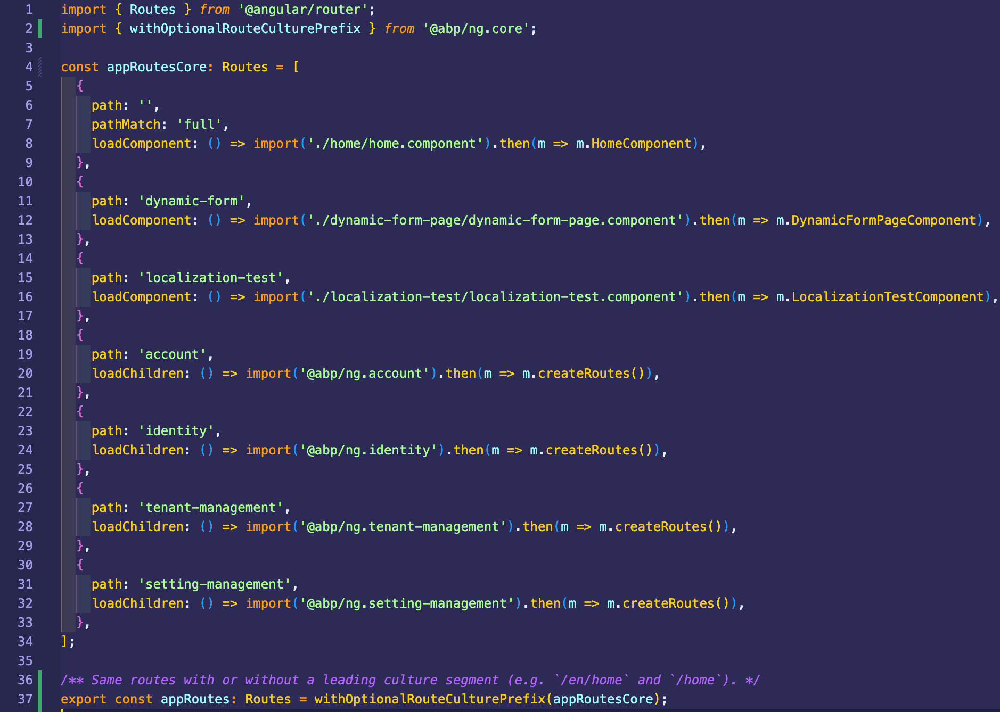
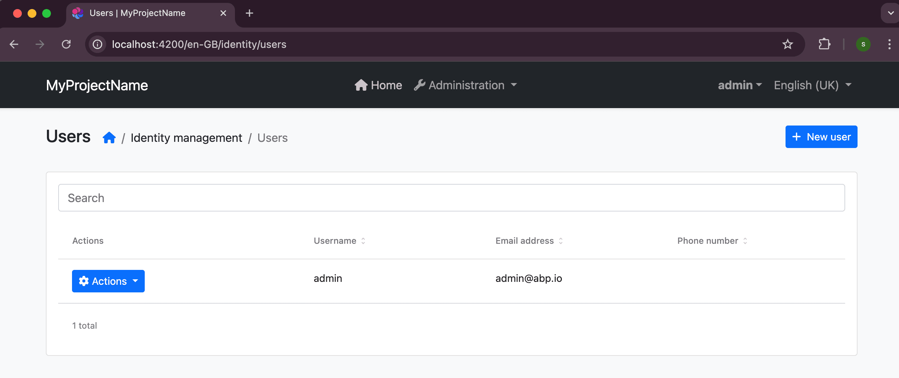

````json
//[doc-seo]
{
    "Description": "Learn how to use ABP's URL-based localization to embed culture in the URL path, enabling SEO-friendly and shareable localized URLs."
}
````

# URL-Based Localization

ABP supports embedding the current culture directly in the URL path, for example `/tr/products` or `/en/about`. This approach is widely used by documentation sites, e-commerce platforms, and any site that needs SEO-friendly, shareable localized URLs.

By default, ABP detects language from QueryString (`?culture=tr`), Cookie, and `Accept-Language` header. URL path detection is **opt-in** and fully backward-compatible.

## Enabling URL-Based Localization

Configure the `AbpRequestLocalizationOptions` in your [module class](../architecture/modularity/basics.md):

````csharp
Configure<AbpRequestLocalizationOptions>(options =>
{
    options.UseRouteBasedCulture = true;
});
````

That's all you need. The framework automatically handles the rest.

## What Happens Automatically

When you set `UseRouteBasedCulture` to `true`, ABP automatically registers the following:

* **`RouteDataRequestCultureProvider`** — A built-in ASP.NET Core provider that reads `{culture}` from route data. ABP inserts it after `QueryStringRequestCultureProvider` and before `CookieRequestCultureProvider`.
* **`{culture}/{controller}/{action}` route** — A conventional route for MVC controllers. The `{culture}` parameter uses a custom route constraint (`AbpCultureRouteConstraint`) that only matches culture values configured in `AbpLocalizationOptions.Languages`, so URLs like `/enterprise/products` are not mistaken for culture-prefixed routes.
* **`AbpCultureRoutePagesConvention`** — An `IPageRouteModelConvention` that adds `{culture}/...` route selectors to all Razor Pages.
* **`AbpCultureRouteUrlHelperFactory`** — Replaces the default `IUrlHelperFactory` to auto-inject culture into `Url.Page()` and `Url.Action()` calls.
* **`AbpCultureMenuItemUrlProvider`** — Prepends the culture prefix to navigation menu item URLs (MVC / Blazor Server).
* **`AbpWasmCultureMenuItemUrlProvider`** — Prepends the culture prefix to menu item URLs in Blazor WebAssembly (reads the `UseRouteBasedCulture` flag from `/api/abp/application-configuration`).

You do not need to configure these individually.

## URL Generation

When a request has a `{culture}` route value, all URL generation methods automatically include the culture prefix:

````csharp
// In a Razor Page — culture is auto-injected, no manual parameter needed
@Url.Page("/About")         // Generates: /zh-Hans/About
@Url.Action("About", "Home") // Generates: /zh-Hans/Home/About
````

Menu items registered via `IMenuContributor` also automatically get the culture prefix. No changes are needed in your menu contributors or theme.

## Language Switching

ABP's built-in language switcher (the `/Abp/Languages/Switch` action) automatically replaces the culture segment in the `returnUrl`. The controller reads the culture from the request cookie to identify the current page culture and replaces it with the new one:

| Before switching | After switching to English |
|---|---|
| `/tr/products` | `/en/products` |
| `/tenant-a/zh-Hans/about` | `/tenant-a/en/about` |
| `/home?culture=tr&ui-culture=tr` | `/home?culture=en&ui-culture=en` |
| `/about` (no prefix) | `/about` (unchanged) |

No changes are needed in any theme or language switcher component.

## MVC / Razor Pages

MVC and Razor Pages have the most complete support. Everything works automatically when `UseRouteBasedCulture = true` — route registration, URL generation, menu links, and language switching. **No code changes are needed in your pages or controllers.**

## Blazor Server

Blazor Server uses SignalR (WebSocket) for the interactive circuit. The HTTP middleware pipeline only runs on the **initial page load** — subsequent interactions happen over the WebSocket connection. ABP handles this by persisting the detected URL culture to a **Cookie** on the first request, so the entire Blazor circuit uses the correct language.

Culture detection, cookie persistence, menu URLs, and language switching all work automatically. No additional configuration is needed beyond the `UseRouteBasedCulture` option.

### What requires manual changes

**Blazor component routes**: ASP.NET Core does not provide an `IPageRouteModelConvention` equivalent for Blazor components. You must manually add the `{culture}` route to each page:

````razor
@page "/"
@page "/{culture}"

@code {
    [Parameter]
    public string? Culture { get; set; }
}
````

````razor
@page "/About"
@page "/{culture}/About"

@code {
    [Parameter]
    public string? Culture { get; set; }
}
````

> This applies to your own application pages. ABP built-in module pages (Identity, Tenant Management, Settings, Account, etc.) already include `@page "/{culture}/..."` routes out of the box — you do not need to add them manually.

## Blazor WebAssembly (WebApp)

Blazor WebAssembly (WASM) runs in the browser. On the **first page load**, the server renders the page via SSR, and the culture is detected from the URL. After WASM downloads, subsequent renders run in the browser. The WASM app fetches `/api/abp/application-configuration` from the server to get the current culture, so the culture stays consistent.

Culture detection, cookie persistence, menu URLs, and language switching all work automatically. The WASM client reads the `UseRouteBasedCulture` flag from the server via `/api/abp/application-configuration`, so no client-side configuration is needed.

### What requires manual changes

Same as Blazor Server — you must manually add `@page "/{culture}/..."` routes to your Blazor pages.

## Angular

The [ABP Angular UI](../ui/angular/quick-start.md) runs in the browser. The server still applies `UseRouteBasedCulture`; the client reads **`localization.useRouteBasedCulture`** from `/api/abp/application-configuration` (same payload as other UI types). There is no separate Angular setting.

### Routing

Angular does not add a culture segment to your route config automatically. Use **`withOptionalRouteCulturePrefix`** from **`@abp/ng.core`** so one route tree matches both **`/identity/users`** and **`/en/identity/users`** (the first path segment is matched only when it looks like a culture code, e.g. `en`, `tr`, `zh-Hans`).

````typescript
import { Routes } from '@angular/router';
import { withOptionalRouteCulturePrefix } from '@abp/ng.core';

const appRoutesCore: Routes = [
  // ... your routes (path: '', 'account', 'identity', lazy children, etc.)
];

export const appRoutes = withOptionalRouteCulturePrefix(appRoutesCore);
````



### URL → session language

When **`useRouteBasedCulture`** is **true**, **`RouteBasedCultureService`** (from `@abp/ng.core`) keeps the session language aligned with the first URL segment after navigation. This runs during application bootstrap and on each **`NavigationEnd`**.

### Menu links, breadcrumbs, and `routerLink`

Menu paths from **`RoutesService`** are usually **without** a culture prefix (`/identity/users`). Use the **`abpRouteCultureUrl`** pipe on **`routerLink`** (or **`RouteBasedCultureUrlService.prefixPathWithCulture`**) so links navigate to **`/en/identity/users`** when route-based culture is enabled. The **Basic** theme navigation and **Theme Shared** breadcrumb links follow this pattern.



### Language switcher (toolbar)

If the user selects a language in the UI, call **`RouteBasedCultureUrlService.applyLanguageSelection(cultureName)`** (or **`navigateToUrlWithCulture`**) instead of only updating the session language. That rewrites the current URL’s culture segment (or prepends it) so the address bar and session stay consistent; **`RouteBasedCultureService`** then picks up the culture from the URL after navigation.

### Active menu, breadcrumbs, and route matching

The browser URL may be **`/en/identity/users`** while menu items and **`RoutesService`** paths stay **`/identity/users`**. For comparisons (active state, **`findRoute`**, permission guard, dynamic layout), normalize the current URL with **`RouteBasedCultureUrlService.normalizeForMenuMatch`** (or **`stripCulturePrefixIfEnabled`**) or use **`getRoutePathForMatching`** where **`getRoutePath`** was used.

### Configuration refresh

**`RouteBasedCultureUrlService`** refreshes its cached **`useRouteBasedCulture`** and **languages** when application configuration is updated (for example after **`refreshAppState`**), so hot paths do not query configuration on every change detection cycle.

## Multi-Tenancy Compatibility

URL-based localization is fully compatible with [multi-tenancy URL routing](../architecture/multi-tenancy/index.md). The culture route is registered as a conventional route `{culture}/{controller}/{action}`. If your application uses tenant routing (e.g., `/{tenant}/...`), the tenant middleware strips the tenant segment before routing, and the culture segment is handled separately.

Language switching also supports tenant-prefixed URLs. For example, `/tenant-a/zh-Hans/About` correctly switches to `/tenant-a/en/About`.

## API Routes

Routes like `/api/products` have no `{culture}` segment, so `RouteDataRequestCultureProvider` returns `null` and falls through to the next provider (Cookie → `Accept-Language` → default). API routes are completely unaffected.

## Culture Detection Priority

ASP.NET Core has a built-in [`RouteDataRequestCultureProvider`](https://learn.microsoft.com/en-us/dotnet/api/microsoft.aspnetcore.localization.routing.routedatarequestcultureprovider) (in `Microsoft.AspNetCore.Localization.Routing`) that reads culture from route data, but it is not included in the default provider list. When `UseRouteBasedCulture` is enabled, ABP inserts it after `QueryStringRequestCultureProvider` and before `CookieRequestCultureProvider`. The resulting provider order is:

1. `QueryStringRequestCultureProvider` (ASP.NET Core default — useful for debugging and testing)
2. `RouteDataRequestCultureProvider` (URL path — inserted by ABP when enabled)
3. `CookieRequestCultureProvider` (ASP.NET Core default)
4. `AcceptLanguageHeaderRequestCultureProvider` (ASP.NET Core default)

If a URL contains an invalid culture code (e.g. `/xyz1234/page`), `RequestLocalizationMiddleware` ignores it and falls through to the next provider. No error is thrown.
