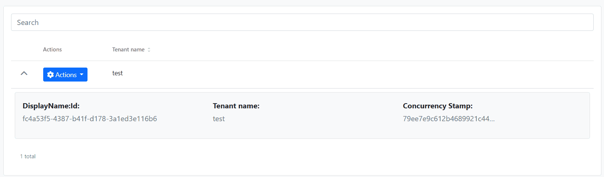

```json
//[doc-seo]
{
    "Description": "Learn how to add expandable row details to data tables using the Extensible Table Row Detail component in ABP Framework Angular UI."
}
```

# Extensible Table Row Detail for Angular UI

## Introduction

The `<abp-extensible-table-row-detail>` component allows you to add expandable row details to any `<abp-extensible-table>`. When users click the expand icon, additional content is revealed below the row.



## Quick Start

### Step 1. Import the Component

Import `ExtensibleTableRowDetailComponent` in your component:

```typescript
import { 
  ExtensibleTableComponent, 
  ExtensibleTableRowDetailComponent 
} from '@abp/ng.components/extensible';

@Component({
  // ...
  imports: [
    ExtensibleTableComponent,
    ExtensibleTableRowDetailComponent,
  ],
})
export class MyComponent { }
```

### Step 2. Add Row Detail Template

Place `<abp-extensible-table-row-detail>` inside `<abp-extensible-table>` with an `ng-template`:

```html
<abp-extensible-table [data]="data.items" [recordsTotal]="data.totalCount" [list]="list">
  <abp-extensible-table-row-detail>
    <ng-template let-row="row" let-expanded="expanded">
      <div class="p-3">
        <h5></h5>
        <p>ID: </p>
        <p>Status: </p>
      </div>
    </ng-template>
  </abp-extensible-table-row-detail>
</abp-extensible-table>
```

An expand/collapse chevron icon will automatically appear in the first column of each row.

## API

### ExtensibleTableRowDetailComponent

| Input | Type | Default | Description |
|-------|------|---------|-------------|
| `rowHeight` | `string` &#124; `number` | `'100%'` | Height of the expanded row detail area |

### Template Context Variables

| Variable | Type | Description |
|----------|------|-------------|
| `row` | `R` | The current row data object |
| `expanded` | `boolean` | Whether the row is currently expanded |

## Usage Examples

### Basic Example

Display additional information when a row is expanded:

```html
<abp-extensible-table [data]="data.items" [list]="list">
  <abp-extensible-table-row-detail>
    <ng-template let-row="row">
      <div class="p-3 border rounded m-2">
        <strong>Details for: </strong>
        <pre></pre>
      </div>
    </ng-template>
  </abp-extensible-table-row-detail>
</abp-extensible-table>
```

### With Custom Row Height

Specify a fixed height for the detail area:

```html
<abp-extensible-table-row-detail [rowHeight]="200">
  <ng-template let-row="row">
    <div class="p-3">Fixed 200px height content</div>
  </ng-template>
</abp-extensible-table-row-detail>
```

### Using Expanded State

Apply conditional styling based on expansion state:

```html
<abp-extensible-table-row-detail>
  <ng-template let-row="row" let-expanded="expanded">
    <div class="p-3" [class.fade-in]="expanded">
      <p>This row is </p>
    </div>
  </ng-template>
</abp-extensible-table-row-detail>
```

### With Badges and Localization

```html
<abp-extensible-table-row-detail>
  <ng-template let-row="row">
    <div class="p-3 bg-light border rounded m-2">
      <div class="row">
        <div class="col-md-6">
          <p class="mb-1"><strong></strong></p>
          <p class="text-muted"></p>
        </div>
        <div class="col-md-6">
          <p class="mb-1"><strong></strong></p>
          <p>
            @if (row.isActive) {
              <span class="badge bg-success"></span>
            } @else {
              <span class="badge bg-secondary"></span>
            }
          </p>
        </div>
      </div>
    </div>
  </ng-template>
</abp-extensible-table-row-detail>
```

## Alternative: Direct Template Input

For simpler use cases, you can use the `rowDetailTemplate` input on `<abp-extensible-table>` directly:

```html
<abp-extensible-table 
  [data]="data.items" 
  [list]="list"
  [rowDetailTemplate]="detailTemplate"
/>

<ng-template #detailTemplate let-row="row">
  <div class="p-3"></div>
</ng-template>
```

## Events

### rowDetailToggle

The `rowDetailToggle` output emits when a row is expanded or collapsed:

```html
<abp-extensible-table 
  [data]="data.items" 
  [list]="list"
  (rowDetailToggle)="onRowToggle($event)"
>
  <abp-extensible-table-row-detail>
    <ng-template let-row="row">...</ng-template>
  </abp-extensible-table-row-detail>
</abp-extensible-table>
```

```typescript
onRowToggle(row: MyDto) {
  console.log('Row toggled:', row);
}
```

## See Also

- [Data Table Column Extensions](data-table-column-extensions.md)
- [Entity Action Extensions](entity-action-extensions.md)
- [Extensions Overview](extensions-overall.md)
