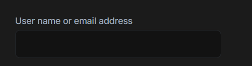

```json
//[doc-seo]
{
    "Description": "Explore the ABP Form Input Component documentation to learn how to easily implement reusable text input fields in your applications."
}
```

# Form Input Component

The ABP FormInput Component is a reusable form input component for the text type.

# Inputs
* `label`
* `labelClass (default form-label)`
* `inputPlaceholder`
* `inputReadonly`
* `inputClass (default form-control)`

# Outputs
* `formBlur`
* `formFocus`

# Usage

The ABP FormInput component (`AbpFormInputComponent`) is a standalone component. You can import it directly in your component:

```ts
import { Component } from "@angular/core";
import { AbpFormInputComponent } from "@abp/ng.theme.shared";

@Component({
  selector: 'app-form-input-demo',
  imports: [AbpFormInputComponent],
  templateUrl: './form-input-demo.component.html',
})
export class FormInputDemoComponent {}
```

Then, the `abp-form-input` component can be used in your template. See the example below:

```html
<div class="row">
  <div class="col-4">
    <abp-form-input
	label="AbpAccount::UserNameOrEmailAddress"
	inputId="login-input-user-name-or-email-address"
     ></abp-form-input>
  </div>
</div>
```

See the form input result below:


