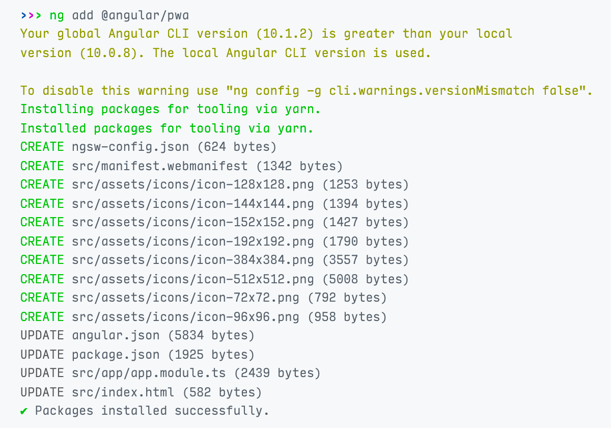

```json
//[doc-seo]
{
    "Description": "Learn how to easily convert your Angular application into a Progressive Web App (PWA) and leverage native features for enhanced user experience."
}
```

# PWA Configuration

[Progressive Web Apps](https://web.dev/progressive-web-apps/) are web applications which, although not as integrated to the OS as a native app, can take advantage of native features. They can be discovered via search engines, installed on devices with a single tap or click, and shared via a regular link. They also can work offline and get updates when new content is available.

Converting your Angular application to a PWA is easy.

## 1. Install Angular PWA

Run the following command in the root folder of your Angular application:

```shell
yarn ng add @angular/pwa
```

...or...

```shell
npm run ng add @angular/pwa
```

This will install the `@angular/service-worker` package and make your default app a PWA. Alternatively, you may add `project` parameter to target a specific app in your workspace:

```shell
yarn ng add @angular/pwa --project MyProjectName
```

Here is the output of the command:



So, Angular CLI updates some files and add a few others:

- **ngsw-config.json** is where the [service worker configuration](https://angular.dev/ecosystem/service-workers/config) is placed. Not all PWAs have this file. It is specific to Angular.
- **manifest.webmanifest** is a [web app manifest](https://developer.mozilla.org/en-US/docs/Web/Manifest) and provides information about your app in JSON format.
- **icons** are placeholder icons that are referred to in your web app manifest. We will replace these in a minute.
- **angular.json** has following modifications:
  - `assets` include _manifest.webmanifest_.
  - `serviceWorker` is `true` in production build.
  - `ngswConfigPath` refers to _ngsw-config.json_.
- **package.json** has _@angular/service-worker_ as a new dependency.
- **app.config.ts** The `provideServiceWorker` provider is imported to register the service worker script.
- **index.html** has following modifications:
  - A `<link>` element that refers to _manifest.webmanifest_.
  - A `<meta>` tag that sets a theme color.

## 2. Update the Web App Manifest

### 2.1. Set the Name of Your App

The `name` and the `short_name` properties in the generated manifest are derived from your project name. Let's change them.

Open the _manifest.webmanifest_ file and update `name` and `short_name` props:

```json
{
  /* rest of the manifest meta data */
  "short_name": "My Project",
  "name": "My Project: My Catch-Phrase"
}
```

The short name must be really short because it will be displayed on anywhere with limited space, like the launcher and the home screen.

### 2.2. Add a Description

The `@angular/pwa` schematic we just added does not insert a description to your manifest file, but, according to [web app manifest standards](https://www.w3.org/TR/appmanifest/#description-member), you should.

So, open the _manifest.webmanifest_ file and place the description as seen below:

```json
{
  /* rest of the manifest meta data */
  "description": "My short project description giving a slightly better idea about my app"
}
```

As a bonus, providing a description [along with other criteria](https://docs.microsoft.com/en-us/microsoft-edge/progressive-web-apps-edgehtml/microsoft-store#criteria-for-automatic-submission) helps Bing web crawler to index your app and automatically submit your app to Microsoft Store in `.appx` format.

### 2.3. Set App Colors

Angular generates the manifest file with a default `theme_color` and `background_color`. Change these according to your brand identity:

Open the _manifest.webmanifest_ file and update `theme_color` and `background_color` properties:

```json
{
  /* rest of the manifest meta data */
  "theme_color": "#000000",
  "background_color": "#ffffff"
}
```

Then open _index.html_ and change the theme color meta tag as below:

```html
<meta name="theme-color" content="#000000" />
```

### 2.4. Replace App Icons & Add Splash Screens

We need to update the icons and add some splash screens. This normally is time-consuming, but we will use the marvelous [pwa-asset-generator](https://github.com/onderceylan/pwa-asset-generator#readme) library.

First, open the _manifest.webmanifest_ file and remove all elements in the `icons` property:

```json
{
  /* rest of the manifest meta data */
  "icons": []
}
```

Then, run the following command in your terminal (changing the path of course):

```shell
npx pwa-asset-generator /path/to/your/logo.png ./src/assets/pwa -i ./src/index.html -m ./src/manifest.webmanifest
```

Open the _manifest.webmanifest_ file again. You will see this:

```json
{
  /* rest of the manifest meta data */
  "icons": [
    {
      "src": "../manifest-icon-192.png",
      "sizes": "192x192",
      "type": "image/png",
      "purpose": "maskable any"
    },
    {
      "src": "../manifest-icon-512.png",
      "sizes": "512x512",
      "type": "image/png",
      "purpose": "maskable any"
    }
  ]
}
```

In addition to updated icons, the library will generate splash screens. However, Apple requires all splash screens to be added in your _index.html_ and displays a blank screen at startup otherwise. So, the following tags will be inserted into the _index.html_ file:

```html
<link
  rel="apple-touch-icon"
  sizes="180x180"
  href="assets/pwa/apple-icon-180.jpg"
/>
<link
  rel="apple-touch-icon"
  sizes="167x167"
  href="assets/pwa/apple-icon-167.jpg"
/>
<link
  rel="apple-touch-icon"
  sizes="152x152"
  href="assets/pwa/apple-icon-152.jpg"
/>
<link
  rel="apple-touch-icon"
  sizes="120x120"
  href="assets/pwa/apple-icon-120.jpg"
/>

<meta name="apple-mobile-web-app-capable" content="yes" />

<link
  rel="apple-touch-startup-image"
  href="assets/pwa/apple-splash-2048-2732.jpg"
  media="(device-width: 1024px) and (device-height: 1366px) and (-webkit-device-pixel-ratio: 2) and (orientation: portrait)"
/>
<link
  rel="apple-touch-startup-image"
  href="assets/pwa/apple-splash-2732-2048.jpg"
  media="(device-width: 1024px) and (device-height: 1366px) and (-webkit-device-pixel-ratio: 2) and (orientation: landscape)"
/>
<link
  rel="apple-touch-startup-image"
  href="assets/pwa/apple-splash-1668-2388.jpg"
  media="(device-width: 834px) and (device-height: 1194px) and (-webkit-device-pixel-ratio: 2) and (orientation: portrait)"
/>
<link
  rel="apple-touch-startup-image"
  href="assets/pwa/apple-splash-2388-1668.jpg"
  media="(device-width: 834px) and (device-height: 1194px) and (-webkit-device-pixel-ratio: 2) and (orientation: landscape)"
/>
<link
  rel="apple-touch-startup-image"
  href="assets/pwa/apple-splash-1536-2048.jpg"
  media="(device-width: 768px) and (device-height: 1024px) and (-webkit-device-pixel-ratio: 2) and (orientation: portrait)"
/>
<link
  rel="apple-touch-startup-image"
  href="assets/pwa/apple-splash-2048-1536.jpg"
  media="(device-width: 768px) and (device-height: 1024px) and (-webkit-device-pixel-ratio: 2) and (orientation: landscape)"
/>
<link
  rel="apple-touch-startup-image"
  href="assets/pwa/apple-splash-1668-2224.jpg"
  media="(device-width: 834px) and (device-height: 1112px) and (-webkit-device-pixel-ratio: 2) and (orientation: portrait)"
/>
<link
  rel="apple-touch-startup-image"
  href="assets/pwa/apple-splash-2224-1668.jpg"
  media="(device-width: 834px) and (device-height: 1112px) and (-webkit-device-pixel-ratio: 2) and (orientation: landscape)"
/>
<link
  rel="apple-touch-startup-image"
  href="assets/pwa/apple-splash-1620-2160.jpg"
  media="(device-width: 810px) and (device-height: 1080px) and (-webkit-device-pixel-ratio: 2) and (orientation: portrait)"
/>
<link
  rel="apple-touch-startup-image"
  href="assets/pwa/apple-splash-2160-1620.jpg"
  media="(device-width: 810px) and (device-height: 1080px) and (-webkit-device-pixel-ratio: 2) and (orientation: landscape)"
/>
<link
  rel="apple-touch-startup-image"
  href="assets/pwa/apple-splash-1242-2688.jpg"
  media="(device-width: 414px) and (device-height: 896px) and (-webkit-device-pixel-ratio: 3) and (orientation: portrait)"
/>
<link
  rel="apple-touch-startup-image"
  href="assets/pwa/apple-splash-2688-1242.jpg"
  media="(device-width: 414px) and (device-height: 896px) and (-webkit-device-pixel-ratio: 3) and (orientation: landscape)"
/>
<link
  rel="apple-touch-startup-image"
  href="assets/pwa/apple-splash-1125-2436.jpg"
  media="(device-width: 375px) and (device-height: 812px) and (-webkit-device-pixel-ratio: 3) and (orientation: portrait)"
/>
<link
  rel="apple-touch-startup-image"
  href="assets/pwa/apple-splash-2436-1125.jpg"
  media="(device-width: 375px) and (device-height: 812px) and (-webkit-device-pixel-ratio: 3) and (orientation: landscape)"
/>
<link
  rel="apple-touch-startup-image"
  href="assets/pwa/apple-splash-828-1792.jpg"
  media="(device-width: 414px) and (device-height: 896px) and (-webkit-device-pixel-ratio: 2) and (orientation: portrait)"
/>
<link
  rel="apple-touch-startup-image"
  href="assets/pwa/apple-splash-1792-828.jpg"
  media="(device-width: 414px) and (device-height: 896px) and (-webkit-device-pixel-ratio: 2) and (orientation: landscape)"
/>
<link
  rel="apple-touch-startup-image"
  href="assets/pwa/apple-splash-1080-1920.jpg"
  media="(device-width: 360px) and (device-height: 640px) and (-webkit-device-pixel-ratio: 3) and (orientation: portrait)"
/>
<link
  rel="apple-touch-startup-image"
  href="assets/pwa/apple-splash-1920-1080.jpg"
  media="(device-width: 360px) and (device-height: 640px) and (-webkit-device-pixel-ratio: 3) and (orientation: landscape)"
/>
<link
  rel="apple-touch-startup-image"
  href="assets/pwa/apple-splash-750-1334.jpg"
  media="(device-width: 375px) and (device-height: 667px) and (-webkit-device-pixel-ratio: 2) and (orientation: portrait)"
/>
<link
  rel="apple-touch-startup-image"
  href="assets/pwa/apple-splash-1334-750.jpg"
  media="(device-width: 375px) and (device-height: 667px) and (-webkit-device-pixel-ratio: 2) and (orientation: landscape)"
/>
<link
  rel="apple-touch-startup-image"
  href="assets/pwa/apple-splash-640-1136.jpg"
  media="(device-width: 320px) and (device-height: 568px) and (-webkit-device-pixel-ratio: 2) and (orientation: portrait)"
/>
<link
  rel="apple-touch-startup-image"
  href="assets/pwa/apple-splash-1136-640.jpg"
  media="(device-width: 320px) and (device-height: 568px) and (-webkit-device-pixel-ratio: 2) and (orientation: landscape)"
/>
```

## 3. Configure Service Worker

Once the PWA schematic is installed and the manifest is customized, you should review and tune the Angular service worker configuration.

The configuration lives in `ngsw-config.json` and controls **what is cached**, **how it is cached**, and **for how long**. See Angular’s [service worker configuration](https://angular.dev/ecosystem/service-workers/config) for full details.


### 3.1. Minimal starter configuration

This is a **simple, safe default** that works well for most ABP Angular applications:

```json
{
  "$schema": "./node_modules/@angular/service-worker/config/schema.json",
  "index": "/index.html",
  "assetGroups": [
    {
      "name": "app",
      "installMode": "prefetch",
      "resources": {
        "files": ["/favicon.ico", "/index.html", "/manifest.webmanifest", "/*.css", "/*.js"]
      }
    },
    {
      "name": "assets",
      "installMode": "lazy",
      "updateMode": "prefetch",
      "resources": {
        "files": [
          "/assets/**",
          "/*.(eot|svg|cur|jpg|jpeg|png|apng|webp|avif|gif|otf|ttf|woff|woff2)"
        ]
      }
    }
  ]
}
```

- `app` group: prefetches the application shell (HTML, JS, CSS, manifest) so the UI loads quickly and works offline after first visit.
- `assets` group: lazily caches static assets (images, fonts, etc.) as they are requested.

> **Note**: The `"/*.js"` pattern is intentionally generic to work with modern Angular build outputs. Always adapt patterns to match your actual `dist/<project>/browser` files if you customize the build.


### 3.2. Advanced: separate lazy modules

If your app uses many lazy‑loaded feature modules and you want more control over their caching, you can split them into a dedicated group:

```json
{
  "$schema": "./node_modules/@angular/service-worker/config/schema.json",
  "index": "/index.html",
  "assetGroups": [
    {
      "name": "app",
      "installMode": "prefetch",
      "resources": {
        "files": [
          "/favicon.ico",
          "/index.html",
          "/manifest.webmanifest",
          "/*.css",
          "/main.*.js",
          "/polyfills.*.js",
          "/runtime.*.js",
          "/vendor.*.js"
        ]
      }
    },
    {
      "name": "modules",
      "installMode": "lazy",
      "updateMode": "prefetch",
      "resources": {
        "files": ["/*.*.js", "!/main.*.js", "!/polyfills.*.js", "!/runtime.*.js", "!/vendor.*.js"]
      }
    },
    {
      "name": "assets",
      "installMode": "lazy",
      "updateMode": "prefetch",
      "resources": {
        "files": [
          "/assets/**",
          "/*.(eot|svg|cur|jpg|jpeg|png|apng|webp|avif|gif|otf|ttf|woff|woff2)"
        ]
      }
    }
  ]
}
```

- `app`: core shell bundles that should always be prefetched.
- `modules`: lazy‑loaded feature bundles that are cached only when actually used, then updated in the background.
- `assets`: all static files.

For ABP Angular apps that use `index.csr.html` (CSR/SSR setups), you can add it into the `app` group as well:

```json
"/index.csr.html",
"/index.html",
```


### 3.3. Example `dataGroups` for API caching

`dataGroups` control **HTTP request caching**. This is highly application‑specific, but a small, explicit example is very helpful:

```json
{
  "$schema": "./node_modules/@angular/service-worker/config/schema.json",
  "index": "/index.html",
  "assetGroups": [
    // ...
  ],
  "dataGroups": [
    {
      "name": "api",
      "urls": ["/api/**"],
      "cacheConfig": {
        "strategy": "freshness",
        "maxSize": 50,
        "maxAge": "1h",
        "timeout": "5s"
      }
    }
  ]
}
```

- `urls`: which HTTP URLs are cached (`/api/**` is an example; narrow this to specific APIs in real apps).
- `strategy: "freshness"`: try network first, fall back to cache if the network is too slow (`timeout`) or offline.
- `maxSize`: maximum number of request entries stored.
- `maxAge`: how long a cached response is considered fresh.

For endpoints where stale data is acceptable and you want faster responses, you can use `"strategy": "performance"` instead.

> **Important**: Be careful not to cache authenticated or highly dynamic endpoints unless you fully understand the implications (stale user data, security, GDPR, etc.).


### 3.4. Build and verify

After changing `ngsw-config.json`:

1. **Build with service worker enabled** (production config):

   ```bash
   ng build --configuration production
   ```

2. **Serve the built app over HTTP/HTTPS** and open it in the browser.

3. In Chrome DevTools → **Application**:
   - **Service Workers**: ensure `ngsw-worker.js` is _installed_ and _controlling the page_.
   - **Manifest**: verify the manifest and that the app is installable.

4. **Test offline**:
   - Load the app once while online.
   - Enable “Offline” in DevTools → Network and reload.
   - The shell and static assets configured in `assetGroups` should still work.

For further customization, refer to the official Angular service worker docs:  
[https://angular.dev/ecosystem/service-workers/config](https://angular.dev/ecosystem/service-workers/config).
