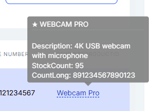

```json
//[doc-seo]
{
    "Description": "Define dynamic entities using C# attributes and configure them with the Fluent API in the ABP Low-Code System. The primary way to build auto-generated admin panels."
}
```

# Attributes & Fluent API

C# Attributes and the Fluent API are the **recommended way** to define dynamic entities. They provide compile-time checking, IntelliSense, refactoring support, and keep your entity definitions close to your domain code.

## Quick Start

### Step 1: Define an Entity

````csharp
[DynamicEntity]
[DynamicEntityUI(PageTitle = "Products")]
public class Product : DynamicEntityBase
{
    [DynamicPropertyUnique]
    public string Name { get; set; }

    [DynamicPropertyUI(DisplayName = "Unit Price")]
    public decimal Price { get; set; }

    public int StockCount { get; set; }

    public DateTime? ReleaseDate { get; set; }
}
````

### Step 2: Add Migration and Run

```bash
dotnet ef migrations add Added_Product
dotnet ef database update
```

You now have a complete Product management page with data grid, create/edit modals, search, sorting, and pagination.

### Step 3: Add Relationships

````csharp
[DynamicEntity]
[DynamicEntityUI(PageTitle = "Orders")]
public class Order : DynamicEntityBase
{
    [DynamicForeignKey("MyApp.Customers.Customer", "Name", ForeignAccess.Edit)]
    public Guid CustomerId { get; set; }

    public decimal TotalAmount { get; set; }
    public bool IsDelivered { get; set; }
}

[DynamicEntity(Parent = "MyApp.Orders.Order")]
public class OrderLine : DynamicEntityBase
{
    [DynamicForeignKey("MyApp.Products.Product", "Name")]
    public Guid ProductId { get; set; }

    public int Quantity { get; set; }
    public decimal Amount { get; set; }
}
````

The `Order` page now has a foreign key dropdown for Customer, and `OrderLine` is managed as a nested child inside the Order detail modal.

## Three-Layer Configuration System

The Low-Code System uses a layered configuration model. From lowest to highest priority:

1. **Code Layer** — C# classes with `[DynamicEntity]` and other attributes
2. **JSON Layer** — `model.json` file (see [model.json Structure](model-json.md))
3. **Fluent Layer** — `AbpDynamicEntityConfig.EntityConfigurations`

A `DefaultLayer` runs last to fill in any missing values with conventions.

> When the same entity or property is configured in multiple layers, the higher-priority layer wins.

## C# Attributes Reference

### `[DynamicEntity]`

Marks a class as a dynamic entity. The entity name is derived from the class namespace and name.

````csharp
[DynamicEntity]
public class Product : DynamicEntityBase
{
    public string Name { get; set; }
    public decimal Price { get; set; }
}
````

Use the `Parent` property for parent-child (master-detail) relationships:

````csharp
[DynamicEntity(Parent = "MyApp.Orders.Order")]
public class OrderLine : DynamicEntityBase
{
    public Guid ProductId { get; set; }
    public int Quantity { get; set; }
}
````

### `[DynamicEntityUI]`

Configures entity-level UI. Entities with `PageTitle` get a menu item and a dedicated page:

````csharp
[DynamicEntity]
[DynamicEntityUI(PageTitle = "Product Management")]
public class Product : DynamicEntityBase
{
    // ...
}
````

### `[DynamicForeignKey]`

Defines a foreign key relationship on a `Guid` property:

````csharp
[DynamicForeignKey("MyApp.Customers.Customer", "Name", ForeignAccess.Edit)]
public Guid CustomerId { get; set; }
````

| Parameter | Description |
|-----------|-------------|
| `entityName` | Full name of the target entity — can be a **dynamic entity** (e.g., `"MyApp.Customers.Customer"`) or a **[reference entity](reference-entities.md)** (e.g., `"Volo.Abp.Identity.IdentityUser"`) |
| `displayPropertyName` | Property to show in lookups |
| `access` | `ForeignAccess.None`, `ForeignAccess.View`, or `ForeignAccess.Edit` (see [Foreign Access](foreign-access.md)) |

### `[DynamicPropertyUI]`

Controls property visibility and behavior in the UI:

````csharp
[DynamicPropertyUI(
    DisplayName = "Registration Number",
    IsAvailableOnListing = true,
    IsAvailableOnDataTableFiltering = true,
    CreationFormAvailability = EntityPropertyUIFormAvailability.Hidden,
    EditingFormAvailability = EntityPropertyUIFormAvailability.NotAvailable,
    QuickLookOrder = 100
)]
public string RegistrationNumber { get; set; }
````

| Property | Type | Default | Description |
|----------|------|---------|-------------|
| `DisplayName` | string | null | Custom label for the property |
| `IsAvailableOnListing` | bool | `true` | Show in data grid |
| `IsAvailableOnDataTableFiltering` | bool | `true` | Show in filter panel |
| `CreationFormAvailability` | enum | `Available` | Visibility on create form |
| `EditingFormAvailability` | enum | `Available` | Visibility on edit form |
| `QuickLookOrder` | int | `-2` | Order in quick-look panel |

The quick-look panel shows a summary of the selected record:



### `[DynamicPropertyServerOnly]`

Hides a property from API clients entirely. It is stored in the database but never returned to the client:

````csharp
[DynamicPropertyServerOnly]
public string InternalNotes { get; set; }
````

### `[DynamicPropertySetByClients]`

Controls whether clients can set this property value. Useful for computed or server-assigned fields:

````csharp
[DynamicPropertySetByClients(false)]
public string RegistrationNumber { get; set; }
````

### `[DynamicPropertyUnique]`

Marks a property as requiring unique values across all records:

````csharp
[DynamicPropertyUnique]
public string ProductCode { get; set; }
````

### `[DynamicEntityCommandInterceptor]`

Defines JavaScript interceptors on a class for CRUD lifecycle hooks:

````csharp
[DynamicEntity]
[DynamicEntityCommandInterceptor(
    "Create",
    InterceptorType.Pre,
    "if(!context.commandArgs.data['Name']) { globalError = 'Name is required!'; }"
)]
[DynamicEntityCommandInterceptor(
    "Delete",
    InterceptorType.Post,
    "context.log('Deleted: ' + context.commandArgs.entityId);"
)]
public class Organization : DynamicEntityBase
{
    public string Name { get; set; }
}
````

> The `Name` parameter must be one of: `"Create"`, `"Update"`, or `"Delete"`. The `InterceptorType` can be `Pre`, `Post`, or `Replace`. When `Replace` is used, the default DB operation is skipped entirely and only the JavaScript handler runs. **`Replace-Create` must return the new entity's Id** (e.g. `return result.Id;` after `db.insert`). Multiple interceptors can be added to the same class (`AllowMultiple = true`).

See [Interceptors](interceptors.md) for the full JavaScript context API.

### `[DynamicEnum]`

Marks an enum for use in dynamic entity properties:

````csharp
[DynamicEnum]
public enum OrganizationType
{
    Corporate = 0,
    Enterprise = 1,
    Startup = 2,
    Consulting = 3
}
````

Reference in an entity:

````csharp
[DynamicEntity]
[DynamicEntityUI(PageTitle = "Organizations")]
public class Organization : DynamicEntityBase
{
    public string Name { get; set; }
    public OrganizationType OrganizationType { get; set; }
}
````

### Enum Localization

Enum values can be localized using ABP's localization system. Add localization keys in the format `Enum:{EnumTypeName}.{ValueName}` to your localization JSON files:

```json
{
  "culture": "en",
  "texts": {
    "Enum:OrganizationType.Corporate": "Corporate",
    "Enum:OrganizationType.Enterprise": "Enterprise",
    "Enum:OrganizationType.Startup": "Startup",
    "Enum:OrganizationType.Consulting": "Consulting"
  }
}
```

The Blazor UI automatically uses these localization keys for enum dropdowns and display values. If no localization key is found, the enum member name is used as-is.

## Fluent API

The Fluent API has the **highest priority** in the configuration system. Use `AbpDynamicEntityConfig.EntityConfigurations` to override any attribute or JSON setting programmatically.

### Basic Usage

Configure in your Low-Code Initializer (e.g. `MyAppLowCodeInitializer`):

````csharp
public static class MyAppLowCodeInitializer
{
    private static readonly AsyncOneTimeRunner Runner = new();

    public static async Task InitializeAsync()
    {
        await Runner.RunAsync(async () =>
        {
            AbpDynamicEntityConfig.EntityConfigurations.Configure(
                "MyApp.Products.Product",
                entity =>
                {
                    entity.DefaultDisplayPropertyName = "Name";

                    var priceProperty = entity.AddOrGetProperty("Price");
                    priceProperty.AsRequired();
                    priceProperty.UI = new EntityPropertyUIDescriptor
                    {
                        DisplayName = "Unit Price",
                        CreationFormAvailability = EntityPropertyUIFormAvailability.Available
                    };

                    entity.AddOrGetProperty("InternalNotes").AsServerOnly();
                }
            );

            await DynamicModelManager.Instance.InitializeAsync();
        });
    }
}
````

You can also use the generic overload with a type parameter:

````csharp
AbpDynamicEntityConfig.EntityConfigurations.Configure<Product>(entity =>
{
    entity.DefaultDisplayPropertyName = "Name";
});
````

### Entity Configuration

The `Configure` method provides an `EntityDescriptor` instance. You can set its properties directly:

| Property / Method | Description |
|--------|-------------|
| `DefaultDisplayPropertyName` | Set the display property for lookups |
| `Parent` | Set parent entity name for nesting |
| `UI` | Set entity-level UI (`EntityUIDescriptor` with `PageTitle`) |
| `AddOrGetProperty(name)` | Get or create a property descriptor for configuration |
| `FindProperty(name)` | Find a property descriptor by name (returns `null` if not found) |
| `GetProperty(name)` | Get a property descriptor by name (throws if not found) |
| `Interceptors` | List of `CommandInterceptorDescriptor` — add interceptors directly |

### Property Configuration

`AddOrGetProperty` returns an `EntityPropertyDescriptor`. Configure it using direct property assignment and extension methods:

| Property / Extension Method | Description |
|--------|-------------|
| `.AsRequired(bool)` | Mark as required (extension method, returns the descriptor for chaining) |
| `.AsServerOnly(bool)` | Hide from clients (extension method, returns the descriptor for chaining) |
| `.MapToDbField(bool)` | Control if property is stored in DB (extension method, returns the descriptor for chaining) |
| `.IsUnique` | Set to `true` to mark as unique |
| `.AllowSetByClients` | Set to `false` to prevent client writes |
| `.ForeignKey` | Set a `ForeignKeyDescriptor` to configure foreign key relationship |
| `.UI` | Set an `EntityPropertyUIDescriptor` to configure property UI |

### Chaining Extension Methods

The extension methods `AsRequired()`, `AsServerOnly()`, and `MapToDbField()` return the property descriptor, enabling fluent chaining:

````csharp
entity.AddOrGetProperty("InternalNotes")
    .AsServerOnly()
    .AsRequired()
    .MapToDbField();
````

### Configuring Foreign Keys

````csharp
AbpDynamicEntityConfig.EntityConfigurations.Configure(
    "MyApp.Orders.Order",
    entity =>
    {
        var customerIdProperty = entity.AddOrGetProperty("CustomerId");
        customerIdProperty.ForeignKey = new ForeignKeyDescriptor
        {
            EntityName = "MyApp.Customers.Customer",
            DisplayPropertyName = "Name",
            Access = ForeignAccess.Edit
        };
    }
);
````

### Adding Interceptors

````csharp
entity.Interceptors.Add(new CommandInterceptorDescriptor("Create")
{
    Type = InterceptorType.Pre,
    Javascript = "if(!context.commandArgs.data['Name']) { globalError = 'Name is required!'; }"
});
````

## Assembly Registration

Register assemblies containing `[DynamicEntity]` classes in your [Low-Code Initializer](index.md#1-create-a-low-code-initializer):

````csharp
AbpDynamicEntityConfig.SourceAssemblies.Add(
    new DynamicEntityAssemblyInfo(
        typeof(MyDomainModule).Assembly,
        rootNamespace: "MyApp",
        projectRootPath: sourcePath  // For model.json hot-reload
    )
);
````

| Parameter | Description |
|-----------|-------------|
| `assembly` | The assembly containing `[DynamicEntity]` classes and/or `model.json` |
| `rootNamespace` | Root namespace for the assembly (used for embedded resource lookup) |
| `projectRootPath` | Path to the Domain project source folder (enables `model.json` hot-reload in development) |

You can also register entity types directly:

````csharp
AbpDynamicEntityConfig.DynamicEntityTypes.Add(typeof(Product));
AbpDynamicEntityConfig.DynamicEnumTypes.Add(typeof(OrganizationType));
````

## Combining with model.json

Attributes and model.json work together seamlessly. A common pattern:

1. **Define core entities** with C# attributes (compile-time safety)
2. **Add additional entities** via model.json (no recompilation needed)
3. **Fine-tune configuration** with Fluent API (overrides everything)

The three-layer system merges all definitions:

```
Fluent API (highest) > JSON (model.json) > Code (Attributes) > Defaults (lowest)
```

For example, if an attribute sets `[DynamicPropertyUnique]` and model.json sets `"isUnique": false`, the JSON value wins because JSON layer has higher priority than Code layer.

## End-to-End Example

A complete e-commerce-style entity setup:

````csharp
// Enum
[DynamicEnum]
public enum OrderStatus
{
    Pending = 0,
    Processing = 1,
    Shipped = 2,
    Delivered = 3
}

// Customer entity
[DynamicEntity]
[DynamicEntityUI(PageTitle = "Customers")]
public class Customer : DynamicEntityBase
{
    [DynamicPropertyUnique]
    public string Name { get; set; }

    [DynamicPropertyUI(DisplayName = "Phone Number", QuickLookOrder = 100)]
    public string Telephone { get; set; }

    [DynamicForeignKey("Volo.Abp.Identity.IdentityUser", "UserName")]
    public Guid? UserId { get; set; }

    [DynamicPropertyServerOnly]
    public string InternalNotes { get; set; }
}

// Product entity
[DynamicEntity]
[DynamicEntityUI(PageTitle = "Products")]
public class Product : DynamicEntityBase
{
    [DynamicPropertyUnique]
    public string Name { get; set; }

    public decimal Price { get; set; }
    public int StockCount { get; set; }
}

// Order entity with child OrderLine
[DynamicEntity]
[DynamicEntityUI(PageTitle = "Orders")]
[DynamicEntityCommandInterceptor(
    "Update",
    InterceptorType.Pre,
    @"if(context.commandArgs.data['IsDelivered']) {
        if(!context.currentUser.roles.includes('admin')) {
            globalError = 'Only admins can mark as delivered!';
        }
    }"
)]
public class Order : DynamicEntityBase
{
    [DynamicForeignKey("MyApp.Customers.Customer", "Name", ForeignAccess.Edit)]
    public Guid CustomerId { get; set; }

    public decimal TotalAmount { get; set; }
    public bool IsDelivered { get; set; }
    public OrderStatus Status { get; set; }
}

[DynamicEntity(Parent = "MyApp.Orders.Order")]
public class OrderLine : DynamicEntityBase
{
    [DynamicForeignKey("MyApp.Products.Product", "Name")]
    public Guid ProductId { get; set; }

    public int Quantity { get; set; }
    public decimal Amount { get; set; }
}
````

Register everything in your [Low-Code Initializer](index.md#1-create-a-low-code-initializer):

````csharp
public static class MyAppLowCodeInitializer
{
    private static readonly AsyncOneTimeRunner Runner = new();
    
    public static async Task InitializeAsync()
    {
        await Runner.RunAsync(async () =>
        {
            // Reference existing ABP entities
            AbpDynamicEntityConfig.ReferencedEntityList.Add<IdentityUser>("UserName");
            
            // Register assembly
            AbpDynamicEntityConfig.SourceAssemblies.Add(
                new DynamicEntityAssemblyInfo(typeof(MyDomainModule).Assembly)
            );
            
            // Initialize
            await DynamicModelManager.Instance.InitializeAsync();
        });
    }
}
````

Configure your DbContext to implement `IDbContextWithDynamicEntities`:

````csharp
public class MyAppDbContext : AbpDbContext<MyAppDbContext>, IDbContextWithDynamicEntities
{
    // ... constructors and DbSets ...

    protected override void OnModelCreating(ModelBuilder builder)
    {
        builder.ConfigureDynamicEntities();
        base.OnModelCreating(builder);
    }
}
````

Configure your DbContextFactory for EF Core CLI commands:

````csharp
public class MyAppDbContextFactory : IDesignTimeDbContextFactory<MyAppDbContext>
{
    public MyAppDbContext CreateDbContext(string[] args)
    {
        var configuration = BuildConfiguration();
        
        MyAppEfCoreEntityExtensionMappings.Configure();

        // ----- Ensure Low-Code system is initialized before running migrations ---
        LowCodeEfCoreTypeBuilderExtensions.Configure();
        AsyncHelper.RunSync(MyAppLowCodeInitializer.InitializeAsync);
        // -------------------------------

        var builder = new DbContextOptionsBuilder<MyAppDbContext>()
            .UseSqlServer(configuration.GetConnectionString("Default"));
        
        return new MyAppDbContext(builder.Options);
    }
    
    // ... BuildConfiguration method ...
}

This gives you four auto-generated pages (Customers, Products, Orders with nested OrderLines), complete with permissions, menu items, foreign key lookups, and interceptor-based business rules.

## See Also

* [model.json Structure](model-json.md)
* [Reference Entities](reference-entities.md)
* [Interceptors](interceptors.md)
