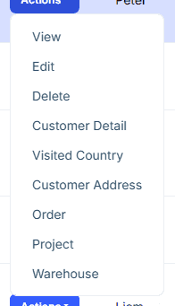
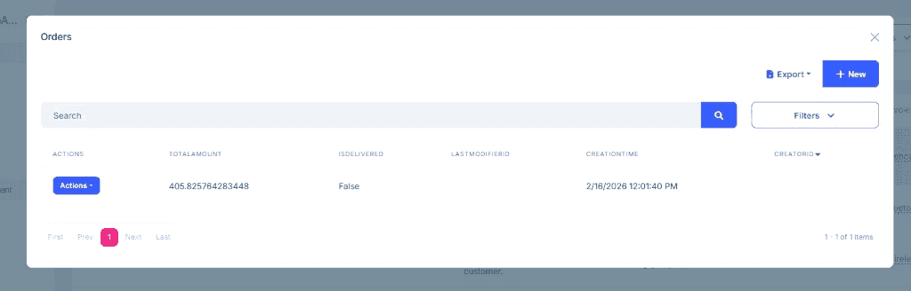

```json
//[doc-seo]
{
    "Description": "Control access to related entities through foreign key relationships using Foreign Access in the ABP Low-Code System."
}
```

# Foreign Access

Foreign Access controls how related **dynamic entities** can be accessed through foreign key relationships. It determines whether users can view or manage related data directly from the **target entity's** UI.

> **Important:** Foreign Access only works between **dynamic entities**. It does not apply to [reference entities](reference-entities.md) because they are read-only and don't have UI pages.

## Access Levels

The `ForeignAccess` enum defines three levels:

| Level | Value | Description |
|-------|-------|-------------|
| `None` | 0 | No access from the target entity side. The relationship exists only for lookups. |
| `View` | 1 | Read-only access. Users can view related records from the target entity's action menu. |
| `Edit` | 2 | Full CRUD access. Users can create, update, and delete related records from the target entity's action menu. |

## Configuring with Attributes

Use the third parameter of `[DynamicForeignKey]`:

````csharp
[DynamicEntity]
public class Order
{
    [DynamicForeignKey("MyApp.Customers.Customer", "Name", ForeignAccess.Edit)]
    public Guid CustomerId { get; set; }
}
````

## Configuring with Fluent API

````csharp
AbpDynamicEntityConfig.EntityConfigurations.Configure(
    "MyApp.Orders.Order",
    entity =>
    {
        var customerIdProperty = entity.AddOrGetProperty("CustomerId");
        customerIdProperty.ForeignKey = new ForeignKeyDescriptor
        {
            EntityName = "MyApp.Customers.Customer",
            DisplayPropertyName = "Name",
            Access = ForeignAccess.Edit
        };
    }
);
````

## Configuring in model.json

Set the `access` field on a foreign key property:

```json
{
  "name": "CustomerId",
  "foreignKey": {
    "entityName": "LowCodeDemo.Customers.Customer",
    "displayPropertyName": "Name",
    "access": "edit"
  }
}
```

### Examples from the Demo Application

**Edit access** — Orders can be managed from the Customer page:

```json
{
  "name": "LowCodeDemo.Orders.Order",
  "properties": [
    {
      "name": "CustomerId",
      "foreignKey": {
        "entityName": "LowCodeDemo.Customers.Customer",
        "access": "edit"
      }
    }
  ]
}
```

**View access** — Visited countries are viewable from the Country page:

```json
{
  "name": "LowCodeDemo.Customers.VisitedCountry",
  "parent": "LowCodeDemo.Customers.Customer",
  "properties": [
    {
      "name": "CountryId",
      "foreignKey": {
        "entityName": "LowCodeDemo.Countries.Country",
        "access": "view"
      }
    }
  ]
}
```

## UI Behavior

When foreign access is configured between two **dynamic entities**:



### `ForeignAccess.View`

An **action menu item** appears on the target entity's data grid row (e.g., a "Visited Countries" item on the Country row). Clicking it opens a read-only modal showing related records.

### `ForeignAccess.Edit`

An **action menu item** appears on the target entity's data grid row (e.g., an "Orders" item on the Customer row). Clicking it opens a fully functional CRUD modal where users can create, edit, and delete related records.



### `ForeignAccess.None`

No action menu item is added. The foreign key exists only for data integrity and lookup display.

## Permission Control

Foreign access actions respect the **entity permissions** of the source entity (the entity with the foreign key). For example, if a user does not have the `Delete` permission for `Order`, the delete button will not appear in the foreign access modal, even if the access level is `Edit`.

## How It Works

The `ForeignAccessRelation` class stores the relationship metadata:

* **Source entity** — the dynamic entity with the foreign key (e.g., `Order`)
* **Target entity** — the dynamic entity being referenced (e.g., `Customer`)
* **Foreign key property** — the property name (e.g., `CustomerId`)
* **Access level** — `None`, `View`, or `Edit`

The `DynamicEntityAppService` checks these relations when building entity actions and filtering data.

> **Terminology:** In foreign access context, "target entity" refers to the entity whose UI shows the action menu (the entity being pointed to by the foreign key). This is different from "reference entity" which specifically means an existing C# entity registered for read-only access.

## See Also

* [model.json Structure](model-json.md)
* [Reference Entities](reference-entities.md)
* [Attributes & Fluent API](fluent-api.md)
