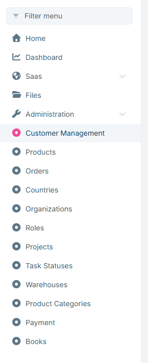
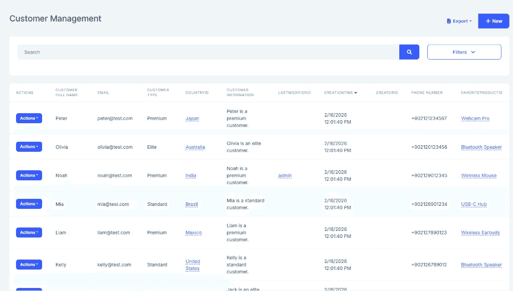
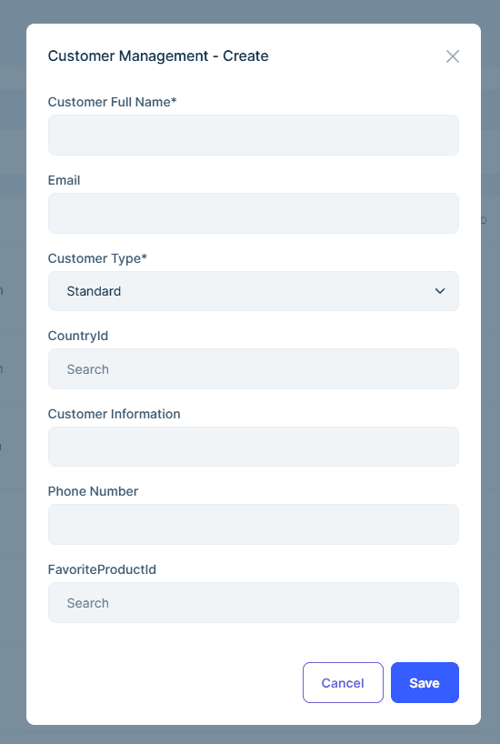

```json
//[doc-seo]
{
    "Description": "ABP Low-Code System: Build admin panels with auto-generated CRUD UI, APIs, and permissions using C# attributes and Fluent API. No boilerplate code needed."
}
```

# Low-Code System

> You must have an ABP Team or a higher license to use this module.

The ABP Low-Code System allows you to define entities using C# attributes or Fluent API and automatically generates:

* **Database tables** (via EF Core migrations)
* **CRUD REST APIs** (Get, GetList, Create, Update, Delete)
* **Permissions** (View, Create, Update, Delete per entity)
* **Menu items** (auto-added to the admin sidebar)
* **Full Blazor UI** (data grid, create/edit modals, filters, foreign key lookups)

No need to write DTOs, application services, repositories, or UI pages manually.



## Why Low-Code?

Traditionally, adding a new entity with full CRUD functionality to an ABP application requires:

* Entity class in Domain
* DbContext configuration in EF Core
* DTOs in Application.Contracts
* AppService in Application
* Controller in HttpApi
* Razor/Blazor pages in UI
* Permissions, menu items, localization

**With Low-Code, a single C# class replaces all of the above:**

````csharp
[DynamicEntity(DefaultDisplayPropertyName = "Name")]
[DynamicEntityUI(PageTitle = "Products")]
public class Product : DynamicEntityBase
{
    [DynamicPropertyUnique]
    public string Name { get; set; }

    [DynamicPropertyUI(DisplayName = "Unit Price")]
    public decimal Price { get; set; }

    public int StockCount { get; set; }

    [DynamicForeignKey("MyApp.Categories.Category", "Name")]
    public Guid? CategoryId { get; set; }
}
````

Run `dotnet ef migrations add Added_Product` and start your application. You get a complete Product management page with search, filtering, sorting, pagination, create/edit forms, and foreign key dropdown — all auto-generated.





## Getting Started

### 1. Create a Low-Code Initializer

Create a static initializer class in your Domain project's `_Dynamic` folder that registers your assembly and calls `DynamicModelManager.Instance.InitializeAsync()`:

````csharp
using Volo.Abp.Identity;
using Volo.Abp.LowCode.Configuration;
using Volo.Abp.LowCode.Modeling;
using Volo.Abp.Threading;

namespace MyApp._Dynamic;

public static class MyAppLowCodeInitializer
{
    private static readonly AsyncOneTimeRunner Runner = new();
    
    public static async Task InitializeAsync()
    {
        await Runner.RunAsync(async () =>
        {
            // Register reference entities (optional — for linking to existing C# entities)
            AbpDynamicEntityConfig.ReferencedEntityList.Add<IdentityUser>(
                nameof(IdentityUser.UserName),
                nameof(IdentityUser.Email)
            );
            
            // Register assemblies containing [DynamicEntity] classes and model.json
            var sourcePath = ResolveDomainSourcePath();
            AbpDynamicEntityConfig.SourceAssemblies.Add(
                new DynamicEntityAssemblyInfo(
                    typeof(MyAppDomainModule).Assembly,
                    rootNamespace: "MyApp",
                    projectRootPath: sourcePath  // Required for model.json hot-reload in development
                )
            );
            
            // Fluent API configurations (optional — highest priority)
            AbpDynamicEntityConfig.EntityConfigurations.Configure("MyApp.Products.Product", entity =>
            {
                entity.AddOrGetProperty("InternalNotes").AsServerOnly();
            });
            
            // Initialize the dynamic model manager
            await DynamicModelManager.Instance.InitializeAsync();
        });
    }
    
    private static string ResolveDomainSourcePath()
    {
        // Traverse up from bin folder to find the Domain project source
        var baseDir = AppContext.BaseDirectory;
        var current = new DirectoryInfo(baseDir);
        
        for (int i = 0; i < 10 && current != null; i++)
        {
            var candidate = Path.Combine(current.FullName, "src", "MyApp.Domain");
            if (Directory.Exists(Path.Combine(candidate, "_Dynamic")))
            {
                return candidate;
            }
            current = current.Parent;
        }
        
        // Fallback for production (embedded resource will be used instead)
        return string.Empty;
    }
}
````

> The `projectRootPath` parameter enables hot-reload of `model.json` during development. When the path is empty or the file doesn't exist, the module falls back to reading `model.json` as an embedded resource.

### 2. Call the Initializer in Program.cs

The initializer must be called **before** the application starts. Add it to `Program.cs`:

````csharp
public static async Task<int> Main(string[] args)
{
    // Initialize Low-Code before building the application
    await MyAppLowCodeInitializer.InitializeAsync();
    
    var builder = WebApplication.CreateBuilder(args);
    // ... rest of your startup code
}
````

> **Important:** The initializer must also be called in your `DbMigrator` project and any other entry points (AuthServer, HttpApi.Host, etc.) that use dynamic entities. This ensures EF Core migrations can discover the entity schema.

### 3. Configure DbContext

Call `ConfigureDynamicEntities()` in your `DbContext`:

````csharp
protected override void OnModelCreating(ModelBuilder builder)
{
    builder.ConfigureDynamicEntities();
    base.OnModelCreating(builder);
}
````

### 3. Define Your First Entity

````csharp
[DynamicEntity]
[DynamicEntityUI(PageTitle = "Customers")]
public class Customer : DynamicEntityBase
{
    public string Name { get; set; }

    [DynamicPropertyUI(DisplayName = "Phone Number")]
    public string Telephone { get; set; }

    [DynamicForeignKey("Volo.Abp.Identity.IdentityUser", "UserName")]
    public Guid? UserId { get; set; }
}
````

### 4. Add Migration and Run

```bash
dotnet ef migrations add Added_Customer
dotnet ef database update
```

Start your application — the Customer page is ready.

## Two Ways to Define Entities

### C# Attributes (Recommended)

Define entities as C# classes with attributes. You get compile-time checking, IntelliSense, and refactoring support:

````csharp
[DynamicEntity]
[DynamicEntityUI(PageTitle = "Orders")]
public class Order : DynamicEntityBase
{
    [DynamicForeignKey("MyApp.Customers.Customer", "Name", ForeignAccess.Edit)]
    public Guid CustomerId { get; set; }

    public decimal TotalAmount { get; set; }
    public bool IsDelivered { get; set; }
}

[DynamicEntity(Parent = "MyApp.Orders.Order")]
public class OrderLine : DynamicEntityBase
{
    [DynamicForeignKey("MyApp.Products.Product", "Name")]
    public Guid ProductId { get; set; }

    public int Quantity { get; set; }
    public decimal Amount { get; set; }
}
````

See [Attributes & Fluent API](fluent-api.md) for the full attribute reference.

### model.json (Declarative)

Alternatively, define entities in a JSON file without writing C# classes:

```json
{
  "entities": [
    {
      "name": "MyApp.Customers.Customer",
      "displayProperty": "Name",
      "properties": [
        { "name": "Name", "isRequired": true },
        { "name": "Telephone", "ui": { "displayName": "Phone Number" } }
      ],
      "ui": { "pageTitle": "Customers" }
    }
  ]
}
```

See [model.json Structure](model-json.md) for the full specification.

> Both approaches can be combined. The [three-layer configuration system](fluent-api.md#three-layer-configuration-system) merges Attributes, JSON, and Fluent API with clear priority rules.

## Key Features

| Feature | Description | Documentation |
|---------|-------------|---------------|
| **Attributes & Fluent API** | Define dynamic entities with C# attributes and configure programmatically | [Attributes & Fluent API](fluent-api.md) |
| **model.json** | Declarative dynamic entity definitions in JSON | [model.json Structure](model-json.md) |
| **Reference Entities** | Read-only access to existing C# entities (e.g., `IdentityUser`) for foreign key lookups | [Reference Entities](reference-entities.md) |
| **Interceptors** | Pre/Post hooks for Create, Update, Delete with JavaScript | [Interceptors](interceptors.md) |
| **Scripting API** | Server-side JavaScript for database queries and CRUD | [Scripting API](scripting-api.md) |
| **Custom Endpoints** | REST APIs with JavaScript handlers | [Custom Endpoints](custom-endpoints.md) |
| **Foreign Access** | View/Edit related dynamic entities from the target entity's UI | [Foreign Access](foreign-access.md) |
| **Export** | Export dynamic entity data to Excel (XLSX) or CSV | See below |

## Export (Excel / CSV)

The Low-Code System provides built-in export functionality for all dynamic entities. Users can export filtered data to **Excel (XLSX)** or **CSV** directly from the Blazor UI.

### How It Works

1. The client calls `GET /api/low-code/entities/{entityName}/download-token` to obtain a single-use download token (valid for 30 seconds).
2. The client calls `GET /api/low-code/entities/{entityName}/export-as-excel` or `GET /api/low-code/entities/{entityName}/export-as-csv` with the token and optional filters.

### API Endpoints

| Endpoint | Description |
|----------|-------------|
| `GET /api/low-code/entities/{entityName}/download-token` | Get a single-use download token |
| `GET /api/low-code/entities/{entityName}/export-as-excel` | Export as Excel (.xlsx) |
| `GET /api/low-code/entities/{entityName}/export-as-csv` | Export as CSV (.csv) |

Export requests accept the same filtering, sorting, and search parameters as the list endpoint. Server-only properties are automatically excluded, and foreign key columns display the referenced entity's display value instead of the raw ID.

## Custom Commands and Queries

The Low-Code System allows you to replace or extend the default CRUD operations by implementing custom command and query handlers in C#.

### Custom Commands

Create a class that implements `ILcCommand<TResult>` and decorate it with `[CustomCommand]`:

````csharp
[CustomCommand("Create", "MyApp.Products.Product")]
public class CustomProductCreateCommand : CreateCommand<Product>
{
    public override async Task<Guid> ExecuteWithResultAsync(DynamicCommandArgs commandArgs)
    {
        // Your custom create logic here
        // ...
    }
}
````

| Parameter | Description |
|-----------|-------------|
| `commandName` | The command to replace: `"Create"`, `"Update"`, or `"Delete"` |
| `entityName` | Full entity name (e.g., `"MyApp.Products.Product"`) |

### Custom Queries

Create a class that implements `ILcQuery<TResult>` and decorate it with `[CustomQuery]`:

````csharp
[CustomQuery("List", "MyApp.Products.Product")]
public class CustomProductListQuery : ILcQuery<DynamicQueryResult>
{
    public async Task<DynamicQueryResult> ExecuteAsync(DynamicQueryArgs queryArgs)
    {
        // Your custom list query logic here
        // ...
    }
}
````

````csharp
[CustomQuery("Single", "MyApp.Products.Product")]
public class CustomProductListQuery : ILcQuery<DynamicEntityDto>
{
    public async Task<DynamicEntityDto> ExecuteAsync(DynamicQueryArgs queryArgs)
    {
        // Your custom single query logic here
        // ...
    }
}
````

| Parameter | Description |
|-----------|-------------|
| `queryName` | The query to replace: `"List"` or `"Single"` |
| `entityName` | Full entity name (e.g., `"MyApp.Products.Product"`) |

Custom commands and queries are automatically discovered and registered at startup. They completely replace the default handler for the specified entity and operation.

## Internals

### Domain Layer

* `DynamicModelManager`: Singleton managing all entity metadata with a layered configuration architecture (Code > JSON > Fluent > Defaults).
* `EntityDescriptor`: Entity definition with properties, foreign keys, interceptors, and UI configuration.
* `EntityPropertyDescriptor`: Property definition with type, validation, UI settings, and foreign key info.
* `IDynamicEntityRepository`: Repository for dynamic entity CRUD operations.

### Application Layer

* `DynamicEntityAppService`: CRUD operations for all dynamic entities (Get, GetList, Create, Update, Delete, Export).
* `DynamicEntityUIAppService`: UI definitions, menu items, and page configurations. Provides:
  * `GetUiDefinitionAsync(entityName)` — Full UI definition (filters, columns, forms, children, foreign access actions, permissions)
  * `GetUiCreationFormDefinitionAsync(entityName)` — Creation form fields with validation rules
  * `GetUiEditFormDefinitionAsync(entityName)` — Edit form fields with validation rules
  * `GetMenuItemsAsync()` — Menu items for all entities that have a `pageTitle` configured (filtered by permissions)
* `DynamicPermissionDefinitionProvider`: Auto-generates permissions per entity.
* `CustomEndpointExecutor`: Executes JavaScript-based custom endpoints.

### Database Providers

**Entity Framework Core**: Dynamic entities are configured as EF Core [shared-type entities](https://learn.microsoft.com/en-us/ef/core/modeling/entity-types?tabs=fluent-api#shared-type-entity-types) via the `ConfigureDynamicEntities()` extension method.

## See Also

* [Attributes & Fluent API](fluent-api.md)
* [model.json Structure](model-json.md)
* [Scripting API](scripting-api.md)
