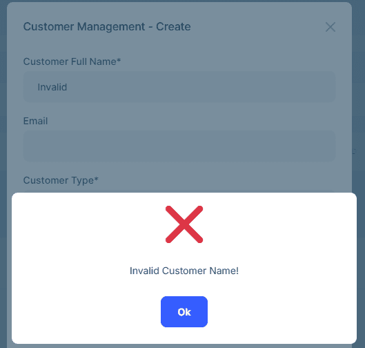

```json
//[doc-seo]
{
    "Description": "Add custom business logic to dynamic entity CRUD operations using Interceptors in the ABP Low-Code System. Validate, transform, and react to data changes with JavaScript."
}
```

# Interceptors

Interceptors allow you to run custom JavaScript code before, after, or instead of Create, Update, and Delete operations on dynamic entities.

## Interceptor Types

| Command | Type | When Executed |
|---------|------|---------------|
| `Create` | `Pre` | Before entity creation — validation, default values |
| `Create` | `Post` | After entity creation — notifications, related data |
| `Create` | `Replace` | Instead of entity creation — **must return the new entity's Id** (see below) |
| `Update` | `Pre` | Before entity update — validation, authorization |
| `Update` | `Post` | After entity update — sync, notifications |
| `Update` | `Replace` | Instead of entity update — no return value needed |
| `Delete` | `Pre` | Before entity deletion — dependency checks |
| `Delete` | `Post` | After entity deletion — cleanup |
| `Delete` | `Replace` | Instead of entity deletion — no return value needed |

## Defining Interceptors with Attributes

Use the `[DynamicEntityCommandInterceptor]` attribute on a C# class:

````csharp
[DynamicEntity]
[DynamicEntityCommandInterceptor(
    "Create",
    InterceptorType.Pre,
    "if(!context.commandArgs.data['Name']) { globalError = 'Name is required!'; }"
)]
[DynamicEntityCommandInterceptor(
    "Create",
    InterceptorType.Post,
    "context.log('Entity created: ' + context.commandArgs.entityId);"
)]
public class Organization
{
    public string Name { get; set; }
}
````

The `Name` parameter must be one of: `"Create"`, `"Update"`, or `"Delete"`. The `InterceptorType` can be `Pre`, `Post`, or `Replace`. When `Replace` is used, the default database operation is completely skipped and only your JavaScript handler executes. Multiple interceptors can be added to the same class (`AllowMultiple = true`).

## Defining Interceptors with Fluent API

Use the `Interceptors` list on an `EntityDescriptor` to add interceptors programmatically in your [Low-Code Initializer](index.md#1-create-a-low-code-initializer):

````csharp
AbpDynamicEntityConfig.EntityConfigurations.Configure(
    "MyApp.Organizations.Organization",
    entity =>
    {
        entity.Interceptors.Add(new CommandInterceptorDescriptor("Create")
        {
            Type = InterceptorType.Pre,
            Javascript = "if(!context.commandArgs.data['Name']) { globalError = 'Name is required!'; }"
        });

        entity.Interceptors.Add(new CommandInterceptorDescriptor("Delete")
        {
            Type = InterceptorType.Post,
            Javascript = "context.log('Deleted: ' + context.commandArgs.entityId);"
        });
    }
);
````

See [Attributes & Fluent API](fluent-api.md#adding-interceptors) for more details on Fluent API configuration.

## Defining Interceptors in model.json

Add interceptors to the `interceptors` array of an entity:

```json
{
  "name": "LowCodeDemo.Customers.Customer",
  "interceptors": [
    {
      "commandName": "Create",
      "type": "Pre",
      "javascript": "if(context.commandArgs.data['Name'] == 'Invalid') {\n  globalError = 'Invalid Customer Name!';\n}"
    }
  ]
}
```

### Interceptor Descriptor

| Field | Type | Description |
|-------|------|-------------|
| `commandName` | string | `"Create"`, `"Update"`, or `"Delete"` |
| `type` | string | `"Pre"`, `"Post"`, or `"Replace"` |
| `javascript` | string | JavaScript code to execute |

## JavaScript Context

Inside interceptor scripts, you have access to:

### `context.commandArgs`

| Property / Method | Type | Description |
|----------|------|-------------|
| `data` | object | Entity data dictionary (for Create/Update) |
| `entityId` | string | Entity ID (for Update/Delete) |
| `commandName` | string | Command name (`"Create"`, `"Update"`, or `"Delete"`) |
| `entityName` | string | Full entity name |
| `getValue(name)` | function | Get a property value |
| `setValue(name, value)` | function | Set a property value (Pre-interceptors only) |
| `hasValue(name)` | function | Check if a property exists in the data |
| `removeValue(name)` | function | Remove a property from the data |

### `context.currentUser`

| Property / Method | Type | Description |
|----------|------|-------------|
| `isAuthenticated` | bool | Whether user is logged in |
| `id` | string | User ID |
| `userName` | string | Username |
| `email` | string | Email address |
| `name` | string | First name |
| `surName` | string | Last name |
| `phoneNumber` | string | Phone number |
| `phoneNumberVerified` | bool | Whether phone is verified |
| `emailVerified` | bool | Whether email is verified |
| `tenantId` | string | Tenant ID (for multi-tenant apps) |
| `roles` | string[] | User's role names |
| `isInRole(roleName)` | function | Check if user has a specific role |

### `context.emailSender`

| Property / Method | Description |
|--------|-------------|
| `isAvailable` | Whether the email sender is configured and available |
| `sendAsync(to, subject, body)` | Send a plain-text email |
| `sendHtmlAsync(to, subject, htmlBody)` | Send an HTML email |

### Logging

| Method | Description |
|--------|-------------|
| `context.log(message)` | Log an informational message |
| `context.logWarning(message)` | Log a warning message |
| `context.logError(message)` | Log an error message |

> Use these methods instead of `console.log` (which is blocked in the sandbox).

### `db` (Database API)

Full access to the [Scripting API](scripting-api.md) for querying and mutating data.

### `globalError`

Set this variable to a string to **abort** the operation and return an error:

```javascript
globalError = 'Cannot delete this entity!';
```



## Examples

### Pre-Create: Validation

```json
{
  "commandName": "Create",
  "type": "Pre",
  "javascript": "if(!context.commandArgs.data['Name']) {\n  globalError = 'Organization name is required!';\n}"
}
```

### Post-Create: Email Notification

```json
{
  "commandName": "Create",
  "type": "Post",
  "javascript": "if(context.currentUser.isAuthenticated && context.emailSender) {\n  await context.emailSender.sendAsync(\n    context.currentUser.email,\n    'New Order Created',\n    'Order total: $' + context.commandArgs.data['TotalAmount']\n  );\n}"
}
```

### Pre-Update: Role-Based Authorization

```json
{
  "commandName": "Update",
  "type": "Pre",
  "javascript": "if(context.commandArgs.data['IsDelivered']) {\n  if(!context.currentUser.roles.includes('admin')) {\n    globalError = 'Only administrators can mark orders as delivered!';\n  }\n}"
}
```

### Pre-Delete: Business Rule Check

```json
{
  "commandName": "Delete",
  "type": "Pre",
  "javascript": "var project = await db.get('LowCodeDemo.Projects.Project', context.commandArgs.entityId);\nif(project.Budget > 100000) {\n  globalError = 'Cannot delete high-budget projects!';\n}"
}
```

### Pre-Update: Negative Value Check

```json
{
  "commandName": "Update",
  "type": "Pre",
  "javascript": "if(context.commandArgs.data['Quantity'] < 0) {\n  globalError = 'Quantity cannot be negative!';\n}"
}
```

### Replace-Create: Custom Insert Logic

When you need to completely replace the default create operation with custom logic:

```json
{
  "commandName": "Create",
  "type": "Replace",
  "javascript": "var data = context.commandArgs.data;\ndata['Code'] = 'PRD-' + Date.now();\nvar result = await db.insert('LowCodeDemo.Products.Product', data);\ncontext.log('Product created with custom code: ' + data['Code']);\nreturn result.Id;"
}
```

> **Important:** `Replace-Create` interceptors **must** return the new entity's `Id` (Guid). The system uses this value to fetch and return the created entity. Use `return result.Id;` after `db.insert(...)`.
>
> `Replace-Update` and `Replace-Delete` interceptors do not need to return a value.

### Pre-Update: Self-Reference Check

```json
{
  "commandName": "Update",
  "type": "Pre",
  "javascript": "if(context.commandArgs.data.ParentCategoryId === context.commandArgs.entityId) {\n  globalError = 'A category cannot be its own parent!';\n}"
}
```

## See Also

* [Scripting API](scripting-api.md)
* [model.json Structure](model-json.md)
* [Custom Endpoints](custom-endpoints.md)
