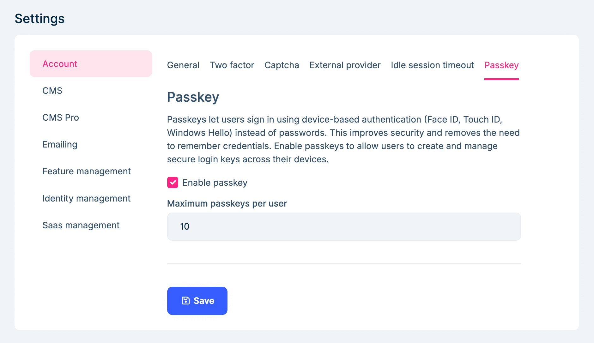
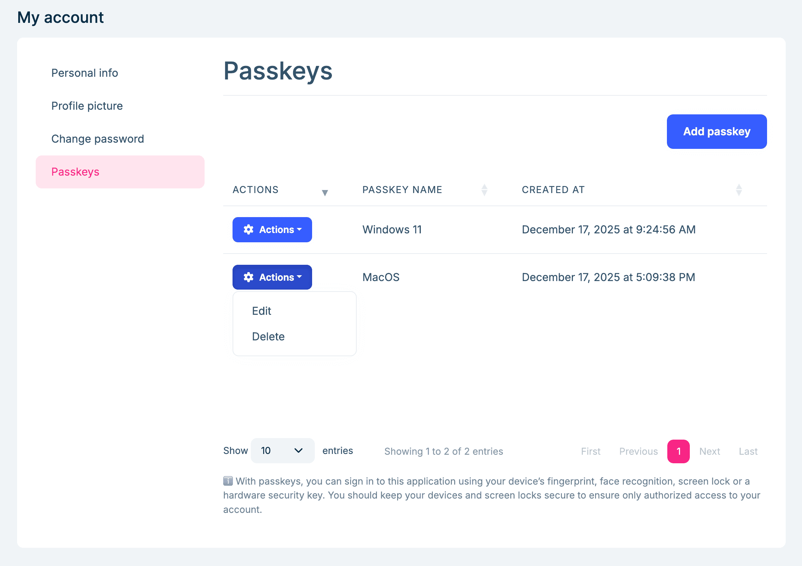
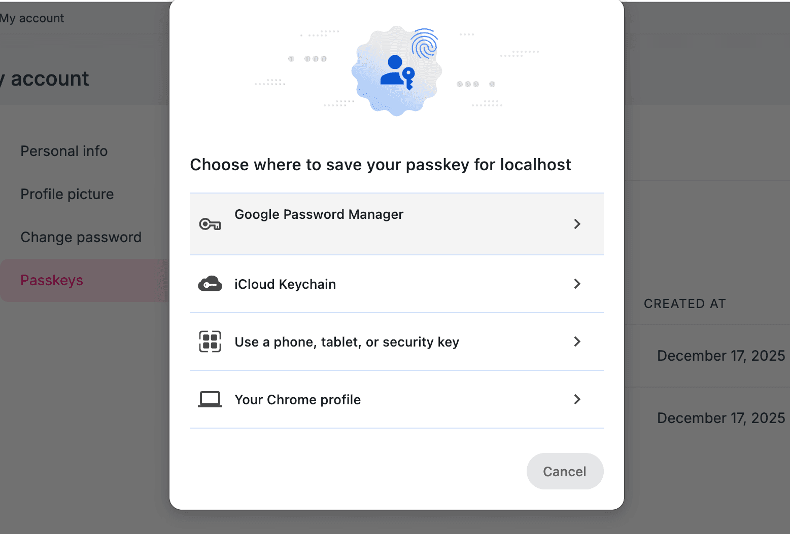
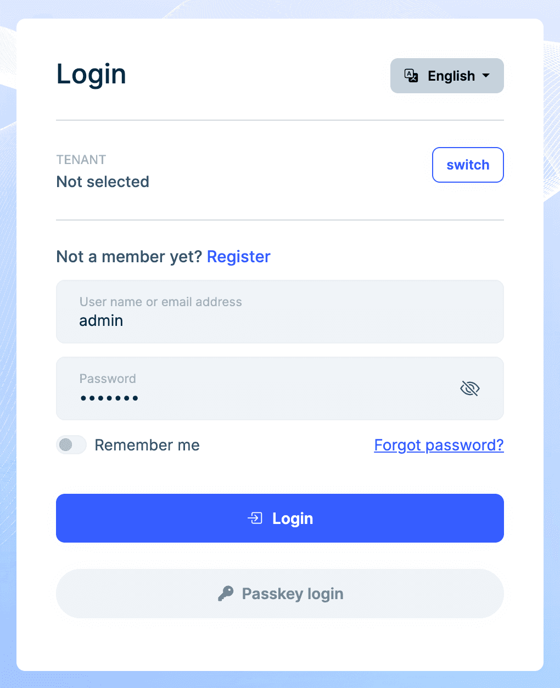
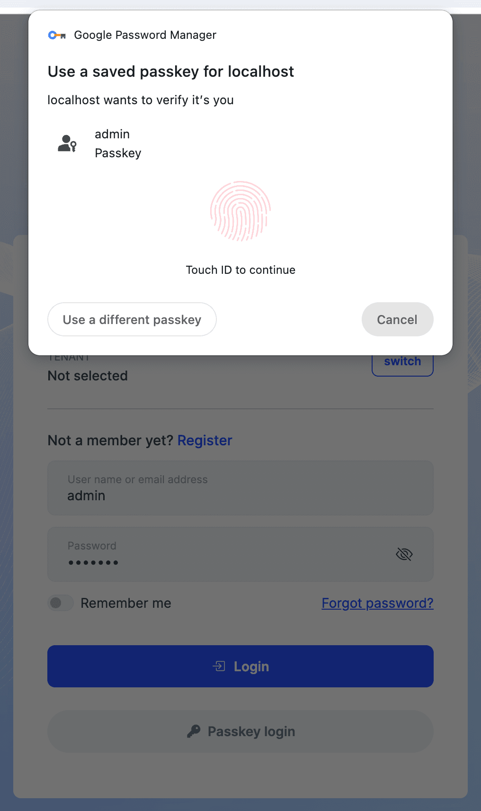

# Web Authentication API (WebAuthn) passkeys

The `Web Authentication API (WebAuthn) passkeys` feature allows users to authenticate using passkeys, which are more secure and user-friendly alternatives to traditional passwords. Passkeys leverage public key cryptography to provide strong authentication without the need for users to remember complex passwords.

## Enabling Passkeys

You can enable/disable the `Web Authentication API (WebAuthn) passkeys` feature in the `Setting > Account > Passkeys` page. Also, there is an option to allow how many passkeys a user can register:



## Manage Passkeys

You can add/rename/delete your passkeys in the `Account/Manage` page:



Click the `Add Passkey` button to register a new passkey. You will be prompted to use your device's built-in biometric authentication (such as fingerprint or facial recognition) or an external security key to complete the registration process:



## Using Passkey for Login

Once you enable the passkey feature and register at least one passkey, you can use it to log in to your account. On the login page, select the `Passkey login` option and follow the prompts to authenticate using your registered passkey:





## Configure passkey options

ASP.NET Core Identity provides various options to configure passkey behavior through the `IdentityPasskeyOptions` class, which include:

- **AuthenticatorTimeout**: Gets or sets the time that the browser should wait for the authenticator to provide a passkey as a TimeSpan. This option applies to both creating a new passkey and requesting an existing passkey. This option is treated as a hint to the browser, and the browser may ignore the option. The default value is 5 minutes.
- **ChallengeSize**: Gets or sets the size of the challenge in bytes sent to the client during attestation and assertion. This option applies to both creating a new passkey and requesting an existing passkey. The default value is 32 bytes.
- **ServerDomain**: Gets or sets the effective Relying Party ID (domain) of the server. This should be unique and will be used as the identity for the server. This option applies to both creating a new passkey and requesting an existing passkey. If null, which is the default value, the server's origin is used. For more information, see Relying Party Identifier RP ID.

**Example configuration:**

```csharp
builder.Services.Configure<IdentityPasskeyOptions>(options =>
{
    options.ServerDomain = "abp.io";
    options.AuthenticatorTimeout = TimeSpan.FromMinutes(3);
    options.ChallengeSize = 64;
});
```

For a complete list of configuration options, see [IdentityPasskeyOptions](https://learn.microsoft.com/en-us/dotnet/api/microsoft.aspnetcore.identity.identitypasskeyoptions). For the most up-to-date browser defaults, see the [W3C WebAuthn specification](https://www.w3.org/TR/webauthn-3/).

## HTTPS requirement

All passkey operations require HTTPS. The implementation stores authentication data in encrypted and signed cookies that could be intercepted over unencrypted connections.

## Browser Support

Passkeys are supported in most modern browsers, including: Chrome, Edge, Firefox, and Safari. Ensure that you are using the latest version of your browser to take advantage of passkey functionality.

## Additional resources

For more information on WebAuthn and passkeys, refer to the following resources:

- [Enable Web Authentication API (WebAuthn) passkeys](https://learn.microsoft.com/en-us/aspnet/core/security/authentication/passkeys)
- [Web Authentication API](https://developer.mozilla.org/en-US/docs/Web/API/Web_Authentication_API)
