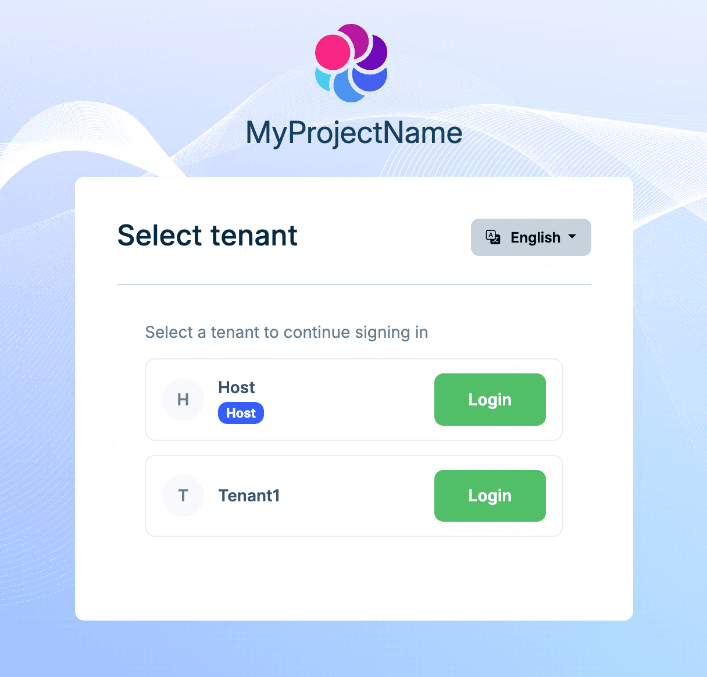
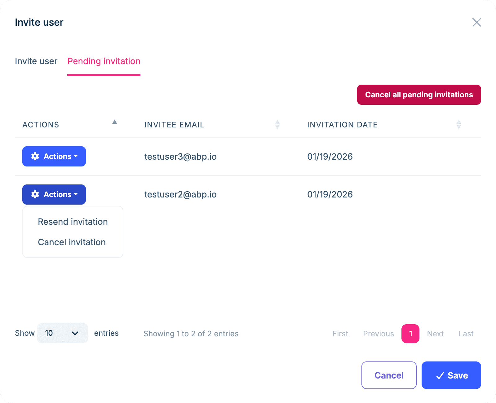
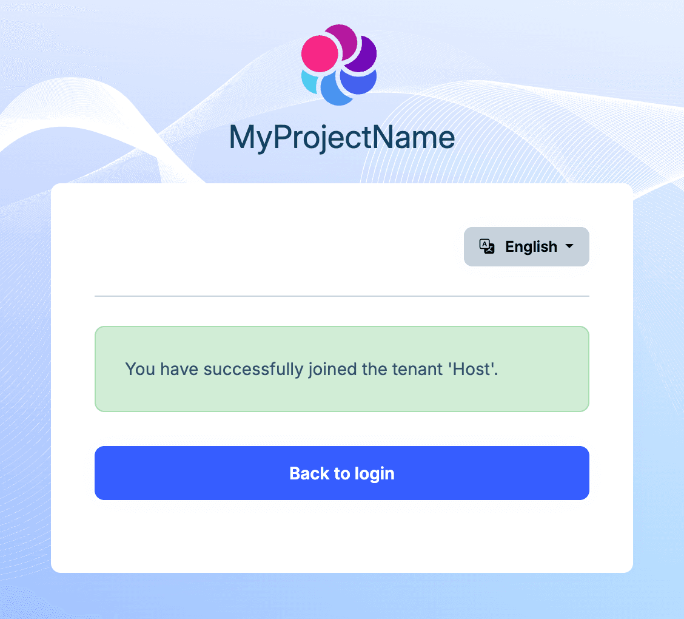
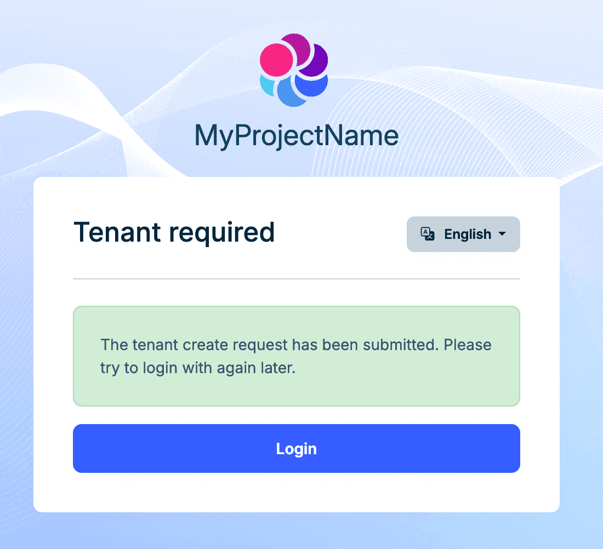

```json
//[doc-seo]
{
    "Description": "Learn how Shared User Accounts work in ABP (UserSharingStrategy): login flow with tenant selection, switching tenants, inviting users, and the Pending Tenant registration flow."
}
```

# Shared User Accounts

This document explains **Shared User Accounts**: a single user account can belong to multiple tenants, and the user can choose/switch the active tenant when signing in.

> This is a **commercial** feature. It is mainly provided by Account.Pro and Identity.Pro (and related SaaS UI).

## Introduction

In a typical multi-tenant setup with the **Isolated** user strategy, a user belongs to exactly one tenant (or the Host), and uniqueness rules (username/email) are usually scoped per tenant.

If you want a `one account, multiple tenants` experience (for example, inviting the same email address into multiple tenants), you should enable the **Shared** user strategy.

## Enabling Shared User Accounts

Enable shared accounts by configuring `AbpMultiTenancyOptions.UserSharingStrategy`:

```csharp
Configure<AbpMultiTenancyOptions>(options =>
{
    options.IsEnabled = true;
    options.UserSharingStrategy = TenantUserSharingStrategy.Shared;
});
```

### Constraints and Behavior

When you use Shared User Accounts:

- Username/email uniqueness becomes **global** (Host + all tenants). A username/email can exist only once, but that user can be invited into multiple tenants.
- Some security/user management settings (2FA, lockout, password policies, recaptcha, etc.) are managed at the **Host** level.

If you are migrating from an isolated strategy, ABP will validate the existing data when you switch to Shared. If there are conflicts (e.g., the same email registered as separate users in different tenants), you must resolve them before enabling the shared strategy. See the [Migration Guide](#migration-guide) section below.

## Tenant Selection During Login

If a user account belongs to multiple tenants, the login flow prompts the user to select the tenant to sign in to:



## Switching Tenants

After signing in, the user can switch between the tenants they have joined using the tenant switcher in the user menu:


## Leaving a Tenant

Users can leave a tenant. After leaving, the user is no longer a member of that tenant, and the tenant can invite the user again later.

> When a user leaves and later re-joins the same tenant, the `UserId` does not change and tenant-related data (roles, permissions, etc.) is preserved.

## Inviting Users to a Tenant

Tenant administrators can invite existing or not-yet-registered users to join a tenant. The invited user receives an email; clicking the link completes the join process. If the user doesn't have an account yet, they can register and join through the same flow.

While inviting, you can also assign roles so the user gets the relevant permissions automatically after joining.

> The invitation feature is also available in the Isolated strategy, but invited users can join only a single tenant.


## Managing Invitations

From the invitation modal, you can view and manage sent invitations, including resending an invitation email and revoking individual or all invitations.



## Accepting an Invitation

If the invited person already has an account, clicking the email link shows a confirmation screen to join the tenant:


If the invited person doesn't have an account yet, clicking the email link takes them to registration and then joins them to the tenant:


After accepting the invitation, the user can sign in and switch to that tenant.



## Inviting an Admin After Tenant Creation

With Shared User Accounts, you typically don't create an `admin` user during tenant creation. Instead, create the tenant first, then invite an existing user (or a new user) and grant the required roles.


> In the Isolated strategy, tenant creation commonly seeds an `admin` user automatically. With Shared User Accounts, you usually use invitations instead.

### Registration Strategy for New Users

When a user registers a new account, the user is not a member of any tenant by default (and is not a Host user). You can configure `AbpIdentityPendingTenantUserOptions.Strategy` to decide what happens next.

Available strategies:

- **CreateTenant**: Automatically creates a tenant for the new user and adds the user to that tenant.
- **Redirect**: Redirects the user to a URL where you can implement custom logic (commonly: a tenant selection/join experience).
- **Inform** (default): Shows an informational message telling the user to contact an administrator to join a tenant.

> In this state, the user can't proceed into a tenant context until they follow the configured strategy.

### CreateTenant Strategy

```csharp
Configure<AbpIdentityPendingTenantUserOptions>(options =>
{
    options.Strategy = AbpIdentityPendingTenantUserStrategy.CreateTenant;
});
```




### Redirect Strategy

```csharp
Configure<AbpIdentityPendingTenantUserOptions>(options =>
{
    options.Strategy = AbpIdentityPendingTenantUserStrategy.Redirect;
    options.RedirectUrl = "/your-custom-logic-url";
});
```

### Inform Strategy

```csharp
Configure<AbpIdentityPendingTenantUserOptions>(options =>
{
    options.Strategy = AbpIdentityPendingTenantUserStrategy.Inform;
});
```


## Tenant Admin vs Host Admin Operations

When the Shared strategy is enabled, a user is a **global resource** across host and all tenants. Their identity, activation state, lockout, password policy and two-factor settings live at the host level. Therefore some user management operations are restricted to host administrators and are not available to tenant administrators.

### Host-only operations

The following operations can only be performed by a host administrator when Shared is enabled. Both the Identity Pro UI (MVC + Blazor) and the `IdentityUserAppService` enforce this — a direct API call from a tenant context will be rejected with a `UserFriendlyException`:

- Delete a user
- Activate / deactivate a user (`IsActive`)
- Lock / unlock a user
- Enable or disable two-factor authentication
- Change `LockoutEnabled` or `ShouldChangePasswordOnNextLogin`

### What tenant admins can do

- Invite users to the tenant (see the Invitation flow above)
- Manage role and organization-unit assignments within the tenant
- View audit / security logs scoped to the tenant

### What a user can do for themselves

Users can leave a tenant from their own account menu (`Switch Tenant` → `Leave`). Leaving marks the tenant membership as `Leaved = true` and preserves the user's host identity, so they can be re-invited later with the same `UserId`.

## Migration Guide

If you plan to migrate an existing multi-tenant application from an isolated strategy to Shared User Accounts, keep the following in mind:

1. **Uniqueness check**: Before enabling Shared, ensure all existing usernames and emails are unique globally. ABP performs this check when you switch the strategy and reports conflicts.
2. **Tenants with separate databases**: If some tenants use separate databases, you must ensure the Host database contains matching user records in the `AbpUsers` table (and, if you use social login / passkeys, also sync `AbpUserLogins` and `AbpUserPasskeys`) so the Host-side records match the tenant-side data. After that, the framework can create/manage the user-to-tenant associations.

