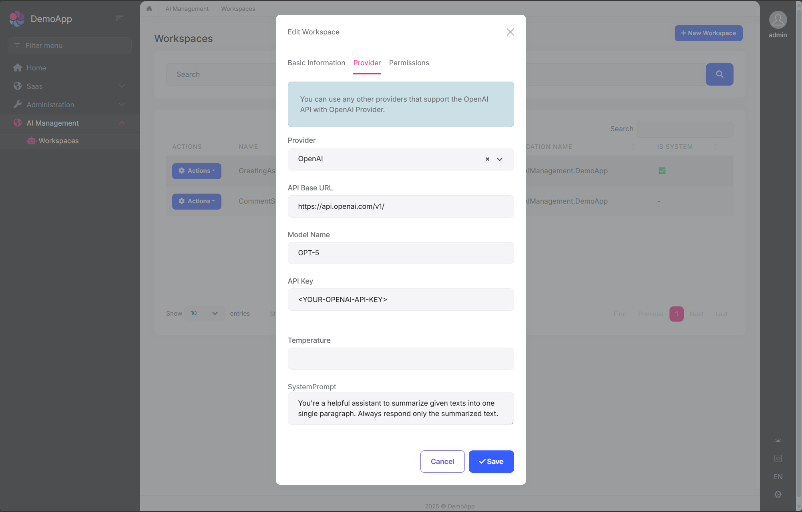
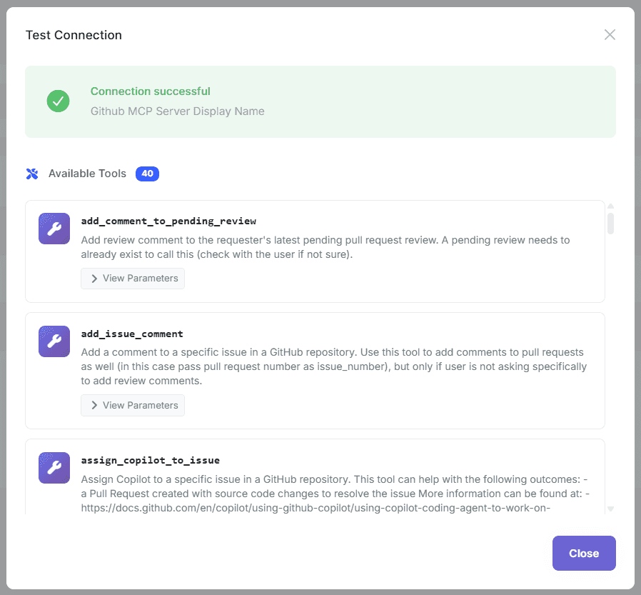
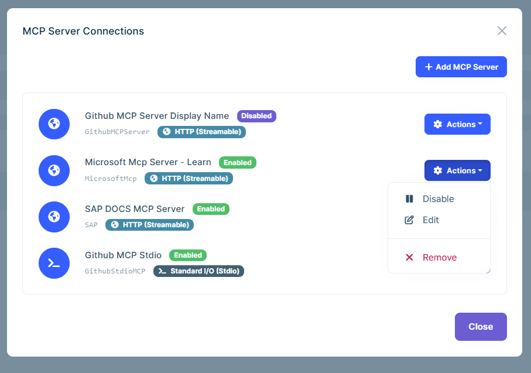
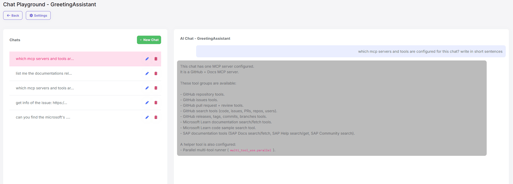
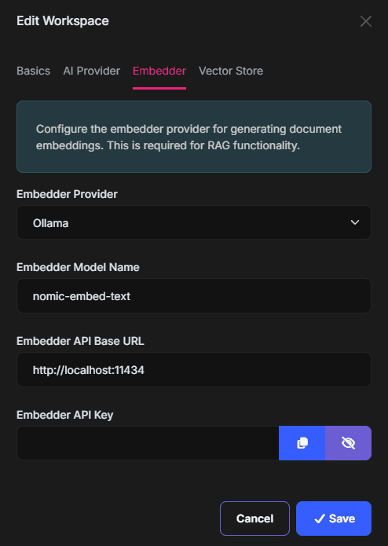
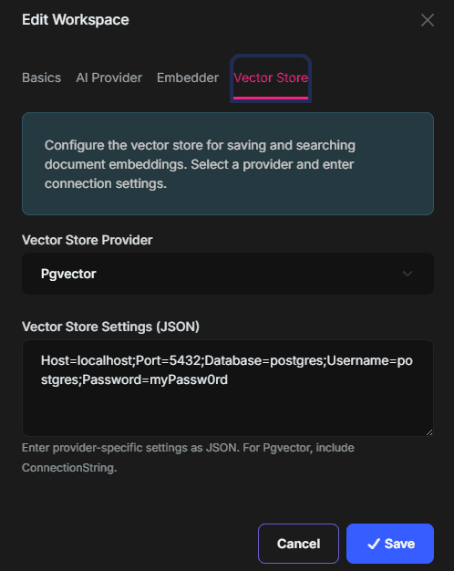
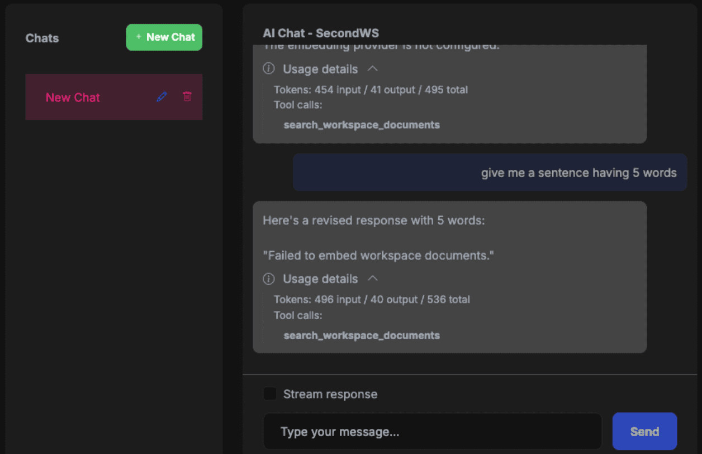
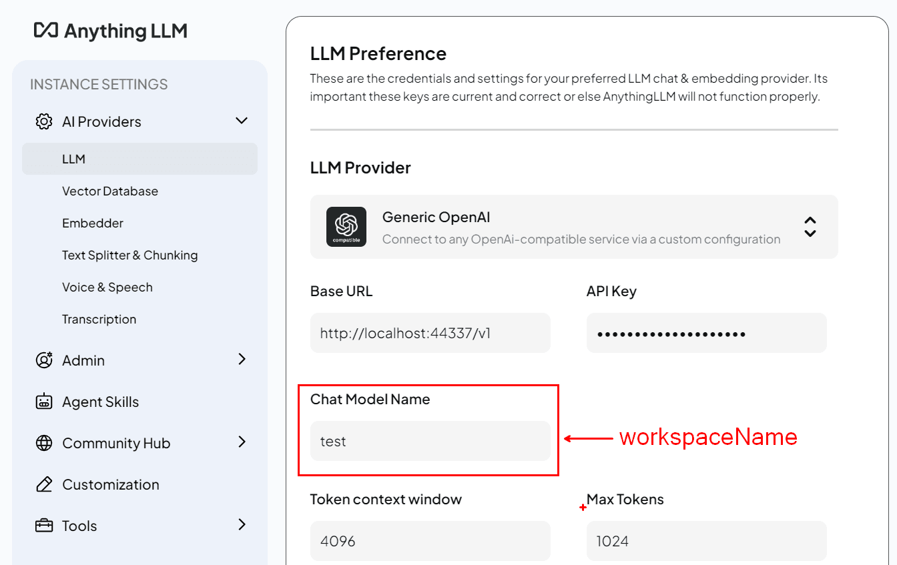
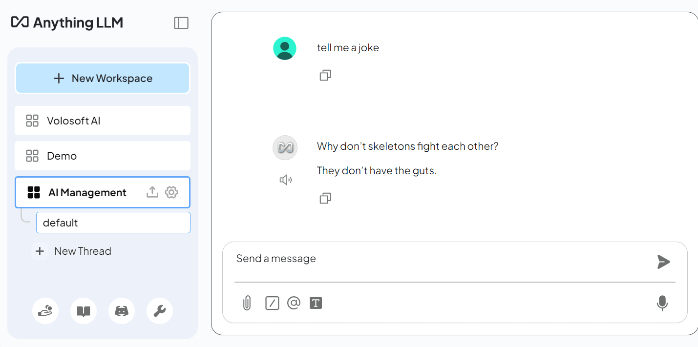

```json
//[doc-seo]
{
    "Description": "Discover how to implement AI management in your ABP Framework application, enhancing workspace dynamics with easy installation options."
}
```

# AI Management (Pro)

> You must have an ABP Team or a higher license to use this module.

This module implements AI (Artificial Intelligence) management capabilities on top of the [Artificial Intelligence Workspaces](../../framework/infrastructure/artificial-intelligence/index.md) feature of the ABP Framework and allows managing workspaces dynamically from the application, including UI components and API endpoints.

## How to Install

The **AI Management Module** is not included in [the startup templates](../solution-templates/layered-web-application) by default. However, when creating a new application with [ABP Studio](../../tools/abp-studio/index.md), you can easily enable it during setup via the *AI Integration* step in the project creation wizard. Alternatively, you can install it using the ABP CLI or ABP Studio:

**Using ABP CLI:**

```bash
abp add-module Volo.AIManagement
```

**Using ABP Studio:**

Open ABP Studio, navigate to your solution explorer, **Right Click** on the project and select **Import Module**. Choose `Volo.AIManagement` from `NuGet` tab and check the "Install this Module" checkbox. Click the "OK" button to install the module.

### Adding an AI Provider

> [!IMPORTANT]
> The AI Management module requires **at least one AI provider** package to be installed. Without a provider, the module won't be able to create chat clients for your workspaces.

Install one of the built-in provider packages using the ABP CLI:

**For OpenAI (including Azure OpenAI-compatible endpoints):**

```bash
abp add-package Volo.AIManagement.OpenAI
```

**For Ollama (local AI models):**

```bash
abp add-package Volo.AIManagement.Ollama
```

> [!IMPORTANT]
> If you use Ollama, make sure the Ollama server is installed and running, and that the models referenced by your workspace are already available locally. Before configuring an Ollama workspace, pull the chat model and any embedding model you plan to use. For example:
>
> ```bash
> ollama pull llama3.2
> ollama pull nomic-embed-text
> ```
>
> Replace the model names with the exact models you configure in the workspace. `nomic-embed-text` is an embedding-only model and can't be used as a chat model.

> [!TIP]
> You can install multiple provider packages to support different AI providers simultaneously in your workspaces.

If you need to integrate with a provider that isn't covered by the built-in packages, you can implement your own. See the [Implementing Custom AI Provider Factories](#implementing-custom-ai-provider-factories) section for details.

### Adding RAG Dependencies

> [!TIP]
> RAG is entirely optional. All other AI Management features work without any RAG dependencies installed.

Retrieval-Augmented Generation (RAG) support requires both an embedding provider and a vector store provider.

Install at least one embedding provider package:

```bash
abp add-package Volo.AIManagement.OpenAI
# or
abp add-package Volo.AIManagement.Ollama
```

Install at least one vector store package:

```bash
abp add-package Volo.AIManagement.VectorStores.MongoDB
# or
abp add-package Volo.AIManagement.VectorStores.Pgvector
# or
abp add-package Volo.AIManagement.VectorStores.Qdrant
```

> [!NOTE]
> Available provider names in workspace settings come from registered factories at startup. Built-in names are `OpenAI` and `Ollama` for embedding providers, and `MongoDb`, `Pgvector`, and `Qdrant` for vector stores.

## Packages

This module follows the [module development best practices guide](../../framework/architecture/best-practices) and consists of several NuGet and NPM packages. See the guide if you want to understand the packages and relations between them.

You can visit [AI Management module package list page](https://abp.io/packages?moduleName=Volo.AIManagement) to see list of packages related with this module.

AI Management module packages are designed for various usage scenarios. Packages are grouped by the usage scenario as `Volo.AIManagement.*` and `Volo.AIManagement.Client.*`. This structure helps to separate the use-cases clearly.

## User Interface

This module provides UI integration for all three officially supported UI frameworks by ABP:

* **MVC / Razor Pages** UI
* **Angular** UI  
* **Blazor** UI (Server & WebAssembly)

### Menu Items

The **AI Management Module** adds the following items to the "Main" menu:

* **AI Management**: Root menu item for AI Management module. (`AIManagement`)
  * **Workspaces**: Workspace management page. (`AIManagement.Workspaces`)
  * **MCP Servers**: MCP server management page. (`AIManagement.McpServers`)

`AIManagementMenus` class has the constants for the menu item names.

### Pages

#### Workspace Management

Workspaces page is used to manage AI workspaces in the system. You can create, edit, duplicate, and delete workspaces.



You can create a new workspace or edit an existing workspace in this page. The workspace configuration includes:

* **Name**: Unique identifier for the workspace (cannot contain spaces)
* **Provider**: AI provider (OpenAI, Ollama, or custom providers)
* **Model**: AI model name (e.g., gpt-4, mistral)
* **API Key**: Authentication key (if required by provider)
* **API Base URL**: Custom endpoint URL (optional)
* **System Prompt**: Default system instructions
* **Temperature**: Response randomness (0.0-1.0)
* **Application Name**: Associate with specific application
* **Required Permission**: Permission needed to use this workspace
* **Embedder Provider / Model**: Embedding generator used for RAG
* **Vector Store Provider / Settings**: Storage backend and connection settings for document vectors

#### Chat Interface

The AI Management module includes a built-in chat interface for testing workspaces. You can:

* Select a workspace from available workspaces
* Send messages and receive AI responses
* Test streaming responses
* Verify workspace configuration before using in production

> Access the chat interface at: `/AIManagement/Workspaces/{WorkspaceName}`

#### MCP Servers

The [MCP (Model Context Protocol)](https://modelcontextprotocol.io/) Servers page allows you to manage external MCP servers that can be used as tools by your AI workspaces. MCP enables AI models to interact with external services, databases, APIs, and more through a standardized protocol.


You can create, edit, delete, and test MCP server connections. Each MCP server supports one of the following transport types:

* **Stdio**: Runs a local command (e.g., `npx`, `dotnet`, `python`) with arguments and environment variables.
* **SSE**: Connects to a remote server using Server-Sent Events.
* **StreamableHttp**: Connects to a remote server using the Streamable HTTP transport.

For HTTP-based transports (SSE and StreamableHttp), you can configure authentication:

* **None**: No authentication.
* **API Key**: Sends an API key in the header.
* **Bearer**: Sends a Bearer token in the Authorization header.
* **Custom**: Sends a custom header name/value pair.

You can test the connection to an MCP server after creating it. The test verifies connectivity and lists available tools from the server.



Once MCP servers are defined, you can associate them with workspaces. Navigate to a workspace's edit page and configure which MCP servers should be available as tools for that workspace.



When a workspace has MCP servers associated, the AI model can invoke tools from those servers during chat conversations. Tool calls and results are displayed in the chat interface.



#### Workspace Data Sources

Workspace Data Sources page is used to upload and manage RAG documents per workspace. Uploaded files are processed and indexed in the background.

* Supported file extensions: `.txt`, `.md`, `.pdf` (configurable)
* Maximum file size: `10 MB` (configurable)
* Each uploaded file can be re-indexed individually or re-indexed in bulk per workspace
* Deleting a data source also removes its vector embeddings and document chunks

> Access the page from workspace details, or navigate to `/AIManagement/WorkspaceDataSources?WorkspaceId={WorkspaceId}`.

> [!TIP]
> You can customize the allowed file extensions and maximum file size via `WorkspaceDataSourceOptions`. See [Configuring Data Source Upload Options](#configuring-data-source-upload-options) for details.

## Workspace Configuration

Workspaces are the core concept of the AI Management module. A workspace represents an AI provider configuration that can be used throughout your application.

### Workspace Properties

When creating or managing a workspace, you can configure the following properties:

| Property                      | Required | Description                                                    |
| ----------------------------- | -------- | -------------------------------------------------------------- |
| `Name`                        | Yes      | Unique workspace identifier (cannot contain spaces)            |
| `Provider`                    | Yes*     | AI provider name (e.g., "OpenAI", "Ollama")                    |
| `ModelName`                   | Yes*     | Model identifier (e.g., "gpt-4", "mistral")                    |
| `ApiKey`                      | No       | API authentication key (required by some providers)            |
| `ApiBaseUrl`                  | No       | Custom endpoint URL (defaults to provider's default)           |
| `SystemPrompt`                | No       | Default system prompt for all conversations                    |
| `Temperature`                 | No       | Response randomness (0.0-1.0, defaults to provider default)    |
| `Description`                 | No       | Workspace description                                          |
| `IsActive`                    | No       | Enable/disable the workspace (default: true)                   |
| `ApplicationName`             | No       | Associate workspace with specific application                  |
| `RequiredPermissionName`      | No       | Permission required to use this workspace                      |
| `IsSystem`                    | No       | Whether it's a system workspace (read-only)                    |
| `OverrideSystemConfiguration` | No       | Allow database configuration to override code-defined settings |
| `EmbedderProvider`            | No       | Embedding provider name (e.g., "OpenAI", "Ollama")             |
| `EmbedderModelName`           | No       | Embedding model identifier (e.g., "text-embedding-3-small")    |
| `EmbedderApiKey`              | No       | API key for embedding provider                                 |
| `EmbedderApiBaseUrl`          | No       | Custom embedding endpoint URL                                  |
| `VectorStoreProvider`         | No       | Vector store provider name (e.g., "MongoDb", "Pgvector", "Qdrant") |
| `VectorStoreSettings`         | No       | Provider-specific connection setting string                    |

**\*Not required for system workspaces**

### System vs Dynamic Workspaces

The AI Management module supports two types of workspaces:

#### System Workspaces

* **Defined in code** using `PreConfigure<AbpAIWorkspaceOptions>`
* **Cannot be deleted** through the UI
* **Read-only by default**, but can be overridden when `OverrideSystemConfiguration` is enabled
* **Useful for** application-critical AI features that must always be available
* **Created automatically** when the application starts

Example:

```csharp
PreConfigure<AbpAIWorkspaceOptions>(options =>
{
    options.Workspaces.Configure<MyAssistantWorkspace>(configuration =>
    {
        configuration.ConfigureChatClient(chatClientConfiguration =>
        {
            chatClientConfiguration.Builder = new ChatClientBuilder(
                sp => new OpenAIClient(apiKey).GetChatClient("gpt-4")
            );
        });
    });
});
```

#### Dynamic Workspaces

* **Created through the UI** or programmatically via `ApplicationWorkspaceManager` and `IWorkspaceRepository`
* **Fully manageable** - can be created, updated, activated/deactivated, and deleted
* **Stored in database** with all configuration
* **Ideal for** user-customizable AI features

Example (data seeding):

```csharp
public class WorkspaceDataSeederContributor : IDataSeedContributor, ITransientDependency
{
    private readonly IWorkspaceRepository _workspaceRepository;
    private readonly ApplicationWorkspaceManager _applicationWorkspaceManager;
    public WorkspaceDataSeederContributor(
        IWorkspaceRepository workspaceRepository,
        ApplicationWorkspaceManager applicationWorkspaceManager)
    {
        _workspaceRepository = workspaceRepository;
        _applicationWorkspaceManager = applicationWorkspaceManager;
    }

    public async Task SeedAsync(DataSeedContext context)
    {
        var workspace = await _applicationWorkspaceManager.CreateAsync(
            name: "CustomerSupportWorkspace",
            provider: "OpenAI",
            modelName: "gpt-4");

        workspace.ApiKey = "your-api-key";
        workspace.SystemPrompt = "You are a helpful customer support assistant.";

        await _workspaceRepository.InsertAsync(workspace);
    }
```

### Workspace Naming Rules

* Workspace names **must be unique**
* Workspace names **cannot contain spaces** (use underscores or camelCase)
* Workspace names are **case-sensitive**

## RAG with File Upload

The AI Management module supports RAG (Retrieval-Augmented Generation), which enables workspaces to answer questions based on the content of uploaded documents. When RAG is configured, the AI model searches the uploaded documents for relevant information before generating a response.

### Supported File Formats

By default, the following file formats are supported:

* **PDF** (.pdf)
* **Markdown** (.md)
* **Text** (.txt)

Default maximum file size: **10 MB**.

> [!TIP]
> Both the allowed file extensions and the maximum file size are configurable via `WorkspaceDataSourceOptions`. See [Configuring Data Source Upload Options](#configuring-data-source-upload-options) for details.

### Prerequisites

RAG requires an **embedder** and a **vector store** to be configured on the workspace:

* **Embedder**: Converts documents and queries into vector embeddings. You can use any provider that supports embedding generation (e.g., OpenAI `text-embedding-3-small`, Ollama `nomic-embed-text`).
* **Vector Store**: Stores and retrieves vector embeddings. Supported providers: **MongoDb**, **Pgvector**, and **Qdrant**.

> [!IMPORTANT]
> If the workspace uses Ollama for chat or embeddings, the configured model names must exist in the local Ollama instance first. For example, if you configure `ModelName = "llama3.2"` and `EmbedderModelName = "nomic-embed-text"`, pull both models before using the workspace:
>
> ```bash
> ollama pull llama3.2
> ollama pull nomic-embed-text
> ```

### Configuring RAG on a Workspace

To enable RAG for a workspace, configure the embedder and vector store settings in the workspace edit page.

#### Configuring Embedder



The **Embedder** tab allows you to configure how documents and queries are converted into vector embeddings:

* **Embedder Provider**: The provider for generating embeddings (e.g., "OpenAI", "Ollama").
* **Embedder Model Name**: The embedding model (e.g., "text-embedding-3-small", "nomic-embed-text").
* **Embedder Base URL**: The endpoint URL for the embedder (optional if using the default endpoint).

#### Configuring Vector Store



The **Vector Store** section allows you to configure where the generated embeddings are stored and retrieved:

* **Vector Store Provider**: The vector store to use (e.g., "Pgvector", "MongoDb", "Qdrant").
* **Vector Store Settings**: The connection string for the vector store (e.g., `Host=localhost;Port=5432;Database=postgres;Username=postgres;Password=myPassword`).

### Uploading Documents


Once RAG is configured on a workspace, you can upload documents through the workspace management UI. Uploaded documents are automatically processed -- their content is chunked, embedded, and stored in the configured vector store. You can then ask questions in the chat interface, and the AI model will use the uploaded documents as context.



### RAG Configuration & Indexing Flow

RAG is enabled per workspace when both embedding and vector store settings are configured.

#### VectorStoreSettings Format

`VectorStoreSettings` is passed to the selected provider factory as a connection setting string:

* `MongoDb`: Standard MongoDB connection string including database name.
* `Pgvector`: Standard PostgreSQL/Npgsql connection string.
* `Qdrant`: Qdrant endpoint string (`http://host:port`, `https://host:port`, or `host:port`).

#### Document Processing Pipeline

When a file is uploaded as a workspace data source:

1. File is stored in blob storage.
2. `IndexDocumentJob` is queued.
3. `DocumentProcessingManager` extracts text using content-type-specific extractors.
4. Text is chunked (default chunk size: `1000`, overlap: `200`).
5. Embeddings are generated in batches and stored through the configured vector store.
6. Data source is marked as processed (`IsProcessed = true`).

#### Workspace Data Source HTTP API

The module exposes workspace data source endpoints under `/api/ai-management/workspace-data-sources`:

* `POST /workspace/{workspaceId}`: Upload a new file.
* `GET /by-workspace/{workspaceId}`: List data sources for a workspace.
* `GET /{id}`: Get a data source.
* `PUT /{id}`: Update data source metadata.
* `DELETE /{id}`: Delete data source, its vector embeddings, document chunks, and underlying blob.
* `GET /{id}/download`: Download original file.
* `POST /{id}/reindex`: Re-index a single file.
* `POST /workspace/{workspaceId}/reindex-all`: Re-index all files in a workspace.

#### Chat Integration Behavior

When a workspace has embedder configuration, AI Management wraps the chat client with a document search tool function named `search_workspace_documents`.

* The tool delegates to `IDocumentSearchService` (`DocumentSearchService` by default).
* The search currently uses `TopK = 5` chunks.
* If RAG retrieval fails, chat continues without injected context.

#### Automatic Reindexing on Configuration Changes

When workspace embedder or vector store configuration changes, AI Management automatically:

* Initializes the new vector store configuration (if needed).
* Deletes existing embeddings when embedder provider/model changes.
* Re-queues all workspace data sources for re-indexing.

### Configuring Data Source Upload Options

The `WorkspaceDataSourceOptions` class allows you to customize the file upload constraints for workspace data sources. You can configure the allowed file extensions, maximum file size, and content type mappings.

```csharp
public override void ConfigureServices(ServiceConfigurationContext context)
{
    Configure<WorkspaceDataSourceOptions>(options =>
    {
        // Add support for additional file types
        options.AllowedFileExtensions = new[] { ".txt", ".md", ".pdf", ".docx", ".csv" };

        // Increase the maximum file size to 50 MB
        options.MaxFileSize = 50 * 1024 * 1024;

        // Add content type mappings for new extensions
        options.ContentTypeMap[".docx"] = "application/vnd.openxmlformats-officedocument.wordprocessingml.document";
        options.ContentTypeMap[".csv"] = "text/csv";
    });
}
```

#### Available Properties

| Property                | Type                         | Default                                      | Description                                                |
| ----------------------- | ---------------------------- | -------------------------------------------- | ---------------------------------------------------------- |
| `AllowedFileExtensions` | `string[]`                   | `{ ".txt", ".md", ".pdf" }`                  | File extensions allowed for upload                         |
| `MaxFileSize`           | `long`                       | `10485760` (10 MB)                           | Maximum file size in bytes                                 |
| `ContentTypeMap`        | `Dictionary<string, string>` | `.txt`, `.md`, `.pdf` with their MIME types   | Maps file extensions to MIME content types                 |

The options class also provides helper methods:

| Method                       | Description                                                          |
| ---------------------------- | -------------------------------------------------------------------- |
| `GetMaxFileSizeDisplay()`    | Returns a human-readable size string (e.g., "10MB", "512KB")        |
| `GetAllowedExtensionsDisplay()` | Returns a comma-separated display string (e.g., ".txt, .md, .pdf")  |
| `GetAcceptAttribute()`       | Returns a string for the HTML `accept` attribute (e.g., ".txt,.md,.pdf") |

> [!NOTE]
> Adding new file extensions also requires a matching content extractor to be registered for document processing. The built-in extractors support `.txt`, `.md`, and `.pdf` files.

#### Hosting-Level Upload Limits

`WorkspaceDataSourceOptions.MaxFileSize` controls the module-level validation, but your hosting stack may reject large uploads before the request reaches AI Management. If you increase `MaxFileSize`, make sure the underlying server and proxy limits are also updated.

Typical limits to review:

* **ASP.NET Core form/multipart limit** (`FormOptions.MultipartBodyLengthLimit`)
* **Kestrel request body limit** (`KestrelServerLimits.MaxRequestBodySize`)
* **IIS request filtering limit** (`maxAllowedContentLength`)
* **Reverse proxy limits** such as **Nginx** (`client_max_body_size`)

Example ASP.NET Core configuration:

```csharp
using Microsoft.AspNetCore.Http.Features;

public override void ConfigureServices(ServiceConfigurationContext context)
{
    Configure<WorkspaceDataSourceOptions>(options =>
    {
        options.MaxFileSize = 50 * 1024 * 1024;
    });

    Configure<FormOptions>(options =>
    {
        options.MultipartBodyLengthLimit = 50 * 1024 * 1024;
    });
}
```

```csharp
builder.WebHost.ConfigureKestrel(options =>
{
    options.Limits.MaxRequestBodySize = 50 * 1024 * 1024;
});
```

Example IIS configuration in `web.config`:

```xml
<configuration>
  <system.webServer>
    <security>
      <requestFiltering>
        <requestLimits maxAllowedContentLength="52428800" />
      </requestFiltering>
    </security>
  </system.webServer>
</configuration>
```

Example Nginx configuration:

```nginx
server {
    client_max_body_size 50M;
}
```

If you are hosting behind another proxy or gateway (for example Apache, YARP, Azure App Gateway, Cloudflare, or Kubernetes ingress), ensure its request-body limit is also greater than or equal to the configured `MaxFileSize`.

## Permissions

The AI Management module defines the following permissions:

| Permission                       | Description              |
| -------------------------------- | ------------------------ |
| `AIManagement.Workspaces`        | View workspaces          |
| `AIManagement.Workspaces.Create` | Create new workspaces    |
| `AIManagement.Workspaces.Update` | Edit existing workspaces |
| `AIManagement.Workspaces.Delete` | Delete workspaces        |
| `AIManagement.Workspaces.Playground` | Access workspace chat playground |
| `AIManagement.Workspaces.ManagePermissions` | Manage workspace resource permissions |
| `AIManagement.McpServers`        | View MCP servers         |
| `AIManagement.McpServers.Create` | Create new MCP servers   |
| `AIManagement.McpServers.Update` | Edit existing MCP servers|
| `AIManagement.McpServers.Delete` | Delete MCP servers       |

The module also defines workspace data source permissions for RAG document operations:

| Permission                                    | Description                         |
| --------------------------------------------- | ----------------------------------- |
| `AIManagement.WorkspaceDataSources`           | View workspace data sources         |
| `AIManagement.WorkspaceDataSources.Create`    | Upload documents                    |
| `AIManagement.WorkspaceDataSources.Update`    | Update data source metadata         |
| `AIManagement.WorkspaceDataSources.Delete`    | Delete uploaded documents           |
| `AIManagement.WorkspaceDataSources.Download`  | Download original uploaded file     |
| `AIManagement.WorkspaceDataSources.ReIndex`   | Re-index one or all workspace files |

### Workspace-Level Permissions

In addition to module-level permissions, you can restrict access to individual workspaces by setting the `RequiredPermissionName` property:

```csharp
var workspace = await _applicationWorkspaceManager.CreateAsync(
    name: "PremiumWorkspace",
    provider: "OpenAI",
    modelName: "gpt-4"
);
// Set a specific permission for the workspace
workspace.RequiredPermissionName = MyAppPermissions.AccessPremiumWorkspaces;
```

When a workspace has a required permission:

* Only authorized users with that permission can access the workspace endpoints
* Users without the permission will receive an authorization error

## Usage Scenarios

The AI Management module is designed to support various usage patterns, from simple standalone AI integration to complex microservice architectures. The module provides two main package groups to support different scenarios:

- **`Volo.AIManagement.*`** packages for hosting AI Management with full database and management capabilities
- **`Volo.AIManagement.Client.*`** packages for client applications that consume AI services

### Scenario 1: No AI Management Dependency

**Use this when:** You want to use AI in your application without any dependency on the AI Management module.

In this scenario, you only use the ABP Framework's AI features directly. You configure AI providers (like OpenAI) in your code and don't need any database or management UI.

**Required Packages:**

- `Volo.Abp.AI`
- Any Microsoft AI extensions (e.g., `Microsoft.Extensions.AI.OpenAI`)

**Configuration:**

```csharp
public class YourModule : AbpModule
{
    public override void ConfigureServices(ServiceConfigurationContext context)
    {
        PreConfigure<AbpAIWorkspaceOptions>(options =>
        {
            options.Workspaces.ConfigureDefault(configuration =>
            {
                configuration.ConfigureChatClient(chatClientConfiguration =>
                {
                    chatClientConfiguration.Builder = new ChatClientBuilder(
                        sp => new OpenAIClient(apiKey).GetChatClient("gpt-4")
                    );
                });
            });
        });
    }
}
```

**Usage:**

```csharp
public class MyService
{
    private readonly IChatClient<TWorkspace> _chatClient;

    public MyService(IChatClient<TWorkspace> chatClient)
    {
        _chatClient = chatClient;
    }

    public async Task<string> GetResponseAsync(string prompt)
    {
        var response = await _chatClient.CompleteAsync(prompt);
        return response.Message.Text;
    }
}
```

> See [Artificial Intelligence](../../framework/infrastructure/artificial-intelligence/index.md) documentation for more details about workspace configuration.

### Scenario 2: AI Management with Domain Layer Dependency (Local Execution)

**Use this when:** You want to host the full AI Management module inside your application with database storage and management UI.

In this scenario, you install the AI Management module with its database layer, which allows you to manage AI workspaces dynamically through the UI or data seeding.

**Required Packages:**

**Minimum (backend only):**

- `Volo.AIManagement.EntityFrameworkCore` (or `Volo.AIManagement.MongoDB`)
- `Volo.AIManagement.OpenAI` (or another AI provider package)
- For RAG: `Volo.AIManagement.VectorStores.MongoDB` or another vector store package (`Volo.AIManagement.VectorStores.Pgvector`, `Volo.AIManagement.VectorStores.Qdrant`)

**Full installation (with UI and API):**

- `Volo.AIManagement.EntityFrameworkCore` (or `Volo.AIManagement.MongoDB`)
- `Volo.AIManagement.Application`
- `Volo.AIManagement.HttpApi`
- `Volo.AIManagement.Web` (for management UI)
- `Volo.AIManagement.OpenAI` (or another AI provider package)
- For RAG: `Volo.AIManagement.VectorStores.MongoDB` or another vector store package (`Volo.AIManagement.VectorStores.Pgvector`, `Volo.AIManagement.VectorStores.Qdrant`)

> Note: `Volo.AIManagement.EntityFrameworkCore` transitively includes `Volo.AIManagement.Domain` and `Volo.Abp.AI.AIManagement` packages.

**Workspace Definition Options:**

**Option 1 - System Workspace (Code-based):**

```csharp
public class YourModule : AbpModule
{
    public override void ConfigureServices(ServiceConfigurationContext context)
    {
        PreConfigure<AbpAIWorkspaceOptions>(options =>
        {
            options.Workspaces.Configure<MyCustomWorkspace>(configuration =>
            {
                configuration.ConfigureChatClient(chatClientConfiguration =>
                {
                    // Configuration will be populated from database
                });
            });
        });
    }
}
```

**Option 2 - Dynamic Workspace (UI-based):**

No code configuration needed. Define workspaces through:

- The AI Management UI (navigate to AI Management > Workspaces)
- Data seeding in your `DataSeeder` class

**Using Chat Client:**

```csharp
public class MyService
{
    private readonly IChatClient<MyCustomWorkspace> _chatClient;

    public MyService(IChatClient<MyCustomWorkspace> chatClient)
    {
        _chatClient = chatClient;
    }
}
```

### Scenario 3: AI Management Client with Remote Execution

**Use this when:** You want to use AI capabilities without managing AI configuration yourself, and let a dedicated AI Management microservice handle everything.

In this scenario, your application communicates with a separate AI Management microservice that manages configurations and communicates with AI providers on your behalf. The AI Management service handles all AI provider interactions.

**Required Packages:**

- `Volo.AIManagement.Client.HttpApi.Client`

**Configuration:**

Add the remote service endpoint in your `appsettings.json`:

```json
{
  "RemoteServices": {
    "AIManagementClient": {
      "BaseUrl": "https://your-ai-management-service.com/"
    }
  }
}
```

Optionally define workspace in your module:

```csharp
public class YourModule : AbpModule
{
    public override void ConfigureServices(ServiceConfigurationContext context)
    {
        PreConfigure<AbpAIWorkspaceOptions>(options =>
        {
            // Optional: Pre-define workspace type for type safety
            options.Workspaces.Configure<MyWorkspace>(configuration =>
            {
                // Configuration will be fetched from remote service
            });
        });
    }
}
```

**Usage:**

```csharp
public class MyService
{
    private readonly IChatCompletionClientAppService _chatService;

    public MyService(IChatCompletionClientAppService chatService)
    {
        _chatService = chatService;
    }

    public async Task<string> GetAIResponseAsync(string workspaceName, string prompt)
    {
        var request = new ChatClientCompletionRequestDto
        {
            Messages = new List<ChatMessageDto>
            {
                new ChatMessageDto { Role = "user", Content = prompt }
            }
        };

        var response = await _chatService.ChatCompletionsAsync(workspaceName, request);
        return response.Content;
    }

    // For streaming responses
    public async IAsyncEnumerable<string> StreamAIResponseAsync(string workspaceName, string prompt)
    {
        var request = new ChatClientCompletionRequestDto
        {
            Messages = new List<ChatMessageDto>
            {
                new ChatMessageDto { Role = "user", Content = prompt }
            }
        };

        await foreach (var update in _chatService.StreamChatCompletionsAsync(workspaceName, request))
        {
            yield return update.Content;
        }
    }
}
```

### Scenario 4: Exposing Client HTTP Endpoints (Proxy Pattern)

**Use this when:** You want your application to act as a proxy/API gateway, exposing AI capabilities to other services or client applications.

This scenario builds on Scenario 3, but your application exposes its own HTTP endpoints that other applications can call. Your application then forwards these requests to the AI Management service.

**Required Packages:**

- `Volo.AIManagement.Client.HttpApi.Client` (to communicate with AI Management service)
- `Volo.AIManagement.Client.Application` (application services)
- `Volo.AIManagement.Client.HttpApi` (to expose HTTP endpoints)
- `Volo.AIManagement.Client.Web` (optional, for UI components)

**Configuration:**

Same as Scenario 3, configure the remote AI Management service in `appsettings.json`.

**Usage:**

Once configured, other applications can call your application's endpoints:

- `POST /api/ai-management-client/chat-completion` for chat completions
- `POST /api/ai-management-client/stream-chat-completion` for streaming responses

Your application acts as a proxy, forwarding these requests to the AI Management microservice.

### Comparison Table

| Scenario                  | Database Required | Manages Config | Executes AI    | Exposes API | Use Case                                  |
| ------------------------- | ----------------- | -------------- | -------------- | ----------- | ----------------------------------------- |
| **1. No AI Management**   | No                | Code           | Local          | Optional    | Simple apps, no config management needed  |
| **2. Full AI Management** | Yes               | Database/UI    | Local          | Optional    | Monoliths, services managing their own AI |
| **3. Client Remote**      | No                | Remote Service | Remote Service | No          | Microservices consuming AI centrally      |
| **4. Client Proxy**       | No                | Remote Service | Remote Service | Yes         | API Gateway pattern, proxy services       |

## OpenAI-Compatible API

The AI Management module exposes an **OpenAI-compatible REST API** at the `/v1` path. This allows any application or tool that supports the OpenAI API format -- such as [AnythingLLM](https://anythingllm.com/), [Open WebUI](https://openwebui.com/), [Dify](https://dify.ai/), or custom scripts using the OpenAI SDK -- to connect directly to your AI Management instance.



Each AI Management **workspace** appears as a selectable model in the client application. The workspace's configured AI provider handles the actual inference transparently.



#### Available Endpoints

| Endpoint                     | Method | Description                                     |
| ---------------------------- | ------ | ----------------------------------------------- |
| `/v1/chat/completions`       | POST   | Chat completions (streaming and non-streaming)  |
| `/v1/completions`            | POST   | Legacy text completions                         |
| `/v1/models`                 | GET    | List available models (workspaces)              |
| `/v1/models/{modelId}`       | GET    | Retrieve a single model (workspace)             |
| `/v1/embeddings`             | POST   | Generate embeddings                             |
| `/v1/files`                  | GET    | List uploaded files                             |
| `/v1/files`                  | POST   | Upload a file                                   |
| `/v1/files/{fileId}`         | GET    | Get file info                                   |
| `/v1/files/{fileId}`         | DELETE | Delete a file                                   |
| `/v1/files/{fileId}/content` | GET    | Download file content                           |

All endpoints require authentication via a **Bearer token** in the `Authorization` header.

#### Usage

The general pattern for connecting any OpenAI-compatible client:

* **Base URL**: `https://<your-app-url>/v1`
* **API Key**: A valid Bearer token obtained from your application's authentication endpoint.
* **Model**: One of the workspace names returned by `GET /v1/models`.

**Example with the OpenAI Python SDK:**

```python
from openai import OpenAI

client = OpenAI(
    base_url="https://localhost:44336/v1",
    api_key="<your-token>"
)

response = client.chat.completions.create(
    model="MyWorkspace",
    messages=[{"role": "user", "content": "Hello!"}]
)
print(response.choices[0].message.content)
```

**Example with cURL:**

```bash
curl -X POST https://localhost:44336/v1/chat/completions \
  -H "Authorization: Bearer <your-token>" \
  -H "Content-Type: application/json" \
  -d '{
    "model": "MyWorkspace",
    "messages": [{"role": "user", "content": "Hello!"}]
  }'
```

> The OpenAI-compatible endpoints are available from both the `Volo.AIManagement.Client.HttpApi` and `Volo.AIManagement.HttpApi` packages, depending on your deployment scenario.

## Client Usage

AI Management uses different packages depending on the usage scenario:

- **`Volo.AIManagement.*` packages**: These contain the core AI functionality and are used when your application hosts and manages its own AI operations. These packages don't expose any application service and endpoints to be consumed by default.

- **`Volo.AIManagement.Client.*` packages**: These are designed for applications that need to consume AI services from a remote application. They provide both server and client side of remote access to the AI services.

### MVC / Razor Pages UI

**List of packages:**
- `Volo.AIManagement.Client.Application`
- `Volo.AIManagement.Client.Application.Contracts`
- `Volo.AIManagement.Client.HttpApi`
- `Volo.AIManagement.Client.HttpApi.Client`
- `Volo.AIManagement.Client.Web`

#### The Chat Widget

The `Volo.AIManagement.Client.Web` package provides a chat widget to allow you to easily integrate a chat interface into your application that uses a specific AI workspace named `ChatClientChatViewComponent`.

##### Basic Usage

You can invoke the `ChatClientChatViewComponent` Widget in your razor page with the following code:

```csharp
@await Component.InvokeAsync(typeof(ChatClientChatViewComponent), new ChatClientChatViewModel
{
    WorkspaceName = "mylama",
})
```


##### Properties

You can customize the chat widget with the following properties:

- `WorkspaceName`: The name of the workspace to use.
- `ComponentId`: Unique identifier for accessing the component via JavaScript API (stored in abp.chatComponents).
- `ConversationId`: The unique identifier for persisting and retrieving chat history from client-side storage.
- `Title`: The title of the chat widget.
- `ShowStreamCheckbox`: Whether to show the stream checkbox. Allows user to toggle streaming on and off. Default is `false`.
- `UseStreaming`: Default streaming behavior. Can be overridden by user when `ShowStreamCheckbox` is true.

```csharp
@await Component.InvokeAsync(typeof(ChatClientChatViewComponent), new ChatClientChatViewModel
{
    WorkspaceName = "mylama",
    ComponentId = "mylama-chat",
    ConversationId = "mylama-conversation-" + @CurrentUser.Id,
    Title = "My Custom Title",
    ShowStreamCheckbox = true,
    UseStreaming = true
})
```

##### Using the Conversation Id

You can use the `ConversationId` property to specify the id of the conversation to use. When the Conversation Id is provided, the chat will be stored at the client side and will be retrieved when the user revisits the page that contains the chat widget. If it's not provided or provided as **null**, the chat will be temporary and will not be saved, it'll be lost when the component lifetime ends. 

```csharp
@await Component.InvokeAsync(typeof(ChatClientChatViewComponent), new ChatClientChatViewModel
{
    WorkspaceName = "mylama",
    ConversationId = "my-support-conversation-" + @CurrentUser.Id
})
```

##### JavaScript API

The chat components are initialized automatically when the ViewComponent is rendered in the page. All the initialized components in the page are stored in the `abp.chatComponents` object. You can retrieve a specific component by its `ComponentId` which is defined while invoking the ViewComponent.

```csharp
@await Component.InvokeAsync(typeof(ChatClientChatViewComponent), new ChatClientChatViewModel
{
    WorkspaceName = "mylama",
    ComponentId = "mylama-chat"
})
```

You can then use the JavaScript API to interact with the component.
```js
var chatComponent = abp.chatComponents.get('mylama-chat');
```

Once you have the component, you can use the following functions to interact with it:

```js
// Switch to a different conversation
chatComponent.switchConversation(conversationId);

// Create a new conversation with a specific model
chatComponent.createConversation(conversationId, modelName);

// Clear the current conversation history
chatComponent.clearConversation();

// Get the current conversation ID (returns null for ephemeral conversations)
var currentId = chatComponent.getCurrentConversationId();

// Initialize with a specific conversation ID
chatComponent.initialize(conversationId);

// Send a message programmatically
chatComponent.sendMessage();

// Listen to events
chatComponent.on('messageSent', function(data) {
    console.log('Message sent:', data.message);
    console.log('Conversation ID:', data.conversationId);
    console.log('Is first message:', data.isFirstMessage);
});

chatComponent.on('messageReceived', function(data) {
    console.log('AI response:', data.message);
    console.log('Conversation ID:', data.conversationId);
    console.log('Is streaming:', data.isStreaming);
});

chatComponent.on('streamStarted', function(data) {
    console.log('Streaming started for conversation:', data.conversationId);
});

// Remove event listeners
chatComponent.off('messageSent', callbackFunction);
```

**Best-practices:**
- Don't try to access the component at the page load time, it's not guaranteed to be initialized yet. Get the component whenever you need it to make sure it's **initialized** and the **latest state** is applied.

❌ Don't do this
```js
(function(){
    var chatComponent = abp.chatComponents.get('mylama-chat');
    $('#my-button').on('click', function() {
        chatComponent.clearConversation();
    });
});
```

✅ Do this
```js
(function(){
    $('#my-button').on('click', function() {
        var chatComponent = abp.chatComponents.get('mylama-chat');
        chatComponent.clearConversation();
    });
});
```

### Angular UI

#### Installation

In order to configure the application to use the AI Management module, you first need to import `provideAIManagementConfig` from `@volo/abp.ng.ai-management/config` to root application configuration. Then, you will need to append it to the `appConfig` array:

```js
// app.config.ts
import { provideAIManagementConfig } from '@volo/abp.ng.ai-management/config';

export const appConfig: ApplicationConfig = {
  providers: [
    // ...
    provideAIManagementConfig(),
  ],
};
```

The AI Management module should be imported and lazy-loaded in your routing array. It has a static `createRoutes` method for configuration. It is available for import from `@volo/abp.ng.ai-management`.

```js
// app.routes.ts
const APP_ROUTES: Routes = [
  // ...
  {
    path: 'ai-management',
    loadChildren: () =>
      import('@volo/abp.ng.ai-management').then(m => m.createRoutes(/* options here */)),
  },
];
```

#### Services / Models

AI Management module services and models are generated via `generate-proxy` command of the [ABP CLI](../../cli). If you need the module's proxies, you can run the following command in the Angular project directory:

```bash
abp generate-proxy --module aiManagement
```

#### Remote Endpoint URL

The AI Management module remote endpoint URLs can be configured in the environment files.

```js
export const environment = {
  // other configurations
  apis: {
    default: {
      url: 'default url here',
    },
    AIManagement: {
      url: 'AI Management remote url here',
    },
    // other api configurations
  },
};
```

The AI Management module remote URL configurations shown above are optional.

> If you don't set the `AIManagement` property, the `default.url` will be used as fallback.

#### The Chat Widget

The `@volo/abp.ng.ai-management` package provides a `ChatInterfaceComponent` (`abp-chat-interface`) that you can use to embed a chat interface into your Angular application that communicates with a specific AI workspace.

**Example: You can use the `abp-chat-interface` component in your template**:

```html
<abp-chat-interface
  [workspaceName]="'mylama'"
  [conversationId]="'my-conversation-id'"
/>
```

- `workspaceName` (required): The name of the workspace to use.
- `conversationId`: The unique identifier for persisting and retrieving chat history from client-side storage. When provided, the chat history is stored in the browser and restored when the user revisits the page. If `null`, the chat is ephemeral and will be lost when the component is destroyed.
- `providerName`: The name of the AI provider. Used for displaying contextual error messages.

### Blazor UI

#### Remote Endpoint URL

The AI Management module remote endpoint URLs can be configured in your `appsettings.json`:

```json
"RemoteServices": {
  "Default": {
    "BaseUrl": "Default url here"
  },
  "AIManagement": {
    "BaseUrl": "AI Management remote url here"
  }
}
```

For **Blazor WebAssembly**, you can also configure the remote endpoint URL via `AIManagementClientBlazorWebAssemblyOptions`:

```csharp
Configure<AIManagementClientBlazorWebAssemblyOptions>(options =>
{
    options.RemoteServiceUrl = builder.Configuration["RemoteServices:AIManagement:BaseUrl"];
});
```

> If you don't set the `BaseUrl` for AIManagement, the `Default.BaseUrl` will be used as fallback.

#### The Chat Widget

The `Volo.AIManagement.Client.Blazor` package provides a `ChatClientChat` Blazor component that you can use to embed a chat interface into your Blazor application that communicates with a specific AI workspace.

**Example: You can use the `ChatClientChat` component in your Blazor page:**

```xml
<ChatClientChat WorkspaceName="mylama"
                ConversationId="@("my-conversation-" + CurrentUser.Id)"
                ShowStreamCheckbox="true"
                OnFirstMessage="HandleFirstMessageAsync" />
```

- `WorkspaceName` (required): The name of the workspace to use.
- `ConversationId`: The unique identifier for persisting and retrieving chat history from client-side storage. When provided, the chat history is stored in the browser's local storage and restored when the user revisits the page. If not provided or `null`, the chat is ephemeral and will be lost when the component is disposed.
- `Title`: The title displayed in the chat widget header.
- `ShowStreamCheckbox`: Whether to show a checkbox that allows the user to toggle streaming on and off. Default is `false`.
- `OnFirstMessage`: An `EventCallback<FirstMessageEventArgs>` that is triggered when the first message is sent in a conversation. It can be used to determine the chat title after the first prompt like applied in the chat playground. The event args contain `ConversationId` and `Message` properties. 

```xml
<ChatClientChat WorkspaceName="mylama"
                ConversationId="@("my-support-conversation-" + CurrentUser.Id)"
                Title="My Custom Title"
                ShowStreamCheckbox="true"
                OnFirstMessage="@HandleFirstMessage" />
```

## Using Dynamic Workspace Configurations for custom requirements

The AI Management module allows you to access only configuration of a workspace without resolving pre-constructed chat client. This is useful when you want to use a workspace for your own purposes and you don't need to use the chat client.
The `IWorkspaceConfigurationStore` service is used to access the configuration of a workspace. It has multiple implementations according to the usage scenario.

```csharp
public class MyService
{
    private readonly IWorkspaceConfigurationStore _workspaceConfigurationStore;
    public MyService(IWorkspaceConfigurationStore workspaceConfigurationStore)
    {
        _workspaceConfigurationStore = workspaceConfigurationStore;
    }

    public async Task DoSomethingAsync()
    {
        // Get the configuration of the workspace that can be managed dynamically.
        var configuration = await _workspaceConfigurationStore.GetAsync("MyWorkspace");

        // Do something with the configuration
        var kernel =  Kernel.CreateBuilder()
            .AddAzureOpenAIChatClient(
                config.ModelName!,
                new Uri(config.ApiBaseUrl),
                config.ApiKey
            )
            .Build();
    }
}
```

## Implementing Custom AI Provider Factories

While the AI Management module provides built-in support for OpenAI through the `Volo.AIManagement.OpenAI` package, you can easily add support for other AI providers by implementing a custom `IChatClientFactory`.

### Understanding the Factory Pattern

The AI Management module uses a factory pattern to create `IChatClient` instances based on the provider configuration stored in the database. Each provider (OpenAI, Ollama, Azure OpenAI, etc.) needs its own factory implementation.

### Creating a Custom Factory

Here's how to implement a factory for Ollama as an example:

#### Step 1: Install the Provider's NuGet Package

First, install the AI provider's package. For Ollama:

```bash
dotnet add package OllamaSharp
```

#### Step 2: Implement the `IChatClientFactory` Interface

Create a factory class that implements `IChatClientFactory`:

```csharp
using Microsoft.Extensions.AI;
using OllamaSharp;
using Volo.AIManagement.Factory;
using Volo.Abp.DependencyInjection;

namespace YourNamespace;

public class OllamaChatClientFactory : IChatClientFactory, ITransientDependency
{
    public string Provider => "Ollama";

    public Task<IChatClient> CreateAsync(ChatClientCreationConfiguration configuration)
    {
        // Create the Ollama client with configuration from database
        var client = new OllamaApiClient(
            configuration.ApiBaseUrl ?? "http://localhost:11434",
            configuration.ModelName
        );

        // Return as IChatClient
        return Task.FromResult<IChatClient>(client);
    }
}
```

#### Step 3: Register the Factory

Register your factory in your module's `ConfigureServices` method:

```csharp
public override void ConfigureServices(ServiceConfigurationContext context)
{
    Configure<ChatClientFactoryOptions>(options =>
    {
        options.AddFactory<OllamaChatClientFactory>("Ollama");
    });
}
```

>  [!TIP]
> For production scenarios, you may want to add validation for the factory configuration.

### Available Configuration Properties

The `ChatClientCreationConfiguration` object provides the following properties from the database:

| Property                 | Type    | Description                                 |
| ------------------------ | ------- | ------------------------------------------- |
| `Name`                   | string  | Workspace name                              |
| `Provider`               | string  | Provider name (e.g., "OpenAI", "Ollama")    |
| `ApiKey`                 | string? | API key for authentication                  |
| `ModelName`              | string  | Model identifier (e.g., "gpt-4", "mistral") |
| `SystemPrompt`           | string? | Default system prompt for the workspace     |
| `Temperature`            | float?  | Temperature setting for response generation |
| `ApiBaseUrl`             | string? | Custom API endpoint URL                     |
| `Description`            | string? | Workspace description                       |
| `IsActive`               | bool    | Whether the workspace is active             |
| `IsSystem`               | bool    | Whether it's a system workspace             |
| `RequiredPermissionName` | string? | Permission required to use this workspace   |
| `HasEmbedderConfiguration` | bool | Whether the workspace has embedder/RAG configuration |

### Example: Azure OpenAI Factory

Here's an example of implementing a factory for Azure OpenAI:

```csharp
using Azure.AI.OpenAI;
using Azure;
using Microsoft.Extensions.AI;
using Volo.AIManagement.Factory;
using Volo.Abp.DependencyInjection;

namespace YourNamespace;

public class AzureOpenAIChatClientFactory : IChatClientFactory, ITransientDependency
{
    public string Provider => "AzureOpenAI";

    public Task<IChatClient> CreateAsync(ChatClientCreationConfiguration configuration)
    {
        var client = new AzureOpenAIClient(
            new Uri(configuration.ApiBaseUrl ?? throw new ArgumentNullException(nameof(configuration.ApiBaseUrl))),
            new AzureKeyCredential(configuration.ApiKey ?? throw new ArgumentNullException(nameof(configuration.ApiKey)))
        );

        var chatClient = client.GetChatClient(configuration.ModelName);
        return Task.FromResult(chatClient.AsIChatClient());
    }
}
```

### Using Your Custom Provider

After implementing and registering your factory:

1. **Through UI**: Navigate to the AI Management workspaces page and create a new workspace:
   
   - Select your provider name (e.g., "Ollama", "AzureOpenAI")
   - Configure the API settings
   - Set the model name

2. **Through Code** (data seeding):

```csharp
var workspace = await _applicationWorkspaceManager.CreateAsync(
    name: "MyOllamaWorkspace",
    provider: "Ollama", 
    modelName: "mistral"
);
workspace.ApiBaseUrl = "http://localhost:11434";
workspace.Description = "Local Ollama workspace";
await _workspaceRepository.InsertAsync(workspace);
```

> **Tip**: The provider name you use in `AddFactory<TFactory>("ProviderName")` must match the provider name stored in the workspace configuration in the database.

## Internals

### Domain Layer

The AI Management module follows Domain-Driven Design principles and has a well-structured domain layer.

#### Aggregates

- **Workspace**: The main aggregate root representing an AI workspace configuration.
- **McpServer**: Aggregate root representing an MCP server configuration.

#### Repositories

The following custom repositories are defined:

- `IWorkspaceRepository`: Repository for workspace management with custom queries.
- `IMcpServerRepository`: Repository for MCP server management with custom queries.

#### Domain Services

- `ApplicationWorkspaceManager`: Manages workspace operations and validations.
- `McpServerManager`: Manages MCP server operations and validations.
- `WorkspaceConfigurationStore`: Retrieves workspace configuration with caching. Implements `IWorkspaceConfigurationStore` interface.
- `ChatClientResolver`: Resolves the appropriate `IChatClient` implementation for a workspace.
- `EmbeddingClientResolver`: Resolves the appropriate embedding client for a workspace (used by RAG).
- `IMcpToolProvider`: Resolves and aggregates MCP tools from all connected MCP servers for a workspace.
- `IMcpServerConfigurationStore`: Retrieves MCP server configurations for workspaces.
- `VectorStoreResolver`: Resolves the configured vector store implementation for a workspace.
- `VectorStoreInitializer`: Initializes vector store artifacts for newly configured workspaces.
- `RagService`: Generates query embeddings and retrieves relevant chunks from vector stores.
- `DocumentProcessingManager`: Extracts and chunks uploaded document contents.
- `WorkspaceDataSourceManager`: Manages data source lifecycle including file deletion with full cleanup (vector embeddings, document chunks, and blob storage).

#### Integration Services

The module exposes the following integration services for inter-service communication:

- `IAIChatCompletionIntegrationService`: Executes AI chat completions remotely.
- `IAIEmbeddingIntegrationService`: Generates embeddings remotely.
- `IWorkspaceConfigurationIntegrationService`: Retrieves workspace configuration for remote setup.
- `IWorkspaceIntegrationService`: Manages workspaces remotely.

> Integration services are exposed at `/integration-api` prefix and marked with `[IntegrationService]` attribute.

### Application Layer

#### Application Services

- `WorkspaceAppService`: CRUD operations for workspace management.
- `McpServerAppService`: CRUD operations for MCP server management.
- `WorkspaceDataSourceAppService`: Upload, list, download, and re-index workspace documents.
- `ChatCompletionClientAppService`: Client-side chat completion services.
- `OpenAICompatibleChatAppService`: OpenAI-compatible API endpoint services.
- `AIChatCompletionIntegrationService`: Integration service for remote AI execution. Returns RAG metadata fields (`HasRagContext`, `RagChunkCount`) and tool call details. Note: `RagChunkCount` reflects the number of RAG tool invocations, not the number of retrieved chunks.

### Caching

Workspace configurations are cached for performance. The cache key format:

```
WorkspaceConfiguration:{ApplicationName}:{WorkspaceName}
```

### HttpApi Client Layer

- `IntegrationWorkspaceConfigurationStore`: Integration service for remote workspace configuration retrieval. Implements `IWorkspaceConfigurationStore` interface.

The cache is automatically invalidated when workspaces are created, updated, or deleted.

## See Also

- [Artificial Intelligence Infrastructure](../../framework/infrastructure/artificial-intelligence/index.md): Learn about the underlying AI workspace infrastructure
- [Microsoft.Extensions.AI](https://learn.microsoft.com/en-us/dotnet/ai/): Microsoft's unified AI abstractions
- [Microsoft Agent Framework](https://learn.microsoft.com/en-us/agent-framework/overview/agent-framework-overview): Microsoft's Agent Framework
- [Semantic Kernel](https://learn.microsoft.com/en-us/semantic-kernel/): Microsoft's Semantic Kernel integration
