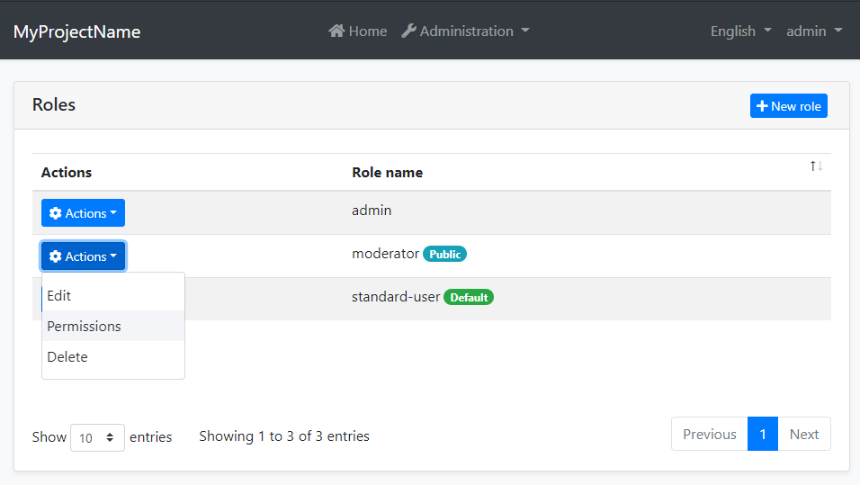
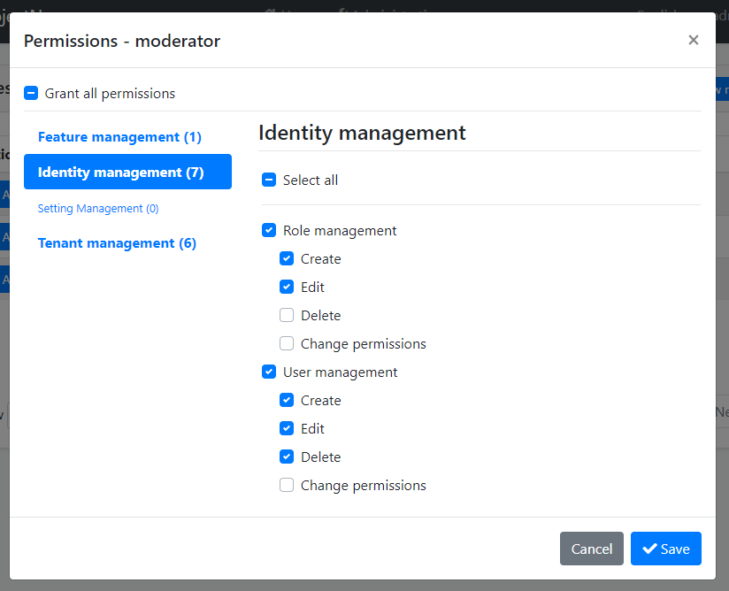
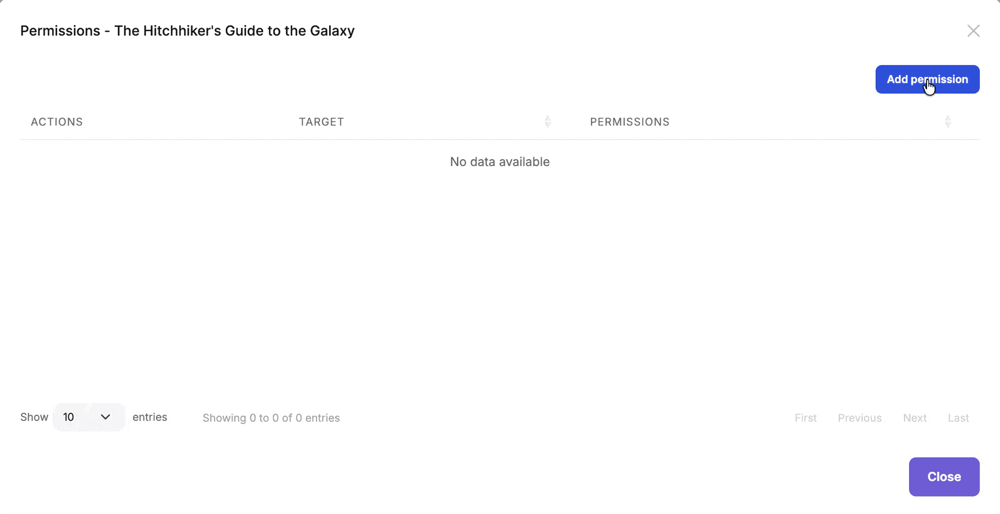

```json
//[doc-seo]
{
    "Description": "Learn how to manage permissions in your application using the ABP Framework's Permission Management Module, including installation and source code access."
}
```

# Permission Management Module

This module implements the `IPermissionStore` and `IResourcePermissionStore` to store and manage permission values in a database.

> This document covers only the permission management module which persists permission values to a database. See the [Authorization document](../framework/fundamentals/authorization/index.md) to understand the authorization and permission systems.

## How to Install

This module comes as pre-installed (as NuGet/NPM packages). You can continue to use it as package and get updates easily, or you can include its source code into your solution (see `get-source` [CLI](../cli) command) to develop your custom module.

### The Source Code

The source code of this module can be accessed [here](https://github.com/abpframework/abp/tree/dev/modules/permission-management). The source code is licensed with [MIT](https://choosealicense.com/licenses/mit/), so you can freely use and customize it.

## User Interface

### Permission Management Dialog

Permission management module provides a reusable dialog to manage permissions related to an object. For example, the [Identity Module](identity.md) uses it to manage permissions of users and roles. The following image shows Identity Module's Role Management page:



When you click *Actions* -> *Permissions* for a role, the permission management dialog is opened. An example screenshot from this dialog:



In this dialog, you can grant permissions for the selected role. The tabs in the left side represents main permission groups and the right side contains the permissions defined in the selected group.

### Resource Permission Management Dialog

In addition to standard permissions, this module provides a reusable dialog for managing **resource-based permissions** on specific resource instances. This allows administrators to grant or revoke permissions for users, roles and clients on individual resources (e.g., a specific document, project, or any entity).



The dialog displays all resource permissions defined for the resource type and allows granting them to specific users, roles or clients for the selected resource instance.

You can integrate this dialog into your own application to manage permissions for your custom entities and resources. See the following sections to learn how to use the component in each UI framework.

#### MVC / Razor Pages

First, add the `resource-permission-management-modal.js` script to your page. This script registers the `ResourcePermissionManagement` modal class used by `abp.ModalManager`:

````html
@section scripts
{
    <abp-script src="/Pages/MyBook/Index.js"/>
    <abp-script src="/Pages/AbpPermissionManagement/resource-permission-management-modal.js" />
}
````

Then use the `abp.ModalManager` to open the resource permission management dialog:

````javascript
var _resourcePermissionsModal = new abp.ModalManager({
    viewUrl: abp.appPath + 'AbpPermissionManagement/ResourcePermissionManagementModal',
    modalClass: 'ResourcePermissionManagement'
});

// Open the modal for a specific resource
_resourcePermissionsModal.open({
    resourceName: 'MyApp.Document',
    resourceKey: documentId,
    resourceDisplayName: documentTitle
});
````

#### Blazor

Use the `ResourcePermissionManagementModal` component's `OpenAsync` method to open the dialog:

````razor
@using Volo.Abp.PermissionManagement.Blazor.Components

<ResourcePermissionManagementModal @ref="ResourcePermissionModal" />

@code {
    private ResourcePermissionManagementModal ResourcePermissionModal { get; set; }

    private async Task OpenPermissionsModal()
    {
        await ResourcePermissionModal.OpenAsync(
            resourceName: "MyApp.Document",
            resourceKey: Document.Id.ToString(),
            resourceDisplayName: Document.Title
        );
    }
}
````

#### Angular

Use the `ResourcePermissionManagementComponent`:

````typescript
import { NgbModal } from '@ng-bootstrap/ng-bootstrap';
import { ResourcePermissionManagementComponent } from '@abp/ng.permission-management';

@Component({
  // ...
})
export class DocumentListComponent {
  constructor(private modalService: NgbModal) {}

  openPermissionsModal(document: DocumentDto) {
    const modalRef = this.modalService.open(
      ResourcePermissionManagementComponent, 
      { size: 'lg' }
    );
    modalRef.componentInstance.resourceName = 'MyApp.Document';
    modalRef.componentInstance.resourceKey = document.id;
    modalRef.componentInstance.resourceDisplayName = document.title;
  }
}
````

## IPermissionManager

`IPermissionManager` is the main service provided by this module. It is used to read and change the global permission values. `IPermissionManager` is typically used by the *Permission Management Dialog*. However, you can inject it if you need to set a permission value.

> If you just want to read/check permission values for the current user, use the `IAuthorizationService` or the `[Authorize]` attribute as explained in the [Authorization document](../framework/fundamentals/authorization/index.md).

**Example: Grant permissions to roles and users using the `IPermissionManager` service**

````csharp
public class MyService : ITransientDependency
{
    private readonly IPermissionManager _permissionManager;

    public MyService(IPermissionManager permissionManager)
    {
        _permissionManager = permissionManager;
    }

    public async Task GrantRolePermissionDemoAsync(
        string roleName, string permission)
    {
        await _permissionManager
            .SetForRoleAsync(roleName, permission, true);
    }

    public async Task GrantUserPermissionDemoAsync(
        Guid userId, string roleName, string permission)
    {
        await _permissionManager
            .SetForUserAsync(userId, permission, true);
    }
}
````

## IResourcePermissionManager

`IResourcePermissionManager` is the service for programmatically managing resource-based permissions. It is typically used by the *Resource Permission Management Dialog*. However, you can inject it when you need to grant, revoke, or query permissions for specific resource instances.

> If you just want to check resource permission values for the current user, use the `IResourcePermissionChecker` service as explained in the [Resource-Based Authorization](../framework/fundamentals/authorization/resource-based-authorization.md) document.

**Example: Grant and revoke resource permissions programmatically**

````csharp
public class DocumentPermissionService : ITransientDependency
{
    private readonly IResourcePermissionManager _resourcePermissionManager;

    public DocumentPermissionService(
        IResourcePermissionManager resourcePermissionManager)
    {
        _resourcePermissionManager = resourcePermissionManager;
    }

    public async Task GrantViewPermissionToUserAsync(
        Guid documentId, 
        Guid userId)
    {
        await _resourcePermissionManager.SetAsync(
            permissionName: "MyApp_Document_View",
            resourceName: "MyApp.Document",
            resourceKey: documentId.ToString(),
            providerName: "U", // User
            providerKey: userId.ToString(),
            isGranted: true
        );
    }

    public async Task GrantEditPermissionToRoleAsync(
        Guid documentId, 
        string roleName)
    {
        await _resourcePermissionManager.SetAsync(
            permissionName: "MyApp_Document_Edit",
            resourceName: "MyApp.Document",
            resourceKey: documentId.ToString(),
            providerName: "R", // Role
            providerKey: roleName,
            isGranted: true
        );
    }

    public async Task RevokeUserPermissionsAsync(
        Guid documentId, 
        Guid userId)
    {
        await _resourcePermissionManager.DeleteAsync(
            resourceName: "MyApp.Document",
            resourceKey: documentId.ToString(),
            providerName: "U",
            providerKey: userId.ToString()
        );
    }
}
````

## IResourcePermissionStore

The `IResourcePermissionStore` interface is responsible for retrieving resource permission values from the database. This module provides the default implementation that stores permissions in the database.

You can query the store directly if needed:

````csharp
public class MyService : ITransientDependency
{
    private readonly IResourcePermissionStore _resourcePermissionStore;

    public MyService(IResourcePermissionStore resourcePermissionStore)
    {
        _resourcePermissionStore = resourcePermissionStore;
    }

    public async Task<string[]> GetGrantedResourceKeysAsync(string permissionName)
    {
        // Get all resource keys where the permission is granted
        return await _resourcePermissionStore.GetGrantedResourceKeysAsync(
            "MyApp.Document",
            permissionName);
    }
}
````

## Cleaning Up Resource Permissions

When a resource is deleted, you should clean up its associated permissions to avoid orphaned permission records in the database. You can do this directly in your delete logic or handle it asynchronously through event handlers:

````csharp
public async Task DeleteDocumentAsync(Guid id)
{
    // Delete the document
    await _documentRepository.DeleteAsync(id);

    // Clean up all permissions for this resource
    await _resourcePermissionManager.DeleteAsync(
        resourceName: "MyApp.Document",
        resourceKey: id.ToString(),
        providerName: "U",
        providerKey: null // Deletes for all users
    );

    await _resourcePermissionManager.DeleteAsync(
        resourceName: "MyApp.Document",
        resourceKey: id.ToString(),
        providerName: "R",
        providerKey: null // Deletes for all roles
    );
}
````

> ABP modules automatically handle permission cleanup for their own entities. For your custom entities, you are responsible for cleaning up resource permissions when resources are deleted.

## Permission Management Providers

Permission Management Module is extensible, just like the [permission system](../framework/fundamentals/authorization/index.md). You can extend it by defining permission management providers.

[Identity Module](identity.md) defines the following permission management providers:

* `UserPermissionManagementProvider`: Manages user-based permissions.
* `RolePermissionManagementProvider`: Manages role-based permissions.

`IPermissionManager` uses these providers when you get/set permissions. You can define your own provider by implementing the `IPermissionManagementProvider` or inheriting from the `PermissionManagementProvider` base class.

**Example:**

````csharp
public class CustomPermissionManagementProvider : PermissionManagementProvider
{
    public override string Name => "Custom";

    public CustomPermissionManagementProvider(
        IPermissionGrantRepository permissionGrantRepository,
        IGuidGenerator guidGenerator,
        ICurrentTenant currentTenant)
        : base(
            permissionGrantRepository,
            guidGenerator,
            currentTenant)
    {
    }
}
````

`PermissionManagementProvider` base class makes the default implementation (using the `IPermissionGrantRepository`) for you. You can override base methods as you need. Every provider must have a unique name, which is `Custom` in this example (keep it short since it is saved to database for each permission value record).

Once you create your provider class, you should register it using the `PermissionManagementOptions` [options class](../framework/fundamentals/options.md):

````csharp
Configure<PermissionManagementOptions>(options =>
{
    options.ManagementProviders.Add<CustomPermissionManagementProvider>();
});
````

The order of the providers are important. Providers are executed in the reverse order. That means the `CustomPermissionManagementProvider` is executed first for this example. You can insert your provider in any order in the `Providers` list.

### Resource Permission Management Providers

Similar to standard permission management providers, you can create custom providers for resource permissions by implementing `IResourcePermissionManagementProvider` or inheriting from `ResourcePermissionManagementProvider`:

````csharp
public class CustomResourcePermissionManagementProvider 
    : ResourcePermissionManagementProvider
{
    public override string Name => "Custom";

    public CustomResourcePermissionManagementProvider(
        IResourcePermissionGrantRepository resourcePermissionGrantRepository,
        IGuidGenerator guidGenerator,
        ICurrentTenant currentTenant)
        : base(
            resourcePermissionGrantRepository,
            guidGenerator,
            currentTenant)
    {
    }
}
````

After creating the custom provider, you need to register your provider using the `PermissionManagementOptions` in your module class:

````csharp
Configure<PermissionManagementOptions>(options =>
{
    options.ResourceManagementProviders.Add<CustomResourcePermissionManagementProvider>();
});
````

#### Controlling Provider Availability

You can control whether a provider is active in a given context by overriding `IsAvailableAsync()`. When a provider returns `false`, it is completely excluded from all read, write, and UI listing operations. This is useful for host-only providers that should not be visible or writable in a tenant context.

````csharp
public class CustomResourcePermissionManagementProvider 
    : ResourcePermissionManagementProvider
{
    public override string Name => "Custom";

    // ...constructor...

    public override Task<bool> IsAvailableAsync()
    {
        // Only available for the host, not for tenants
        return Task.FromResult(CurrentTenant.Id == null);
    }
}
````

The same `IsAvailableAsync()` method is available on `IResourcePermissionProviderKeyLookupService`, which controls whether the provider appears in the UI provider picker:

````csharp
public class CustomResourcePermissionProviderKeyLookupService
    : IResourcePermissionProviderKeyLookupService, ITransientDependency
{
    public string Name => "Custom";
    public ILocalizableString DisplayName { get; }

    protected ICurrentTenant CurrentTenant { get; }

    public CustomResourcePermissionProviderKeyLookupService(ICurrentTenant currentTenant)
    {
        CurrentTenant = currentTenant;
    }

    public Task<bool> IsAvailableAsync()
    {
        return Task.FromResult(CurrentTenant.Id == null);
    }

    // ...SearchAsync implementations...
}
````

## Permission Value Providers

Permission value providers are used to determine if a permission is granted. They are different from management providers: **value providers** are used when *checking* permissions, while **management providers** are used when *setting* permissions.

> For standard permissions, see the [Authorization document](../framework/fundamentals/authorization/index.md) for details on permission value providers.

### Resource Permission Value Providers

Similar to the standard permission system, you can create custom value providers for resource permissions. ABP comes with two built-in resource permission value providers:

* `UserResourcePermissionValueProvider` (`U`): Checks permissions granted directly to users
* `RoleResourcePermissionValueProvider` (`R`): Checks permissions granted to roles

You can create your own custom value provider by implementing the `IResourcePermissionValueProvider` interface or inheriting from the `ResourcePermissionValueProvider` base class:

````csharp
using System.Threading.Tasks;
using Volo.Abp.Authorization.Permissions.Resources;

public class OwnerResourcePermissionValueProvider : ResourcePermissionValueProvider
{
    public override string Name => "Owner";

    public OwnerResourcePermissionValueProvider(
        IResourcePermissionStore permissionStore) 
        : base(permissionStore)
    {
    }

    public override async Task<PermissionGrantResult> CheckAsync(
        ResourcePermissionValueCheckContext context)
    {
        // Check if the current user is the owner of the resource
        var currentUserId = context.Principal?.FindUserId();
        if (currentUserId == null)
        {
            return PermissionGrantResult.Undefined;
        }

        // Your logic to determine if user is the owner
        var isOwner = await CheckIfUserIsOwnerAsync(
            currentUserId.Value, 
            context.ResourceName, 
            context.ResourceKey);

        return isOwner 
            ? PermissionGrantResult.Granted 
            : PermissionGrantResult.Undefined;
    }

    private Task<bool> CheckIfUserIsOwnerAsync(
        Guid userId, 
        string resourceName, 
        string resourceKey)
    {
        // Implement your ownership check logic
        throw new NotImplementedException();
    }
}
````

Register your custom provider in your module's `ConfigureServices` method:

````csharp
Configure<AbpPermissionOptions>(options =>
{
    options.ResourceValueProviders.Add<OwnerResourcePermissionValueProvider>();
});
````

## See Also

* [Authorization](../framework/fundamentals/authorization/index.md)
* [Resource-Based Authorization](../framework/fundamentals/authorization/resource-based-authorization.md)
