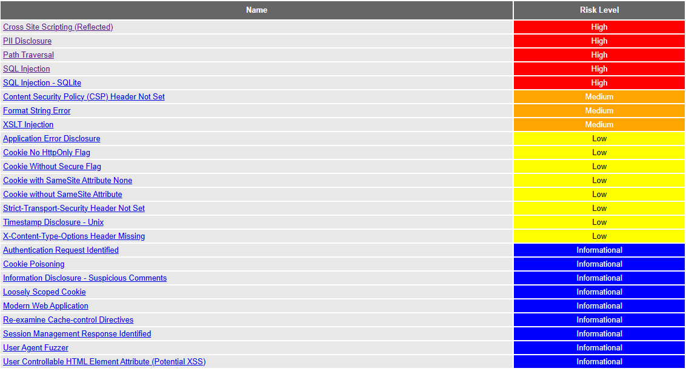
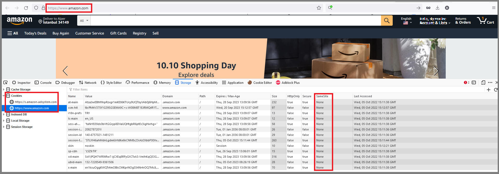
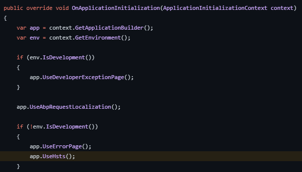

```json
//[doc-seo]
{
    "Description": "Explore the ABP Penetration Test Report detailing security findings, false positives, and actionable fixes for the ABP Commercial MVC app."
}
```

# ABP Penetration Test Report

The ABP Commercial MVC `v10.0.1` application template has been tested against security vulnerabilities by the [OWASP ZAP v2.14.0](https://www.zaproxy.org/) tool. The demo web application was started on the `https://localhost:44349` address. The below alerts have been reported by the pentest tool. These alerts are sorted by the risk level as high, medium, and low. The informational alerts are not mentioned in this document. 

Many of these alerts are **false-positive**, meaning the vulnerability scanner detected these issues, but they are not exploitable. It's clearly explained for each false-positive alert why this alert is a false-positive. 

In the next sections, you will find the affected URLs, attack parameters (request-body), alert descriptions, false-positive explanations, and fixes for the issues. Some positive alerts are already fixed or needed additional actions that can be taken by you. The issue links for the fixes are mentioned in each positive alert.

## Alerts

There are high _(red flag)_, medium _(orange flag)_, low _(yellow flag)_, and informational _(blue flag)_ alerts. 



> The informational alerts are not mentioned in this document. These alerts don't raise any risks for your application and they are optional.

### Cross Site Scripting (Reflected) [Risk: High] - Positive

- *[GET] - https://localhost:44349/Identity/OrganizationUnits/AddMemberModal?title=SelectAUser&organizationUnitId=...&OrganizationUnitName=%3C%2Fh5%3E%3CscrIpt%3Ealert%281%29%3B%3C%2FscRipt%3E%3Ch5%3E*
- *[GET] - https://localhost:44349/Identity/OrganizationUnits/AddRoleModal?organizationUnitId=...&OrganizationUnitName=%3C%2Fh5%3E%3CscrIpt%3Ealert%281%29%3B%3C%2FscRipt%3E%3Ch5%3E*
- *[GET] - https://localhost:44349/Saas/Host/Tenants/ImpersonateTenantModal?tenantId=...&tenantName=%3C%2Fh5%3E%3CscrIpt%3Ealert%281%29%3B%3C%2FscRipt%3E%3Ch5%3E*

**Description**:

Cross-site Scripting (XSS) is an attack technique that involves echoing attacker-supplied code into a user's browser instance.

**Explanation**:

This is a **Positive** alert. The application reflects the `OrganizationUnitName` and `tenantName` parameters without proper encoding in the modal headers, allowing for the execution of arbitrary JavaScript. We have created an **internal issue** to track this vulnerability, and it will be fixed in the next release.

### PII Disclosure [Risk: High] - False Positive

- *[GET] - https://localhost:44349/* (Evidence: 639002492030480000)
- *[GET] - https://localhost:44349/?page=...*

**Description**:

The response contains Personally Identifiable Information, such as CC number, SSN and similar sensitive data.

**Explanation**:

This is a **false-positive** alert. The detected numbers (e.g., `639002492030480000`) are cache-busting timestamps (`_v` parameter) generated by the framework for static assets. They coincidentally match the pattern of Credit Card numbers (pattern matching) but are not sensitive data.

### Path Traversal [Risk: High] - False Positive

- *[GET] - https://localhost:44349/Account/Login?returnUrl=Login*
- *[GET] - https://localhost:44349/api/account/security-logs?action=\security-logs*

**Description**:

The Path Traversal attack technique allows an attacker access to files, directories, and commands that potentially reside outside the web document root directory.

**Explanation**:

This is a **false-positive** alert. ABP Framework automatically validates `returnUrl` parameters and ensures they are local to the application or within a whitelist. The application does not return file contents based on these parameters.

### SQL Injection [Risk: High] - False Positive

- *[GET] - https://localhost:44349/AbpPermissionManagement/PermissionManagementModal?providerKey=AbpSolution16711_Swagger+AND+1%3D1+--+*
- *[GET] - https://localhost:44349/Account/Manage?CurrentPassword=ZAP%27+AND+%271%27%3D%271%27+--+*

**Description**:

SQL injection may be possible.

**Explanation**:

This is a **false-positive** alert. ABP Framework uses Entity Framework Core, which inherently uses parameterized queries, preventing standard SQL injection attacks. Manual verification showed that injecting SQL syntax into parameters like `providerKey` results in the input being treated as a literal string (resulting in no match or default behavior) rather than altering the query structure.

### SQL Injection - SQLite [Risk: High] - False Positive

- *[POST] - https://localhost:44349/Account/ForgotPassword?returnUrl=%2FAccount%2FManage* (Attack: `case randomblob(100000) ...`)
- *[POST] - https://localhost:44349/FeatureManagement/FeatureManagementModal*

**Description**:

SQL injection may be possible.

**Explanation**:

This is a **false-positive** alert. Similar to the standard SQL Injection alert, the application uses parameterized queries. The detected delays are likely due to application processing variations or network latency rather than successful SQL injection.

### Content Security Policy (CSP) Header Not Set [Risk: Medium] — Positive (Fixed)

- *[GET] — https://localhost:44349*
- *[GET] — https://localhost:44349/AuditLogs*
- *[GET] — https://localhost:44349/CookiePolicy*
- *[GET] — https://localhost:44349/Gdpr/PersonalData*
- *[GET] — https://localhost:44349/Identity/ClaimTypes/{0}* (create & edit modal URLs - also there are other modal related URLs...)
- *[GET] — https://localhost:44349/AbpPermissionManagement/PermissionManagementModal?providerName=R&providerKey=role&providerKeyDisplayName=role*
- *[GET] — https://localhost:44349/Abp/MultiTenancy/TenantSwitchModal*
- *[GET] — https://localhost:44349/Account/AuthorityDelegation/AuthorityDelegationModal*
- *[GET] — https://localhost:44349/Account/AuthorityDelegation/DelegateNewUserModal*
- *[GET] — https://localhost:44349/Account/ForgotPassword _(other several account URLS)_* 
- *[GET] — https://localhost:44349/Account/ExternalLogins _(other several account URLS)_* 
- *[GET] — https://localhost:44349/Account/SecurityLogs _(other several account URLS)_* 
- *[GET] — https://localhost:44349/Account/Login _(other several account URLS)_*
- *[GET] — https://localhost:44349/Account/Register _(other several account URLS)_*
- *[GET] — https://localhost:44349/Account/Manage _(other several account URLS)_*
- *[GET] — https://localhost:44349/Account/Sessions _(other several account URLS)_*

**Description:** 

Content Security Policy (CSP) is an added layer of security that helps to detect and mitigate certain types of attacks, including Cross Site Scripting (XSS) and data injection attacks. These attacks are used for everything from data theft to site defacement or distribution of malware. CSP provides a set of standard HTTP headers that allow website owners to declare approved sources of content that browsers should be allowed to load on a certain page — covered types are JavaScript, CSS, HTML frames, fonts, images and embeddable objects such as Java applets, ActiveX, audio, and video files.

**Solution:** 

Ensure that your web server, application server, load balancer, etc. are configured to set the `Content-Security-Policy` header, to achieve optimal browser support: "Content-Security-Policy" for Chrome 25+, Firefox 23+, and Safari 7+, "X-Content-Security-Policy" for Firefox 4.0+ and Internet Explorer 10+, and "X-WebKit-CSP" for Chrome 14+ and Safari 6+.

This vulnerability has fixed in ABP v7.0. You can check the related issue from [github.com/abpframework/abp/issues/14173](https://github.com/abpframework/abp/issues/14173). You can configure the `AbpSecurityHeadersOptions` and set the `UseContentSecurityPolicyHeader` property as *true* to add the `Content-Security-Policy` header into your application:

```csharp
Configure<AbpSecurityHeadersOptions>(options => 
{
   options.UseContentSecurityPolicyHeader = true; //false by default
});
```

> See [the documentation](../framework/ui/mvc-razor-pages/security-headers.md) for more info.

### Format String Error [Risk: Medium] - False Positive

- *[GET] — https://localhost:44349/Abp/Languages/Switch?culture=ZAP%25n%25s%25n%25s%25n%25s%25n%25s%25n%25s%25n%25s%25n%25s%25n%25s%25n%25s%25n%25s%25n%25s%25n%25s%25n%25s%25n%25s%25n%25s%25n%25s%25n%25s%25n%25s%25n%25s%25n%25s%0A&returnUrl=%2F&uiCulture=ar* (with combination of different parameters)
- *[GET] — https://localhost:44349/Abp/ApplicationLocalizationScript?cultureName=ZAP%25n%25s%25n%25s%25n%25s%25n%25s%25n%25s%25n%25s%25n%25s%25n%25s%25n%25s%25n%25s%25n%25s%25n%25s%25n%25s%25n%25s%25n%25s%25n%25s%25n%25s%25n%25s%25n%25s%25n%25s%0A* (with combination of different parameters)
- *[GET] — https://localhost:44349/api/language-management/language-texts?filter=aa&resourceName=&baseCultureName=es&targetCultureName=ZAP%25n%25s%25n%25s%25n%25s%25n%25s%25n%25s%25n%25s%25n%25s%25n%25s%25n%25s%25n%25s%25n%25s%25n%25s%25n%25s%25n%25s%25n%25s%25n%25s%25n%25s%25n%25s%25n%25s%25n%25s%0A&getOnlyEmptyValues=false&sorting=name+asc&skipCount=0&maxResultCount=10* (with combination of different parameters)
- *[GET] — https://localhost:44349/LanguageManagement/Texts/Edit?name=IncorrectCaptchaAnswer&targetCultureName=sv&resourceName=AbpAccount&baseCultureName=ZAP%25n%25s%25n%25s%25n%25s%25n%25s%25n%25s%25n%25s%25n%25s%25n%25s%25n%25s%25n%25s%25n%25s%25n%25s%25n%25s%25n%25s%25n%25s%25n%25s%25n%25s%25n%25s%25n%25s%25n%25s%0A*  (with combination of different parameters)
- *[POST] — https://localhost:44349/Account/Login?ReturnUrl=%2FSettingManagement*
- *[POST] — https://localhost:44349/Account/Manage* (with combination of different parameters)

**Description:**

A Format String error occurs when the submitted data of an input string is evaluated as a command by the application.

**Solution:**

Rewrite the background program using proper deletion of bad character strings. This will require a recompile of the background executable. 

**Explanation:**

The first affected URL is a **false-positive** alert since it's already fixed and there is not any bad character string in the responses of these endpoints anymore. (It displays an error message such as: *"The selected culture is not valid! Make sure you enter a valid culture name."*).

The second URL is also a **false-positive** alert because there is no bad character string in the response. 

> **Note**: However, it might be possible if you had any sensitive localization key-value pair in your localization entries, because this endpoint returns all localization values to be able to be used in the application. Therefore, keep that in mind while defining new localization entries. Pass the critical values in your code while using the localization entry as a parameter.

### XSLT Injection [Risk: Medium] - False Positive

- *[GET] — https://localhost:44349/Abp/Languages/Switch?culture=%3Cxsl%3Avalue-of+select%3D%22system-property%28%27xsl%3Avendor%27%29%22%2F%3E&returnUrl=%2F&uiCulture=tr _(same URL with different parameters...)_*
- *[POST] — https://localhost:44349/Account/ForgotPassword _(same URL with different parameters...)_*
- *[GET] — https://localhost:44349/SaasWidgets/LatestTenants _(same URL with different parameters...)_*
  
**Description**: 

Injection using XSL transformations may be possible and may allow an attacker to read system information, read and write files, or execute arbitrary code.

**Explanation**: 

This is a **false-positive** alert. v9.0 uses .NET 9 and the XSLT transformation is not possible on .NET5 or higher.

### Application Error Disclosure [Risk: Low] — False Positive

- *[POST] — https://localhost:44349/Account/ImpersonateUser*  
- *[GET] — https://localhost:44349/Account/ExternalLogins*  
- *[GET] — https://localhost:44349/OrganizationUnits*  
- *[GET] — https://localhost:44349/HostDashboard*  
- *[GET] — https://localhost:44349/Saas/Host/Editions*  
- *[GET] — https://localhost:44349/Saas/Host/Tenants*  

**Description:** 

The reported pages contain an error/warning message that may disclose sensitive information like the location of the file that produced the unhandled exception. This information can be used to launch further attacks against the web application. The alert could be a false positive if the error message is found inside a documentation page.

**Explanation:** 

This vulnerability was reported as a **positive** alert because the application ran in `Development` mode. ABP throws exceptions for developers in the `Development` environment. We set the environment to `Production` and re-run the test, then the server sent a *500-Internal Error* without the error disclosed. Therefore this alert is **false-positive**. Further information can be found in the following issue: [github.com/abpframework/abp/issues/14177](https://github.com/abpframework/abp/issues/14177#issuecomment-1268206947).

### Cookie No `HttpOnly` Flag [Risk: Low] — Positive (No need for a fix)

* *[GET] — https://localhost:44349 (and other several URLs...)*
* *[GET] — https://localhost:44349/Abp/Languages/Switch?culture=ar&returnUrl=%2FAccount%2FForgotPassword%3FreturnUrl%3D%2522%252F%253E%253Cxsl%253Avalue-of%2520select%253D%2522system-property(%2527xsl%253Avendor%2527)%2522%252F%253E%253C!--&uiCulture=ar (and other several URLs...)*
* *[GET] — https://localhost:44349/Abp/ApplicationConfigurationScript*

**Description:** 

A cookie has been set without the secure flag, which means that the cookie can be accessed via unencrypted connections.

**Explanation:** 

The following alert is related to the next alert. Therefore, to understand this alert, you can take a look at the next alert: _Cookie Without Secure Flag [Risk: Low]_

### Cookie Without Secure Flag [Risk: Low] — Positive (No need for a fix)

* *[GET] — https://localhost:44349 (and other several URLs...)*
* *[GET] — https://localhost:44349/Abp/Languages/Switch?culture=ar&returnUrl=%2F%3Fpage%3D% (same url with different query parameters...)*

**Description:** A cookie has been set without the secure flag, which means that the cookie can be accessed via unencrypted connections. The following cookies don't have an `httponly` flag.

* `XSRF-TOKEN` (Anti CSRF token cookie)
* `.AspNetCore.Culture` (ASP.NET Core culture cookie)

**Explanation:** 

All the pages that are setting the `XSRF-TOKEN` and `.AspNetCore.Culture` cookies in the HTTP response are reported as "No `HttpOnly` Flag" vulnerability. This is a **positive-alert**. 

> **Note for IDS4 users**: The `idsrv.session` cookie is being used in IDS4 and after ABP 6.x, ABP switched to OpenIddict ([github.com/abpframework/abp/issues/7221](https://github.com/abpframework/abp/issues/7221)). Therefore, this cookie is not being used in the current startup templates and you can ignore this note if you have created your application after v6.0+. However, if you are still using Identity Server 4, there is an issue related to the `idsrv.session` cookie, it cannot be set as `HttpOnly`; you can see the related thread at its own repository: [github.com/IdentityServer/IdentityServer4/issues/3873](https://github.com/IdentityServer/IdentityServer4/issues/3873)

The `.AspNetCore.Culture` and `XSRF-TOKEN` cookies are being retrieved via JavaScript in ABP Angular, MVC and Blazor WASM UIs. Therefore they cannot be set as `HttpOnly`. You can check out the following modules that retrieve these cookies via JavaScript:

* [github.com/abpframework/abp/blob/dev/framework/src/Volo.Abp.Swashbuckle/wwwroot/swagger/ui/abp.swagger.js#L28](https://github.com/abpframework/abp/blob/dev/framework/src/Volo.Abp.Swashbuckle/wwwroot/swagger/ui/abp.swagger.js#L28)
* [github.com/abpframework/abp/blob/dev/modules/cms-kit/src/Volo.CmsKit.Admin.Web/Pages/CmsKit/Pages/update.js#L54](https://github.com/abpframework/abp/blob/dev/modules/cms-kit/src/Volo.CmsKit.Admin.Web/Pages/CmsKit/Pages/update.js#L54)
* [github.com/abpframework/abp/blob/dev/modules/cms-kit/src/Volo.CmsKit.Admin.Web/Pages/CmsKit/Pages/create.js#L84](https://github.com/abpframework/abp/blob/dev/modules/cms-kit/src/Volo.CmsKit.Admin.Web/Pages/CmsKit/Pages/create.js#L84)
* [github.com/abpframework/abp/blob/392beb897bb2d7214db8facba7a2022be7aa837c/modules/cms-kit/src/Volo.CmsKit.Admin.Web/Pages/CmsKit/BlogPosts/update.js#L91](https://github.com/abpframework/abp/blob/392beb897bb2d7214db8facba7a2022be7aa837c/modules/cms-kit/src/Volo.CmsKit.Admin.Web/Pages/CmsKit/BlogPosts/update.js#L91)
* [github.com/abpframework/abp/blob/dev/modules/cms-kit/src/Volo.CmsKit.Admin.Web/Pages/CmsKit/BlogPosts/create.js#L127](https://github.com/abpframework/abp/blob/dev/modules/cms-kit/src/Volo.CmsKit.Admin.Web/Pages/CmsKit/BlogPosts/create.js#L127)
* [github.com/abpframework/abp/blob/dev/modules/docs/app/VoloDocs.Web/wwwroot/libs/abp/jquery/abp.jquery.js#L261](https://github.com/abpframework/abp/blob/dev/modules/docs/app/VoloDocs.Web/wwwroot/libs/abp/jquery/abp.jquery.js#L261)
* [github.com/abpframework/abp/blob/dev/framework/src/Volo.Abp.AspNetCore.Components.Web/Volo/Abp/AspNetCore/Components/Web/AbpBlazorClientHttpMessageHandler.cs#L94](https://github.com/abpframework/abp/blob/dev/framework/src/Volo.Abp.AspNetCore.Components.Web/Volo/Abp/AspNetCore/Components/Web/AbpBlazorClientHttpMessageHandler.cs#L94)

**Setting `XSRF-TOKEN` cookie as `HttpOnly`:**

If you want to set it, you can configure the `TokenCookie` property of the [AbpAntiForgeryOptions](https://github.com/abpframework/abp/blob/dev/framework/src/Volo.Abp.AspNetCore.Mvc/Volo/Abp/AspNetCore/Mvc/AntiForgery/AbpAntiForgeryOptions.cs#L56) class.

**Setting `.AspNetCore.Culture` cookie as `HttpOnly`:**

If you want to set it, you can do it in the [AbpRequestCultureCookieHelper](https://github.com/abpframework/abp/blob/dev/framework/src/Volo.Abp.AspNetCore/Microsoft/AspNetCore/RequestLocalization/AbpRequestCultureCookieHelper.cs#L16) class. Set the option as `HttpOnly = true`.

The related issue for this alert can be found at [github.com/abpframework/abp/issues/14214](https://github.com/abpframework/abp/issues/14214).

### Cookie with SameSite Attribute None [Risk: Low] — Positive (No need for a fix)

* *[GET] — https://localhost:44349 (and other several URLs...)*
* *[GET] — https://localhost:44349/Abp/ApplicationConfigurationScript*
* *[GET] — https://localhost:44349/Account/ForgotPassword (and there are several URLs)*
* *[GET] — https://localhost:44349/Abp/Languages/Switch?culture=ar&returnUrl=%2F%3Fpage%3D%252FAccount%252F%7E%252FAccount%252FLogin&uiCulture=a (and other several URLs...)*

**Description:** 

A cookie has been set with its `SameSite` attribute set to `none`, which means that the cookie can be sent as a result of a `cross-site` request. The `SameSite` attribute is an effective counter measure to cross-site request forgery, cross-site script inclusion, and timing attacks.

**Solution:** 

Ensure that the `SameSite` attribute is set to either `lax` or ideally `strict` for all cookies. You can see the Amazon.com `SameSite` attribute policy. We discussed setting the **SameSite** attribute to `strict` in the following issue [github.com/abpframework/abp/issues/14215](https://github.com/abpframework/abp/issues/14215) and decided to leave this change to the final developer.



### Cookie without `SameSite` Attribute [Risk: Low] — Positive (No need for a fix)

* *[GET] — https://localhost:44349/Abp/Languages/Switch?culture=ar&returnUrl=%2F&uiCulture=ar _(and other several URLs with different query parameters...)_* 

**Description:** 

A cookie has been set with its `SameSite` attribute set to `none`, which means that the cookie can be sent as a result of a `cross-site` request. The `SameSite` attribute is an effective counter measure to cross-site request forgery, cross-site script inclusion, and timing attacks.

**Solution:** 

Ensure that the `SameSite` attribute is set to either `lax` or ideally `strict` for all cookies. We discussed setting the **SameSite** attribute to `strict` in the following issue [github.com/abpframework/abp/issues/14215](https://github.com/abpframework/abp/issues/14215) and decided to leave this change to the final developer.


### Strict-Transport-Security Header Not Set [Risk: Low] - False Positive

- *[DELETE] — https://localhost:44349/api/feature-management/features?providerName=E&providerKey=49dfb08f-f5ed-0b61-8d37-3a0fc6b61679*
- *[DELETE] — https://localhost:44349/api/identity/claim-types/4c580525-c08f-9280-f729-3a0fc6b9c3fa*
- *[DELETE] — https://localhost:44349/api/account/sessions/de2f8683-f8f4-d3bb-6b7e-3a138af89d1f*
- *[DELETE] — https://localhost:44349/api/language-management/languages/6b311a44-65bd-14ea-1a21-3a0e778b41d5*
- *[DELETE] — https://localhost:44349/api/saas/tenants/c77b1554-5837-3303-9983-3a0e77824bb3*
- *[DELETE] — https://localhost:44349/api/openiddict/scopes?id=af5a66e2-7cbb-cf69-7301-3a0fc6bb0ebf*
- *[GET] — https://localhost:44349/*
- *[GET] — https://localhost:44349/Abp/ApplicationConfigurationScript*
- *[GET] — https://localhost:44349/Abp/ApplicationLocalizationScript?cultureName=zh-Hant*
- other URLS...

**Description**: 

HTTP Strict Transport Security (HSTS) is a web security policy mechanism whereby a web server declares that complying user agents (such as a web browser) are to interact with it using only secure HTTPS connections (i.e. HTTP layered over TLS/SSL). HSTS is an IETF standards track protocol and is specified.

**Solution**: 

Enabling HSTS on production.

**Explanation**: 

This vulnerability was reported as a positive alert because the application ran in `Development` mode. We enable HSTS on `Production` mode as can be seen in the image below, therefore this is a **false-positive** alert.



### Timestamp Disclosure - Unix [Risk: Low] - False Positive

- *[GET] — https://localhost:44349/libs/zxcvbn/zxcvbn.js?=*
- *[GET] — https://localhost:44349/libs/sweetalert2/sweetalert2.all.min.js?=*

**Description**: 

A timestamp was disclosed by the application/web server - Unix

**Solution**:

Manually confirm that the timestamp data is not sensitive, and that the data cannot be aggregated to disclose exploitable patterns.

**Explanation**: 

This vulnerability was reported as a positive alert, because ABP uses the [zxcvbn](https://github.com/dropbox/zxcvbn) library for [password complexity indicators](../framework/ui/angular/password-complexity-indicator-component.md). This library is one of the most used password strength estimator and it does not disclosure any sensitive data related to web server's timestamp and therefore it's a **false-positive** alert.

### X-Content-Type-Options Header Missing [Risk: Low] - Positive (Fixed)

- *[GET] — https://localhost:44349/client-proxies/account-proxy.js?_v=638550091940000000 (and other client-proxies related URLs...)*
- *[GET] — https://localhost:44349/favicon.svg*
- *[GET] — https://localhost:44349/images/getting-started/bg-01.png* (and other image URLs...)
- *[GET] — https://localhost:44349/global-styles.css?_v=638556076064360335*
- *[GET] — https://localhost:44349/libs/@fortawesome/fontawesome-free/css/all.css?_v=%5CWEB-INF%5Cweb.xml (other several URLs...)*
- other URLs...

**Description**: 

The Anti-MIME-Sniffing header `X-Content-Type-Options` was not set to 'nosniff'. This allows older versions of Internet Explorer and Chrome to perform MIME-sniffing on the response body, potentially causing the response body to be interpreted and displayed as a content type other than the declared content type. Current (early 2014) and legacy versions of Firefox will use the declared content type (if one is set), rather than performing MIME-sniffing.

**Solution**:

Ensure that the application/web server sets the Content-Type header appropriately, and that it sets the X-Content-Type-Options header to 'nosniff' for all web pages.

If possible, ensure that the end user uses a standards-compliant and modern web browser that does not perform MIME-sniffing at all, or that can be directed by the web application/web server to not perform MIME-sniffing.

**Explanation**: 

The `X-Content-Type-Options` header allows you to avoid MIME type sniffing by saying that the MIME types are deliberately configured. This headeer is not strictly required, but it is highly recommended for security reasons. While modern browsers have improved security features, you can still set this header for ensuring the security of web applications.

You can add the [ABP's Security Header Middleware](../framework/ui/mvc-razor-pages/security-headers.md#security-headers-middleware) into the request pipeline to set the `X-Content-Type-Options` as *no-sniff*. Also, this middleware adds other pre-defined security headers to your application, including `X-XSS-Protection`, `X-Frame-Options` and `Content-Security-Policy` (if it's enabled). Read [Security Headers](../framework/ui/mvc-razor-pages/security-headers.md) documentation for more info.
