```json
//[doc-seo]
{
    "Description": "Learn how to integrate .NET Aspire into your ABP-based solution for streamlined development, orchestration, and observability of distributed applications."
}
```

# .NET Aspire Integration

````json
//[doc-nav]
{
  "Next": {
    "Name": "Miscellaneous guides in the Microservice solution",
    "Path": "solution-templates/microservice/guides"
  }
}
````

> You must have an ABP Business or a higher license to be able to create a microservice solution.

## .NET Aspire Overview

[Aspire](https://aspire.dev/get-started/what-is-aspire/) streamlines building, running, debugging, and deploying distributed apps. Picture your app as a set of services, databases, and frontends—when they’re deployed, they all work together seamlessly, but every time you develop them they need to be individually started and connected. With Aspire, you get a unified toolchain that eliminates complex configs and makes local debugging effortless. Instantly launch and debug your entire app with a single command. Ready to deploy? Aspire lets you publish anywhere—Kubernetes, the cloud, or your own servers. It’s also fully extensible, so you can integrate your favorite tools and services with ease. It provides:

- **Orchestration**: A code-first approach to defining and running distributed applications, managing dependencies, and launch order.
- **Integrations**: Pre-built components for common services (databases, caches, message brokers) with automatic configuration.
- **Tooling**: A developer dashboard for real-time monitoring of logs, traces, metrics, and resource health.
- **Service Discovery**: Automatic service-to-service communication without hardcoded endpoints.
- **Observability**: Built-in OpenTelemetry support for distributed tracing, metrics, and structured logging.

## ABP Integration

When you enable .NET Aspire in an ABP microservice solution, you get a fully integrated development experience where:

- All microservices, gateways, and applications are orchestrated through a single entry point (AppHost).
- Infrastructure containers (databases, Redis, RabbitMQ, Elasticsearch, etc.) are managed as code.
- OpenTelemetry, health checks, and service discovery are automatically configured for all projects via the shared ServiceDefaults project.

## Enabling Aspire

When creating a new microservice solution via ABP Studio:

1. In the solution creation wizard, look for the **".NET Aspire Integration"** step.
2. Toggle the option to **enable .NET Aspire**.
3. Complete the wizard—Aspire projects will be generated along with your solution.


## Solution Structure Changes

When Aspire is enabled, two additional projects are added to your solution:

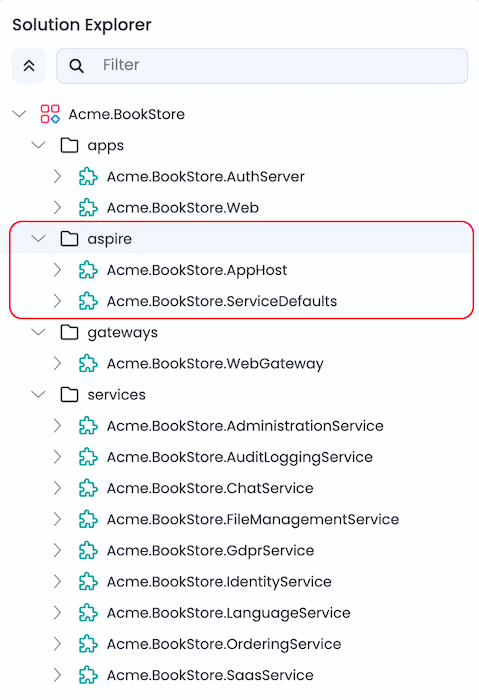

### AppHost (Orchestrator)

[`AppHost`](https://aspire.dev/get-started/app-host/) is the .NET Aspire orchestrator project that declares all resources (services, databases, containers, applications) and their dependencies in C# code. All services, gateways, and applications in the solution have their project references added to `AppHost`.

**Why is it added?**

- Centralized orchestration: Start your entire microservice ecosystem with a single command.
- Code-first infrastructure: Databases, Redis, RabbitMQ, Elasticsearch, and observability tools are defined programmatically.
- Dependency management: `AppHost` ensures services start in the correct order using `WaitFor()` declarations.
- Automatic configuration: Connection strings, endpoints, and environment variables are injected automatically.

**Key files in AppHost:**
| File | Purpose |
|--------|------------|
| `AppHost.cs` | Entry point—creates the distributed application builder and adds all resources |
| `AppHostExtensions.cs` | Extension methods for adding infrastructures, databases, microservices, gateways, and applications |

**What it manages:**

- Database servers (SQL Server, PostgreSQL, MySQL, or MongoDB)
- Per-service databases
- Redis (caching)
- RabbitMQ (messaging)
- Elasticsearch + Kibana (logging)
- Prometheus + Grafana (metrics)
- Jaeger (tracing)
- OpenTelemetry Collector
- All microservices, gateways, and web applications

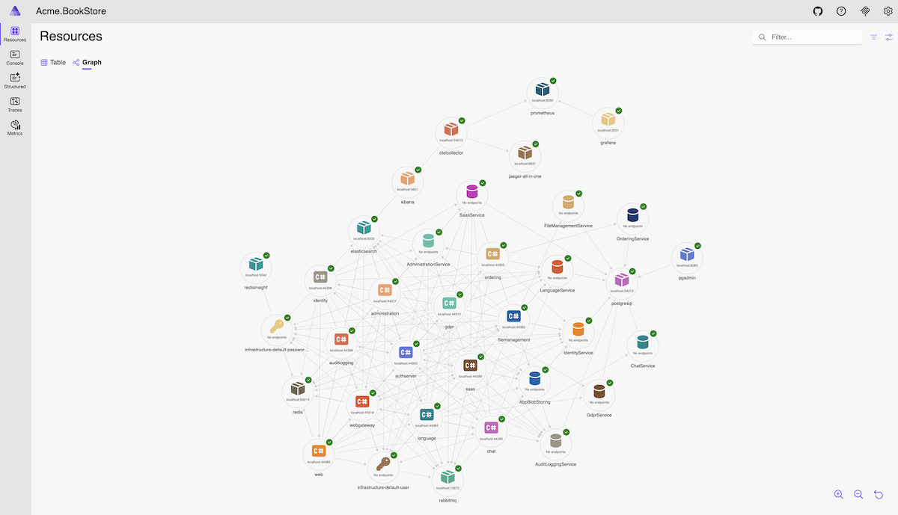

### ServiceDefaults

[`ServiceDefaults`](https://aspire.dev/fundamentals/service-defaults/) is a shared library that provides common cloud-native configuration for all projects in the solution. The `ServiceDefaults` project reference is added to all services, gateways, and applications in the solution.

**Why is it added?**

- Consistency: Every service uses the same observability, health check, and resilience patterns.
- Less boilerplate: Add `builder.AddServiceDefaults()` once, get all defaults automatically.
- Production-ready: OpenTelemetry, health endpoints, and HTTP resilience are preconfigured.

**What it provides:**

| Feature | Description |
|---------|-------------|
| OpenTelemetry | Tracing, metrics, and structured logging with automatic instrumentation |
| Health Checks | `/health` and `/alive` endpoints for Kubernetes-style probes |
| Service Discovery | Automatic resolution of service endpoints |
| HTTP Resilience | Retry policies, timeouts, and circuit breakers for HTTP clients |

**Usage example:**

```csharp
var builder = WebApplication.CreateBuilder(args);
builder.AddServiceDefaults();  // Adds all cloud-native defaults
// ... rest of configuration
```

## Running the Solution

### Without Aspire

1. Open **Solution Runner** in ABP Studio.
2. Start all resources in Solution Runner (services, gateways, applications, and tools such as databases, Redis, RabbitMQ, etc.) individually or collectively using the `Default` profile.

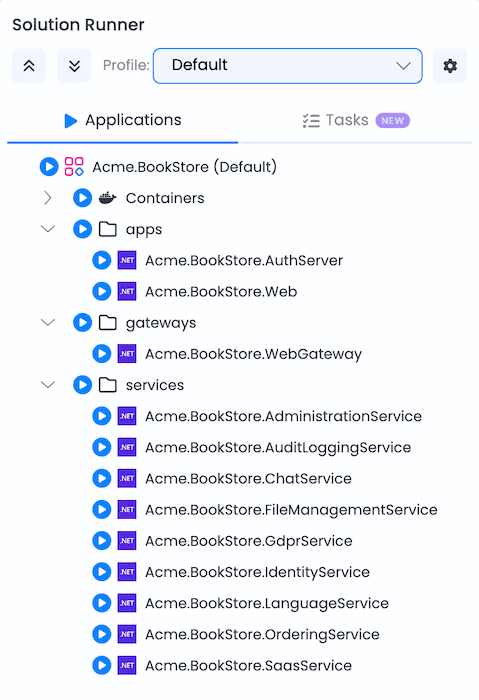

### With Aspire
1. Open **Solution Runner** in ABP Studio.
2. Select the **Aspire** profile.
3. Run `MyCompanyName.MyProjectName.AppHost`.
4. AppHost automatically:
   - Starts all infrastructure containers (database, Redis, RabbitMQ, Elasticsearch, etc.).
   - Launches all microservices, gateways, and applications in dependency order.
   - Injects connection strings and environment variables.
   - Opens the Aspire Dashboard for monitoring.

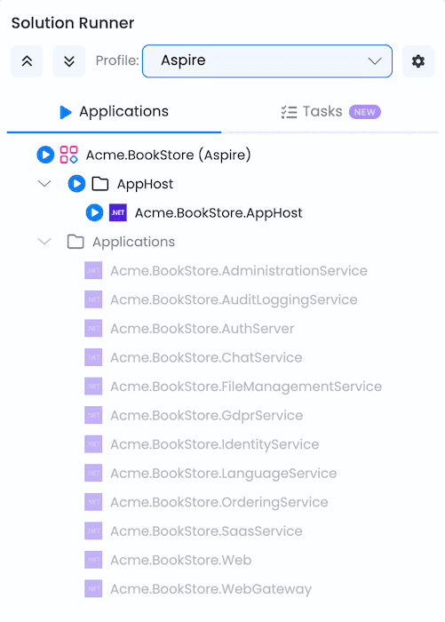

## Aspire Dashboard

The dashboard enables real-time tracking of key aspects of your app, including logs, traces, and environment configurations. It's designed to enhance the development experience by providing a clear and insightful view of your app's state and structure.

Key features of the dashboard include:

- Real-time tracking of logs, traces, and environment configurations.
- User interface to stop, start, and restart resources.
- Collects and displays logs and telemetry; view structured logs, traces, and metrics in an intuitive UI.
- Enhanced debugging with GitHub Copilot, your AI-powered assistant built into the dashboard.

### Opening the Dashboard

When AppHost starts, the Aspire Dashboard opens automatically in ABP Studio's built-in browser at `https://localhost:15105`. Alternatively, you can right-click on AppHost in Solution Runner and select **Browse** to open it manually.

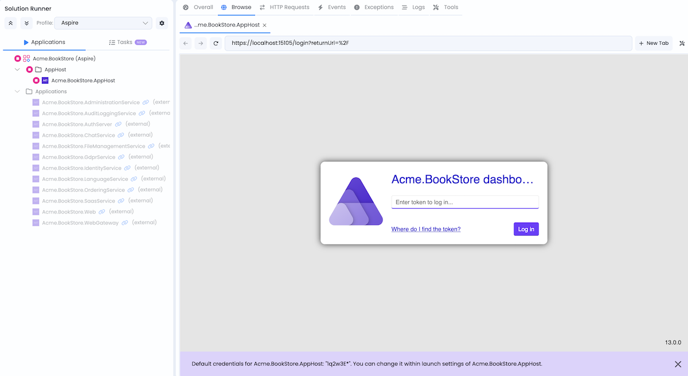

**Dashboard login token**: `1q2w3E*` (default, configurable via launch settings)

### Dashboard Features

The dashboard includes several tabs, each offering different insights into your application:

#### Resources

View the status of all resources in your application, including projects, containers, and executables. Monitor health checks, view environment variables, and access endpoints for each resource.

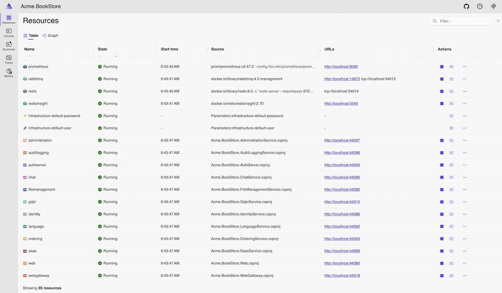

#### Console

Display console logs from all resources in real-time. Filter by resource and log level to quickly find relevant information during development and debugging.

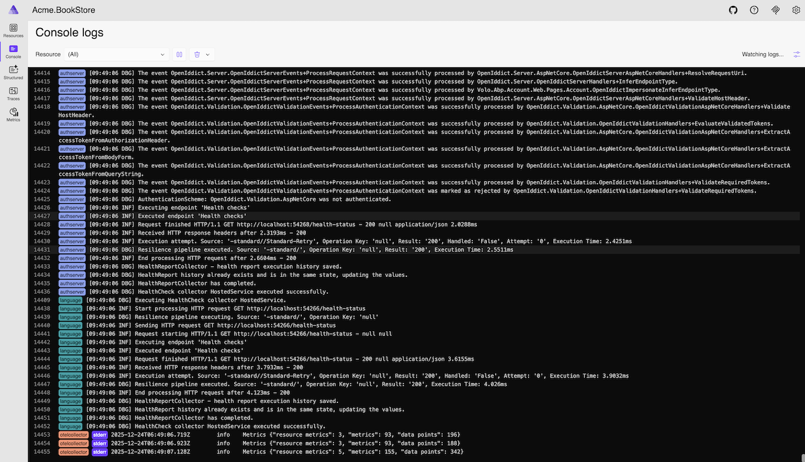

#### Structured Logs

View structured logs from all resources with advanced filtering capabilities. Search and filter logs by resource, log level, timestamp, and custom properties to diagnose issues efficiently.

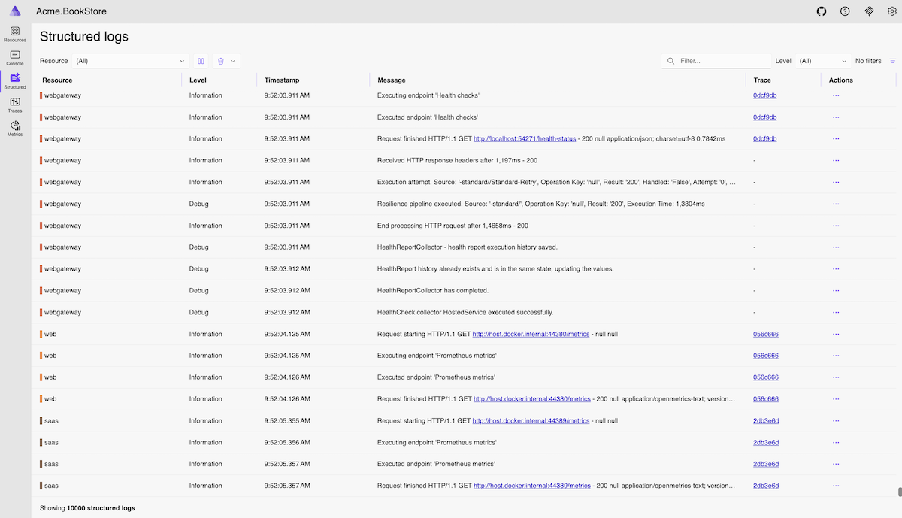

#### Traces

Explore distributed traces across your microservices to understand request flows and identify performance bottlenecks. Visualize how requests propagate through different services and examine timing information.

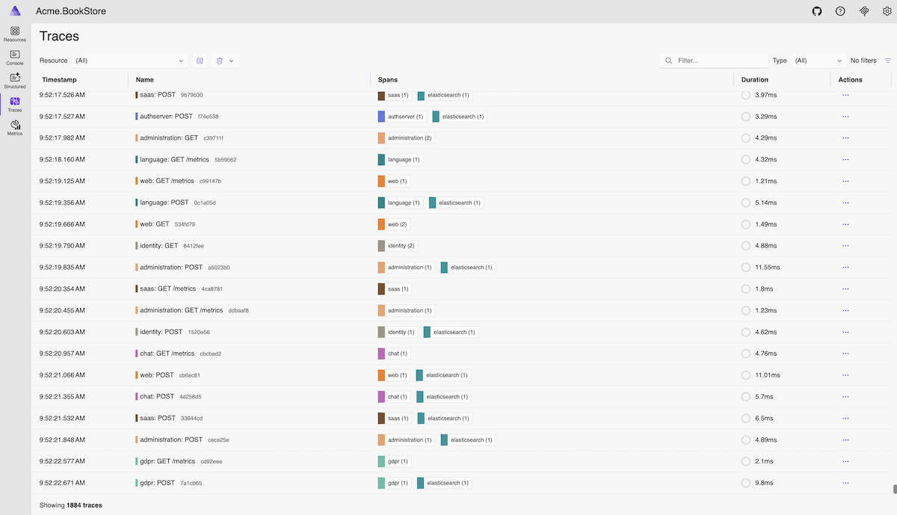

#### Metrics

Monitor real-time metrics including HTTP requests, response times, garbage collection, memory usage, and custom metrics. Visualize metric trends with interactive charts to understand application performance.


## Tools and Their Management UIs

AppHost pre-configures the following observability and tools. The URLs below are for their **management/dashboard interfaces** (these tools may expose additional internal endpoints for service communication).

All URLs and configurations are defined in the `AppHost` project. If you need to change ports or other settings, you can modify them in the `AppHost` project.

After running AppHost, you can access these tools either by opening the URLs directly in your browser or via Solution Runner **Tools** tab.

### Database Management System Admin Tool

The database management admin tool varies by database type:

| Database | Tool | URL |
|----------|------|-----|
| SQL Server | DBeaver CloudBeaver | `http://localhost:8081` |
| MySQL | phpMyAdmin | `http://localhost:8082` |
| PostgreSQL | pgAdmin | `http://localhost:8083` |
| MongoDB | Mongo Express | `http://localhost:8084` |

For example, if using PostgreSQL, access **pgAdmin** at `http://localhost:8083` or via Solution Runner Tools tab:


### Grafana

**URL**: `http://localhost:3001`  
**Credentials**: `admin` / `admin`

Grafana is a visualization and analytics platform for monitoring metrics. It provides interactive dashboards with charts and graphs for tracking application performance.

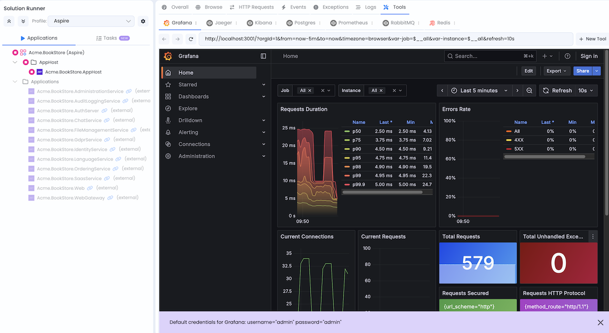

### Jaeger

**URL**: `http://localhost:16686`  
**Credentials**: No authentication required

Jaeger is a distributed tracing system to monitor and troubleshoot problems on interconnected software components called microservices.

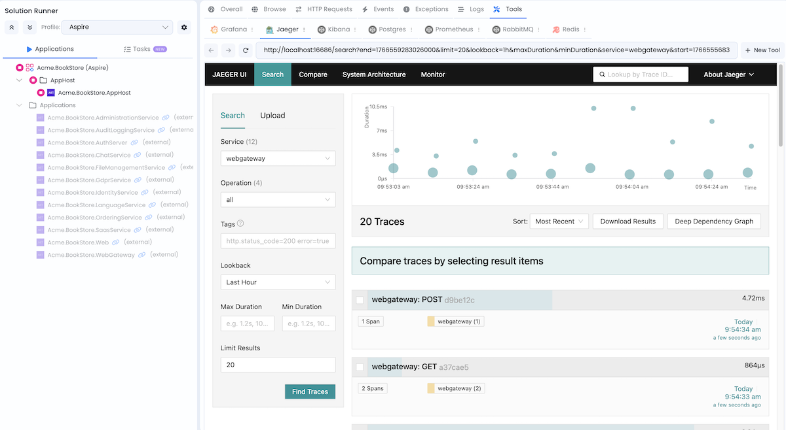

### Kibana

**URL**: `http://localhost:5601`  
**Credentials**: No authentication required

Kibana is a visualization tool for Elasticsearch data. It provides search and data visualization capabilities for logs stored in Elasticsearch.


### Prometheus

**URL**: `http://localhost:9090`  
**Credentials**: No authentication required

Prometheus is a monitoring and alerting toolkit. It collects and stores metrics as time series data, allowing you to query and analyze application performance.

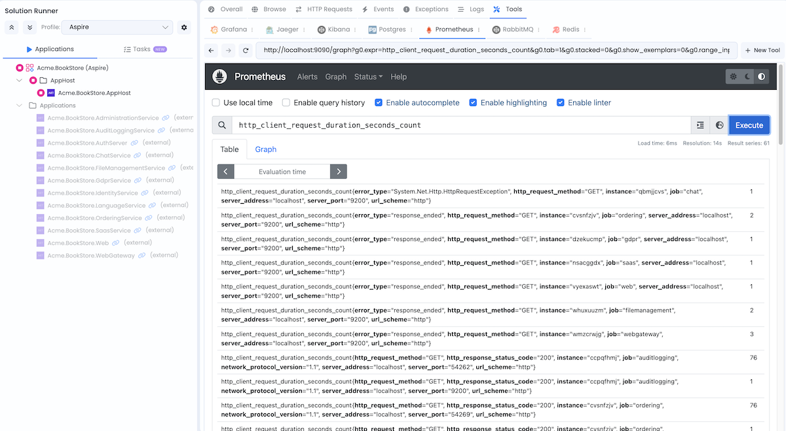

### RabbitMQ Management

**URL**: `http://localhost:15672`  
**Credentials**: `guest` / `guest`

RabbitMQ Management UI provides a web-based interface for managing and monitoring RabbitMQ message broker, including queues, exchanges, and message flows.


### Redis Insight

**URL**: `http://localhost:5540`  
**Credentials**: No authentication required

Redis Insight is a visual tool for Redis that allows you to browse data, run commands, and monitor Redis performance.

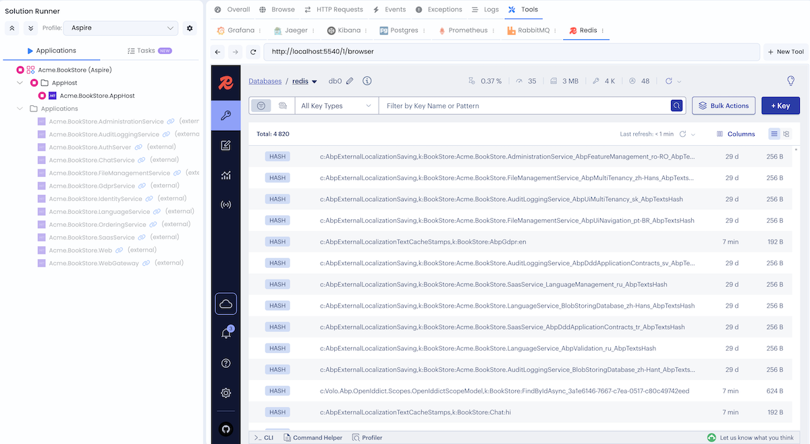

## Adding New Services, Gateways, or Applications

When you add a new microservice, gateway, or application via **ABP Studio**:

1. `AppHost` is updated automatically - the new project is registered as a resource with appropriate configurations.
2. `ServiceDefaults` is referenced - the new project gets cloud-native defaults.

> You don't need to manually edit `AppHost` in most cases.

## Adding a Resource Manually

If you need to add a resource manually (not via **ABP Studio**), follow these steps:

### 1. Reference ServiceDefaults in your new project

```xml
<ProjectReference Include="..\..\..\aspire\service-defaults\MyCompanyName.MyProjectName.ServiceDefaults\MyCompanyName.MyProjectName.ServiceDefaults.csproj" />
```

> Adjust the path as necessary based on your solution structure.

### 2. Add ServiceDefaults in Program.cs

```csharp
var builder = WebApplication.CreateBuilder(args);
builder.AddServiceDefaults();
// ... your configuration
```

### 3. Add Project Reference to AppHost

Add a reference to your resource project in `MySolutionName.MyProjectName.AppHost/MySolutionName.MyProjectName.AppHost.csproj`:

```xml
<ProjectReference Include="..\..\services\myresource\src\MySolutionName.MyProjectName.MyResource\MySolutionName.MyProjectName.MyResource.csproj" />
```

### 4. Register Resource in AppHost

Edit `AppHostExtensions.cs` and add your resource in the `AddAdditionalResources` method:

```csharp
var myResource = builder
    .AddProject<Projects.MySolutionName_MyProjectName_ServiceName>("myresource", "MySolutionName.MyProjectName.MyResource")
    .WaitFor(databases.AdministrationDb)
    .WaitFor(databases.IdentityDb)
    .WaitFor(databases.MyResourceDb)
    .WaitFor(databases.AuditLoggingDb)
    .WaitFor(databases.SaasDb)
    .WaitFor(databases.LanguageManagementDb)
    .WaitFor(redis)
    .WaitFor(rabbitMq)
    .WithReference(databases.AdministrationDb)
    .WithReference(databases.IdentityDb)
    .WithReference(databases.BlobStoringDb)
    .WithReference(databases.MyResourceDb)
    .WithReference(databases.AuditLoggingDb)
    .WithReference(databases.SaasDb)
    .WithReference(databases.LanguageManagementDb)
    .ConfigureRabbitMq(rabbitMq, infrastructureDefaultUser, infrastructureDefaultUserPassword)
    .ConfigureRedis(redis)
    .ConfigureElasticSearch(elasticsearch);
applicationResources["MyResource"] = myResource;
```
> Adjust the dependencies and configurations as necessary.

### 5. Configure Gateway (if needed)

If your resource should be accessible through a gateway, add the gateway configuration in the `AddAdditionalResources` method:

```csharp
var webgateway = applicationResources.FirstOrDefault(x => x.Key == "WebGateway").Value;
if (webgateway != null)
{
    webgateway
        .WaitFor(applicationResources["MyResource"])
        .WithReference(applicationResources["MyResource"])
        .WithEnvironment("ReverseProxy__Clusters__MyResource__Destinations__MyResource__Address", "http://MyResource");
}
```

### 6. Configure Authentication Server (if needed)

If your resource needs to be added to `CORS` and `RedirectAllowedUrls` configuration for the authentication server, update the `allowedUrls` variable in the `ConfigureAuthServer` method:

```csharp
var allowedUrls = ReferenceExpression.Create($"{applicationResources["MyResource"].GetEndpoint("http")},...");
```

### 7. Add Database (if needed)

If your resource requires a dedicated database, add it in the `AddDatabases` method:

```csharp
var myResourceDb = databaseServers.Postgres.AddDatabase("MyResource", "MySolutionName.MyProjectName_MyResource");
```
> Adjust the database management system as necessary.

### 8. Add to Solution Runner Profiles (optional)

To run your resource in **Solution Runner** profiles(Default or Aspire), add it following the instructions in the [Studio running applications documentation](../../studio/running-applications.md#add).

## Deploying the Application

.NET Aspire supports deployment to Azure Container Apps, Kubernetes, and other cloud platforms. For detailed deployment guidance, see the official documentation: [.NET Aspire Deployment](https://aspire.dev/deployment/overview/)

To learn more about .NET Aspire, visit: https://aspire.dev/get-started/what-is-aspire/
