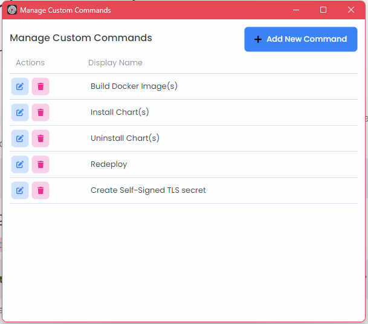
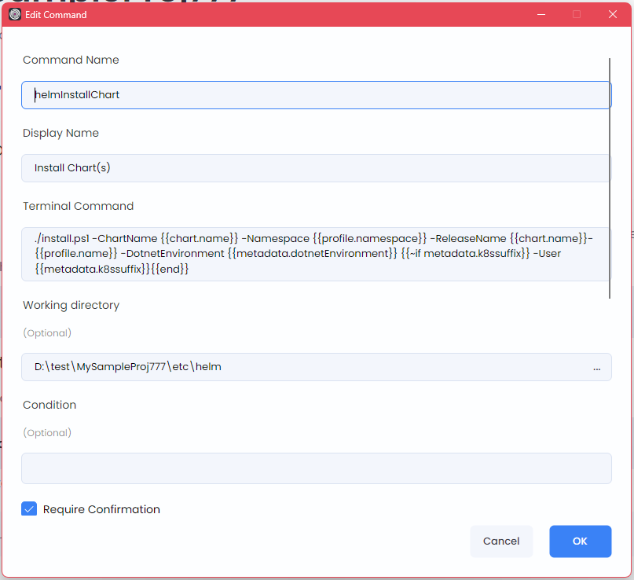

```json
//[doc-seo]
{
    "Description": "Learn how to create and manage custom commands in ABP Studio to automate build, deployment, and other workflows."
}
```

# Custom Commands

````json
//[doc-nav]
{
  "Next": {
    "Name": "Working with ABP Suite",
    "Path": "studio/working-with-suite"
  }
}
````

Custom commands allow you to define reusable terminal commands that appear in context menus throughout ABP Studio. You can use them to automate repetitive tasks such as building Docker images, installing Helm charts, running deployment scripts, or executing any custom workflow.

> **Note:** This is an advanced feature primarily intended for teams working with Kubernetes deployments or complex build/deployment workflows. If you're developing a standard application without custom DevOps requirements, you may not need this feature.

## Opening the Management Window

To manage custom commands, right-click on the solution root in *Solution Explorer* and select *Manage Custom Commands*.



The management window displays all defined commands with options to add, edit, or delete them.

## Creating a New Command

Click the *Add New Command* button to open the command editor dialog.



## Command Properties

| Property | Description |
|----------|-------------|
| **Command Name** | A unique identifier for the command (used internally) |
| **Display Name** | The text shown in context menus |
| **Terminal Command** | The PowerShell command to execute. Use `&&&` to chain multiple commands |
| **Working Directory** | Optional. The directory where the command runs (relative to solution path) |
| **Condition** | Optional. A [Scriban](https://github.com/scriban/scriban/blob/master/doc/language.md) expression that determines when the command is visible |
| **Require Confirmation** | When enabled, shows a confirmation dialog before execution |
| **Confirmation Text** | The message shown in the confirmation dialog |

## Trigger Targets

Trigger targets determine where your command appears in context menus. You can select multiple targets for a single command.

| Target | Location |
|--------|----------|
| **Helm Charts Root** | *Kubernetes* panel > *Helm* tab > root node |
| **Helm Main Chart** | *Kubernetes* panel > *Helm* tab > main chart |
| **Helm Sub Chart** | *Kubernetes* panel > *Helm* tab > sub chart |
| **Kubernetes Service** | *Kubernetes* panel > *Kubernetes* tab > service |
| **Solution Runner Root** | *Solution Runner* panel > profile root |
| **Solution Runner Folder** | *Solution Runner* panel > folder |
| **Solution Runner Application** | *Solution Runner* panel > application |

## Execution Targets

Execution targets define where the command actually runs. This enables cascading execution:

- When you trigger a command from a **root or parent item**, it can recursively execute on all matching children
- For example: trigger from *Helm Charts Root* with execution target *Helm Sub Chart* → the command runs on each sub chart

## Template Variables

Commands support [Scriban](https://github.com/scriban/scriban/blob/master/doc/language.md) template syntax for dynamic values. Use `` to insert context-specific data.

### Available Variables by Context

**Helm Charts:**

| Variable | Description |
|----------|-------------|
| `profile.name` | Kubernetes profile name |
| `profile.namespace` | Kubernetes namespace |
| `chart.name` | Current chart name |
| `chart.path` | Chart directory path |
| `metadata.*` | Hierarchical metadata values (e.g., `metadata.imageName`) |
| `secrets.*` | Secret values (e.g., `secrets.registryPassword`) |

**Kubernetes Service:**

| Variable | Description |
|----------|-------------|
| `name` | Service name |
| `profile.name` | Kubernetes profile name |
| `profile.namespace` | Kubernetes namespace |
| `mainChart.name` | Parent main chart name |
| `chart.name` | Related sub chart name |
| `chart.metadata.*` | Chart-specific metadata |

**Solution Runner (Root, Folder, Application):**

| Variable | Description |
|----------|-------------|
| `profile.name` | Run profile name |
| `profile.path` | Profile file path |
| `application.name` | Application name (Application context only) |
| `application.baseUrl` | Application URL (Application context only) |
| `folder.name` | Folder name (Folder/Application context) |
| `metadata.*` | Profile metadata values |
| `secrets.*` | Profile secret values |

## Example: Build Docker Image

Here's an example command that builds a Docker image for Helm charts:

**Command Properties:**
- **Command Name:** `buildDockerImage`
- **Display Name:** `Build Docker Image`
- **Terminal Command:** `./build-image.ps1 -ProjectPath  -ImageName `
- **Working Directory:** `etc/helm`
- **Trigger Targets:** Helm Charts Root, Helm Main Chart, Helm Sub Chart
- **Execution Targets:** Helm Main Chart, Helm Sub Chart
- **Condition:** ``

This command:
1. Appears in the context menu of Helm charts root and all chart nodes
2. Executes on main charts and sub charts (cascading from root if triggered there)
3. Only shows for charts that have `projectPath` metadata defined
4. Runs the `build-image.ps1` script with dynamic parameters from metadata
