```json
//[doc-seo]
{
    "Description": "Explore ABP Studio's centralized monitoring solution to effectively oversee your applications, track performance, and collect telemetry data seamlessly."
}
```

# ABP Studio: Monitoring Applications

````json
//[doc-nav]
{
  "Next": {
    "Name": "Model Context Protocol (MCP)",
    "Path": "studio/model-context-protocol"
  }
}
````

ABP Studio offers a comprehensive centralized monitoring solution, enabling you to oversee all applications from a single interface. To see the monitoring tabs you can select the [Solution Runner](./running-applications.md) or *Kubernetes* from the left menu, monitoring tabs are automatically opened in the center. You can start the applications for monitoring. Various monitoring options are available, including [Overall](#overall), [Browse](#browse), [HTTP Requests](#http-requests), [Events](#events), [Exceptions](#exceptions), [Logs](#logs), [Tools](#tools). 

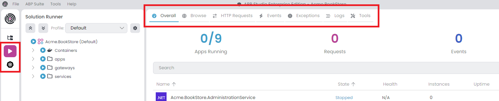

If you want to open any of these tabs in separate window, just drag it from the header a little bit and it will pop-up in a new window. In this way you can monitor multiple tabs at once:

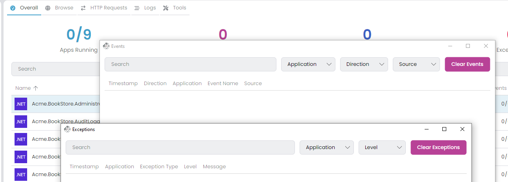

## Collecting Telemetry Information

There are two application [types](./running-applications.md#applications): C# and CLI. Only C# applications can establish a connection with ABP Studio and transmit telemetry information via the `Volo.Abp.Studio.Client.AspNetCore` package. However, we can view the *Logs* and *Browse* (if there is a *Launch URL*) for both CLI and C# application types. Upon starting C# applications, they attempt to establish a connection with ABP Studio. When connection successful, you should see a chain icon next to the application name in [Solution Runner](./running-applications.md#start--stop--restart). Applications can connect the ABP Studio with *Solution Runner* -> *C# Application* -> *Run* -> *Start* or  from an outside environment such as debugging with Visual Studio. Additionally, they can establish a connection from a Kubernetes Cluster through the ABP Studio [Kubernetes Integration: Connecting to the Cluster](../get-started/microservice.md#kubernetes-integration-connecting-to-the-cluster).

You can [configure](../framework/fundamentals/options.md) the `AbpStudioClientOptions` to disable send telemetry information. The package automatically gets the [configuration](../framework/fundamentals/configuration.md) from the `IConfiguration`. So, you can set your configuration inside the `appsettings.json`:

- `StudioUrl`: The ABP Studio URL for sending telemetry information. Mostly, you don't need to change this value. The default value is `http://localhost:38271`.
- `IsLinkEnabled`: If this value is `true`, it starts the connection to ABP Studio and transmits telemetry information. You can switch this to `false` for deactivation. In a production deployment, you should explicitly set this value to `false`. The default value is `true`.


```json
"AbpStudioClient": { 
 "StudioUrl": "http://abp-studio-proxy:38271",
 "IsLinkEnabled": false
}
```

Alternatively you can configure the standard [Options](../framework/fundamentals/options.md) pattern in the `ConfigureServices` method of the `YourApplicationModule` class.

```csharp
public override void ConfigureServices(ServiceConfigurationContext context)
{
    Configure<AbpStudioClientOptions>(options =>
    {
        options.IsLinkEnabled = false;
        //options.StudioUrl = "";
    });
}
```

## Overall

In this tab, you can view comprehensive overall information. You have the option to search by application name and filter by application state. To reset all filters, use the *Clear Filters* button. When you apply a filter header informations gonna refresh by filtered applications.

- `Apps Running`: The number of applications running. It includes only C# applications. In the example, nine C# microservice applications are running.
- `Requests`: The number of HTTP requests received by all C# applications.
- `Events`: The number of [Distributed Event](../framework/infrastructure/event-bus/distributed) sent or received by all C# applications.
- `Exceptions`: The number of exceptions thrown by all C# applications.

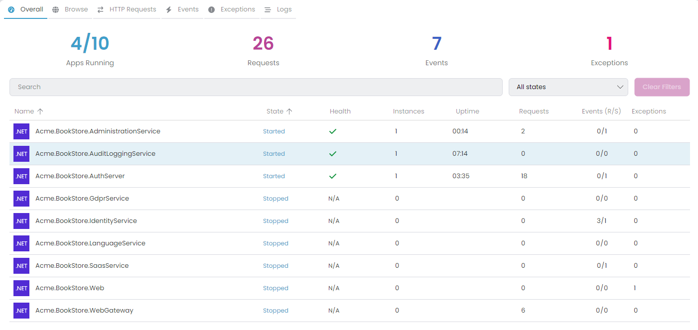

In the data grid, details for each application are displayed. It's possible to sort rows by columns.

- `Name`: The name of the application.
- `State`: The state of the application. It can take on several values such as *Scheduled*, *Starting*, *Started*, *Stopping* and *Stopped*. The *Scheduled* state indicates the application is waiting for an automatic restart (e.g., after a crash or when watch mode detects changes). You can cancel the scheduled restart at this stage.
- `Health`: The health state of the application. The icon indicates the current health status: *Healthy* (green), *Unhealthy* (red), *Degraded* (yellow), or *Unknown* (gray). Clicking on the icon shows the latest health check response in JSON format. Displays `N/A` if the application is not running or health check is not configured for the application.
- `Instances`: Indicates the count of running instances for the application. This value is particularly helpful when scaling the application within a Kubernetes cluster, providing visibility into the number of currently active pods.
- `Uptime`: The time elapsed since the application started.
- `Requests`: The number of HTTP requests received by the application.
- `Events (R/S)`: The number of [Distributed Events](../framework/infrastructure/event-bus/distributed) received or sent by the application.
- `Exceptions`: The number of exceptions thrown by the application.
- `Actions`: The actions that can be performed on the application. You can start and stop the application.

### Context Menu Actions

When selecting a row, you can right-click to access the context menu with the following actions:

| Action | Description |
|--------|-------------|
| **Start / Stop** | Start or stop the selected application. |
| **Restart** | Restart the application (available when the application is running). |
| **Build** | Build options including *Build*, *Graph Build*, *Restore*, and *Clean* (available for C# applications when stopped). |
| **Browse** | Open the application in the [Browse](#browse) tab (available when a Launch URL is configured). |
| **Health Status** | Submenu with *Browse Health UI* and *Show Latest Health Check Response* options. |
| **Requests** | Open the [HTTP Requests](#http-requests) tab filtered by this application. |
| **Exceptions** | Open the [Exceptions](#exceptions) tab filtered by this application. |
| **Logs** | Open the [Logs](#logs) tab with this application selected. |
| **Copy Url** | Copy the application's URL to the clipboard. |
| **Properties** | Open the application properties dialog. |

> For the events system, you can exclusively view the [Distributed Events](../framework/infrastructure/event-bus/distributed). Generally, the [Local Events](../framework/infrastructure/event-bus/local) are not included.

## Browse

ABP Studio includes a built-in browser that allows access to websites and running applications. You can open new tabs to browse different websites or view active applications. It's a convenient utility to access websites and applications without leaving ABP Studio. Clicking the *Browse* tab displays the running applications and an *Open new tab* button.

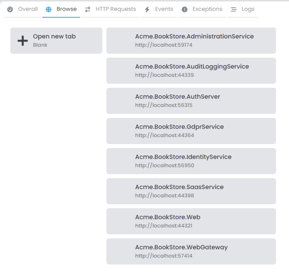

You can open the *Browse* tabs as many times as you want. It's possible to open the same application in several tabs simultaneously. To open an application, you can:

- Double-click on an application in the *Solution Runner* tree.
- Right-click on an application and select *Browse* from the context menu.
- Click on a running application in the application list shown in the *Browse* tab.

These options are only available when the application has a [Launch URL](./running-applications.md#properties) configured. Additionally, you can access any URL by entering it into the address bar.

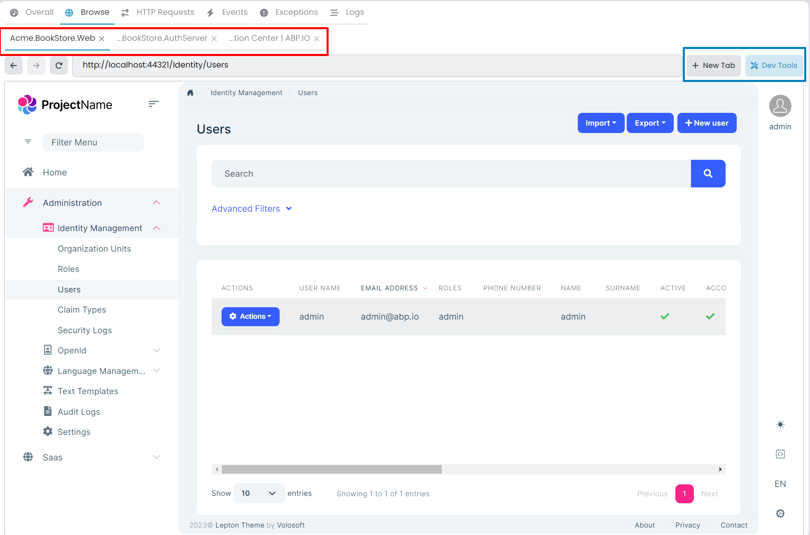

### Browser Toolbar

The browser toolbar provides the following controls:

| Control | Description |
|---------|-------------|
| **Back / Forward** | Navigate through your browsing history within the tab. |
| **Refresh** | Reload the current page. |
| **Address Bar** | Enter any URL to navigate directly. The address bar shows the current URL and allows you to navigate to any website. |
| **Dev Tools** | Opens the [Chrome DevTools](https://developers.google.com/web/tools/chrome-devtools) for the selected tab, allowing you to inspect elements, debug JavaScript, and analyze network requests. |
| **Clear Cookies** | Clears all cookies for the currently selected tab, useful for testing authentication flows or resetting session state. |
| **Open in External Browser** | Opens the current URL in your system's default web browser. |

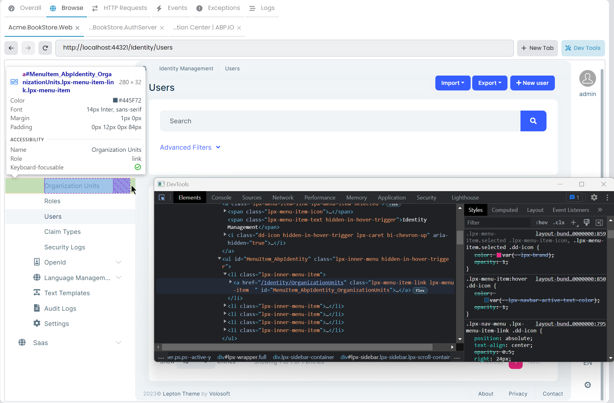

### Default Credentials Notification

When browsing certain applications (such as AppHost dashboards), ABP Studio displays a notification bar with default credentials. This helps you quickly log in during development. You can dismiss this notification permanently by clicking the *Don't show again* option.

## HTTP Requests

Within this tab, you can view all *HTTP Requests* received by your C# applications. You have the option to filter requests based on URLs by using the search textbox or by selecting a particular application from the combobox. The *Clear Requests* button removes all received requests. Moreover, you have the ability to sort requests by columns.

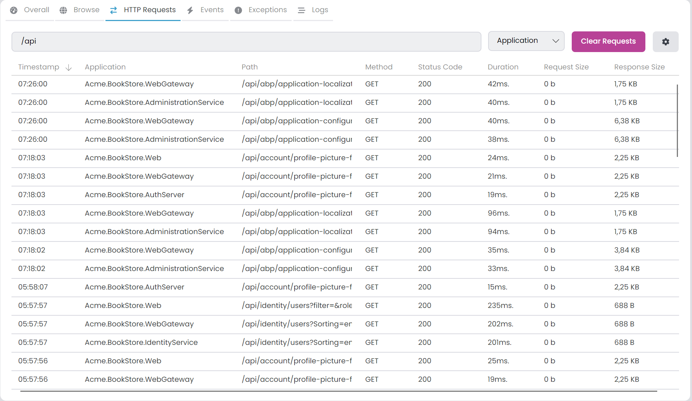

### Request List Columns

The request list displays the following information:

| Column | Description |
|--------|-------------|
| **Timestamp** | When the request was received (displayed as HH:mm:ss). |
| **Application** | The name of the application that received the request. |
| **Path** | The request URL path and query string. |
| **Method** | The HTTP method (GET, POST, PUT, DELETE, etc.). |
| **Status Code** | The HTTP response status code. |
| **Duration** | The time taken to process the request in milliseconds. |
| **Request Body Size** | The size of the request payload. |
| **Response Body Size** | The size of the response payload. |

### Request Details

Clicking on a row enables you to view the details of each HTTP request:

- **URL**: The full request URL.
- **Method**: The HTTP method used.
- **Status Code**: The response status code.
- **Duration**: Request processing time in milliseconds.
- **Timestamp**: When the request was received.
- **Headers (Request)**: All request headers sent by the client.
- **Headers (Response)**: All response headers returned by the server.
- **Request (Payload)**: The request body with size information.
- **Response**: The response body with size information.

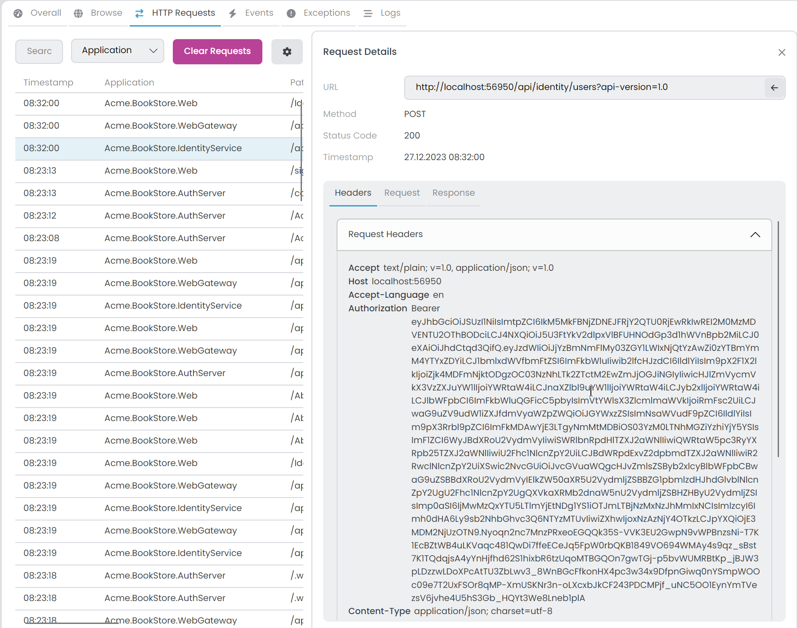

### Formatting JSON Content

Both request and response payloads have a *Format* button that formats JSON content for better readability. This is available when the content type is `application/json`.

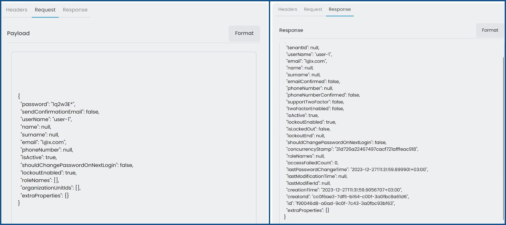

### Quick URL Filter

When viewing request details, you can right-click and select *Filter Selected URL* to quickly apply the current URL as a filter. This is useful when you want to see all requests to a specific endpoint.

### Configuring Ignored URLs

By clicking the gear icon in the *HTTP Requests* tab, you can access the *Solution Runner HTTP Requests Options* window. Within the *Ignored URLs* tab, you have the ability to exclude particular URLs by applying a regex pattern. Excluded URLs won't be visible in the *HTTP Requests* tab. By default, the metrics URL is already ignored. You can add or remove items as needed.

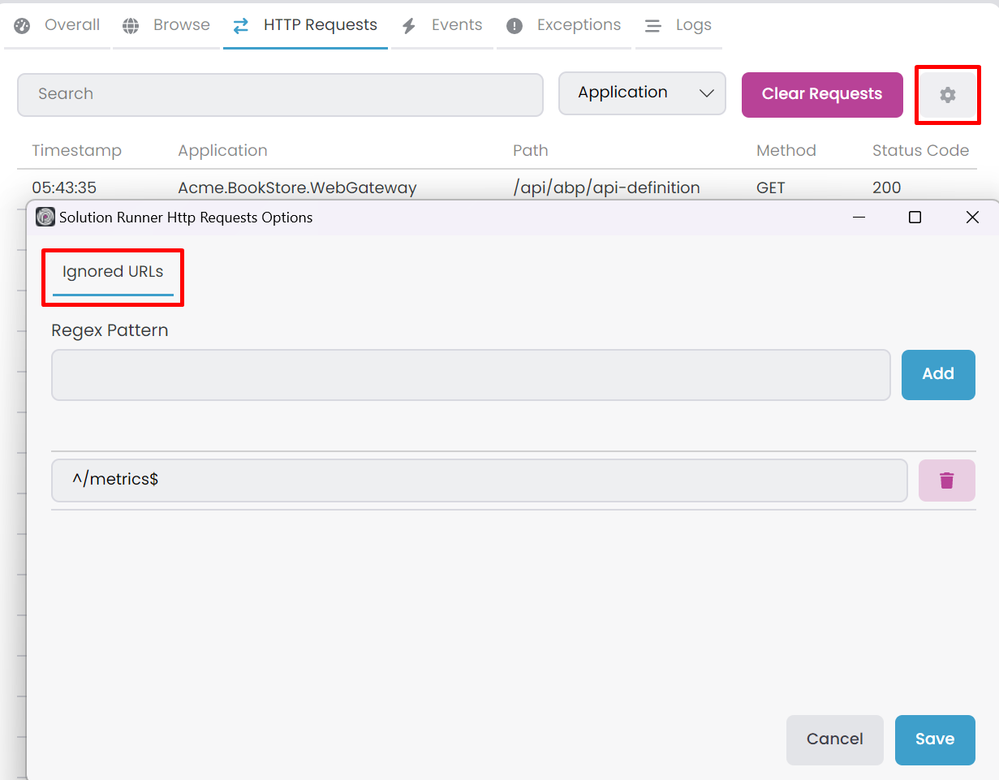

> After adding a new URL pattern, it will only affect subsequent requests. Existing requests will remain visible.

## Events

In this tab, you can view all [Distributed Events](../framework/infrastructure/event-bus/distributed) sent or received by your C# applications. You can filter them by [Event Name](../framework/infrastructure/event-bus/distributed#event-name) using the search textbox or by selecting a specific application. Additionally, you can choose the *Direction* (Received/Sent) and *Source* (Direct/Inbox/Outbox) of events. The *Clear Events* button removes all events.

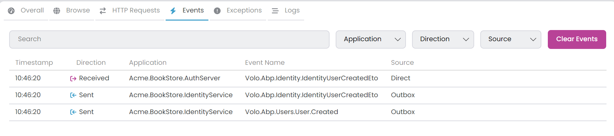

### Direction and Source Filters

| Filter | Options | Description |
|--------|---------|-------------|
| **Direction** | *Received*, *Sent* | Filter by whether events were received or sent by the application. |
| **Source** | *Direct*, *Inbox*, *Outbox* | Filter by event source. Relevant when using the [Inbox/Outbox pattern](../framework/infrastructure/event-bus/distributed#outbox-inbox-for-transactional-events). |

- **Direct**: Events sent or received without using the Inbox/Outbox pattern.
- **Inbox**: Events received through the transactional inbox.
- **Outbox**: Events sent through the transactional outbox.

### Event Details

Clicking on a row enables you to view the details of each event:

- **Application**: The application that sent or received the event.
- **Event Name**: The full event type name.
- **Direction**: Whether the event was received or sent.
- **Source**: The event source (Direct, Inbox, or Outbox).
- **Timestamp**: When the event was processed.
- **Event Data**: The event payload in JSON format.

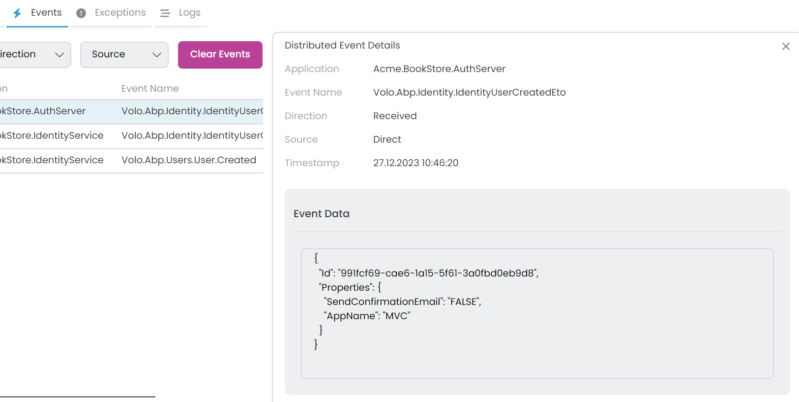

### Formatting Event Data

The *Event Data* section includes a *Format* button that formats the JSON content for better readability. This makes it easier to inspect complex event payloads.

> ABP Studio automatically decodes Base64-encoded event data. If your event bus uses Base64 encoding for message transport, the data will be displayed in its decoded, readable form.

## Exceptions

This tab displays all exceptions thrown by your C# applications. You can apply filters using the search textbox based on *Message*, *Source*, *ExceptionType*, and *StackTrace* or by choosing a specific application. Additionally, you have the option to select the [Log Level](../framework/fundamentals/exception-handling.md#log-level) for filtering. To clear all exceptions, use the *Clear Exceptions* button.

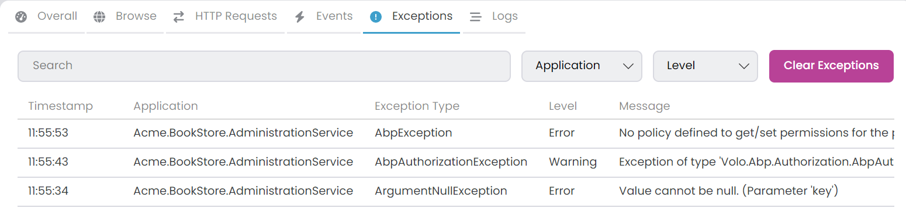

### Exception List

The exception list shows a summary of each exception:

- **Exception Type**: The short exception type name (e.g., `NullReferenceException` instead of `System.NullReferenceException`).
- **Message**: A truncated version of the exception message.
- **Timestamp**: When the exception occurred.
- **Level**: The log level (Error, Warning, etc.).

### Exception Details

Click on a row to inspect the full details of each exception:

- **Application**: The application where the exception occurred.
- **Exception Type**: The full exception type name including namespace.
- **Source**: The source file or component where the exception originated.
- **Timestamp**: When the exception was thrown.
- **Level**: The log level associated with this exception.
- **Message**: The complete exception message.
- **StackTrace**: The full stack trace showing the call hierarchy.

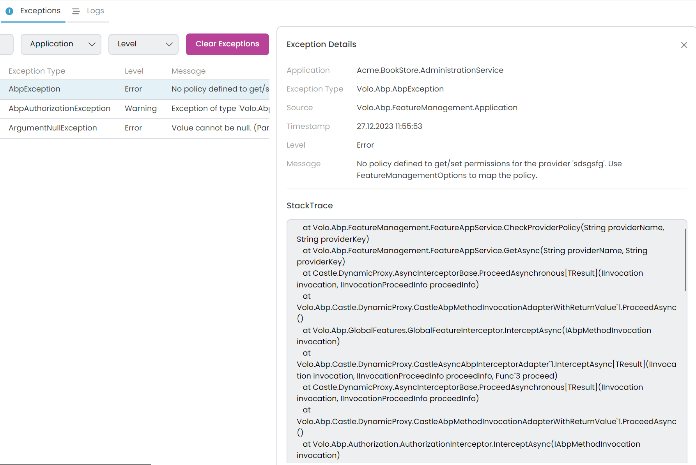

### Inner Exceptions

If an exception contains inner exceptions, they are displayed hierarchically in the details panel. This allows you to trace the root cause of wrapped exceptions, which is common in scenarios like database errors wrapped in application-level exceptions.

## Logs

The *Logs* tab allows you to view all logs for both CLI and C# applications. To access logs, simply select an application from the dropdown. You can also apply filters using the search textbox by log text or by selecting a specific *Log Level*.

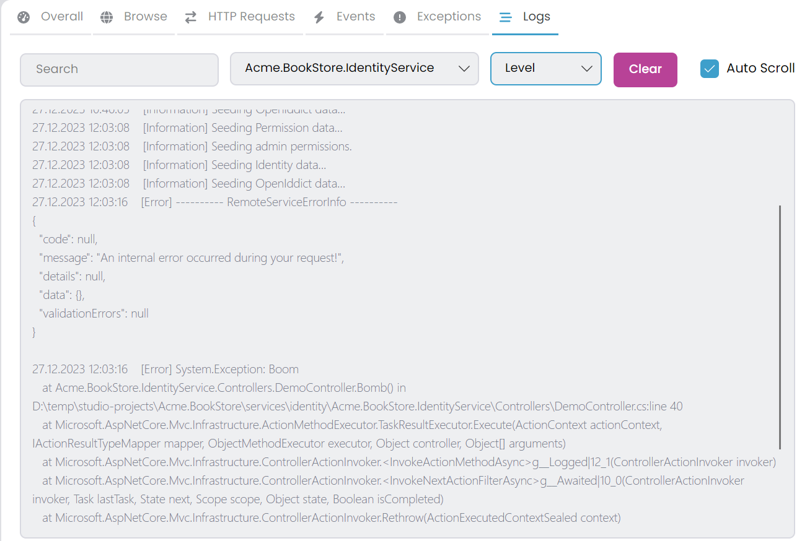

### Log Level Filtering

When you select a *Log Level*, it shows the selected level and all higher severity levels:

| Selected Level | Shows |
|---------------|-------|
| **Trace** | Trace, Debug, Information, Warning, Error, Critical |
| **Debug** | Debug, Information, Warning, Error, Critical |
| **Information** | Information, Warning, Error, Critical |
| **Warning** | Warning, Error, Critical |
| **Error** | Error, Critical |
| **Critical** | Critical only |
| **None** | All logs (no filtering) |

### Log Display Features

- **Color Coding**: Log entries are color-coded by level for quick visual identification. Errors and critical logs stand out with distinct colors.
- **Auto Scroll**: When enabled, the display automatically scrolls to show new logs as they arrive. This is useful for real-time monitoring.
- **Clear Logs**: Clears the logs for the currently selected application only. Other applications' logs remain intact.
- **Text Filter**: Search within log messages using the search textbox. The filter is applied in real-time with a slight delay for performance.

## Tools

The *Tools* tab provides quick access to web-based management interfaces for infrastructure services like Grafana, RabbitMQ, pgAdmin, and Redis Commander. Each tool opens in a dedicated browser tab within ABP Studio, eliminating the need to switch between external browser windows.

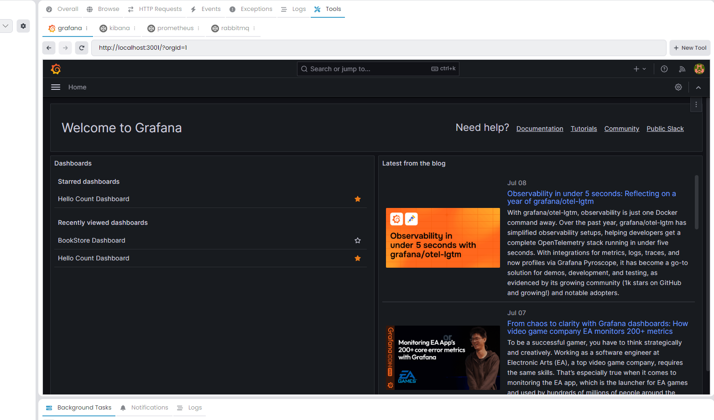

The microservice template includes pre-configured tools for common infrastructure services. You can customize these tools or add new ones based on your project requirements.

### Adding a New Tool

To add a new tool, click the *+* button in the *Tools* tab. This opens the *Create Tool* dialog where you can configure the tool properties.

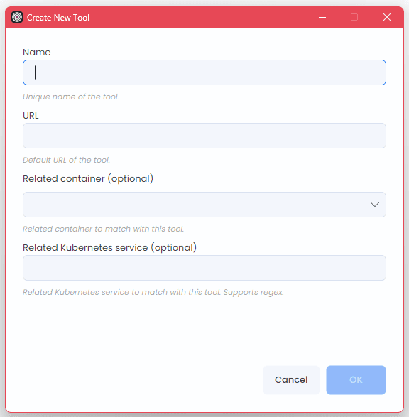

### Tool Properties

Each tool has the following configurable properties:

| Property | Required | Description |
|----------|----------|-------------|
| **Name** | Yes | A unique identifier displayed as the tab header. |
| **URL** | Yes | The web interface URL (e.g., `http://localhost:3000`). |
| **Related Container** | No | Docker container name. When set, the tool activates only when this container is running. |
| **Related Kubernetes Service** | No | A regex pattern to match Kubernetes service names for automatic URL switching. |
| **Related Kubernetes Service Port** | No | The port to use when connecting via Kubernetes service. |

### Editing and Removing Tools

- **Edit**: Right-click on a tool tab and select *Edit* to modify its properties.
- **Remove**: Right-click on a tool tab and select *Close* to remove it from the profile.
- **Clear Cookies**: Right-click on a tool tab and select *Clear Cookies* to reset the browser session for that tool.

### Tool Activation States

Tools can be in different activation states depending on their configuration:

| State | Condition | Behavior |
|-------|-----------|----------|
| **Always Active** | No *Related Container* specified | Tool is always accessible regardless of container state. |
| **Container-Dependent** | *Related Container* specified | Tool activates only when the specified Docker container is running. |
| **Kubernetes-Aware** | *Related Kubernetes Service* specified | Tool URL switches between local and Kubernetes endpoints automatically. |

### Kubernetes Integration

When you specify a *Related Kubernetes Service*, the tool gains the ability to seamlessly switch between local and Kubernetes environments. This is particularly useful for microservice development where you run some services locally while others remain in a Kubernetes cluster.

**Automatic URL Switching:**

1. **Local Mode**: When the *Related Container* is running, the tool uses the configured *URL* (e.g., `http://localhost:3000`).
2. **Kubernetes Mode**: When the container stops and you're [connected to a Kubernetes cluster](./kubernetes.md#connecting-to-a-kubernetes-cluster), the tool automatically redirects to the matching Kubernetes service.
3. **Pattern Matching**: The *Related Kubernetes Service* accepts regex patterns. For example, `.*-grafana` matches any service name ending with `-grafana`.

> This automatic switching eliminates the need to manually update URLs when transitioning between local development and Kubernetes-based testing.

### Run Profile Configuration

Tools are persisted in the Run Profile file (`.abprun.json`). Below is an example configuration with common infrastructure tools:

```json
{
  "tools": {
    "grafana": {
      "url": "http://localhost:3000",
      "relatedContainer": "grafana",
      "relatedKubernetesService": ".*-grafana",
      "relatedKubernetesServicePort": 3000
    },
    "rabbitmq": {
      "url": "http://localhost:15672",
      "relatedContainer": "rabbitmq",
      "relatedKubernetesService": ".*-rabbitmq",
      "relatedKubernetesServicePort": 15672
    },
    "redis-commander": {
      "url": "http://localhost:8081",
      "relatedContainer": "redis-commander"
    },
    "pgadmin": {
      "url": "http://localhost:5050",
      "relatedContainer": "pgadmin"
    },
    "seq": {
      "url": "http://localhost:5341"
    }
  }
}
```

### Default Credentials

Some tools display a notification bar with default credentials when opened for the first time:

| Tool | Username | Password |
|------|----------|----------|
| Grafana | `admin` | `admin` |
| RabbitMQ | `guest` | `guest` |

> You can dismiss this notification permanently by clicking the *Don't show again* option.
