```json
//[doc-seo]
{
    "Description": "Learn how to use the ABP Studio's Solution Runner to run applications, manage tasks, and organize projects with customizable profiles."
}
```

# ABP Studio: Solution Runner

````json
//[doc-nav]
{
  "Next": {
    "Name": "Monitoring Applications",
    "Path": "studio/monitoring-applications"
  }
}
````

Use the *Solution Runner* to easily run your application(s), execute tasks, and set up infrastructure. You can create different profiles to organize projects based on your needs and teams. Simply navigate to the *Solution Runner* panel in the left menu.

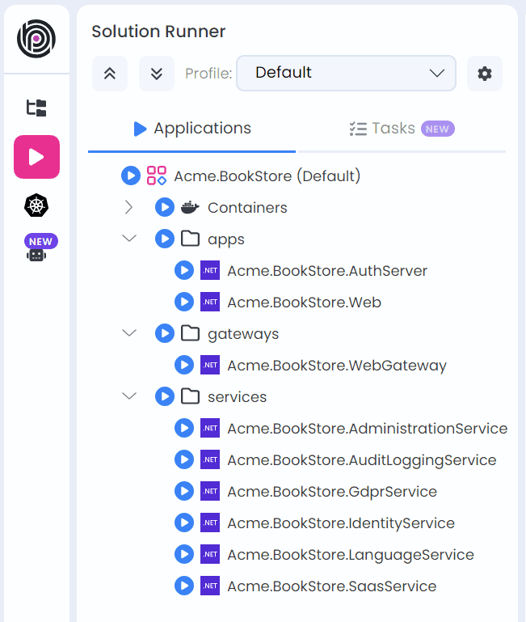

The Solution Runner contains two tabs:

- **Applications**: For managing and running your applications.
- **Tasks**: For managing tasks that can be executed on demand or automatically when the solution is opened.

> The project structure might be different based on your selection. For example MVC microservice project, looks like the following. You can edit the tree structure as you wish.

## Profile

We can create different profiles for each teams or scenarios, which is provide us to organize our tree structure as needed. With this way each profile contains their own folder and application tree structure. We can collapse or expand the entire tree using the up and down arrow icons. The *Default* profile comes with the project creation, includes all projects in the tree to manage at once. You can view all profiles in the combobox and change the current profile. To edit, click the gear icon located on the right side.

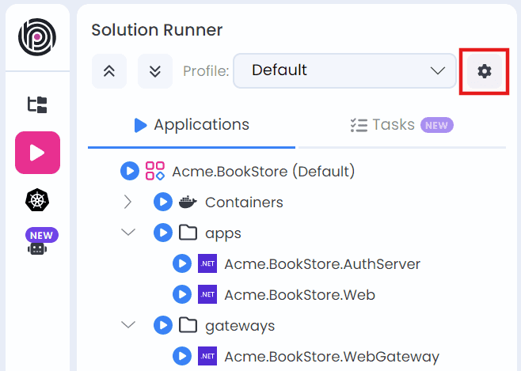

It opens the *Manage Run Profiles* window. You can edit/delete existing profiles or add a new one.

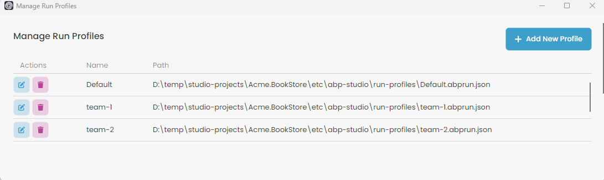

When you click *Add New Profile*, it opens the *Create New Profile* window. You can provide an arbitrary profile name, which should be unique among the profiles. Additionally, the name should only contain letters, numbers, underscores, dashes, and dots in the text. When you create a new profile, it stores the JSON file at the specified path. You can specify the path `abp-solution-path/etc/abp-studio/run-profiles` for microservice projects or `abp-solution-path/etc/run-profiles` for other project types to adhere to the standard format. You can also define *Metadata* and *Secrets* key-value pairs. Click *OK* button to save profile.

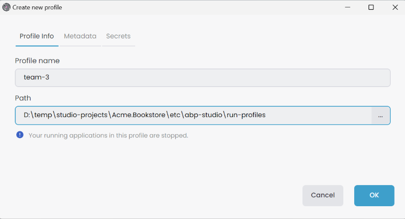

> When a profile is edited or deleted while running some applications, those applications will be stopped. However, applications running under a different profile will continue to run unaffected. Lastly, if we add a new profile, all applications running under existing profiles will be stopped.

## Applications

The **Applications tab** allows you to manage and run your applications. The solution runner contains 4 different types to define tree structure:

- **Profile**: We can create different profiles to manage the tree as our needs. For example we can create 2 different profile for `team-1` and `team-2`. `team-1` want to see the only *Administration* and *Identity* service, `team-2` see the *Saas* and *AuditLogging* services. With that way each team see the only services they need to run. In this example `Default` profile *Acme.BookStore (Default)* comes out of the box when we create the project.
- **Folder**: We can organize the applications with *Folder* type. In this example, we keep services in `services` folder for our microservice projects. We can also use nested folder if we want `apps`, `gateways` and `services` are the folders in current(`Default`) profile. 
- **C# Application**: We can add any C# application from our [Solution Explorer](./solution-explorer.md). If the application is not in our solution, we can add it externally by providing the *.csproj* file path. The .NET icon indicates that the application is a C# project. For example, `Acme.BookStore.AuthServer`, `Acme.BookStore.Web`, `Acme.BookStore.WebGateway`, etc., are C# applications.
- **CLI Application**: We can add [powershell](https://learn.microsoft.com/en-us/powershell/module/microsoft.powershell.core) commands to prepare some environments or run other application types than C# such as angular.
- **Docker Container**: We can add Docker container files to control them on UI, start/stop containers individually.

### Using the Profile

After selecting the current profile, which is the *Default* profile that comes pre-configured, we can utilize the tree items. This allows us to execute collective commands and create various tree structures based on our specific needs. You can navigate through the root of the tree and right-click to view the context menu, which includes the following options: `Start All`, `Stop All`, `Build`, `Add`, and `Manage Start Actions`.

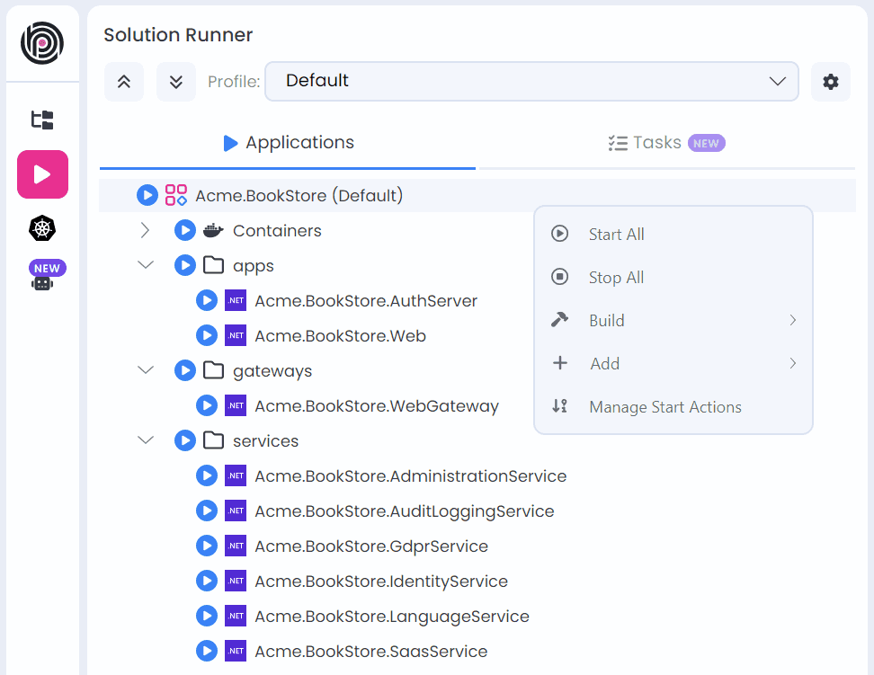

#### Start/Stop All

We can start/stop the applications with these options. Go to the root of the tree and right-click to view the context menu:

- `Start All`: Start all(CLI, C#) applications.
- `Stop All`: Stop all(CLI, C#) applications.

> You can change the current profile while applications are running in the previous profile. The applications continue to run under the previous profile. For example, if we start the `Acme.BookStore.AdministrationService`, `Acme.BookStore.IdentityService` applications when the current profile is *team-1* and after changing the current profile to *team-2* the applications continue to run under *team-1*.

#### Build

We can use common [dotnet](https://learn.microsoft.com/en-us/dotnet/core/tools) commands in this option. Go to the root of the tree and right-click to view the context menu, in this example *Acme.Bookstore(Default)* -> *Build*, there are 4 options available:

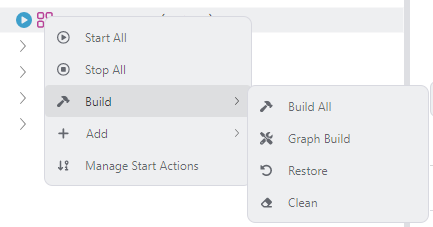

- `Build All`: Builds each C# applications.
- `Graph Build`: Builds each C# applications with [graphBuild](https://learn.microsoft.com/en-us/visualstudio/msbuild/build-process-overview?view=vs-2022#graph-option) option.
- `Restore`: Restores the dependencies for C# applications.
- `Clean`: Cleans the output of the previous build for C# applications.

> Since *Solution Runner* may contain numerous C# projects, the *Build* options uses the [Background Tasks](./overview#background-tasks), ensuring a seamless experience while using ABP Studio.

#### Add

We can add 4 different item types to *Profile* for defining the tree structure. Those options are `C# Application`, `CLI Application`, `Docker Container`, and `Folder`.

> Note: The `Docker Container` option is only available when right-clicking the profile root. When right-clicking a folder, only `C# Application`, `CLI Application`, and `Folder` options are available.

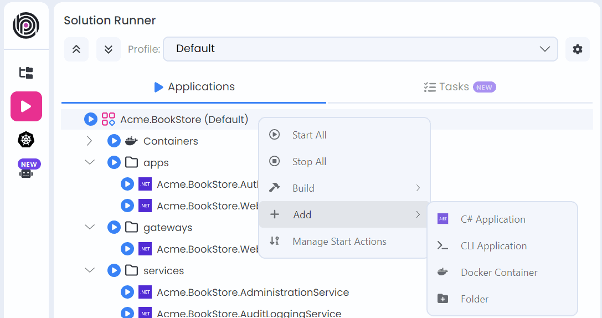

##### C# Application

When we go to the root of the tree and right-click, in this example *Acme.BookStore(Default)* -> *Add* -> *C# Application* it opens the *Add Application* window. There are two methods to add applications: *This solution* and *External*. To add via the *This solution* tab, follow these steps:

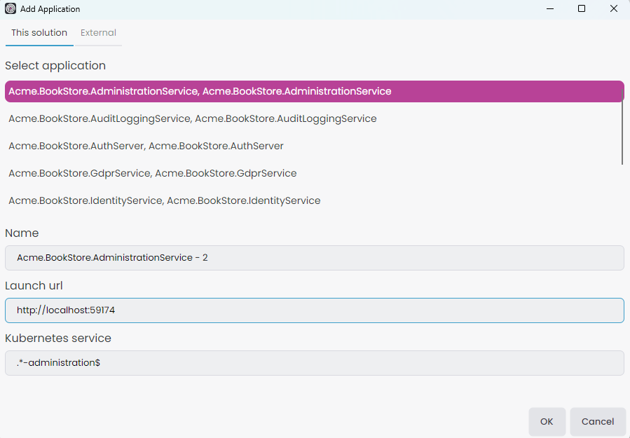

- `Select application`: First we have to select an application, you have the option to add the same application multiple times.
- `Name`: Give an arbitrary name to see in solution runner. This name should be unique for each profile even the selected application already exists.
- `Launch url`: Is the url when we want to browse.
- `Kubernetes service`: If you're not using the *Kubernetes* panel leave it empty. It's necessary for browse, when we connect the kubernetes cluster we should browse the kubernetes services instead *Launch url*. In [microservice](../get-started/microservice.md) template this option already configured and you can copy the existing regex pattern from your selected application [properties](#properties). If you create a custom helm chart you can also give the regex pattern that matches with your helm chart kubernetes service name.

You can click the `OK` button to add the C# application to the profile.

The C# project doesn't have to be within the current [Solution Explorer](./solution-explorer.md), it can even be outside. Also the project type could be anything such as [Console App](https://learn.microsoft.com/en-us/dotnet/csharp/tutorials/console-teleprompter), [ASP.NET Core Razor Pages](https://learn.microsoft.com/en-us/aspnet/core/razor-pages/), etc. To add it, click on the *External* tab in *Add Application* window.

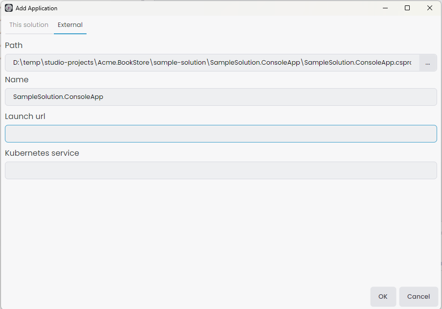

- `Path`: Provide the path to the .csproj file you wish to add. The path will be [normalized](https://learn.microsoft.com/en-us/dotnet/standard/io/file-path-formats#path-normalization), allowing the project location to be flexible, as long as it's accessible from the current [ABP Solution](./concepts.md#solution).
- `Name`: Give an arbitrary name to see in solution runner. This name should be unique for each profile.
- `Launch url`: This is the url when we want to browse. But if the added project doesn't have launch url we can leave it empty.
- `Kubernetes service`: If you're not using the *Kubernetes* panel leave it empty. But if there is a helm chart for added application we should give the correct regex pattern. It's necessary for browse, when we connect the kubernetes cluster we should browse the services instead *Launch url*. Give the matching regex pattern for your helm chart kubernetes service name.

You can click the `OK` button to add the C# application to the profile.

##### CLI Application

We can add any [powershell](https://learn.microsoft.com/en-us/powershell/module/microsoft.powershell.core) file to execute from the solution runner. With this flexibility we can prepare our infrastructure environment such as `Docker-Dependencies` or run different application types like `Angular`. You can add CLI applications with root of the tree and right-click, in this example *Acme.BookStore(Default)* -> *Add* -> *CLI Application*.

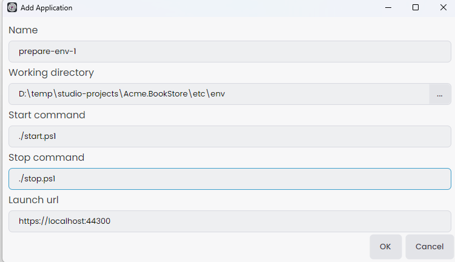

- `Name`: Give an arbitrary name to see in solution runner. This name should be unique for each profile.
- `Working directory`: Provide the start and stop commands file directory path. The path will be [normalized](https://learn.microsoft.com/en-us/dotnet/standard/io/file-path-formats#path-normalization), allowing the folder location to be flexible, as long as it's accessible from the current [ABP Solution](./concepts.md#solution).
- `Start command`: Give the poweshell file name that we wanna execute when we click the *Run* -> *Start*. We should start with local path prefix `./` if the powershell file directory in `Working directory` or if it's in nested folder we can give the path like `./sub-path/start.ps1`. Also we can give the argument like `./start.ps1 -parameter value -parameter2 value2`.
- `Stop command`: If there is a different stop command such as for docker `up.ps1` and `down.ps1` commands. We should give the stop powershell file name that we wanna execute when click the *Run* -> *Stop*. We should start with local path prefix `./` if the powershell file directory in `Working directory` or if it's in nested folder we can give the path like `./sub-path/stop.ps1`. Also we can give the argument like `./stop.ps1 -parameter value -parameter2 value2`.
- `Launch url`: If there's a launch URL at the end of this starting process, such as for angular project publishing an app at `http://localhost:4200`, to enable the browse option, we should provide the *Launch url*.

> If the stop command isn't provided, the starting process automatically ends upon the completion of the executed start command. However, if the start command keeps running, for instance, with a command like `yarn start`, it will continue to run until we manually click *Run* -> *Stop*.

You can click the `OK` button to add the CLI application to the profile.

##### Folder

When adding applications directly to the root of the tree, it can become disorganized, especially with numerous projects. Utilizing a folder structure allows us to organize applications more efficiently. This method enables executing collective commands within a specified folder. When we go to root of the tree and right-click, in this example *Acme.BookStore(Default)* -> *Add* -> *Folder* it opens *New folder* window.

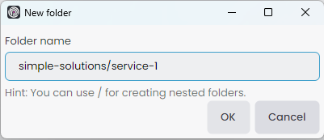

- `Folder name`: Give the folder name that we wanna see in solution runner. We can create nested folder with `/` character. This is a solution runner profile folder so, it doesn't create a real folder. Ensure each folder name is unique for each profile.

You can click the `OK` button to add the folder to the profile.

#### Miscellaneous

- You can drag and drop folder and application into folder for organization purposes. Click and hold an item, then drag it into the desired folder.
- We can start all applications by clicking the *Play* icon on the left side, similar way we can stop all applications by clicking the *Stop*  icon on the left side.
- To remove an application from the tree, open the context menu by right-clicking the application and selecting *Remove*.
- To remove a folder from the tree, open the context menu by right-clicking the folder and selecting *Delete*.
- When starting applications, they continue to restart until the application starts gracefully. To stop the restarting process when attempting to restart the application, click the icon on the left. Additionally, you can review the *Logs* to understand why the application isn't starting gracefully.

#### Manage Start Actions

This command will open a dialog where you can set start actions and start orders of sub-applications and sub-folders.

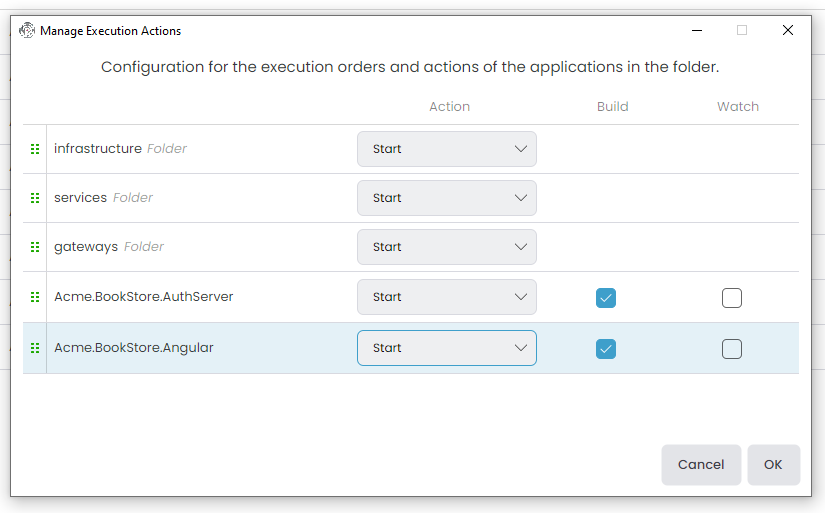

You can order the applications by dragging the icon in the first column. In the screenshot above, applications & folders are ordered like this: *Applications under infrastructure* > *Applications under services* > *Applications under gateways* > *AuthServer* > *Angular*. You can also set starting order and other actions for each folder by performing `right click > Manage Start Actions` on them.

- **Action**: There are two options: `Start` and `Don't start`. This is usefull if you want to exclude applications from batch start.
- **Build**: This option allows to disable/enable build before starting the application. If you are working on a single application, you can exclude the other applications from build to save time. This option can also be set by performing `right click > properties` on applications.
- **Watch**: When enabled, changes in your code are watched and dotnet hot-reloads the application or restarts it if needed. This option also can be set by performing `right click > properties` on applications.

### Folder Context Menu

We already now why we need folder in the [previous](#folder) section, we can use collective commands within this folder items. To do that go to folder and open the context menu by right-clicking, which includes 5 options `Start`, `Stop`, `Build`, `Add`, `Manage Start Actions`, `Rename` and `Delete`.

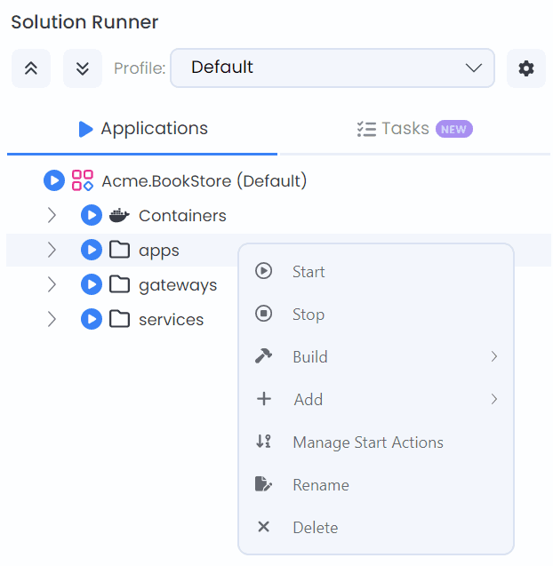

#### Start/Stop

You can see the context menu by right-clicking *Folder*. It will start/stop all the applications under the folder.

#### Build

*Folder* -> *Build* context menu, it's the [similar](#build) options like *Acme.BookStore(Default)* -> *Builds* options there are 4 options available. The only difference between them it's gonna be execute in selected folder.

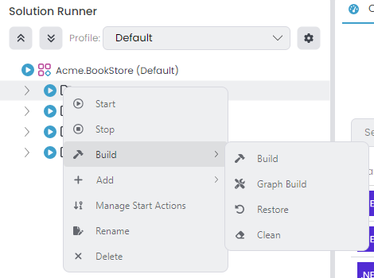

#### Add

*Folder* -> *Add* context menu, it's the [same](#add) options like *Acme.BookStore(Default)* -> *Add* there are 3 options avaiable. The only difference, it's gonna add item to the selected folder.

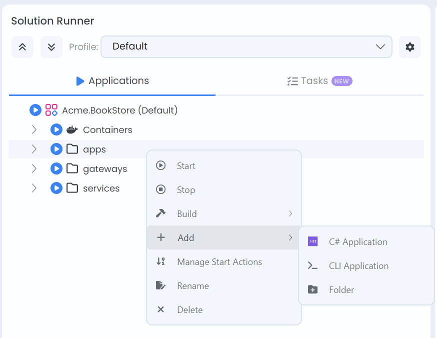

#### Miscellaneous

- You can rename a folder with *Folder* -> *Rename*.
- You can delete a folder with *Folder* -> *Delete*.

### C# Application

The .NET icon indicates that the application is a C# project. After we [add](#c-application) the C# applications to the root of the tree or folder, we can go to any C# application and right-click to view the context menu; `Start`, `Stop`, `Restart`, `Build`, `Browse`, `Health Status`, `Requests`, `Exceptions`, `Logs`, `Copy URL`, `Properties`, `Remove`, and `Open with`.

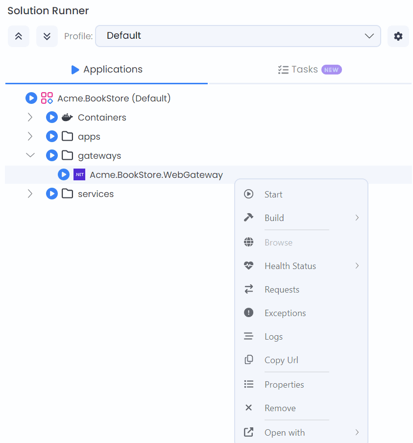

#### Start / Stop / Restart

- **Start**: Starts the selected application.
- **Stop**: Stops the running application.
- **Restart**: Restarts the running application. This option is only available when the application is started.

> When you start the C# application, you should see a *chain* icon next to the application name, that means the started application connected to ABP Studio. C# applications can connect to ABP Studio even when running from outside the ABP Studio environment, for example debugging with Visual Studio. If the application is run from outside the ABP Studio environment, it will display *(external)* information next to the chain icon.

#### Build

It's the [similar](#build) options like root of the tree options. The only difference between them it's gonna be execute the selected application.

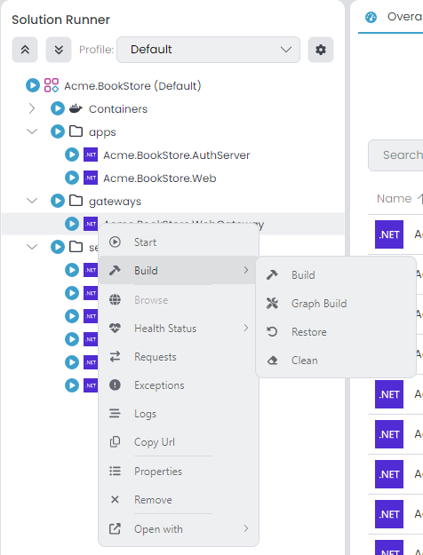

#### Monitoring

When the C# application is connected to ABP Studio, it starts sending telemetry information to see in one place. We can easily click these options to see the detail; `Browse`, `Health Status`, `Requests`, `Exceptions`, `Events` and `Logs`.

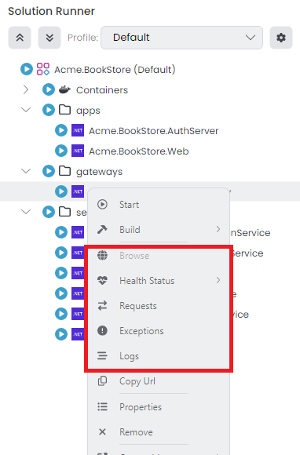

- `Browse`: ABP Studio includes a browser tool for accessing websites and running applications. You can click this option to view the application in the ABP Studio browser. However, this option is only accessible if the application is started.
- `Health Status`: A submenu that provides health monitoring options when Health Check endpoints are defined:
  - **Browse Health UI**: Opens the Health UI page of the application in the built-in browser.
  - **Show Latest Health Check Response**: Displays the latest health check response in JSON format.
- `Requests`: It opens the *HTTP Requests* tab with adding the selected application filter. You can view all *HTTP Requests* received by your applications.
- `Exceptions`: We can display all exceptions on this tab. It opens the *Exceptions* tab with selected application.
- `Events`: Opens the *Events* tab filtered by this application. You can view all [Distributed Events](../framework/infrastructure/event-bus/distributed) sent or received by this application.
- `Logs`: Clicking this option opens the *Logs* tab with adding the selected application filter.

#### Properties

We can open the *Application Properties* window to change *Launch url*, *Health check endpoints*,  *Kubernetes service* and *run* information. To access the *Application Properties* window, navigate to a C# application, right-click to view the context menu, and select the Properties option.

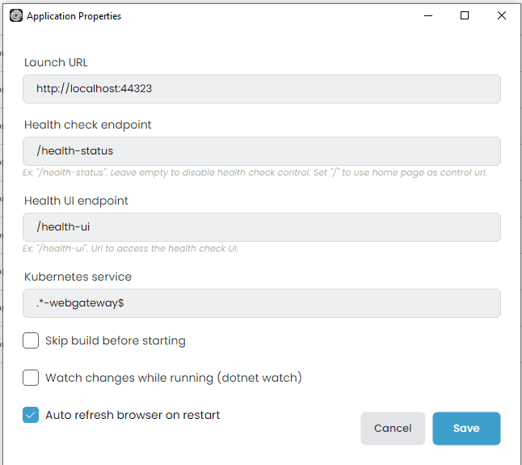

- **Launch URL**: The URL used when browsing the application. This is the address where the application is accessible.
- **Kubernetes service**: A regex pattern to match Kubernetes service names. When connected to a Kubernetes cluster, ABP Studio uses this pattern to find the corresponding Kubernetes service and uses its URL instead of the Launch URL. This applies to *Browse*, *Copy URL*, and *Health UI* features. For example, if your Helm chart creates a service named `bookstore-identity-service`, you can use `.*-identity-service` or `bookstore-identity.*` as the pattern. For [microservice](../get-started/microservice.md) templates, this is pre-configured.
- **Health check endpoint**: Endpoint for controlling the health status of the application periodically. If the application doesn't have an endpoint for health check, you can enter `/` to use the home page of the application as health check endpoint.
- **Health UI endpoint**: Endpoint of the Health UI page of the application.
- **Skip build before starting**: When enabled, the application is started without building, making startup faster. This is useful when you are working on a single application out of multiple, so you don't need to build others every time they start.
- **Watch changes while running**: When enabled, changes in your code are watched and dotnet hot-reloads the application or restarts it if needed. You should see an *eye* icon next to the application name when this is enabled.
- **Open browser on start**: When enabled, the application is automatically opened in the Browse tab when it starts.
- **Auto refresh browser on restart**: When enabled, browser tabs showing this application are automatically refreshed when the application restarts.
- **Runnable**: Controls whether the application can be started from Solution Runner. When disabled, the application will not be included in batch start operations.

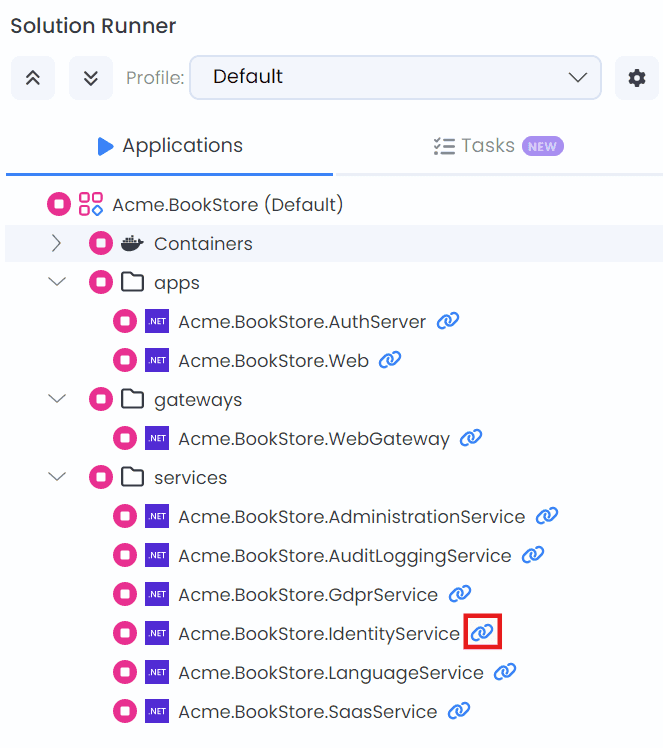

#### Open with

The *Open with* submenu provides options to open the application project in external tools:

- **Visual Studio**: Opens the project in Visual Studio (available if installed).
- **Visual Studio Code**: Opens the project folder in Visual Studio Code (available if installed).
- **JetBrains Rider**: Opens the project in JetBrains Rider (available if installed).
- **Terminal**: Opens a terminal window in the project directory.
- **Explorer / Finder**: Opens the project folder in the system file explorer.

### Custom Commands

You can add custom commands that appear in the context menu of Solution Runner items (root, folders, and applications). These commands allow you to automate custom workflows and scripts. For details on creating and managing custom commands, see the [Custom Commands](custom-commands.md) documentation.

### Miscellaneous

- We can copy the selected application *Browse* URL with *Copy URL*. It copies the *Browse* URL instead of *Launch URL* since we could be connected to a *Kubernetes* service. 
- You can change the target framework by right-click the selected application and change the *Target Framework* option. This option visible if the project has multiple target framework such as MAUI applications.
- To remove an application from the tree, open the context menu by right-clicking the application and selecting *Remove*.

### CLI Application

CLI applications uses the [powershell](https://learn.microsoft.com/en-us/powershell/module/microsoft.powershell.core) commands. With this way we can start and stop anything we want. After we add the CLI applications to root of the tree or folder, we can go to any CLI application and right-click to view the context menu.

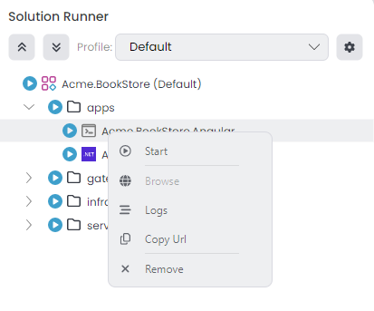

- `Start`: Starts the application. Once it is started, *Start* and *Restart* options will be available.
- `Browse`: This option is available when a *Launch URL* is specified upon adding the CLI application. It opens the *Browse* tab, can be clicked while the application is running.
- `Logs`: It opens the *Logs* tab, we can see the logs for *Start* and *Stop* commands.
- `Copy URL`: This option copies the *Launch URL* of the selected application. It is visible if there is a specified *Launch URL*
- `Remove`: This option allows you to delete the selected application.

> When CLI applications start chain icon won't be visible, because only C# applications can connect the ABP Studio.

### Docker Containers

Each Docker container represents a `.yml` file. Each file can be run on UI individually. A file may contain one or more services. To start/stop each service individually, we recommend to keep services in separate files.

An example `rabbitmq.yml` container file:

```yml
volumes:
  bookstore_rabbitmq:
networks:
  bookstore:
    external: true

services:
  rabbitmq:
    container_name: rabbitmq
    image: rabbitmq:3.12.7-management-alpine
    volumes:
      - bookstore_rabbitmq:/var/lib/rabbitmq
    networks:
      - bookstore
    ports:
      - "15672:15672"
      - "5672:5672"
```

> Note: We suggest to use `container_name` property in your services. Otherwise, tracking the container may not be possible in some cases.

To add this file to `containers`, we can use `Add Docker Container` menu:

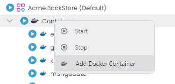

It will open a simple dialog with a file picker:

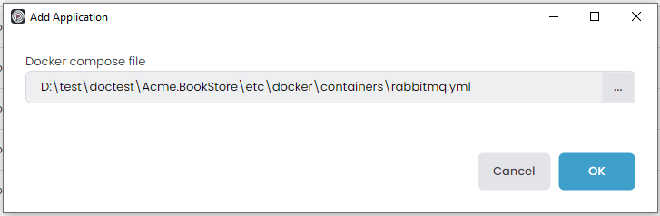

Then we have the `rabbitmq` on the Studio UI under containers:

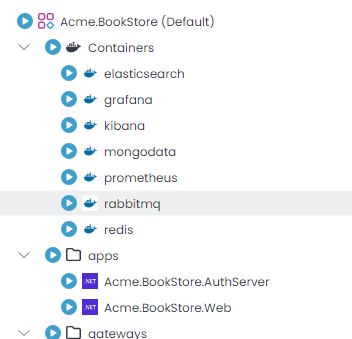

Name of the `yml` file is used as label in the UI, so we recommend to create the file with the name of service inside.

If the `yml` file contains multiple services, they will be represented as a single container with the file name. In this case, when we start/stop it, all services inside the file will be started/stopped.

> If a service is shut down externally, it will be shown as `Stopped` in the UI. In this case you can start them again. If it is constantly stopping, there may be a problem in the `yml` file.

> It may take stuck in `starting` state a while to download images if they don't exist.

>  A warning icon is displayed when a service is stopped externally inside the container. In this case, yo can restart the application on Studio UI:
>
> 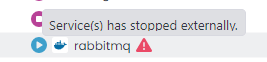

#### Properties

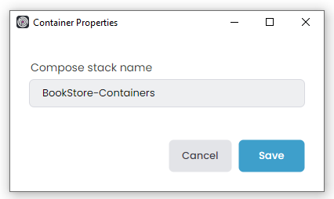

In properties dialog, you can set the name of docker compose stack name of the containers. In the example above, it is set as `BookStore-Containers`. In Docker Desktop UI the containers are stacked under that name. Exmple:

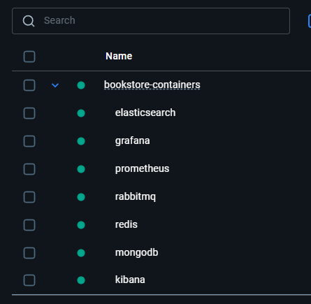

### Docker Compose

You can manually run applications using [Docker Compose](https://docs.docker.com/compose/). This allows for easy setup and management of multi-container Docker applications. To get started, ensure you have Docker and Docker Compose installed on your machine.

Refer to the [Deployment with Docker Compose](../solution-templates/layered-web-application/deployment/deployment-docker-compose.md) documentation for detailed instructions on how to configure and run your applications using `docker-compose`.

> Note: The **Docker Compose** is not available in the ABP Studio interface.

## Tasks

The **Tasks tab** in the Solution Runner allows you to define and execute tasks for your solution. You can run initialization tasks after solution creation, create reusable tasks that can be executed on demand, and optionally configure tasks to run automatically when a solution is opened. Navigate to the *Solution Runner* panel in the left menu and select the *Tasks* tab.

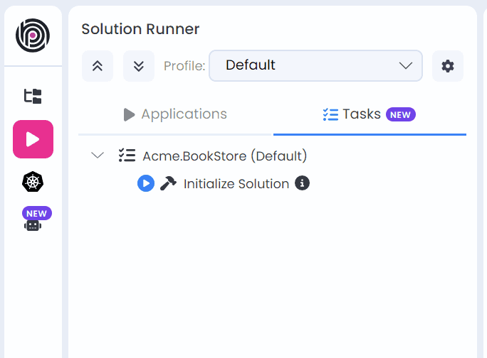

> The task structure might vary based on your solution template. ABP Studio solution templates come with pre-configured tasks like *Initialize Solution*.

### Tasks Panel Overview

The Tasks panel has a tree structure similar to the Applications panel:

- **Root**: The root item displays your solution name, similar to the Solution Explorer.
- **Tasks**: Individual tasks that can be started, stopped, and configured.

Tasks are associated with the current *Profile*, just like applications. When you switch profiles, the task configuration may differ based on what's defined in each profile.

### Built-in Tasks

When you create a new solution using ABP Studio templates, the following tasks are automatically configured in the *Default* profile:


#### Initialize Solution

The *Initialize Solution* task performs the initial setup required after creating a new solution or cloning an existing one from source control. This task is configured with the *Run on solution initialization (1 time per computer)* behaviour, meaning it runs automatically only once per computer when the solution is initialized.

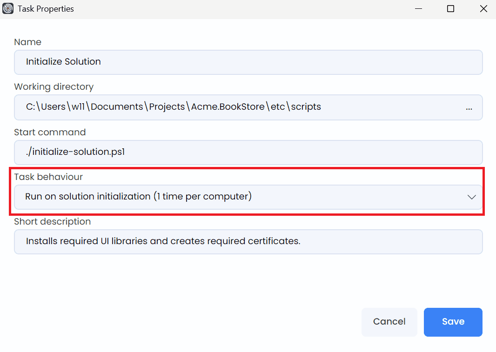

The initialization typically includes:

- Installing NPM packages (`abp install-libs`)
- Creating development certificates (for OpenIddict)
- and more... (depends on solution type)

> This task is designed to be idempotent, meaning it can be run multiple times without causing issues.

#### Migrate Database

The *Migrate Database* task runs the database migration for your solution. This is useful when you need to apply new migrations after pulling changes from source control or when you've added new migrations yourself.

> Unlike the *Initialize Solution* task, the *Migrate Database* task is not configured to run automatically on solution open by default.

### Adding a Task

To add a new task, right-click on the root item (solution name) in the Tasks panel and select *AddTask* item.

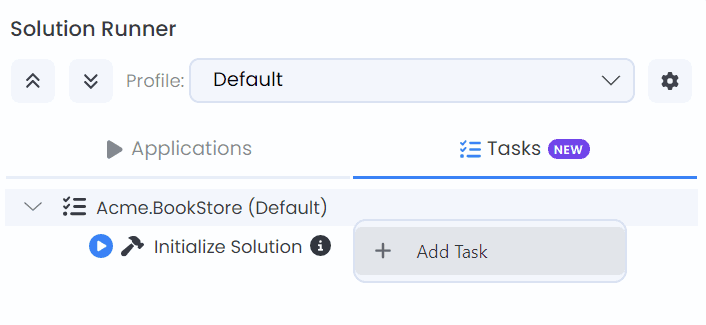

This opens the *Add Task* window where you can configure the task:

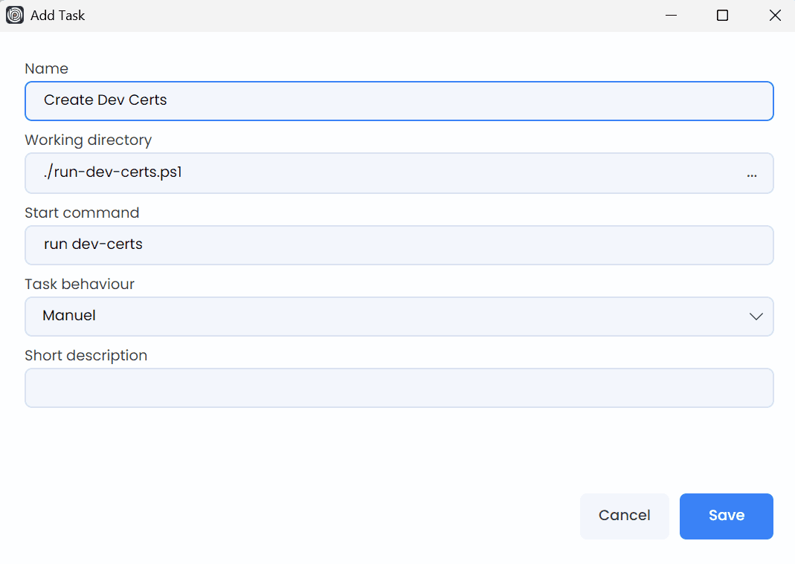

- **Name**: Provide a unique name for the task. This name will be displayed in the Tasks panel tree.
- **Working Directory**: Specify the directory where the task will be executed. You can use the folder picker to browse and select the directory. The path will be [normalized](https://learn.microsoft.com/en-us/dotnet/standard/io/file-path-formats#path-normalization), allowing flexibility in the folder location.
- **Start Command**: Provide the script or command to execute when the task starts. Use the local path prefix `./` if the script is in the working directory (e.g., `./scripts/my-task.ps1`). You can also pass arguments like `./my-script.ps1 -param value`.
- **Task Behaviour**: Select how the task should run: *Manual*, *Run on solution open*, or *Run on solution initialization (1 per computer)*.
- **Short Description**: Short description for the task.

Click *OK* to add the task to the profile.

### Managing Tasks

Once tasks are added to the panel, you can manage them using the context menu. Right-click on a task to see the available options:

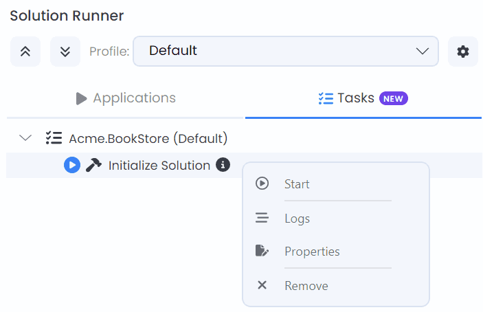

#### Start / Stop

- **Start**: Executes the task's start command. The task status will change to indicate it's running.
- **Stop**: Stops a running task. If a stop command is configured, it will be executed; otherwise, the process will be terminated.

> Unlike applications, tasks do not automatically restart if they fail or stop. A task can complete its execution and stop itself (like running a database migration), or it can continue running until manually stopped.

#### Logs

Click *Logs* to view the task's output in a dedicated window. This shows the console output from the task's execution, which is helpful for debugging or monitoring progress.

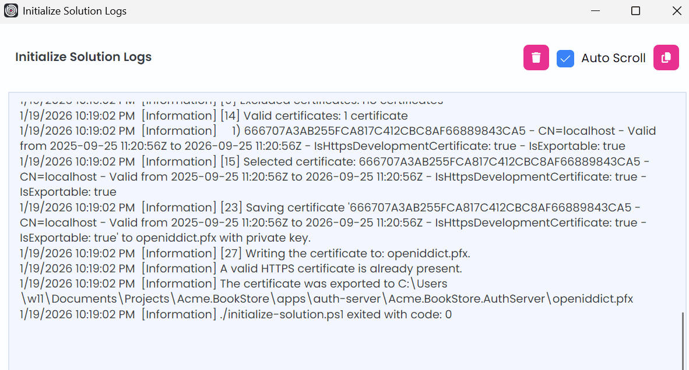

#### Properties

Click *Properties* to open the task configuration window where you can modify the task settings:

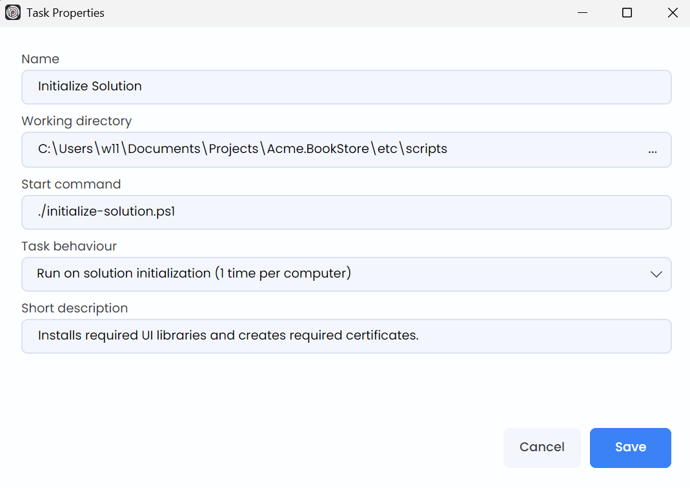

- **Name**: The display name of the task.
- **Working Directory**: The execution directory for the task.
- **Start Command**: The command to run when starting the task.
- **Task Behaviour**: Select how the task should run: *Manual*, *Run on solution open*, or *Run on solution initialization (1 per computer)*.
- **Short Description**: Short description for the task.

#### Remove

Select *Remove* to delete the task from the profile. This action only removes the task configuration; it does not delete any script files.

### Run On Solution Open

Tasks configured with *Run on solution open* behaviour are automatically executed every time you open the solution in ABP Studio. This is useful for:

- **Environment checks**: Verifying that required services or dependencies are available.
- **Recurring setup**: Tasks that need to run on each session, such as starting background services or refreshing configurations.

When the solution is opened:

1. ABP Studio loads the solution and profiles
2. Tasks marked with *Run on solution open* are queued for execution
3. Tasks execute in the background, and you can monitor their progress in the [Background Tasks](./overview.md#background-tasks) panel

> Tasks configured with this behaviour should be idempotent, meaning running them multiple times should not cause errors or duplicate operations.

### Run On Solution Initialization (1 Per Computer)

Tasks configured with *Run on solution initialization (1 per computer)* behaviour are executed only once per computer when the solution is first opened. After the initial execution, the task will not run automatically on subsequent solution opens. This is ideal for:

- **One-time setup**: Tasks like *Initialize Solution* that install dependencies, run database migrations, or create development certificates.
- **First-time configuration**: Setting up environment-specific configurations that only need to happen once.

This behaviour is particularly useful for:

1. **New team members**: When a developer clones the repository and opens the solution for the first time, all initialization tasks run automatically.
2. **Fresh clones**: Ensures the solution is properly configured without requiring manual intervention.
3. **Avoiding redundant operations**: Prevents running time-consuming setup tasks on every solution open.

> The *Initialize Solution* task that comes with ABP Studio templates uses this behaviour by default. It checks if NPM packages are already installed before running `abp install-libs` and performs other initialization steps only when necessary.

### Task Configuration in Profiles

Tasks are stored in the run profile JSON files (`*.abprun.json`). The task configuration looks like this:

```json
{
  "tasks": {
    "Initialize Solution": {
        "behaviour": 2,
        "startCommand": "./initialize-solution.ps1",
        "workingDirectory": "../../scripts",
        "shortDescription": "Installs required UI libraries and creates required certificates."
    }
  }
}
```

You can manually edit these files if needed, but it's recommended to use the ABP Studio UI for managing tasks to ensure proper formatting and validation.

## See Also

- [Solution Explorer](./solution-explorer.md)
- [Monitoring Applications](./monitoring-applications.md)
