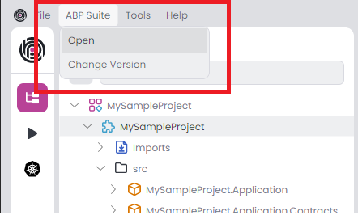
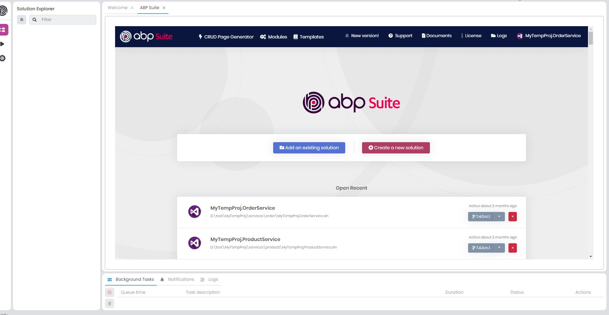
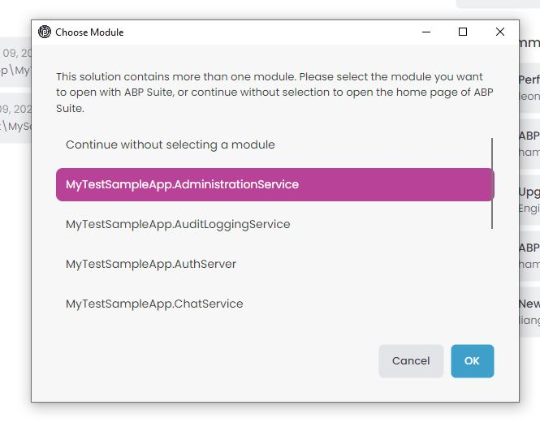
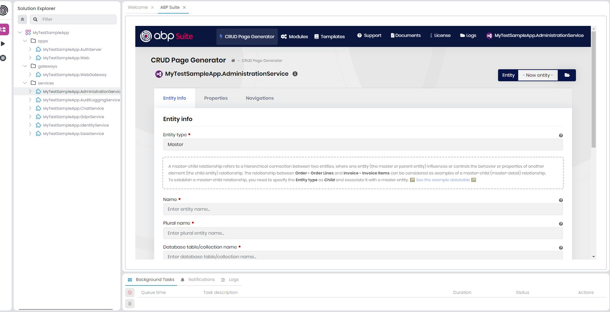
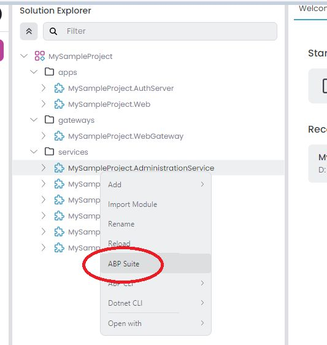
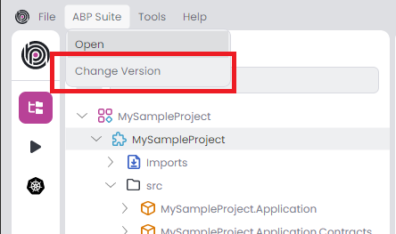
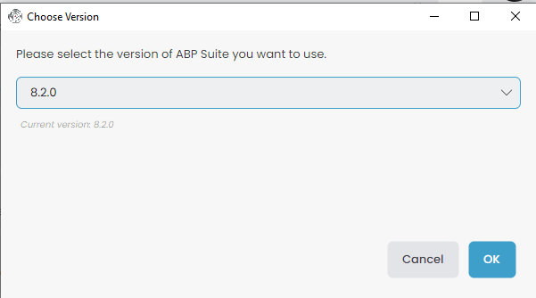

```json
//[doc-seo]
{
    "Description": "Learn how to seamlessly integrate and run ABP Suite within ABP Studio, enhancing your development workflow with unified access and efficiency."
}
```

# ABP Studio: Working with ABP Suite

````json
//[doc-nav]
{
  "Next": {
    "Name": "ABP Suite",
    "Path": "suite/index"
  }
}
````

ABP Studio (Studio) has a shortcut for running [ABP Suite](../suite) (Suite) to allow using it without starting it externally and using it on a browser. Thus you can use both Studio and Suite as a united platform.

## Running Suite From Studio

### Opening from main window

The `Open` button in `ABP Suite` menu runs the Suite and opens it as a tab in the main page of Studio. It may take a few seconds to open Suite if it is not already running. The main page of Suite will be shown if there is not a module loaded in Studio. Otherwise, it will automatically open `Crud Page Generation` screen with the loaded module in Studio.





If There are more than one module which is openable via Suite, Studio will ask you to pick one of them before opening it. If you select a module, Suite will automatically open `Crud Page Generation` screen with the selected module. If you choose `Continue without selecting a module`, Suite main page will be opened.






### Opening from context menu

You can right-click on the solution root or a module in [Solution Explorer](solution-explorer.md) and click `ABP Suite` to open it with Suite.

- **Solution root**: If you right-click on the solution root and select `ABP Suite`, Studio will ask you to pick a module if there are multiple modules. Suite will then open with the selected module.
- **Module**: If you right-click on a specific module and select `ABP Suite`, Suite will automatically open `Crud Page Generation` screen with that module.



## Supported Templates

Standard application solutions (`App` & `App-nolayers`)  generated by Studio are fully supported by Suite.

### Generating code on  the microservice Template

You can generate code on the services of the microservice solution. UI code generation is not supported at the moment. It is on the roadmap.

## Managing Installed Version

You can update or downgrade the version of `ABP Suite` by `Change Version` button in `ABP Suite` menu.

### Automatic Version Matching

When you open ABP Suite for a solution, Studio checks if the installed Suite version matches the solution's ABP version. If they differ, Studio will prompt you to update or downgrade Suite to match your solution's version. This ensures compatibility between Suite and your project.





## See Also

* [ABP Suite](../suite) 